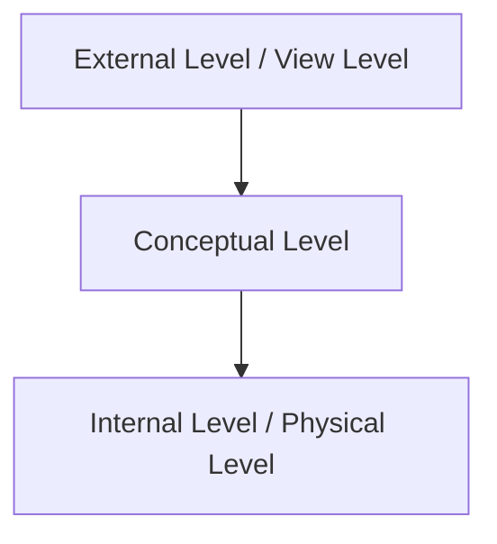

# Chapter 01 — DBMS Fundamentals & Architecture

> DBMS-এর foundation: concept, architecture, key/constraint, ACID, এবং প্রথম SQL practice।

---

## LEVEL 1: FUNDAMENTALS

DBMS ভালোভাবে শিখতে হলে এই chapter-এর concept clear থাকা mandatory।

---

## 1. DBMS কী, কেন

**Database** = organized data collection  
**DBMS** = software যা database create/store/query/manage করে।

### কেন DBMS লাগে?
- Data redundancy কমাতে
- Data consistency রাখতে
- Multi-user access দিতে
- Security + backup + recovery দিতে

### File system vs DBMS

| বিষয় | File System | DBMS |
|---|---|---|
| Redundancy | বেশি | কম |
| Consistency | maintain কঠিন | rules দিয়ে maintain সহজ |
| Query | limited | powerful SQL |
| Security | basic | role/permission based |
| Concurrency | দুর্বল | transaction + lock support |

---

## 2. DBMS Architecture (3-Schema)



- **External level:** user-specific view
- **Conceptual level:** full logical structure
- **Internal level:** storage details (file/index/page)

### Data Independence
- **Physical data independence:** physical storage change হলেও logical schema unchanged
- **Logical data independence:** logical schema change হলেও user view minimally affected

---

## 3. Data Model Snapshot

- Hierarchical
- Network
- **Relational** (most important)
- Object-oriented
- NoSQL family

Relational model-এ:
- data table আকারে
- row = tuple
- column = attribute
- table = relation

---

## 4. Keys & Constraints

### Keys
- Super Key
- Candidate Key
- Primary Key
- Alternate Key
- Foreign Key
- Composite Key

### Constraints
- `NOT NULL`
- `UNIQUE`
- `PRIMARY KEY`
- `FOREIGN KEY`
- `CHECK`
- `DEFAULT`

---

## 5. ACID Properties (Transaction Foundation)

- **A — Atomicity:** all or nothing
- **C — Consistency:** constraints violate করা যাবে না
- **I — Isolation:** concurrent transaction যেন conflict না করে
- **D — Durability:** commit হলে permanent

---

## 6. SQL Practice (SSMS + PostgreSQL)

> নিচের example একই logic-এর; syntax difference যেখানে আছে আলাদা করে দেখানো।

### 6.1 Create Table

```sql
-- SSMS (SQL Server)
CREATE TABLE Students (
    StudentID INT PRIMARY KEY,
    FullName NVARCHAR(100) NOT NULL,
    Dept NVARCHAR(50) NOT NULL,
    CGPA DECIMAL(3,2) CHECK (CGPA BETWEEN 0 AND 4.00),
    CreatedAt DATETIME2 DEFAULT SYSDATETIME()
);
```

```sql
-- PostgreSQL
CREATE TABLE students (
    student_id INT PRIMARY KEY,
    full_name VARCHAR(100) NOT NULL,
    dept VARCHAR(50) NOT NULL,
    cgpa NUMERIC(3,2) CHECK (cgpa BETWEEN 0 AND 4.00),
    created_at TIMESTAMP DEFAULT CURRENT_TIMESTAMP
);
```

### 6.2 Insert + Select

```sql
-- SSMS
INSERT INTO Students (StudentID, FullName, Dept, CGPA)
VALUES (1, 'Arafat Hossain', 'CSE', 3.75),
       (2, 'Nabila Akter', 'EEE', 3.60);

SELECT StudentID, FullName, Dept, CGPA
FROM Students
WHERE CGPA >= 3.60
ORDER BY CGPA DESC;
```

```sql
-- PostgreSQL
INSERT INTO students (student_id, full_name, dept, cgpa)
VALUES (1, 'Arafat Hossain', 'CSE', 3.75),
       (2, 'Nabila Akter', 'EEE', 3.60);

SELECT student_id, full_name, dept, cgpa
FROM students
WHERE cgpa >= 3.60
ORDER BY cgpa DESC;
```

### 6.3 Foreign Key Example

```sql
-- SSMS
CREATE TABLE Courses (
    CourseID INT PRIMARY KEY,
    CourseName NVARCHAR(100) NOT NULL
);

CREATE TABLE Enrollments (
    EnrollmentID INT PRIMARY KEY,
    StudentID INT NOT NULL,
    CourseID INT NOT NULL,
    CONSTRAINT FK_Enroll_Student FOREIGN KEY (StudentID) REFERENCES Students(StudentID),
    CONSTRAINT FK_Enroll_Course FOREIGN KEY (CourseID) REFERENCES Courses(CourseID)
);
```

```sql
-- PostgreSQL
CREATE TABLE courses (
    course_id INT PRIMARY KEY,
    course_name VARCHAR(100) NOT NULL
);

CREATE TABLE enrollments (
    enrollment_id INT PRIMARY KEY,
    student_id INT NOT NULL REFERENCES students(student_id),
    course_id INT NOT NULL REFERENCES courses(course_id)
);
```

---

## 7. MCQ (18টি) — Solution সহ

**Q1.** DBMS-এর প্রধান কাজ কী?  
(a) শুধু file store করা  
(b) data management + query processing ✅  
(c) শুধু UI design  
(d) শুধু backup  
**Solution:** DBMS data define, manipulate, secure, query সব করে।

**Q2.** Primary key-এর বৈশিষ্ট্য?  
(a) NULL হতে পারে  
(b) duplicate হতে পারে  
(c) unique এবং NOT NULL ✅  
(d) শুধু text type  
**Solution:** Primary key uniquely identify করে, NULL allowed না।

**Q3.** Foreign key কী নিশ্চিত করে?  
(a) sorting  
(b) referential integrity ✅  
(c) encryption  
(d) compression  
**Solution:** child table value parent table-এর valid key-কে reference করবে।

**Q4.** কোনটি ACID-এর অংশ না?  
(a) Atomicity  
(b) Consistency  
(c) Isolation  
(d) Distribution ✅  
**Solution:** ACID = A,C,I,Durability.

**Q5.** Super key থেকে candidate key কিভাবে আলাদা?  
(a) candidate key minimal ✅  
(b) super key minimal  
(c) candidate key always composite  
(d) কোনো পার্থক্য নেই  
**Solution:** candidate key = minimal super key।

**Q6.** 3-schema architecture-এর conceptual level কী করে?  
(a) user view  
(b) physical storage detail  
(c) full logical design ✅  
(d) backup schedule  
**Solution:** conceptual level logical structure define করে।

**Q7.** Data redundancy কমাতে DBMS কীভাবে সাহায্য করে?  
(a) random duplicate রাখে  
(b) normalized structured design ব্যবহার করে ✅  
(c) শুধু cache বাড়ায়  
(d) file rename করে  
**Solution:** proper schema + normalization duplicate কমায়।

**Q8.** কোন constraint negative age prevent করতে পারে?  
(a) UNIQUE  
(b) CHECK ✅  
(c) DEFAULT  
(d) PRIMARY KEY  
**Solution:** `CHECK (age >= 0)` ।

**Q9.** SQL-এ table create command?  
(a) MAKE TABLE  
(b) CREATE TABLE ✅  
(c) BUILD TABLE  
(d) NEW TABLE  
**Solution:** standard DDL হলো `CREATE TABLE`।

**Q10.** Transaction commit হলে কোন property reflect হয়?  
(a) Atomicity  
(b) Durability ✅  
(c) Isolation  
(d) Availability  
**Solution:** commit-এর পর data permanent।

**Q11.** `NOT NULL` constraint কী করে?  
(a) duplicate remove  
(b) null value block ✅  
(c) sort করে  
(d) index বানায়  
**Solution:** column-এ NULL ঢুকতে দিবে না।

**Q12.** File system-এর তুলনায় DBMS-এর বড় সুবিধা?  
(a) বেশি redundancy  
(b) কম security  
(c) query flexibility ✅  
(d) manual locking  
**Solution:** SQL query দিয়ে flexible retrieval possible।

**Q13.** কোনটি DML command?  
(a) CREATE  
(b) ALTER  
(c) INSERT ✅  
(d) DROP  
**Solution:** DML data manipulate করে (`INSERT/UPDATE/DELETE`)।

**Q14.** Composite key মানে—  
(a) এক column key  
(b) দুই/একাধিক column মিলে key ✅  
(c) temporary key  
(d) hidden key  
**Solution:** multi-column combination uniquely identify করে।

**Q15.** Referential integrity break হবে কখন?  
(a) valid parent key use করলে  
(b) child table-এ orphan foreign key থাকলে ✅  
(c) check constraint থাকলে  
(d) index create করলে  
**Solution:** parent-এ key না থাকলে child reference invalid।

**Q16.** Isolation property মূলত কোন সমস্যা কমায়?  
(a) schema mismatch  
(b) concurrency anomaly ✅  
(c) data type mismatch  
(d) syntax error  
**Solution:** concurrent transactions-এর conflict control করে।

**Q17.** নিচের মধ্যে candidate key কোনটা হতে পারে?  
(a) duplicate values থাকা column  
(b) unique + minimal attribute set ✅  
(c) nullable non-unique column  
(d) computed random field  
**Solution:** candidate key unique & minimal হতে হয়।

**Q18.** DBMS recovery mechanism-এর উদ্দেশ্য—  
(a) UI সুন্দর করা  
(b) crash-এর পর consistent state ফিরিয়ে আনা ✅  
(c) duplicate বাড়ানো  
(d) file rename  
**Solution:** crash/failure-এর পর data correctness restore করা।

---

## 8. Written Problems (6টি) — Step-by-step Solution সহ

### Problem 1: University schema-এ key identify করো
**Question:** `Students(StudentID, Email, Phone, Name, Dept)`  
যদি `StudentID` এবং `Email` দুটোই unique হয়, key classification দাও।

**Solution:**
1. Super keys: `{StudentID}`, `{Email}`, `{StudentID, Email}`, ...  
2. Candidate keys: `{StudentID}`, `{Email}` (minimal)  
3. Primary key: conventionally `StudentID`  
4. Alternate key: `Email`

---

### Problem 2: Constraint design
**Question:** Employee table-এ age 18–60 range enforce করতে হবে, salary positive রাখতে হবে।

**Solution (SSMS):**
```sql
CREATE TABLE Employees (
    EmpID INT PRIMARY KEY,
    FullName NVARCHAR(100) NOT NULL,
    Age INT CHECK (Age BETWEEN 18 AND 60),
    Salary DECIMAL(10,2) CHECK (Salary > 0)
);
```

**Solution (PostgreSQL):**
```sql
CREATE TABLE employees (
    emp_id INT PRIMARY KEY,
    full_name VARCHAR(100) NOT NULL,
    age INT CHECK (age BETWEEN 18 AND 60),
    salary NUMERIC(10,2) CHECK (salary > 0)
);
```

---

### Problem 3: Foreign key violation explain
**Question:** `Orders(CustomerID)` যদি `Customers(CustomerID)` reference করে,  
`Orders` এ `CustomerID=999` insert করলে error কেন আসবে?

**Solution:**
1. FK rule: child value parent key-এ exist করতে হবে  
2. Parent table-এ `999` না থাকলে referential integrity break  
3. তাই DBMS insert reject করে

---

### Problem 4: ACID দিয়ে bank transfer ব্যাখ্যা
**Question:** A account থেকে B account-এ 500 transfer example দিয়ে ACID explain করো।

**Solution:**
1. Atomicity: debit+credit দুটোই হবে, না হলে কোনোটাই না  
2. Consistency: total money invariant ভাঙবে না  
3. Isolation: concurrent transfer conflict-free  
4. Durability: commit হলে power loss হলেও data থাকবে

---

### Problem 5: SSMS vs PostgreSQL data type mapping
**Question:** Name, amount, created time এর জন্য compatible type দাও।

**Solution:**
- Name: `NVARCHAR(100)` (SSMS) / `VARCHAR(100)` (PostgreSQL)  
- Amount: `DECIMAL(10,2)` (SSMS) / `NUMERIC(10,2)` (PostgreSQL)  
- Time: `DATETIME2` (SSMS) / `TIMESTAMP` (PostgreSQL)

---

### Problem 6: Basic query লিখো (both DB)
**Question:** CGPA 3.50+ students বের করো।

**Solution (SSMS):**
```sql
SELECT StudentID, FullName, CGPA
FROM Students
WHERE CGPA >= 3.50
ORDER BY CGPA DESC;
```

**Solution (PostgreSQL):**
```sql
SELECT student_id, full_name, cgpa
FROM students
WHERE cgpa >= 3.50
ORDER BY cgpa DESC;
```

---

## 9. Tricky Parts

1. `PRIMARY KEY` নিজে থেকেই `UNIQUE + NOT NULL`  
2. `UNIQUE` column সাধারণত NULL নিতে পারে (DB-specific behavior মাথায় রাখো)  
3. `CHECK` rule business validation-এর জন্য খুব effective  
4. FK delete/update behavior (`CASCADE`, `SET NULL`, `RESTRICT`) না বুঝলে exam/interview-তে ভুল হয়  
5. SQL Server vs PostgreSQL naming/casing rules practice করতে হবে

---

## 10. Summary

- DBMS vs file system পার্থক্য clear
- 3-schema architecture + data independence clear
- keys/constraints solid
- ACID foundation clear
- SSMS + PostgreSQL basic syntax side-by-side done
- 18 MCQ + 6 written solved complete

---

## Navigation

- 🏠 Back to [DBMS — Master Index](00-master-index.md)
- ➡️ Next: Chapter 02 — Relational Model, ER to Table Mapping

