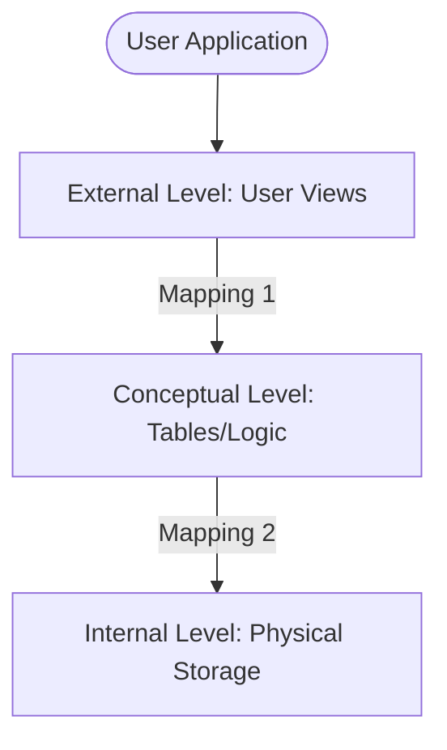

# Chapter 01 — DBMS Fundamentals & Architecture — DBMS 🌐

*DBMS কী, এর ভেতরের কলকব্জা কীভাবে চলে এবং কেন এটি ডাটা হ্যান্ডেল করার সেরা উপায় — তা এই চ্যাপ্টারে আমরা একদম ইন্টারনাল লেভেল থেকে জানব।*

---

# Topic 1: DBMS Components & Engine

*"DBMS শুধু একটি সফটওয়্যার নয়, এটি অনেকগুলো ইঞ্জিনের সমষ্টি"*

একটি DBMS-এর ভেতরে প্রধানত ৩টি ইঞ্জিন কাজ করে:
1.  **Storage Manager:** হার্ডডিস্ক বা এসএসডি-র মেমোরি ব্লকগুলোর সাথে সরাসরি কথা বলে।
2.  **Query Processor:** আপনি যে SQL লেখেন, তাকে ভেঙে লজিক্যাল অর্ডারে সাজায়।
3.  **Buffer Manager:** র‍্যাম (RAM) এর ছোট একটা অংশে ডাটা ক্যাশ (Cache) করে রাখে যাতে বারবার ডিস্ক রিড না করতে হয়।

---

# Topic 2: 3-Schema Architecture (Detailed Mapping)
ইউজার ডাটাবেসের ডাটা সরাসরি দেখে না, ৩টি স্তরের ফেন্স (Fence) পার হয়ে দেখতে হয়। একে **ANSI-SPARC Architecture** বলা হয়।

### 2.1 Mapping & Data Independence
- **Mapping 1 (Logical Mapping):** টেবিল স্ট্রাকচার থেকে ইউজারের ভিউ নির্ধারণ করে।
- **Mapping 2 (Physical Mapping):** টেবিল লজিক থেকে ডিস্কের ফিজিক্যাল অ্যাড্রেস নির্ধারণ করে।
- **Data Independence:** নিচের লেভেলে কোনো চেঞ্জ করলেও ওপরের লেভেলে তার কোনো প্রভাব পড়ে না। 
  - *উদাহরণ:* আপনি যদি ডাটাবেস HDD থেকে SSD-তে শিফট করেন (Internal level), আপনার লেখা SQL কোড (Conceptual level) বা অ্যাপ ভিউ (External level) বদলাতে হবে না। একেই বলে **Physical Data Independence**।

---

### 🔥 Job Exam Special (BPSC/Bank)
- **Metadata:** ডেটা সম্পর্কে তথ্য। একে **Data Dictionary**-তে রাখা হয়।
- **Schema vs Instance:** স্লামা হলো ব্লু-প্রিন্ট (স্থায়ী), আর ইন্সট্যান্স হলো নির্দিষ্ট সময়ের ডাটা (অস্থায়ী)।

---

### 🧠 Practice Zone (MCQ & Written)

#### MCQ Drill
1. কোন লেভেলে ডিস্কের ফিজিক্যাল অ্যাড্রেস সম্পর্কে তথ্য থাকে?
   - (ক) External (খ) Conceptual **(গ) Internal** (ঘ) User
2. ডাটা ডিকশনারি কী স্টোর করে?
   - (ক) User Data **(খ) Metadata** (গ) Index (ঘ) SQL Code
3. ওএস (OS) এবং স্টোরেজের সাথে সরাসরি ইন্টারঅ্যাক্ট করে কে?
   - **(ক) Storage Manager** (খ) Query Optimizer (গ) Scheduler (ঘ) Buffer Manager
4. DBMS-এ "Abstraction" কেন ব্যবহার করা হয়?
   - (ক) ডাটা ডিলিট করতে (খ) ডাটা হাইড করতে **(গ) ইউজারের কাছে কমপ্লেক্সিটি কমাতে** (ঘ) ইন্ডেক্স করতে
5. View স্তরটি নিচের কোনটির সাথে সম্পর্কিত?
   - **(ক) External Schema** (খ) Physical Schema (গ) Logical Schema (ঘ) Internal Schema
6. Conceptual Schema কী ডিফাইন করে?
   - (ক) স্টোরেজ ডিটেইলস **(খ) ডাটার মধ্যকার রিলেশন ও লজিক** (গ) ইউজার ইন্টারফেস (ঘ) মেমোরি অ্যাড্রেস
7. Physical Data Independence বলতে কী বোঝায়?
   - **(ক) ইন্টারনাল স্কিমা পরিবর্তন করলে লজিক্যাল স্কিমা অপরিবর্তিত থাকে** (খ) লজিক্যাল স্কিমা পরিবর্তন করলে এক্সটারনাল স্কিমা অপরিবর্তিত থাকে (গ) হার্ডওয়্যার নষ্ট হলেও ডাটা থাকে (ঘ) ফাইল ডিলিট হয় না
8. নিচের কোনটি মাল্টিপল ইউজার ভিউ সাপোর্ট করে?
   - (ক) ফাইল সিস্টেম **(খ) DBMS** (গ) টেক্সট ফাইল (ঘ) ওএস
9. ডাটা এনক্যাপসুলেশন ও মেথড কোন ধরনের ডাটা মডেলে দেখা যায়?
   - (ক) Relational **(খ) Object-Oriented** (গ) Network (ঘ) Hierarchical
10. ডাটা ক্যাটালগ (Data Catalog)-কে আর কী নামে ডাকা হয়?
    - (ক) ফাইল ক্যাটালগ **(খ) মেটাডাটা রিপোজিটরি** (গ) ইউজার ডাটা (ঘ) কোডবেজ

#### Written Challenge
1. **Physical Data Independence** কেন গুরুত্বপূর্ণ? একটি রিয়েল-লাইফ উদাহরণ দাও।
   - *Solution:* এটি ডিস্ট্রিবিউটেড সিস্টেম বা ক্লাউড মাইগ্রেশনে সাহায্য করে। ইউজারের কুয়েরি না পাল্টেই আমরা ডাটাবেস স্ট্রাকচার অপ্টিমাইজ করতে পারি। যেমন: ডেটাবেসের ফাইলগুলো এক ড্রাইভ থেকে অন্য ড্রাইভে সরালে বা ইনডেক্সিং স্টাইল পাল্টালে অ্যাপ্লিকেশনের কোড পাল্টাতে হয় না।
2. **Schema** এবং **Instance** এর মধ্যে ৩টি মূল পার্থক্য লেখো।
   - *Solution:* 
     - স্লামা হলো ব্লু-প্রিন্ট (Structure), ইন্সট্যান্স হলো ডাটার Snapshot।
     - স্লামা সচরাচর পরিবর্তন হয় না, ইন্সট্যান্স প্রতি সেকেন্ডে আপডেট হতে পারে।
     - স্লামা লজিক্যাল ডিজাইন ডিফাইন করে, ইন্সট্যান্স ভ্যালু স্টোর করে।
3. **Internal Architecture mapping** কেন প্রয়োজন? ম্যাপিং না থাকলে কী হতো?
   - *Solution:* ম্যাপিং লেয়ারগুলো থাকার কারণেই আমরা এক লেয়ারের পরিবর্তন অন্য লেয়ারে না পাঠিয়ে কাজ করতে পারি। ম্যাপিং না থাকলে ডেটাবেস স্টোরেজ ফরম্যাট সামান্য পরিবর্তন করলে ডাউজেন্ড লাইন অফ কোড রি-রাইট করতে হতো।
4. **Buffer Manager** কেন সরাসরি হার্ডডিস্ক থেকে ডাটা না পড়ে র‍্যাম (RAM) ব্যবহার করে?
   - *Solution:* ডিস্ক রিড (I/O) অত্যন্ত স্লো। র‍্যামে ডাটা ক্যাশ (Cache) করে রাখলে রিড/রাইট স্পিড কয়েক হাজার গুণ বেড়ে যায়।
5. **Data Dictionary**-তে কী কী তথ্য থাকে? এর গুরুত্ব ব্যাখ্যা করো।
   - *Solution:* এতে টেবিলের নাম, কলাম টাইপ, কনস্ট্রেইন্ট (Constraints), ইউজার পারমিশন ইত্যাদি থাকে। এটি ছাড়া কুয়েরি প্রসেসর জানতেই পারবে না কোন টেবিল কোথায় আছে।
