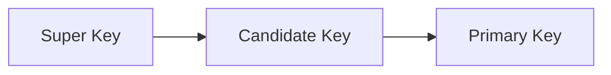

# Chapter 02 — Relational Model & ER Mapping — DBMS 🌐

*একটি ডাটাবেস ডিজাইন করার আগে তার ব্লু-প্রিন্ট বা নকশা তৈরি করতে হয়। এই চ্যাপ্টারে আমরা ER ডায়াগ্রাম থেকে কীভাবে হার্ডকোর রিলেশনাল টেবিলে ম্যাপিং করতে হয় তা শিখব।*

---

# Topic 3: The Relational Model Concepts
রিলেশনাল মডেলের মূল ভিত্তি হলো **Table (Relation)**। এখানে কিছু টেকনিক্যাল টার্ম শিখতে হবে:
-   **Tuple:** টেবিলের একটি Row।
-   **Attribute:** টেবিলের একটি Column।
-   **Degree:** একটি টেবিলে কয়টি কলাম আছে।
-   **Cardinality:** একটি টেবিলে কয়টি রো আছে।
-   **Domain:** একটি কলামে কী ধরনের ডাটা বসবে (যেমন: Age কলামে শুধু পজিটিভ ইন্টিজার)।

---

# Topic 4: Keys in Depth
চাকরি পরীক্ষায় এই সেকশন থেকে প্রশ্ন মাস্ট আসবেই।

1.  **Super Key:** এক বা একাধিক কলামের সেট যা ইউনিকলি একটি রোকে চিনতে পারে।
2.  **Candidate Key:** সুপার কি-র মধ্যে সবচেয়ে ছোট বা মিনিমাল সেট।
3.  **Primary Key:** ক্যান্ডিডেট কি-গুলোর মধ্যে থেকে যাকে মেইন আইডেন্টিফায়ার বানানো হয়।
4.  **Foreign Key:** অন্য টেবিলের প্রাইমারি কি-র সাথে রিলেশন তৈরি করে। একে **Referential Integrity** রক্ষাকারী বলা হয়।

---

# Topic 5: ER Diagram to Table Mapping Rules
এটি একটি ইঞ্জিনিয়ারিং প্রসেস।

### 5.1 Strong vs Weak Entity
-   **Strong Entity:** সাধারণ টেবিল হিসেবে ম্যাপ হয়।
-   **Weak Entity:** এর নিজের কোনো প্রাইমারি কি থাকে না। এটি স্ট্রং এনটিটির প্রাইমারি কি এবং নিজের ডিসক্রিমিনেটর নিয়ে টেবিল তৈরি করে।

### 5.2 Relationship Mapping
-   **1:1 Relationship:** যেকোনো এক টেবিলের প্রাইমারি কি অন্য টেবিলে ফরেন কি হিসেবে যাবে।
-   **1:N (One-to-Many):** 'Many' সাইডের টেবিলে 'One' সাইডের প্রাইমারি কি ফরেন কি হিসেবে যুক্ত হবে।
-   **M:N (Many-to-Many):** একটি **নতুন রিলেশন টেবিল** তৈরি করতে হবে যেখানে দুটি টেবিলেরই প্রাইমারি কি থাকবে।

---

### 🔥 Job Exam Special (BPSC/Bank)
- **Entity Integrity Rule:** প্রাইমারি কি কখনো NULL হতে পারবে না।
- **Referential Integrity Rule:** ফরেন কি-র ভ্যালু হয় NULL হতে হবে, নাহলে রেফারেন্স টেবিলে থাকতে হবে।

---

### 🧠 Practice Zone (Scenario Based)

#### MCQ Drill
1. নিচের কোনটি "Referential Integrity" নিশ্চিত করে?
   - (ক) Primary Key **(খ) Foreign Key** (গ) Unique Key (ঘ) Super Key
2. একটি রিলেশনে ৩টি রিলেশনশিপ ম্যাপ করলে কয়টি ফরেন কি তৈরি হতে পারে?
   - (ক) ১টি (খ) ৩টি (গ) জিরো **(ঘ) ৩টিরও বেশি (কার্ডিনালিটি ভেদে)**
3. "Double Rectangle" দিয়ে ER ডায়াগ্রামে কী বোঝানো হয়?
   - (ক) Strong Entity **(খ) Weak Entity** (গ) Multi-valued Attribute (ঘ) Relationship
4. Primary Key কলামে নিচের কোনটি অ্যালাউড নয়?
   - (ক) জিরো (খ) নেগেটিভ ভ্যালু **(গ) NULL ভ্যালু** (ঘ) ১০০০
5. ER মডেলে "Ellipse" (উপবৃত্ত) দিয়ে কী প্রকাশ করা হয়?
   - **(ক) Attribute** (খ) Entity (গ) Link (ঘ) Key
6. Candidate Key এবং Primary Key এর মধ্যে সম্পর্ক কী?
   - **(ক) PK একটি সিলেক্টেড CK** (খ) PK এবং CK আলাদা কলাম (গ) CK সবসময় PK এর চেয়ে ছোট (ঘ) কোনো সম্পর্ক নেই
7. Cardinality বলতে কী বোঝায়?
   - (ক) কলাম সংখ্যা **(খ) রো সংখ্যা** (গ) টেবিল লেভেল (ঘ) কি সংখ্যা
8. Self-referencing Foreign Key কোথায় ব্যবহৃত হয়?
   - (ক) অন্য টেবিলে রেফার করতে **(খ) একই টেবিলের অন্য রো-তে রেফার করতে** (গ) টেবিল ডিলিট করতে (ঘ) ডাটা সর্ট করতে
9. Partial Key কোনটির ক্ষেত্রে প্রযোজ্য?
   - (ক) Strong Entity **(খ) Weak Entity** (গ) Super Key (ঘ) Foreign Key
10. M:N রিলেশন টেবিলে রিডিউস করলে মিনিমাম কয়টি টেবিল লাগবে?
    - (ক) ১টি (খ) ২টি **(গ) ৩টি** (ঘ) ৪টি

#### Written Challenge
1. একটি ইউনিভার্সিটি ডাটাবেসে `Student` এবং `Course` এর মধ্যে `Many-to-Many` রিলেশন আছে। একে টেবিলে ম্যাপ করলে কয়টি টেবিল লাগবে এবং কেন?
   - *Solution:* ৩টি টেবিল লাগবে। (১) Student (সব ছাত্রের তথ্য), (২) Course (সব কোর্সের তথ্য), (৩) Enrollment (যেখানে স্টুডেন্ট আইডি ও কোর্স আইডি ফরেন কি হিসেবে থাকবে)। কারণ M:N রিলেশনে সরাসরি কোনো এক টেবিলে ডাটা রাখা হলে রিডান্ডেন্সি তৈরি হয়।
2. **Cardinality** এবং **Degree** এর মধ্যে পার্থক্য কী?
   - *Solution:*
     - **Degree:** একটি রিলেশনে কলামের সংখ্যা। এটি সচরাচর ফিক্সড থাকে।
     - **Cardinality:** একটি রিলেশনে রো এর সংখ্যা। এটি ডাটা ইনসারশন বা ডিলিশনের সাথে সাথে পরিবর্তিত হয়।
3. **Weak Entity**-র অস্তিত্ব কেন **Strong Entity**-র ওপর নির্ভরশীল? উদাহরণসহ লেখো।
   - *Solution:* Weak entity-র নিজস্ব কোনো ইউনিক প্রাইমারি কি থাকে না। যেমন: `Dependent` টেবিল (কর্মচারীর পরিবার) `Employee` টেবিল ছাড়া অর্থহীন। এমপ্লয়ি চলে গেলে তার ডিপেন্ডেন্ট ডাটাও রাখার দরকার নেই।
4. **Referential Integrity Constraint** ভায়োলেট হয় এমন ২ টি কাজের উদাহরণ দাও।
   - *Solution:* 
     (১) মাস্টার টেবিলে নেই এমন আইডি ফরেন কি টেবিলে ইনসার্ট করা। 
     (২) মাস্টার টেবিলের একটি আইডি ডিলিট করা যা ফরেন কি টেবিলে অলরেডি ব্যবহৃত হচ্ছে।
5. **Entity Integrity Rule** কেন ইম্পর্ট্যান্ট?
   - *Solution:* এটি নিশ্চিত করে যে প্রাইমারি কি কখনো NULL না হয়। যদি প্রাইমারি কি NULL হতে পারে, তবে ইউনিকলি কোনো রো রিট্রিভ করা অসম্ভব হয়ে পড়বে।

