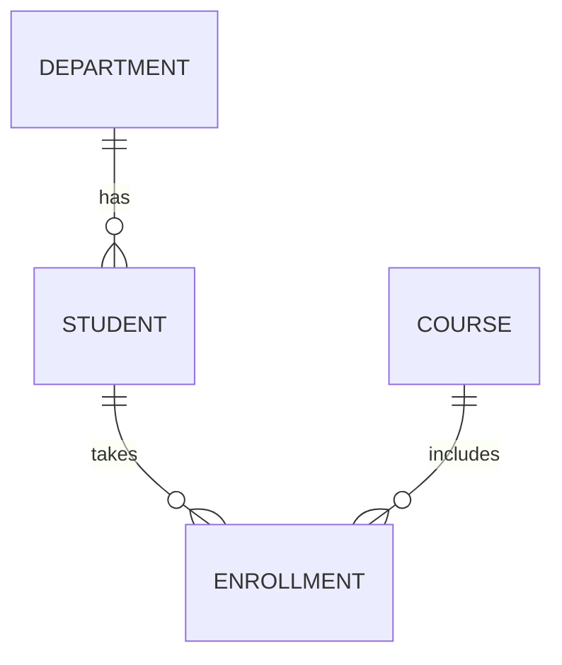

# Chapter 02 — Relational Model & ER to Table Mapping

> ER diagram থেকে relational schema-তে clean mapping করার full guide।

---

## 1. Core Concepts

- Entity, Attribute, Relationship
- Degree/Cardinality: 1:1, 1:N, M:N
- Participation: Total, Partial
- Weak Entity



---

## 2. ER to Relational Mapping Rules

1. Strong entity → table  
2. 1:N relationship → N-side table-এ FK  
3. M:N relationship → separate junction table  
4. 1:1 relationship → যেকোনো এক পাশে FK (business rule দেখে)  
5. Multivalued attribute → separate table  
6. Weak entity → owner key + partial key composite PK

---

## 3. SQL Snippet (SSMS + PostgreSQL)

```sql
-- SSMS
CREATE TABLE Departments (
    DeptID INT PRIMARY KEY,
    DeptName NVARCHAR(100) UNIQUE NOT NULL
);

CREATE TABLE Students (
    StudentID INT PRIMARY KEY,
    FullName NVARCHAR(100) NOT NULL,
    DeptID INT NOT NULL,
    CONSTRAINT FK_Students_Dept FOREIGN KEY (DeptID) REFERENCES Departments(DeptID)
);

CREATE TABLE Courses (
    CourseID INT PRIMARY KEY,
    CourseName NVARCHAR(100) NOT NULL
);

CREATE TABLE Enrollments (
    StudentID INT NOT NULL,
    CourseID INT NOT NULL,
    EnrollDate DATE NOT NULL,
    PRIMARY KEY (StudentID, CourseID),
    FOREIGN KEY (StudentID) REFERENCES Students(StudentID),
    FOREIGN KEY (CourseID) REFERENCES Courses(CourseID)
);
```

```sql
-- PostgreSQL
CREATE TABLE departments (
    dept_id INT PRIMARY KEY,
    dept_name VARCHAR(100) UNIQUE NOT NULL
);

CREATE TABLE students (
    student_id INT PRIMARY KEY,
    full_name VARCHAR(100) NOT NULL,
    dept_id INT NOT NULL REFERENCES departments(dept_id)
);

CREATE TABLE courses (
    course_id INT PRIMARY KEY,
    course_name VARCHAR(100) NOT NULL
);

CREATE TABLE enrollments (
    student_id INT NOT NULL REFERENCES students(student_id),
    course_id INT NOT NULL REFERENCES courses(course_id),
    enroll_date DATE NOT NULL,
    PRIMARY KEY (student_id, course_id)
);
```

---

## 4. MCQ (15)

1. M:N relationship map করতে কী লাগে? → Junction table ✅  
2. 1:N-এ FK কোথায় যায়? → N-side ✅  
3. Weak entity PK সাধারণত কী? → owner key + partial key ✅  
4. Multivalued attribute map? → separate table ✅  
5. Total participation মানে? → mandatory involvement ✅  
6. Candidate key minimal? → হ্যাঁ ✅  
7. Composite key মানে? → multiple column key ✅  
8. ER relationship degree কী? → participating entity count ✅  
9. 1:1 map-এর common approach? → এক পাশে FK ✅  
10. Enrollment table key? → (StudentID, CourseID) ✅  
11. FK integrity rule? → parent key exist করতে হবে ✅  
12. DeptName duplicate আটকাবে কোনটা? → UNIQUE ✅  
13. Attribute domain কী? → allowed value set ✅  
14. Nullable FK কবে? → optional participation হলে ✅  
15. Schema design goal? → anomaly কমানো ✅

---

## 5. Written Problems (5) with Solution

### P1: Library ER map করো
Entity: Member, Book; M:N: Borrows  
**Solution:** `Members`, `Books`, `Borrows(MemberID, BookID, BorrowDate, PK(MemberID,BookID,BorrowDate))`

### P2: 1:N relation implement
Dept→Employee  
**Solution:** `Employees` table-এ `DeptID` FK

### P3: Weak entity
Order + OrderItem(partial key ItemNo)  
**Solution:** PK = `(OrderID, ItemNo)`, FK OrderID references Orders

### P4: Multivalued phone
Student has many phones  
**Solution:** `StudentPhones(StudentID, Phone, PK(StudentID,Phone))`

### P5: Optional advisor relation
Student may have advisor  
**Solution:** `AdvisorID` nullable FK in Students

---

## 6. Summary

- ER থেকে table mapping-এর rules clear
- 1:1/1:N/M:N mapping clear
- Weak entity, multivalued attribute handled

---

## Navigation
- 🏠 [DBMS — Master Index](00-master-index.md)
- ⬅️ [Chapter 01](01-dbms-fundamentals-architecture.md)
- ➡️ Chapter 03 — SQL Core

