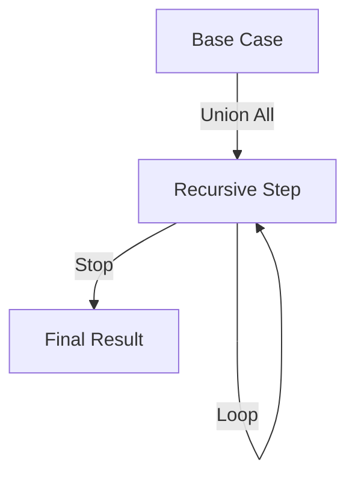

# Chapter 04 — Advanced SQL: Subqueries, CTEs & Window Functions — DBMS 🌐

SQL-এর বেসিক জানার পর আসল চ্যালেঞ্জ শুরু হয় অ্যাডভান্সড কোয়েরি নিয়ে। এই চ্যাপ্টারে আমরা শিখব কীভাবে বড় ডেটাসেট থেকে জটিল সব লজিক ব্যবহার করে ডেটা বের করা যায়।

---

## 1. Subqueries: The Inner Logic

একটি কোয়েরির ভেতরে যখন আরেকটি কোয়েরি থাকে, তাকে **Subquery** বা **Nested Query** বলে। এটি মূলত দুই প্রকার:

### 1.1 Non-correlated Subquery
এখানে ইনার কোয়েরি (Inner Query) আউটার কোয়েরির (Outer Query) ওপর নির্ভর করে না। এটি প্রথমে একবার রান হয় এবং তার রেজাল্ট আউটার কোয়েরিকে পাঠিয়ে দেয়।
- **Example:** ওই সব স্টুডেন্টের নাম বের করো যাদের মার্কস অ্যাভারেজ মার্কসের চেয়ে বেশি।
  ```sql
  SELECT Name FROM Student 
  WHERE Marks > (SELECT AVG(Marks) FROM Student);
  ```

### 1.2 Correlated Subquery
এটি অনেক বেশি গুরুত্বপূর্ণ। এখানে ইনার কোয়েরি আউটার কোয়েরির প্রতিটি রো-র জন্য একবার করে রান হয়। অর্থাৎ, এটি আউটার কোয়েরির ভ্যালুর ওপর নির্ভরশীল।
- **Logic:** এটি লুপের মতো কাজ করে।
- **Example:** প্রতিটি ডিপার্টমেন্ট থেকে হাইয়েস্ট স্যালারি পাওয়া এমপ্লয়ির নাম।
  ```sql
  SELECT E1.Name FROM Emp E1 
  WHERE Salary = (SELECT MAX(Salary) FROM Emp E2 WHERE E1.DeptID = E2.DeptID);
  ```

---

## 2. Window Functions: Analytics Powerhouse

Window Function-এর বিশেষত্ব হলো এটি প্রতিটি রো-র জন্য আলাদা আউটপুট দেয় কিন্তু এগ্রিগেট ফাংশনের মতো সব রো-কে গ্রুপ করে একটি রো বানিয়ে ফেলে না।

### 2.1 RANK vs DENSE_RANK vs ROW_NUMBER
চলুন নিচের উদাহরণের মাধ্যমে এদের পার্থক্য বুঝি:
ধরি মার্কসগুলো হলো: `90, 90, 80, 70`

- **ROW_NUMBER():** স্রেফ সিরিয়াল নম্বর দিবে। (`1, 2, 3, 4`)
- **RANK():** টাই হলে সেম র‍্যাঙ্ক দিবে কিন্তু পরের র‍্যাঙ্কটি স্কিপ করবে। (`1, 1, 3, 4`)
- **DENSE_RANK():** টাই হলে সেম র‍্যাঙ্ক দিবে এবং কোনো গ্যাপ রাখবে না। (`1, 1, 2, 3`)

---

## 3. CTE (Common Table Expressions) & Recursion

CTE কোডকে আরও রিডেবল এবং স্ট্রাকচারড করে। `WITH` ক্লজ দিয়ে এটি শুরু হয়।

### 3.1 Recursive CTE
এটি মূলত হায়ারার্কিকাল ডেটা (যেমন: Boss -> Manager -> Employee) হ্যান্ডেল করতে ব্যবহৃত হয়।
- **Working Method:** এটি নিজেকেই বারবার কল করে যতক্ষণ না বেস কন্ডিশন হিটিং হয়।



---

## 4. Views: Simple, Complex & Materialized

**View** হলো একটি ভার্চুয়াল টেবিল। এটি আসলে ডেটা স্টোর করে না, জাস্ট একটি সেভড কোয়েরি।

- **Simple View:** একটি মাত্র টেবিল থেকে তৈরি। এটি দিয়ে বেইজ টেবিলের ডেটা আপডেট সম্ভব।
- **Complex View:** একাধিক টেবিল (Joins) বা এগ্রিগেট ফাংশন দিয়ে তৈরি। সরাসরি আপডেট করা কঠিন।
- **Materialized View:** এটি ফিজিক্যালি ডিস্কে ডেটা স্টোর করে। পারফরম্যান্স ভালো দেয় যখন কোয়েরি খুব বড় হয় এবং বারবার রান করতে হয়।

---

## 📝 Practice Zone

### MCQ Quiz (10 Questions)
1. Correlated Subquery-তে ইনার কোয়েরি কতবার রান হয়?
   (A) একবার (B) দুবার **(C) আউটার কোয়েরির প্রতিটি রো-র জন্য** (D) রান হয় না
2. `RANK()` ফাংশন নিচের কোন সিকুয়েন্সটি ফলো করে (টাই এর ক্ষেত্রে)?
   (A) 1,2,2,3 **(B) 1,1,3,4** (C) 1,1,2,2 (D) 1,2,3,4
3. CTE শুরু করার জন্য কোন কী-ওয়ার্ড ব্যবহার হয়?
   **(A) WITH** (B) AS (C) VIEW (D) DEFINE
4. কোনটির মাধ্যমে ডেটা ফিজিক্যালি মেমরিতে থাকে?
   (A) Simple View (B) Complex View **(C) Materialized View** (D) Inline View
5. Window Function-এ গ্রুপ করার জন্য কোনটি ব্যবহার হয়?
   (A) GROUP BY **(B) PARTITION BY** (C) ORDER BY (D) OVER
6. Recursive CTE-তে দুটি কোয়েরিকে যুক্ত করতে কী লাগে?
   (A) JOIN **(B) UNION ALL** (C) INTERSECT (D) EXCEPT
7. $N$-th Highest Salary বের করার সবচেয়ে কার্যকর উপায় কোনটি?
   (A) Join **(B) DENSE_RANK()** (C) SELECT * (D) Group By
8. View-এর মেইন অবজেক্টিভ কী?
   (A) Storage **(B) Security & Simplification** (C) Faster Write (D) Backup
9. Correlated Subquery-তে আউটার টেবিলকে ইনারে চেনার উপায় কী?
   (A) Primary Key (B) Foreign Key **(C) Table Alias** (D) View
10. `LEAD()` ফাংশনের কাজ কী?
    **(A) পরের রো-র ভ্যালু দেখা** (B) আগের রো-র ভ্যালু দেখা (C) র‍্যাঙ্ক করা (D) ডুপ্লিকেট সরানো

### Written/Numerical Problems (5 Tasks)
1. **Subquery Logic:** `EXISTS` এবং `IN`-এর মধ্যে পার্ফমন্যান্স ডিফারেন্স ব্যাখ্যা করো। (Ans: EXISTS সাধারণত ডাইনামিক ফিল্টারিংয়ের জন্য ফাস্টার)।
2. **Recursive Logic:** ১ থেকে ১০ পর্যন্ত প্রিন্ট করার একটি Recursive CTE তৈরি করো।
   *Solution:* 
   ```sql
   WITH RECURSIVE nums AS (
     SELECT 1 AS n
     UNION ALL
     SELECT n + 1 FROM nums WHERE n < 10
   ) SELECT * FROM nums;
   ```
3. **Difference Task:** `RANK()` বনাম `DENSE_RANK()`—উদাহরণসহ ৫ মার্কের জন্য বিস্তারিত লেখো।
4. **Window Function Scenario:** প্রত্যেক ডিপার্টমেন্টের সেকেন্ড হায়ারার্কিকাল এমপ্লয়িকে খুঁজে বের করার লজিক লেখো।
5. **Materialized View:** কেন আমরা রিফ্রেশ করি? (Ans: যেহেতু এটি ফিজিক্যাল কপি রাখে, তাই বেইজ টেবিল চেঞ্জ হলে এটি ম্যানুয়ালি বা শিডিউল মেনে রিফ্রেশ করতে হয়)।

---

## 🎖️ Job Exam Special (BPSC/Bank/GATE)
- **GATE Pattern:** সাবকোয়েরির টাইম কমপ্লেক্সিটি এবং এর ইকুইভ্যালেন্ট রিলেশনাল অ্যালজেবরা এক্সপ্রেশন।
- **Bank IT:** ২য় বা ৩য় সর্বোচ্চ স্যালারি বের করার কুয়েরি খুব কমন।
- **BPSC:** ভিউ-এর সুবিধা এবং অসুবিধা নিয়ে প্রশ্ন আসে।

---

## ⚠️ Interview Traps
- **Trap 1:** "Can we update a Materialized View directly?" → No, original table data change must be synced.
- **Trap 2:** "Difference between Partition By and Group By?" → Group BY rows ছোট করে দেয়, Partition By অরিজিনাল রো সংখ্যা ঠিক রাখে কিন্তু ক্যালকুলেশন উইন্ডো চেঞ্জ করে।
- **Trap 3:** "Will a Subquery always be slower than a Join?" → Not always, Modern Optimizers often convert subqueries to joins internally.

---
**প্রো টিপ:** অ্যাডভান্সড SQL মানেই উইন্ডো ফাংশন আর CTE-তে মাস্টার হওয়া। এটি প্র্যাকটিস করার জন্য বড় ডেটাসেটে র‍্যাঙ্কিং ট্রাই করো।
