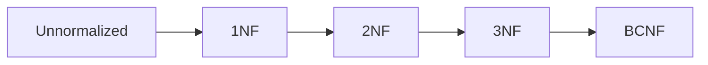

# Chapter 05 — Normalization & Functional Dependency

---

## 1. Why Normalization
- update anomaly remove
- insert anomaly remove
- delete anomaly remove

## 2. FD Basics
- X → Y means X determines Y
- trivial vs non-trivial
- full vs partial dependency
- transitive dependency

## 3. Normal Forms
- 1NF: atomic values
- 2NF: no partial dependency (on composite key)
- 3NF: no transitive dependency
- BCNF: every determinant is a candidate key



---

## 4. SQL Example (decomposition target)

```sql
-- SSMS/PostgreSQL logical model after normalization
CREATE TABLE Departments (
  DeptID INT PRIMARY KEY,
  DeptName VARCHAR(100) UNIQUE NOT NULL
);

CREATE TABLE Students (
  StudentID INT PRIMARY KEY,
  StudentName VARCHAR(100) NOT NULL,
  DeptID INT NOT NULL REFERENCES Departments(DeptID)
);
```

---

## 5. MCQ (15)
1. 1NF core rule? → atomic values ✅  
2. 2NF remove? → partial dependency ✅  
3. 3NF remove? → transitive dependency ✅  
4. BCNF strict than 3NF? → হ্যাঁ ✅  
5. Anomaly reduction purpose? → normalization ✅  
6. FD X→Y মানে? → X determines Y ✅  
7. Candidate key কী? → minimal unique determinant ✅  
8. Composite key partial dep হলে? → 2NF violate ✅  
9. 3NF condition? → non-key attributes depend on key only ✅  
10. BCNF condition? → determinant must be candidate key ✅  
11. Denormalization কবে? → performance tradeoff দরকার হলে ✅  
12. Lossless decomposition goal? → no information loss ✅  
13. Dependency preservation goal? → constraints maintain সহজ ✅  
14. Update anomaly example? → same fact বহু row এ update ✅  
15. Normalization সবসময় performance বাড়ায়? → না, tradeoff আছে ✅

---

## 6. Written Problems (5) with Solution

### P1: Enrollment(Student,Course,Instructor,InstructorPhone) anomalies identify
**Solution:** instructor data repeat হচ্ছে; update anomaly + delete anomaly আছে।

### P2: Composite key partial dependency detect
Relation: (StudentID, CourseID, StudentName, CourseName)  
**Solution:** StudentName depends only on StudentID; CourseName only on CourseID → 2NF violation।

### P3: 3NF decomposition
Relation: (EmpID, EmpName, DeptID, DeptName)  
**Solution:** DeptName depends on DeptID, not EmpID → split Employees + Departments।

### P4: BCNF check
R(A,B,C), FD: A→B, B→A, A→C  
**Solution:** A and B candidate keys; determinants candidate key → BCNF satisfied।

### P5: Lossless decomposition short test
R(XYZ), split R1(XY), R2(YZ)  
**Solution:** common attribute Y যদি key-কে functionally determine করে context অনুযায়ী, lossless হতে পারে; formal chase method explain।

---

## 7. Summary
- FD logic + NF ladder clear
- practical decomposition mindset তৈরি

---

## Navigation
- 🏠 [Master Index](00-master-index.md)
- ⬅️ [Chapter 04](04-advanced-sql-subquery-cte-window.md)
- ➡️ Chapter 06 — Transactions & Concurrency

