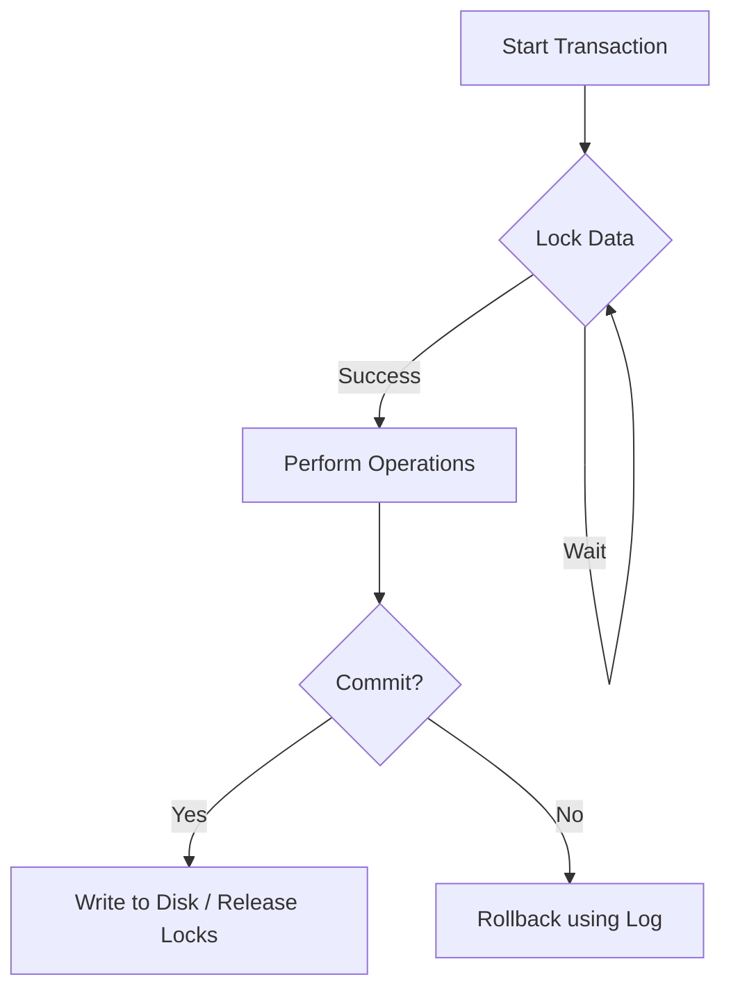

# Chapter 06 — Transactions, Concurrency & Recovery — DBMS 🌐

ডেটাবেস কেবল ডেটা স্টোর করে না, বরং এটি নিশ্চিত করে যে হাজার হাজার মানুষ একসাথে ডেটা এক্সেস করলেও সেটি যেন সব সময় সঠিক (Consistent) থাকে। এটিই হলো ট্রানজেকশন ম্যানেজমেন্টের কাজ।

---

## 1. ACID Properties: The Foundation

একটি সফল ট্রানজেকশনকে অবশ্যই ৪টি শর্ত পূরণ করতে হবে:
1. **Atomicity (All or Nothing):** ট্রানজেকশনটি সম্পূর্ণ হতে হবে অথবা মোটেও হবে না। (Mechanism: **Transaction Log** & **Rollback**).
2. **Consistency:** ট্রানজেকশনের আগে এবং পরে ডেটাবেস যেন একটি ভ্যালিড স্টেটে থাকে।
3. **Isolation:** একাধিক ট্রানজেকশন একসাথে চললেও একটির ইফেক্ট অন্যটির ওপর পড়বে না। (Mechanism: **Concurrency Control**).
4. **Durability:** একবার ট্রানজেকশন সাকসেসফুল হলে, পাওয়ার ফেইলুর হলেও ডেটা হারাবে না। (Mechanism: **Shadow Paging** & **Logging**).

---

## 2. Concurrency Control: The Logic of Conflict

যখন অনেকগুলো ট্রানজেকশন একসাথে রান হয়, তখন আমাদের চেক করতে হয় সেটি **Conflict Serializable** কি না। 

### 2.1 Conflict Conditions
দুটি অপারেশন কনফ্লিক্ট করবে যদি:
1. তারা ভিন্ন ট্রানজেকশনের হয়।
2. তারা একই ডেটা আইটেমে কাজ করে।
3. তাদের মধ্যে অন্তত একটি **Write** অপারেশন হয়।

### 2.2 Precedence Graph
এটি চেক করার সবচেয়ে সহজ উপায়। 
- $T_1 \rightarrow T_2$ হবে যদি $T_1$-এর কনফ্লিক্টিং অপারেশন $T_2$-র আগে ঘটে। 
- **Rule:** যদি গ্রাফে কোনো **Cycle** থাকে, তবে সেটি Serializable নয়।

---

## 3. Locking Protocols: The Traffic Guards

### 3.1 2PL (Two-Phase Locking)
- **Phase 1 (Growing):** কেবল নতুন লক নেওয়া যাবে, কোনো লক ছাড়া যাবে না।
- **Phase 2 (Shrinking):** কেবল লক ছাড়া যাবে, নতুন লক নেওয়া যাবে না।
- **Drawback:** এটি ক্যাসকেডিং রোলব্যাক আটকাতে পারে না এবং ডেডলক হতে পারে।

### 3.2 Strict 2PL
এখানে ট্রানজেকশন শেষ (Commit/Abort) না হওয়া পর্যন্ত কোনো এক্সক্লুসিভ লক (Exclusive Lock) ছাড়া যাবে না। এটি ক্যাসকেডিং রোলব্যাক রক্ষা করে।

---

## 4. Deadlock Handling

ডেডলক হলো এমন পরিস্থিতি যখন $T_1$ অপেক্ষা করছে $T_2$-র জন্য, আর $T_2$ অপেক্ষা করছে $T_1$-এর জন্য।

### 4.1 Deadlock Prevention Strategies
- **Wait-Die (Non-preemptive):** যদি ওল্ডার (Older) ট্রানজেকশন ইয়াঙ্গার (Younger)-এর লক চায়, তবে সে ওয়েট করবে। আর উল্টোটা হলে ইয়াঙ্গার ডাই (Die) করবে।
- **Wound-Wait (Preemptive):** যদি ওল্ডার ইয়াঙ্গার-এর লক চায়, তবে সে ইয়াঙ্গার-কে উন্ড (Wound/Kill) করবে।

---

## 5. Recovery Techniques

সিস্টেম ক্র্যাশ করলে ডেটা রিকভার করার উপায়:
1. **Log-based Recovery:** প্রতিটি কাজের লগ রাখা হয়। এখানে দুটি অপারেশন থাকে: **Redo** (আবার করা) এবং **Undo** (বাতিল করা)।
2. **Shadow Paging:** অরিজিনাল পেজটি আপডেট না করে তার একটি শ্যাডো কপি আপডেট করা হয়। সাকসেসফুল হলে কেবল অরিজিনাল পয়েন্টারটি চেঞ্জ করে দেওয়া হয়।

---

## 📝 Practice Zone

### MCQ Quiz (10 Questions)
1. ACID-এর কোন প্রপার্টি ডেডলক হ্যান্ডলিংয়ের সাথে সম্পর্কিত?
   (A) Atomicity (B) Consistency **(C) Isolation** (D) Durability
2. Precedence Graph-এ সাইকেল (Cycle) থাকলে কী হবে?
   (A) It is serializable **(B) It is not serializable** (C) Deadlock (D) Consistency
3. 2PL-এর কোন ফেজে লক রিলিজ করা শুরু হয়?
   (A) Growing Phase **(B) Shrinking Phase** (C) Lock Phase (D) End Phase
4. Wait-Die স্কিমে যদি ওল্ডার ট্রানজেকশন ওয়েট করে, তবে ইয়াঙ্গার কী হবে?
   (A) Die **(B) Keeps Running** (C) Abort (D) Wait
5. রিকভারি করার জন্য নিচের কোনটি প্রয়োজন?
   **(A) Log File** (B) Compiler (C) Index (D) Primary Key
6. Dirty Read প্রবলেম দেখা যায় কোন ক্ষেত্রে?
   **(A) Uncommitted Dependency** (B) Committed data (C) Serial schedule (D) BCNF
7. $R(A) \rightarrow W(A)$ কনফ্লিক্ট করবে কি না?
   **(A) Yes (If T1 and T2)** (B) No (C) Depends (D) Only if shared
8. Strict 2PL কেন ব্যবহার করা হয়?
   (A) For Speed **(B) To prevent Cascading Rollback** (C) For Deadlock Prevention (D) No use
9. Shadow Paging-এর প্রধান সুবিধা কী?
   (A) Less Memory **(B) No need for Undo/Redo logs** (C) Faster Writes (D) Easier Joins
10. 'Checkpoint' রিকভারি প্রসেসে কী কাজ করে?
    **(A) Reduces Log processing** (B) Saves password (C) Starts SQL (D) Deletes data

### Written/Numerical Problems (5 Tasks)
1. **Serialization Check:** একটি সিডিউল দেওয়া হলো: $S: R_1(X), R_2(Y), W_1(X), R_2(X), W_2(Y)$। এটি কি Conflict Serializable? (Hint: $T_1 \rightarrow T_2$ চেক করো)।
2. **2PL Comparison:** ২-ফেজ লকিং এবং স্ট্রিক্ট ২-ফেজ লকিংয়ের মধ্যে পার্থক্য সারণী আকারে লেখো।
3. **Wait-Die Scenario:** $T_1$ (Timestamp 10) এবং $T_2$ (Timestamp 20)। $T_2$ যদি $T_1$-এর হোল্ড করা লক চায়, তবে কী হবে? (Ans: $T_2$ ডাই করবে কারণ সে ইয়াঙ্গার)।
4. **Log Analysis:** বুঝাও কেন `COMMIT` হওয়ার আগে লগ ফাইল ডিস্কে রাইট করা ম্যান্ডেটরি (**Write-Ahead Logging**)।
5. **State Diagram:** একটি ট্রানজেকশনের লাইফসাইকেল (Active, Partially Committed, Committed, Failed, Aborted) ডায়াগ্রাম একে ব্যাখ্যা করো।

---

## 🎖️ Job Exam Special (BPSC/Bank/GATE)
- **GATE:** Precedence graph থেকে সিরিয়ালাইজেবিলিটি চেক করার ম্যাথ ১০০০% কমন।
- **Bank IT:** ACID প্রপার্টিজ এবং ডেডলকের সংজ্ঞা।
- **BPSC:** রিকভারি টেকনিকসমূহ (Log-based, Checkpoints) নিয়ে ১০ মার্কের প্রশ্ন আসে।

---

## ⚠️ Interview Traps
- **Trap 1:** "Is a serializable schedule always better?" → Performance wise it might be slow due to locking overhead, but consistency wise it is the best.
- **Trap 2:** "Can we have Durability without Atomicity?" → No. If the process is half-done, making it durable will store corrupted data.
- **Trap 3:** "Does 2PL prevent Deadlock?" → No, 2PL can actually lead to deadlocks.

---
**প্রো টিপ:** ট্রানজেকশন বুঝার সবচেয়ে সহজ উপায় হলো ব্যাংক ট্রান্সফারের কথা চিন্তা করা। এক অ্যাকাউন্ট থেকে টাকা কাটা (Write 1) এবং অন্য অ্যাকাউন্টে যোগ হওয়া (Write 2) এর মাঝে কিছু হলে কী হতে পারে—সেটিই ট্রানজেকশন লজিক!
