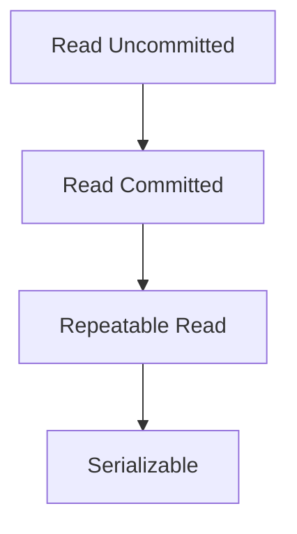

# Chapter 06 — Transactions, Concurrency & Recovery

---

## 1. Transaction Lifecycle
- BEGIN
- READ/WRITE
- COMMIT / ROLLBACK

## 2. Concurrency Problems
- Lost update
- Dirty read
- Non-repeatable read
- Phantom read

## 3. Isolation Levels
- Read Uncommitted
- Read Committed
- Repeatable Read
- Serializable



---

## 4. SSMS + PostgreSQL Snippet

```sql
-- SSMS
BEGIN TRAN;
UPDATE Accounts
SET Balance = Balance - 500
WHERE AccountID = 1;

UPDATE Accounts
SET Balance = Balance + 500
WHERE AccountID = 2;

COMMIT TRAN;
```

```sql
-- PostgreSQL
BEGIN;
UPDATE accounts
SET balance = balance - 500
WHERE account_id = 1;

UPDATE accounts
SET balance = balance + 500
WHERE account_id = 2;

COMMIT;
```

---

## 5. MCQ (15)
1. Atomicity মানে? → all or nothing ✅  
2. Dirty read কবে? → uncommitted data read করলে ✅  
3. Lost update cause? → concurrent overwrite ✅  
4. Highest isolation? → Serializable ✅  
5. COMMIT কাজ? → make changes permanent ✅  
6. ROLLBACK কাজ? → undo uncommitted changes ✅  
7. Deadlock কী? → cyclic waiting ✅  
8. 2PL full form? → Two-Phase Locking ✅  
9. Shared lock use? → read ✅  
10. Exclusive lock use? → write ✅  
11. WAL full form? → Write-Ahead Logging ✅  
12. Recovery core source? → log records ✅  
13. Phantom read reduce কোথায়? → Serializable/Repeatable (engine dependent) ✅  
14. Read committed dirty read allow করে? → না ✅  
15. Checkpoint purpose? → faster recovery ✅

---

## 6. Written Problems (5) with Solution

### P1: Money transfer কেন transaction?
**Solution:** debit+credit pair atomic না হলে টাকা হারাবে/বাড়বে; তাই transaction mandatory।

### P2: Dirty read scenario explain
**Solution:** T1 update but commit না; T2 read করে; T1 rollback করলে T2 invalid data পড়েছে।

### P3: Deadlock example
**Solution:** T1 locks A waits B, T2 locks B waits A → cycle; DBMS detect and victim abort।

### P4: Isolation level নির্বাচন
**Solution:** OLTP banking জন্য Read Committed/Repeatable; strict consistency দরকার হলে Serializable।

### P5: Crash recovery short flow
**Solution:** log scan → redo committed → undo uncommitted।

---

## 7. Summary
- ACID practical meaning clear
- concurrency anomalies + isolation mapping clear
- recovery logging intuition complete

---

## Navigation
- 🏠 [Master Index](00-master-index.md)
- ⬅️ [Chapter 05](05-normalization-functional-dependency.md)
- ➡️ Chapter 07 — Indexing & Optimization

