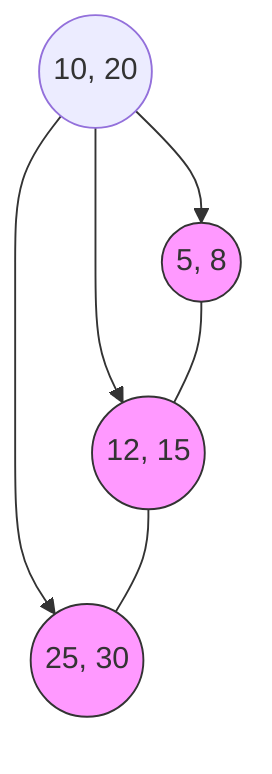

# Chapter 07 — Indexing, Query Optimization & Internals — DBMS 🚀

ডেটাবেস থেকে ডেটা খুঁজে বের করার গতি অনেক সময় ইনডেক্সিং এর ওপর নির্ভর করে। ইনডেক্সিং ছাড়া ডেটাবেস হলো এমন এক লাইব্রেরি যেখানে বইগুলো কোনো নিয়ম ছাড়াই রাখা আছে। এই চ্যাপ্টারে আমরা ইনডেক্সিং এর গভীর মেকানিক্স এবং কুয়েরি অপ্টিমাইজেশন নিয়ে আলোচনা করব।

---

## 1. Internal Mechanics: B-Tree vs B+ Tree

সবচেয়ে কমন ইনডেক্সিং স্ট্রাকচার হলো Tree-based indexing।

### 1.1 B-Tree (Balanced Tree)
- **Logic:** এখানে প্রতিটি নোড (Internal এবং Leaf) ডেটা পয়েন্টার (Data Pointer) ধারণ করে।
- **Pros:** যদি সার্চ করা কি (Key) রুট নোডের কাছে থাকে, তবে দ্রুত পাওয়া যায়।
- **Cons:** প্রতিটি নোডে ডেটা থাকায় লিফ নোডগুলোতে ফ্যান-আউট (Fan-out) কম হয় এবং রেঞ্জ কুয়েরি করা কঠিন।

### 1.2 B+ Tree (The Industry Standard)
- **Logic:** এখানে কেবল **Leaf Nodes** ডেটা বা রেকর্ড পয়েন্টার ধারণ করে। **Internal Nodes** কেবল ইনডেক্স বা গাইড হিসেবে কাজ করে।
- **Linked Leaf:** সব লিফ নোড একে অপরের সাথে লিঙ্কড থাকে (Doubly Linked List), যা রেঞ্জ সার্চের জন্য আদর্শ।

#### B+ Tree Insertion Logic:
1. নতুন কি (Key) সঠিক লিফ নোডে ইনসার্ট করো।
2. যদি নোড ফুল হয়ে যায় ($n$ টা কি এর বেশি), তবে নোডটিকে স্প্লিট (Split) করো।
3. লেফট সাইডে $\lceil(n+1)/2\rceil$ টা কি রাখো এবং বাকিগুলো রাইটে।
4. মিডল কি-টিকে উপরে (Parent node) ঠেলে দাও।

---

## 2. Clustered vs Non-Clustered Indexing

এটি মেমোরিতে ডেটা কীভাবে স্টোর হবে তার ওপর ভিত্তি করে কাজ করে।

### 2.1 Clustered Index
- **Mechanism:** এটি ফিজিক্যাল মেমোরিতে ডেটাকে অর্ডারিং করে। অর্থাৎ, ইনডেক্স যেভাবে সাজানো, ডেটাও হার্ডডিস্কে সেভাবে সাজানো থাকে।
- **Rule:** একটি টেবিলে কেবল **একটি** Clustered Index থাকতে পারে (সাধারণত Primary Key)।
- **Memory Logic:** যেহেতু ডেটা ইনডেক্স পেজের সাথেই থাকে, তাই ডিস্ক I/O অনেক কম হয়।

### 2.2 Non-Clustered Index
- **Mechanism:** এটি একটি আলাদা স্ট্রাকচার তৈরি করে যেখানে কেবল 'Key' এবং ওই ডেটার 'Memory Address' (RID - Row ID) থাকে।
- **Rule:** একটি টেবিলে অনেকগুলো Non-Clustered Index থাকতে পারে।
- **Memory Logic:** প্রথমে ইনডেক্স সার্চ হয়, তারপর সেখান থেকে পয়েন্টার নিয়ে অরিজিনাল ডেটা পেজে জাম্প করতে হয় (এটি 'Bookmark Lookup' নামে পরিচিত)।

---

## 3. Query Optimizer & Relational Algebra

যখন আপনি SQL লিখেন, তখন ডেটাবেস একে সরাসরি রান করে না। **Query Optimizer** সবচেয়ে কম খরুচে (Cost-efficient) পথ খুঁজে বের করে।

### Optimization Rules (Based on Relational Algebra):
1. **Selection Pruning ($\sigma$):** যত দ্রুত সম্ভব ফিল্টার অ্যাপ্লাই করো। (Push selection down).
2. **Projection ($\pi$):** কেবল প্রয়োজনীয় কলামগুলো নাও।
3. **Join Reordering:** বড় টেবিলের সাথে ছোট টেবিলের জয়েন করার আগে ফিল্টার করে টেবিল ছোট করে নেওয়া।

---

## 4. RAID: Redundant Array of Independent Disks

ডেটাবেস স্টোরেজ ফেইলুর হ্যান্ডেল করার জন্য RAID ব্যবহার করা হয়।

| RAID Level | Name | Logic | Pros/Cons |
|------------|------|-------|-----------|
| **RAID 0** | Striping | ডেটা দুটি ডিস্কে ভাগ করে লেখা হয়। | অনেক ফাস্ট, কিন্তু কোনো ব্যাকআপ নেই। |
| **RAID 1** | Mirroring | একই ডেটা দুটি ডিস্কে কপি করা হয়। | ১টি ডিস্ক নষ্ট হলেও ডেটা সেফ। কস্ট বেশি। |
| **RAID 5** | Striping with Parity | ডেটা এবং প্যারিটি বিট ৩+ ডিস্কে রাখা হয়। | ব্যালেন্সড স্পিড ও সেফটি। ১টি ডিস্ক ফেইলুর সহ্য করতে পারে। |
| **RAID 6** | Dual Parity | দুটি ডিস্ক নষ্ট হলেও ডেটা রিকভার সম্ভব। | হাই সিকিউরিটি, রাইট স্পিড কিছুটা স্লো। |

---

## 📝 Practice Zone

### 10 MCQs
1. B+ Tree-তে ডেটা পয়েন্টার কোথায় থাকে?
   (A) Root Node (B) Internal Nodes **(C) Leaf Nodes only** (D) Everywhere
2. একটি টেবিলে কয়টি Clustered Index থাকতে পারে?
   **(A) 1** (B) 2 (C) Unlimited (D) 0
3. RAID 1 কেন ব্যবহার করা হয়?
   (A) Speed (B) Capacity **(C) Redundancy/Mirroring** (D) Striping
4. Query Optimizer কোন অ্যালজেব্রার ওপর ভিত্তি করে কাজ করে?
   **(A) Relational Algebra** (B) Boolean Algebra (C) Linear Algebra (D) Calculus
5. Non-Clustered Index-এর শেষে কী থাকে?
   (A) Actual Data **(B) Pointer/Address to data** (C) Table Name (D) Log
6. B-Tree এর তুলনায় B+ Tree কেন ভালো?
   **(A) Better range queries** (B) Uses more memory (C) Difficult to implement (D) No logic
7. RAID 5 এ অন্তত কয়টি ডিস্ক লাগে?
   (A) 2 **(B) 3** (C) 4 (D) 5
8. 'Push Selection Down' মানে কী?
   **(A) Filter early** (B) Join early (C) Group by last (D) Delete data
9. Dense Index এবং Sparse Index এর মধ্যে পার্থক্য কী?
   **(A) Dense stores every key** (B) Sparse stores every key (C) Both same (D) No index
10. কলাম ইনডেক্সিং-এর সুবিধা কী?
    **(A) Faster Search** (B) Faster Insert (C) Less disk space (D) Reliable recovery

### 5 Written Problems (Solved)
1. **B+ Tree Calculation:** একটি B+ Tree এর অর্ডার $5$। রুট নোডে সর্বোচ্চ কয়টি কি (Key) থাকতে পারে?
   - **Solution:** অর্ডার $n=5$ হলে, সর্বোচ্চ কি থাকতে পারে $n-1 = 4$ টি।
2. **RAID Comparison:** RAID 0 এবং RAID 1 এর মধ্যে কোনটি ডেটাবেস সার্ভারের জন্য বেশি নিরাপদ? কেন?
   - **Solution:** RAID 1। কারণ এখানে Mirroring থাকে, ১টি ডিস্ক ক্রাশ করলে অন্যটি থেকে ডেটা পাওয়া যায়। RAID 0 তে কোনো রিডান্ডেন্সি নেই।
3. **Index Selection:** একটি কলামে প্রচুর ডুপ্লিকেট ভ্যালু আছে (যেমন: Gender)। সেখানে কি ইনডেক্স করা উচিত?
   - **Solution:** না। একে Low Cardinality বলে। ইনডেক্স করলে পার্ফমেন্স না বেড়ে উল্টো ইনসার্ট স্লো হয়ে যাবে।
4. **Clustered Index Logic:** কেন Primary Key-কে ডিফল্টভাবে Clustered Index করা হয়?
   - **Solution:** কারণ Primary Key দিয়ে সবচেয়ে বেশি সার্চ করা হয় এবং ডেটা ফিজিক্যালি সর্টেড থাকলে রেঞ্জ বা অর্ডার কুয়েরি অনেক ফাস্ট হয়।
5. **Query Plan:** `SELECT name FROM users WHERE age > 20 AND city = 'Dhaka'` - এটার অপ্টিমাইজড প্ল্যান কী হবে?
   - **Solution:** প্রথমেই `city = 'Dhaka'` ফিল্টার অ্যাপ্লাই করা (যাতে রো সংখ্যা কমে যায়), তারপর `age > 20` চেক করা।

---

## 🎖️ Job Exam Special (BPSC/Bank)
- **BPSC:** B-Tree vs B+ Tree এর আর্কিটেকচার ড্রয়িং সহ প্রশ্ন ১০ মার্কের জন্য ফ্রিকোয়েন্টলি আসে।
- **Bank IT:** RAID 5 এবং RAID 6 এর মেকানিজম এবং ডিস্ক ফেইলুর টলারেন্স নিয়ে প্রশ্ন আসে।
- **Common Question:** "Explain why indexing makes SELECT faster but INSERT slower." (কারণ ইনসার্ট করার সময় ইনডেক্স ট্রি-কেও আপডেট করতে হয়)।

---

## ⚠️ Interview Traps
- **Trap 1:** "If I index all columns, will my database be super fast?" → **No.** ইনডেক্সিং ডিস্ক স্পেস খায় এবং INSERT/UPDATE/DELETE অপারেশনকে অনেক স্লো করে দেয়।
- **Trap 2:** "Does a B+ Tree always stay balanced?" → **Yes.** ইনসার্ট বা ডিলিট যাই হোক, এটি অটোমেটিক রি-ব্যালেন্স হয়।
- **Trap 3:** "Difference between Index Seek and Index Scan?" → **Seek** হলো সরাসরি টার্গেটে যাওয়া (ফাস্ট), আর **Scan** হলো পুরো ইনডেক্স খাতা শুরু থেকে শেষ পর্যন্ত পড়া (স্লো)।

---
**প্রো টিপ:** ইনডেক্সিং হলো বইয়ের শুরুতে থাকে 'সূচিপত্র' এর মতো। সূচিপত্র ছাড়া ৫০০ পাতার বইয়ে একটা টপিক খোঁজা যতটা কঠিন, ইনডেক্স ছাড়া ডেটাবেসে ডেটা খোঁজা ঠিক ততটাই পেইনফুল!
