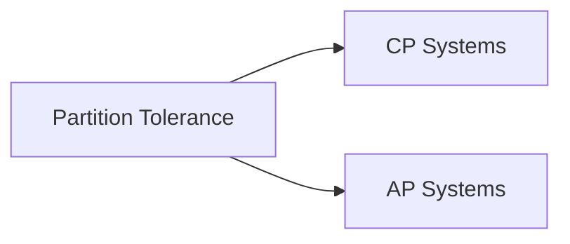

# Chapter 08 — NoSQL, CAP & Practical Database Design

---

## 1. NoSQL Family
- Key-Value (Redis)
- Document (MongoDB)
- Column-family (Cassandra)
- Graph (Neo4j)

## 2. CAP Theory
- C = Consistency
- A = Availability
- P = Partition tolerance

Partition হলে system-কে C vs A এর মধ্যে tradeoff নিতে হয়।



---

## 3. SQL vs NoSQL কখন?

| Scenario | Better Choice |
|---|---|
| strict transaction banking | SQL |
| dynamic schema content data | NoSQL document |
| massive caching | key-value |
| relationship-heavy traversal | graph |

---

## 4. Practical Design Pattern
- Read-heavy: cache + replicas
- Write-heavy: partition/shard
- Event-driven: queue + eventual consistency
- Idempotency key for retry-safe writes

---

## 5. SSMS + PostgreSQL Snippet (design সহ)

```sql
-- SSMS/PostgreSQL style relational order table
CREATE TABLE Orders (
    OrderID INT PRIMARY KEY,
    CustomerID INT NOT NULL,
    OrderAmount DECIMAL(12,2) NOT NULL,
    CreatedAt TIMESTAMP NOT NULL
);
```

```sql
-- PostgreSQL JSONB example (semi-structured)
CREATE TABLE order_events (
    event_id SERIAL PRIMARY KEY,
    order_id INT NOT NULL,
    payload JSONB NOT NULL,
    created_at TIMESTAMP DEFAULT CURRENT_TIMESTAMP
);
```

---

## 6. MCQ (15)
1. CAP-এ partition হলে কী true? → C and A একসাথে full guarantee কঠিন ✅  
2. Redis type? → key-value ✅  
3. MongoDB type? → document ✅  
4. Neo4j type? → graph ✅  
5. Strict ACID কোথায় strong? → relational SQL ✅  
6. Eventual consistency মানে? → later converge ✅  
7. Read scaling কীভাবে? → replicas ✅  
8. Sharding purpose? → horizontal scale ✅  
9. Cache hit increase effect? → latency কমে ✅  
10. Idempotency key কেন? → retry duplicate write ঠেকাতে ✅  
11. OLTP critical banking best? → SQL transactional ✅  
12. Highly connected social graph best? → graph DB ✅  
13. Denormalization NoSQL-এ common? → হ্যাঁ ✅  
14. CAP-এ CA practically distributed network-এ feasible? → limited ✅  
15. Partition tolerance ignore করা যায়? → না (real network failures আছে) ✅

---

## 7. Written Problems (5) with Solution

### P1: E-commerce cart data SQL না NoSQL?
**Solution:** cart দ্রুত read/write + flexible item metadata হলে NoSQL (Redis/Document) useful; order finalization SQL।

### P2: Social follow graph design
**Solution:** graph DB natural; SQL-এ possible but deep traversal expensive হতে পারে।

### P3: Read-heavy product catalog
**Solution:** primary SQL + cache layer (Redis) + search index strategy।

### P4: Retry duplicate payment problem
**Solution:** idempotency key + unique constraint ব্যবহার।

### P5: Multi-region availability decision
**Solution:** AP-leaning eventual consistency for non-critical feed; CP for critical ledger।

---

## 8. Summary
- SQL + NoSQL complement relation clear
- CAP tradeoff বোঝা হয়েছে
- practical architecture decision framework complete

---

## Navigation
- 🏠 [Master Index](00-master-index.md)
- ⬅️ [Chapter 07](07-index-query-optimization-internals.md)
- ✅ DBMS course complete

