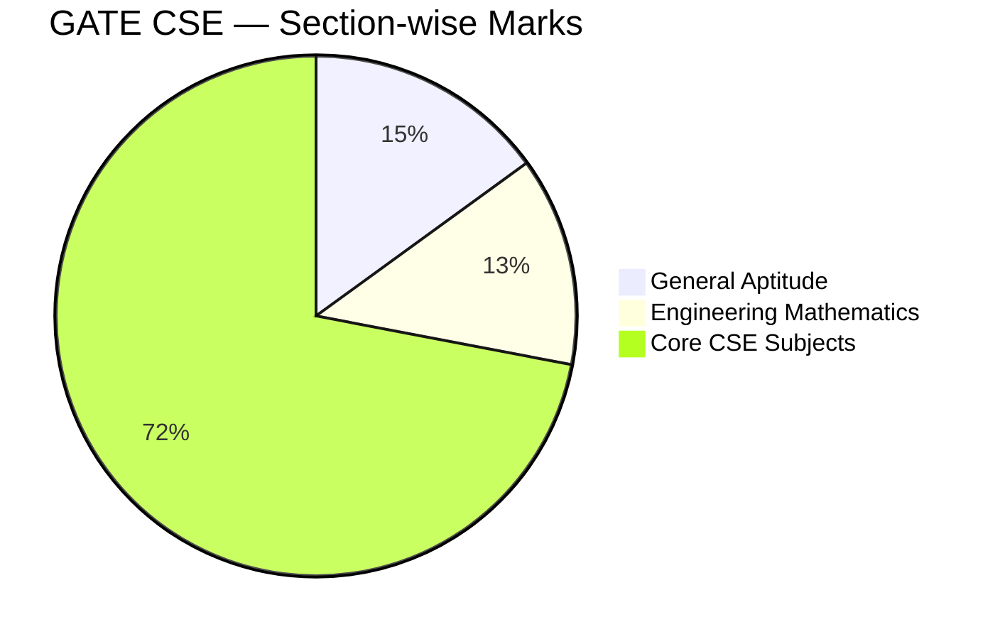
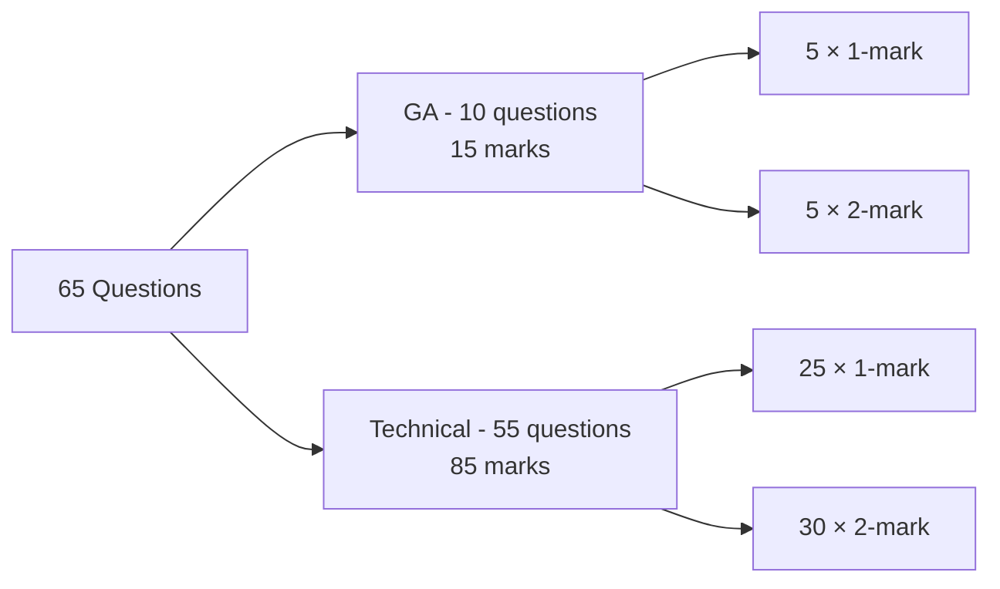
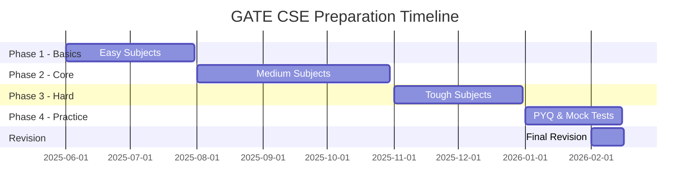
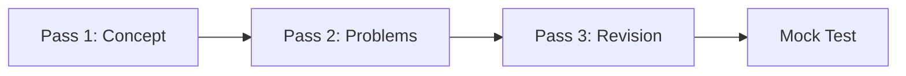
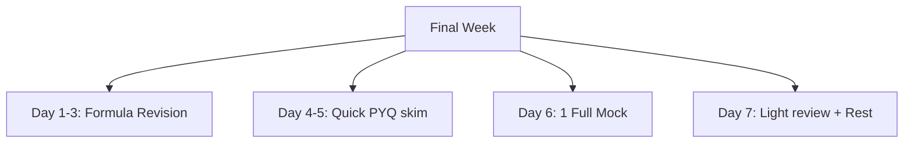

# GATE CSE — Exam Pattern & Strategy 🎯

> GATE এ পরীক্ষার pattern কেমন, কোথায় মনোযোগ দিতে হবে, কীভাবে preparation করতে হবে — সব কিছু এই document এ।

---

## 📋 1. Exam Pattern Overview

### Basic Info

| বিষয় | Details |
|------|---------|
| **পরীক্ষার নাম** | Graduate Aptitude Test in Engineering (GATE) |
| **পরিচালনা** | IIT/IISc (rotates each year) |
| **Duration** | **3 hours** (180 minutes) |
| **Total Marks** | **100** |
| **Mode** | Online Computer Based Test (CBT) |
| **Frequency** | বছরে একবার (February তে) |
| **Language** | English |

---

### Marks Distribution

| Section | Marks | Notes |
|---------|-------|-------|
| General Aptitude (GA) | 15 | Verbal + Numerical |
| Engineering Mathematics | ~13 | Discrete Math, Calculus, Linear Algebra |
| Core CSE | ~72 | OS, DBMS, Algo, Networks, TOC ইত্যাদি |
| **Total** | **100** | — |

---

## 🧩 2. Question Types

GATE এ **৩ ধরনের question** থাকে:

### 2.1 Multiple Choice Questions (MCQ)

- **4 options**, একটা correct
- ✅ Correct answer → **full marks**
- ❌ Wrong answer → **negative marking**
  - 1-mark MCQ → **-⅓ (0.33)** mark
  - 2-mark MCQ → **-⅔ (0.66)** mark
- ⚠️ নিশ্চিত না হলে **skip করা ভালো**

### 2.2 Multiple Select Questions (MSQ)

- **4 options**, **এক বা একাধিক** correct হতে পারে
- ✅ সব correct options select করলে full marks
- ❌ **No negative marking**
- ⚠️ Partial marking **নাই** — সব ঠিক হলে full, না হলে 0

### 2.3 Numerical Answer Type (NAT)

- Answer একটা **number** (integer বা decimal)
- Keyboard দিয়ে type করতে হয়
- ❌ **No negative marking**
- ✅ তাই সব NAT question **অবশ্যই attempt করবেন**

---

### Question Type Comparison

| Type | Options | Negative Marking | Strategy |
|------|---------|------------------|----------|
| **MCQ** | 4 (one correct) | Yes (⅓ or ⅔) | Confirm থাকলে attempt |
| **MSQ** | 4 (multiple correct) | No | Attempt with care |
| **NAT** | Type number | No | অবশ্যই attempt |

---

## 📊 3. Question Distribution

Typical GATE CSE paper এ 65 questions:

| Marks per Question | Number of Questions | Total Marks |
|--------------------|---------------------|-------------|
| **1 mark** | 30 | 30 |
| **2 marks** | 35 | 70 |
| **Total** | **65** | **100** |

### Section-wise Breakup

---

## 📈 4. Subject-wise Weightage (Last 5 Years Average)

| Subject | Avg Marks | Priority |
|---------|-----------|----------|
| **General Aptitude** | 15 | 🔴 Must |
| **Engineering Mathematics** | 13 | 🔴 High |
| **Operating System** | 8 | 🔴 High |
| **Algorithms** | 8 | 🔴 High |
| **DBMS** | 8 | 🔴 High |
| **Computer Networks** | 7 | 🔴 High |
| **Theory of Computation** | 7 | 🟡 Medium |
| **Computer Organization** | 7 | 🟡 Medium |
| **Digital Logic** | 6 | 🟡 Medium |
| **Programming & DS** | 6 | 🟡 Medium |
| **Compiler Design** | 5 | 🟢 Low |

> 💡 **Observation:** GA + Math = 28 marks (almost 1/3 of total)। এগুলো ignore করা যাবে না।

---

## 🎯 5. Qualifying Marks & Score Calculation

### Qualifying Cutoff

- **General:** ~25-30 marks
- **OBC:** ~22-27 marks
- **SC/ST/PwD:** ~16-20 marks

### Good Score for IITs

| Target | Required Marks |
|--------|----------------|
| Top IITs (IITB, IITD, IITK) | 70+ |
| Other IITs | 55-65 |
| NITs | 45-55 |
| PSUs (IOCL, BHEL) | 65+ |

### GATE Score Formula

$$\text{GATE Score} = S_q + (S_t - S_q) \times \frac{M - M_q}{M_t - M_q}$$

যেখানে:
- `M` = আপনার marks
- `Mq` = qualifying marks
- `Mt` = top 0.1% candidates এর average
- `Sq` = 350 (qualifying score)
- `St` = 900 (top score)

**Don't worry about the formula** — বুঝার জন্য দেওয়া। আপনার কাজ marks বাড়ানো।

---

## 📅 6. Preparation Strategy

### 6.1 Timeline (Ideal: 6-8 months)

### 6.2 Daily Schedule (Suggested)

| Time | Activity |
|------|----------|
| 2 hours | New topic / concept |
| 2 hours | Previous topic revision |
| 1 hour | Problem solving |
| 1 hour | PYQ practice |

### 6.3 Week-wise Plan (Example)

| Week | Focus |
|------|-------|
| Week 1-2 | Digital Logic + basic Math |
| Week 3-5 | Programming & DS |
| Week 6-8 | Computer Organization |
| Week 9-12 | OS + DBMS |
| Week 13-16 | Networks + TOC |
| Week 17-20 | Algorithms + Compiler |
| Week 21-24 | Math + Aptitude |
| Week 25-28 | PYQ + Mock tests |
| Week 29-30 | Revision + rest |

---

## 🧠 7. Study Approach

### 7.1 "3 Pass" Method (Very Effective)

**Pass 1: Concept Building**
- Book/video দেখে concept বুঝুন
- Notes বানান
- Simple examples solve করুন

**Pass 2: Problem Solving**
- GATE PYQ solve করুন
- Topic-wise problem sets
- ভুল গুলো note করুন

**Pass 3: Revision**
- Quick notes revise
- Formulas মুখস্থ
- Tricky concepts আবার দেখুন

### 7.2 Note-Making Tips

- ✍️ নিজের হাতে লিখুন (memory তে ভালো থাকে)
- 🎨 Diagrams ও flowcharts বেশি আঁকুন
- 📌 Formulas আলাদা sheet এ রাখুন
- 🏷️ Colors দিয়ে important points highlight করুন

---

## ⏱️ 8. Time Management During Exam

### 8.1 Time Allocation

| Activity | Time |
|----------|------|
| First pass (easy questions) | 90 min |
| Second pass (medium) | 60 min |
| Third pass (tough + review) | 30 min |

### 8.2 During Exam Tips

1. **First 5 minutes:** পুরো paper এ চোখ বুলিয়ে easy questions identify করুন
2. **Easy questions আগে solve করুন** — confidence বাড়বে
3. **তিনবার পড়ে বুঝতে না পারলে skip** — পরে ফিরে আসবেন
4. **NAT + MSQ সব attempt করুন** — no negative marking
5. **MCQ তে ঝুঁকি নিবেন না** — ৫০% নিশ্চিত হলেই attempt
6. **শেষ 15 minutes** answer review

---

## 🔄 9. Revision Strategy

### Revision Frequency (Critical!)

| Interval | Activity |
|----------|----------|
| **Day 1** | Concept learn |
| **Day 2** | Same topic quick review |
| **Day 7** | Week-end revision |
| **Day 30** | Month-end revision |
| **Exam week** | Only formulas + notes |

এই approach কে বলে **Spaced Repetition** — science-backed।

---

## 📚 10. Recommended Resources

### Books (Subject-wise)

| Subject | Book |
|---------|------|
| Digital Logic | *M. Morris Mano* |
| Computer Organization | *Carl Hamacher* |
| Programming & DS | *Balagurusamy + Seymour Lipschutz* |
| Algorithms | *Cormen (CLRS)* |
| TOC | *Hopcroft & Ullman* |
| Compiler | *Aho (Dragon Book)* |
| OS | *Galvin* |
| DBMS | *Korth* |
| Networks | *Forouzan + Tanenbaum* |
| Math | *B.S. Grewal* |

### Online Resources

- **NPTEL** — free video lectures
- **GeeksforGeeks** — articles + PYQ
- **Made Easy / Ace Academy** — coaching materials
- **YouTube:** Ravindrababu Ravula, Gate Lectures by Ravindrababu

### Mock Tests

- **Made Easy Test Series**
- **GATE Overflow** — free PYQ platform
- **Previous year papers** — IISc official website

---

## ❌ 11. Common Mistakes to Avoid

- ❌ শুধু theory পড়া, problem solve না করা
- ❌ Hard subjects avoid করে সহজগুলো বারবার পড়া
- ❌ Mock tests না দেওয়া
- ❌ PYQ analysis না করা (pattern বোঝা যায় না)
- ❌ Last মুহূর্তে নতুন topic শুরু করা
- ❌ Negative marking এর ভয়ে কিছু attempt না করা
- ❌ Sleep skip করা (memory consolidation এ ঘুম essential)
- ❌ Group study বেশি (solo study বেশি effective for GATE)

---

## ✅ 12. Final Week Strategy

- ✅ নতুন কিছু শিখবেন না
- ✅ Notes ও formulas revise করুন
- ✅ ভালো ঘুমান
- ✅ Exam day এর আগে calm থাকুন
- ✅ Health এর যত্ন নিন

---

## 🎯 13. Motivation & Mindset

> **"GATE হলো marathon, sprint না।"**

- 📈 Daily 1% improvement → 1 year এ 37× improvement
- 🧠 Average student ও top rank পেতে পারে দিয়ে **discipline এবং strategy** থাকলে
- 📚 Quantity না, **quality study** important
- 🎯 নিজেকে compare করুন **gEr ago'r** সাথে, অন্য কারো সাথে না

---

## 🔗 Navigation

- [🏠 Back to Master Index](00-master-index.md)
- [📘 Next: Engineering Mathematics →](01-engineering-mathematics.md)

---

**শুভকামনা!** 🎓 নিয়মিত পড়ুন, বিশ্বাস রাখুন — GATE conquered হবেই।
