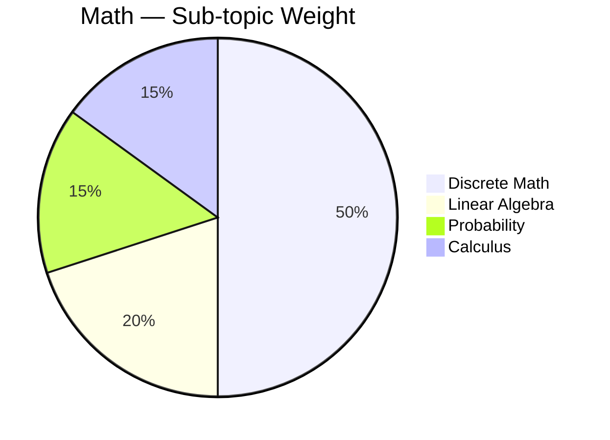

# Engineering Mathematics — GATE CSE 🔢

> **Priority:** 🔴 High | **Avg Marks:** 13 | **Difficulty:** Medium
> Math GATE এ দ্বিতীয় বৃহত্তম section। Sub-topics ভাগ ভাগ করে পড়লে সহজ।

---

## 📚 1. Syllabus Overview

1. **Discrete Mathematics**
   - Propositional and First Order Logic
   - Sets, Relations, Functions
   - Partial Orders and Lattices
   - Monoids, Groups
   - Graph theory, Combinatorics
2. **Linear Algebra** — Matrices, Determinants, Eigenvalues
3. **Calculus** — Limits, Derivatives, Integrals
4. **Probability** — Conditional, Distributions

---

## 📊 2. Weightage Analysis

| Year | Marks | Breakdown |
|------|-------|-----------|
| 2024 | 13 | Discrete 8, LA 3, Prob 2 |
| 2023 | 14 | Similar |
| 2022 | 12 | — |
| 2021 | 13 | — |
| 2020 | 13 | — |



---

## 🧠 3. Core Concepts

### 3.1 Propositional Logic

#### Operators

| Operation | Symbol | Truth |
|-----------|--------|-------|
| Negation | ¬P | opposite |
| Conjunction | P ∧ Q | 1 iff both 1 |
| Disjunction | P ∨ Q | 0 iff both 0 |
| Implication | P → Q | 0 iff P=1, Q=0 |
| Biconditional | P ↔ Q | 1 iff same |

#### Tautology / Contradiction

- **Tautology:** Always true
- **Contradiction:** Always false
- **Contingency:** Depends on values

#### Equivalences

- `P → Q ≡ ¬P ∨ Q`
- `P ↔ Q ≡ (P → Q) ∧ (Q → P)`
- De Morgan: `¬(P ∧ Q) ≡ ¬P ∨ ¬Q`
- Contrapositive: `P → Q ≡ ¬Q → ¬P`

---

### 3.2 Sets

- **Union:** A ∪ B
- **Intersection:** A ∩ B
- **Difference:** A - B
- **Complement:** A'
- **Power set:** P(A) has 2^|A| elements
- **Cartesian product:** A × B, |A×B| = |A|·|B|

#### Set Identities

- De Morgan: `(A ∪ B)' = A' ∩ B'`
- Distributive: `A ∩ (B ∪ C) = (A ∩ B) ∪ (A ∩ C)`

---

### 3.3 Relations and Functions

#### Relation Properties

- **Reflexive:** ∀a, (a,a) ∈ R
- **Symmetric:** (a,b) ∈ R → (b,a) ∈ R
- **Antisymmetric:** (a,b) and (b,a) → a=b
- **Transitive:** (a,b), (b,c) → (a,c)

**Equivalence relation:** Reflexive + Symmetric + Transitive
**Partial order:** Reflexive + Antisymmetric + Transitive

#### Function Types

- **Injective (one-one):** distinct inputs → distinct outputs
- **Surjective (onto):** every output has pre-image
- **Bijective:** both injective and surjective

---

### 3.4 Graph Theory

#### Types

- **Undirected / Directed**
- **Simple / Multi-graph**
- **Connected / Disconnected**
- **Tree** — connected, no cycle, V-1 edges
- **Complete K_n:** n vertices, all connected, `n(n-1)/2` edges
- **Bipartite:** 2 sets, edges only between

#### Properties

- **Handshaking lemma:** Σdeg(v) = 2E
- **Euler circuit:** visits each edge once; exists iff all degrees even
- **Hamilton circuit:** visits each vertex once

#### Planar Graph (Euler's Formula)

`V - E + F = 2`

For simple planar: `E ≤ 3V - 6` (V ≥ 3)।

---

### 3.5 Combinatorics

#### Permutations and Combinations

- **Permutation:** P(n,r) = n!/(n-r)!
- **Combination:** C(n,r) = n!/(r!(n-r)!)

#### Binomial Theorem

`(a+b)ⁿ = Σ C(n,k) a^(n-k) b^k`

#### Pigeonhole Principle

n+1 pigeons in n holes → at least 2 in same hole।

#### Inclusion-Exclusion

|A ∪ B| = |A| + |B| - |A ∩ B|`

For 3 sets:
|A ∪ B ∪ C| = |A|+|B|+|C| - |A∩B| - |B∩C| - |A∩C| + |A∩B∩C|`

---

### 3.6 Linear Algebra

#### Matrix Operations

- **Addition, Multiplication**
- **Transpose:** rows ↔ columns
- **Inverse:** A × A⁻¹ = I
- **Determinant**

#### Determinant

For 2×2:
```
| a b |
| c d | = ad - bc
```

For 3×3 use cofactor expansion।

#### Eigenvalues and Eigenvectors

Av = λv

To find: solve `det(A - λI) = 0` (characteristic equation)।

**Sum of eigenvalues = trace (sum of diagonals)**
**Product of eigenvalues = determinant**

#### System of Equations

Ax = b

- **Unique solution:** det(A) ≠ 0
- **No solution / infinite:** det(A) = 0

---

### 3.7 Calculus

#### Limits

Standard: `lim x→0 (sin x)/x = 1`

#### Derivatives

Common:
- d/dx (xⁿ) = nx^(n-1)
- d/dx (sin x) = cos x
- d/dx (e^x) = e^x
- d/dx (ln x) = 1/x

Chain rule: `d/dx [f(g(x))] = f'(g(x)) · g'(x)`

#### Integrals

- ∫ xⁿ dx = x^(n+1)/(n+1) + C (n ≠ -1)
- ∫ 1/x dx = ln|x| + C
- ∫ eˣ dx = eˣ + C

---

### 3.8 Probability

#### Basic Rules

- `P(A ∪ B) = P(A) + P(B) - P(A ∩ B)`
- `P(A ∩ B) = P(A) P(B)` if independent
- Conditional: `P(A|B) = P(A ∩ B) / P(B)`

#### Bayes' Theorem

P(A|B) = P(B|A) · P(A) / P(B)`

#### Expected Value

E(X) = Σ xᵢ P(xᵢ)`

#### Variance

Var(X) = E(X²) - (E(X))²`

#### Common Distributions

| Distribution | Mean | Variance |
|--------------|------|----------|
| Bernoulli(p) | p | p(1-p) |
| Binomial(n,p) | np | np(1-p) |
| Uniform[a,b] | (a+b)/2 | (b-a)²/12 |
| Normal(μ,σ²) | μ | σ² |

---

## 📐 4. Formulas & Shortcuts

### Series Sum

- 1 + 2 + ... + n = n(n+1)/2
- 1² + 2² + ... + n² = n(n+1)(2n+1)/6
- 1³ + 2³ + ... + n³ = [n(n+1)/2]²

### Logic Quick

- P → Q ≡ ¬P ∨ Q
- ¬(P → Q) ≡ P ∧ ¬Q

### Graph Formulas

- Tree: E = V - 1
- Complete: E = V(V-1)/2
- Planar: V - E + F = 2

### Matrix Facts

- (AB)' = B'A'
- (AB)⁻¹ = B⁻¹A⁻¹
- det(A · B) = det(A) · det(B)
- det(kA) = kⁿ · det(A) for n×n matrix

---

## 🎯 5. Common Question Patterns

1. **Propositional logic** — validity, equivalence
2. **Set cardinality** — inclusion-exclusion
3. **Relation properties** — count reflexive, symmetric
4. **Counting** — permutations, combinations
5. **Eigenvalues** of given matrix
6. **Probability calculation** — conditional, Bayes
7. **Graph counting** — spanning trees, etc.
8. **Calculus** — simple integration

---

## 📜 6. Previous Year Questions (PYQ)

### 🔹 Propositional Logic

#### PYQ 1 (GATE 2024) — Tautology

`(P → Q) ∧ (¬P → Q) → Q` — tautology?

**Solution:**
Case P=T: P→Q requires Q=T, ¬P→Q trivially T
Case P=F: P→Q trivially T, ¬P→Q requires Q=T
Either way Q=T if premises hold। **Yes, tautology** ✅

---

#### PYQ 2 (GATE 2023) — Equivalence

¬(P ∨ Q) ≡ ?`

**Answer:** `¬P ∧ ¬Q` (De Morgan) ✅

---

#### PYQ 3 (GATE 2022) — Implication

P → Q` is false only when?

**Answer:** P = T, Q = F ✅

---

### 🔹 Sets and Relations

#### PYQ 4 (GATE 2024) — Set Count

|A| = 5, |B| = 3. |A × B|?

**Answer:** **15** ✅

---

#### PYQ 5 (GATE 2023) — Power Set

|P({1,2,3,4})| = ?

**Answer:** **2⁴ = 16** ✅

---

#### PYQ 6 (GATE 2022) — Relations

Set {1,2,3,4}। Equivalence relations count?

**Answer:** Bell number B(4) = **15** ✅

---

### 🔹 Graph Theory

#### PYQ 7 (GATE 2024) — Handshaking

Graph with 6 vertices of degree 3 each। Edges?

**Solution:**
Σdeg = 6 × 3 = 18 = 2E → E = **9** ✅

---

#### PYQ 8 (GATE 2023) — Tree

10 vertices tree — edges?

**Answer:** V-1 = **9** ✅

---

#### PYQ 9 (GATE 2022) — Complete Graph

K₆ (complete graph on 6 vertices)। Edges?

**Answer:** 6×5/2 = **15** ✅

---

#### PYQ 10 (GATE 2021) — Euler Circuit

Euler circuit exists when?

**Answer:** All vertices even degree + connected ✅

---

### 🔹 Combinatorics

#### PYQ 11 (GATE 2024) — Permutation

"GATE" letters arrangements?

**Answer:** 4! = **24** ✅

---

#### PYQ 12 (GATE 2023) — Combination

10 people থেকে 3 select?

**Answer:** C(10,3) = **120** ✅

---

#### PYQ 13 (GATE 2022) — Pigeonhole

51 numbers from {1,...,100} chosen। At least 2 consecutive?

**Solution:**
Divide into 50 pairs (1,2), (3,4), ..., (99,100)। By pigeonhole, 51 numbers in 50 pairs, at least 2 from same pair → consecutive! ✅

---

### 🔹 Linear Algebra

#### PYQ 14 (GATE 2024) — Determinant

```
| 1 2 |
| 3 4 |
```
Determinant?

**Answer:** 4 - 6 = **-2** ✅

---

#### PYQ 15 (GATE 2023) — Eigenvalue

Trace of 3×3 matrix = 6. Two eigenvalues 1 and 2. Third?

**Answer:** Sum = 6 → 1+2+λ = 6 → λ = **3** ✅

---

#### PYQ 16 (GATE 2022) — Rank

Rank of identity matrix n×n?

**Answer:** **n** ✅

---

#### PYQ 17 (GATE 2021) — Matrix

A = [[2,1],[0,3]]. Eigenvalues?

**Solution:**
Triangular matrix → eigenvalues = diagonal entries = **2, 3** ✅

---

### 🔹 Calculus

#### PYQ 18 (GATE 2024) — Integral

∫₀¹ x² dx?

**Solution:**
x³/3 from 0 to 1 = **1/3** ✅

---

#### PYQ 19 (GATE 2023) — Limit

lim x→0 (sin x)/x?

**Answer:** **1** ✅

---

### 🔹 Probability

#### PYQ 20 (GATE 2024) — Basic

Fair coin 3 flips। Exactly 2 heads probability?

**Solution:**
C(3,2) × (1/2)³ = 3/8 ✅

---

#### PYQ 21 (GATE 2023) — Conditional

P(A) = 0.4, P(B) = 0.5, P(A∩B) = 0.2. P(A|B)?

**Solution:**
P(A|B) = 0.2/0.5 = **0.4** ✅

---

#### PYQ 22 (GATE 2022) — Bayes

Disease prevalence 1%. Test 90% accurate (both ways). Positive test — actual disease probability?

**Solution:**
P(D) = 0.01, P(T+|D) = 0.9, P(T+|¬D) = 0.1
P(T+) = 0.9×0.01 + 0.1×0.99 = 0.009 + 0.099 = 0.108
P(D|T+) = 0.009/0.108 ≈ **8.3%** ✅

---

#### PYQ 23 (GATE 2021) — Expected Value

Die roll expected value?

**Answer:** (1+2+3+4+5+6)/6 = **3.5** ✅

---

#### PYQ 24 (GATE 2020) — Binomial

10 Bernoulli trials, p=0.5. Expected successes?

**Answer:** np = **5** ✅

---

### 🔹 Logic and Sets

#### PYQ 25 (GATE 2023) — First Order Logic

∀x(P(x) → Q(x)) নেতিবাচন?

**Answer:** ∃x(P(x) ∧ ¬Q(x)) ✅

---

#### PYQ 26 (GATE 2021) — Inclusion-Exclusion

100 students: 60 take Math, 40 take Physics, 30 both। Neither?

**Solution:**
|M ∪ P| = 60+40-30 = 70
Neither = 100 - 70 = **30** ✅

---

## 🏋️ 7. Practice Problems

1. Simplify: `¬(P → ¬Q)`
2. Set {1,...,10}। Transitive relations count?
3. Graph V=5, all degree 4। Edges?
4. (x+y)⁵ এ x²y³ এর coefficient?
5. det of [[1,2,3],[0,1,4],[0,0,5]] = ?
6. Two dice roll। Sum 7 probability?
7. ∫ sin(x) dx from 0 to π?

<details>
<summary>💡 Answers</summary>

1. P ∧ Q
2. Depends — compute using formula
3. 10 edges (5×4/2)
4. C(5,2) = 10
5. 1×1×5 = 5 (triangular)
6. 6/36 = 1/6
7. 2

</details>

---

## ⚠️ 8. Traps & Common Mistakes

- ❌ **P → Q ≠ Q → P** (not commutative)
- ❌ **De Morgan:** negation flips AND ↔ OR
- ❌ **Handshaking:** Σdeg = 2E
- ❌ **Tree** V-1 edges, ONE less than vertices
- ❌ **K_n edges = n(n-1)/2**, not n(n-1)
- ❌ **Determinant = 0** means no inverse
- ❌ **Eigenvalue sum = trace**, product = det
- ❌ **P(A|B) ≠ P(B|A)** generally (Bayes needed)
- ❌ **Binomial vs Bernoulli** — Bernoulli = single trial
- ❌ **Pigeonhole** exact statement — n+1 pigeons, n holes

---

## 📝 9. Quick Revision Summary

### Must-Remember Formulas

```
Set: |A∪B| = |A|+|B|-|A∩B|
Graph: Σdeg = 2E, Tree E=V-1, Kn E=n(n-1)/2
Euler: V-E+F=2 (planar)
Matrix: det(AB)=det(A)det(B), (AB)⁻¹=B⁻¹A⁻¹
Eigenvalue: sum=trace, product=det
Probability: P(A|B)=P(A∩B)/P(B), Bayes
Binomial: P(X=k)=C(n,k)p^k(1-p)^(n-k), mean=np
```

### Logic Equivalences

- P → Q ≡ ¬P ∨ Q
- ¬(P → Q) ≡ P ∧ ¬Q
- Contrapositive: P → Q ≡ ¬Q → ¬P

### Common Values

- 5! = 120, 6! = 720, 7! = 5040
- C(n,0) = C(n,n) = 1
- 2⁵ = 32, 2¹⁰ = 1024

---

## 🔗 Navigation

- [🏠 Master Index](00-master-index.md)
- [◀ Previous: Exam Pattern](00-exam-pattern-strategy.md)
- [▶ Next: Digital Logic](02-digital-logic.md)

---

**Tip:** Math এ direct formula apply problems বেশি। Formulas sheet বানিয়ে পড়ুন। 📝
