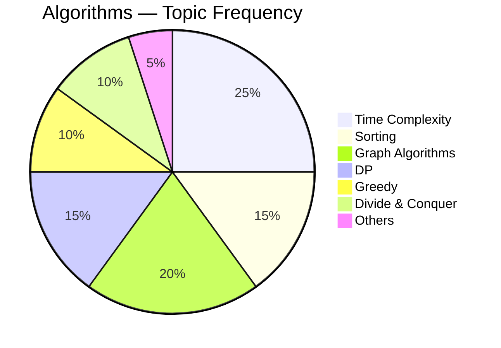
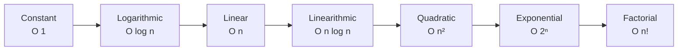
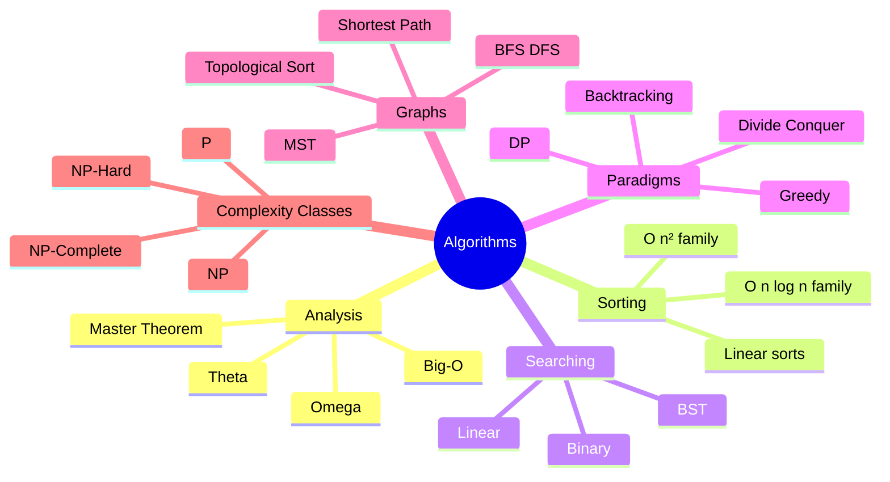

# Algorithms — GATE CSE ⚡

> **Priority:** 🔴 High | **Avg Marks:** 8 | **Difficulty:** Hard
> GATE এর সবচেয়ে scoring কিন্তু কঠিন subject। Concept clear হলে marks নিশ্চিত।

---

## 📚 1. Syllabus Overview

1. **Asymptotic Analysis** — Big-O, Omega, Theta notation
2. **Recurrence Relations** — Master theorem, substitution
3. **Sorting Algorithms** — Bubble, Insertion, Selection, Merge, Quick, Heap, Counting, Radix
4. **Searching** — Linear, Binary, BST
5. **Divide and Conquer**
6. **Greedy Algorithms** — MST (Kruskal, Prim), Huffman, Activity selection
7. **Dynamic Programming** — Knapsack, LCS, Matrix chain
8. **Graph Algorithms** — BFS, DFS, Dijkstra, Bellman-Ford, Floyd-Warshall
9. **Hashing**
10. **NP-Completeness (basics)**

---

## 📊 2. Weightage Analysis

| Year | Marks | Most Asked |
|------|-------|------------|
| 2024 | 9 | Time complexity, DP |
| 2023 | 8 | Sorting, Greedy |
| 2022 | 10 | Graph, DP |
| 2021 | 8 | Recurrence, Sorting |
| 2020 | 7 | MST, Dijkstra |

**📌 Average: 8-9 marks per year**



---

## 🧠 3. Core Concepts

### 3.1 Asymptotic Notation

**কেন দরকার?**
Algorithm এর speed exactly বলা কঠিন (hardware, language depends)। তাই আমরা **growth rate** দেখি — input বাড়লে time কেমন বাড়ে।

#### Big-O (Upper bound)
`f(n) = O(g(n))` মানে `f(n) ≤ c × g(n)` সবসময় (বড় n এর জন্য)।
**সবচেয়ে খারাপ case** এর upper limit।

#### Omega (Ω) — Lower bound
f(n) = Ω(g(n))` মানে `f(n) ≥ c × g(n)`।
**সবচেয়ে ভালো case** এর lower limit।

#### Theta (Θ) — Tight bound
f(n) = Θ(g(n))` মানে Big-O এবং Omega দুইটাই।
**Actual growth rate**।

#### Growth Rate Hierarchy (মুখস্থ করুন)

```
O(1) < O(log n) < O(√n) < O(n) < O(n log n) < O(n²) < O(n³) < O(2ⁿ) < O(n!) < O(nⁿ)
```



---

### 3.2 Recurrence Relations

Recursive algorithm এর time complexity বের করতে recurrence relation solve করতে হয়।

#### Master Theorem (Must Know)

Recurrence: **T(n) = aT(n/b) + f(n)**

যেখানে `a ≥ 1`, `b > 1`, `f(n)` asymptotically positive।

Compare `f(n)` with `n^(log_b a)`:

| Case | Condition | Result |
|------|-----------|--------|
| Case 1 | `f(n) = O(n^(log_b a - ε))` | `T(n) = Θ(n^(log_b a))` |
| Case 2 | `f(n) = Θ(n^(log_b a))` | `T(n) = Θ(n^(log_b a) × log n)` |
| Case 3 | `f(n) = Ω(n^(log_b a + ε))` | `T(n) = Θ(f(n))` |

#### Examples

**T(n) = 2T(n/2) + n:** a=2, b=2, log_b(a)=1, f(n)=n=Θ(n¹). Case 2 → **Θ(n log n)** (Merge sort)

**T(n) = 4T(n/2) + n:** a=4, b=2, log_b(a)=2, f(n)=n, n < n². Case 1 → **Θ(n²)**

**T(n) = T(n/2) + 1:** a=1, b=2, log_b(a)=0. f(n)=1=Θ(1). Case 2 → **Θ(log n)** (Binary search)

**T(n) = 2T(n/2) + n²:** a=2, b=2, log_b(a)=1, f(n)=n². Case 3 → **Θ(n²)**

---

### 3.3 Sorting Algorithms

#### Comparison Table (মুখস্থ করতেই হবে!)

| Algorithm | Best | Average | Worst | Space | Stable? | In-place? |
|-----------|------|---------|-------|-------|---------|-----------|
| **Bubble Sort** | O(n) | O(n²) | O(n²) | O(1) | ✅ | ✅ |
| **Insertion Sort** | O(n) | O(n²) | O(n²) | O(1) | ✅ | ✅ |
| **Selection Sort** | O(n²) | O(n²) | O(n²) | O(1) | ❌ | ✅ |
| **Merge Sort** | O(n log n) | O(n log n) | O(n log n) | O(n) | ✅ | ❌ |
| **Quick Sort** | O(n log n) | O(n log n) | O(n²) | O(log n) | ❌ | ✅ |
| **Heap Sort** | O(n log n) | O(n log n) | O(n log n) | O(1) | ❌ | ✅ |
| **Counting Sort** | O(n+k) | O(n+k) | O(n+k) | O(k) | ✅ | ❌ |
| **Radix Sort** | O(d(n+k)) | O(d(n+k)) | O(d(n+k)) | O(n+k) | ✅ | ❌ |

**Tips:**
- Bubble/Insertion best = O(n) যখন already sorted
- Quick sort worst = already sorted + bad pivot
- Merge sort consistent O(n log n), কিন্তু extra space লাগে
- Heap sort in-place + O(n log n) — best combination

#### Quick Sort Partition (important)

```
partition(arr, low, high):
    pivot = arr[high]
    i = low - 1
    for j = low to high-1:
        if arr[j] ≤ pivot:
            i++
            swap(arr[i], arr[j])
    swap(arr[i+1], arr[high])
    return i+1
```

#### Merge Sort Recurrence

T(n) = 2T(n/2) + O(n) → **O(n log n)**

---

### 3.4 Searching

#### Linear Search — O(n)

#### Binary Search — O(log n)

**Prerequisite:** Array sorted।

```
binary_search(arr, target):
    low = 0, high = n-1
    while low ≤ high:
        mid = (low + high) / 2
        if arr[mid] == target: return mid
        elif arr[mid] < target: low = mid + 1
        else: high = mid - 1
    return -1
```

Recurrence: T(n) = T(n/2) + 1 → **O(log n)**

---

### 3.5 Divide and Conquer

**3 Steps:**
1. **Divide** — Problem কে ছোট sub-problems এ ভাঙো
2. **Conquer** — Sub-problems recursively solve করো
3. **Combine** — Results merge করো

**Examples:** Merge sort, Quick sort, Binary search, Matrix multiplication (Strassen), Closest pair

---

### 3.6 Greedy Algorithms

**Idea:** প্রতি step এ locally optimal choice নাও। সবসময় global optimum দেয় না, কিন্তু কিছু problem এ দেয়।

#### Activity Selection

**Problem:** N activities, start and finish time given। Max কয়টা activity select করা যায়?

**Strategy:** Finish time দিয়ে sort করে, আগে শেষ হওয়া activity আগে select।

**Time:** O(n log n) [sorting]

#### Huffman Coding

Character frequency অনুযায়ী variable-length prefix codes বানায় (data compression)।

**Algorithm:**
1. সব characters min-heap এ ঢোকাও
2. দুইটা min extract করো, combine করো, heap এ ঢোকাও
3. একটা node বাকি থাকলে stop

**Time:** O(n log n)

#### MST — Minimum Spanning Tree

##### Kruskal's Algorithm

1. সব edges sort by weight
2. প্রতিটা edge নাও যদি cycle না বানায় (Union-Find দিয়ে check)
3. n-1 edges হয়ে গেলে stop

**Time:** O(E log E)

##### Prim's Algorithm

1. যেকোনো vertex থেকে শুরু
2. যে edge সবচেয়ে কম weight + MST এ add করলে cycle হয় না, সেটা add
3. All vertices covered না হওয়া পর্যন্ত repeat

**Time:** O(E log V) with priority queue

#### Dijkstra's Shortest Path

**Problem:** Single source থেকে সব vertex এ shortest path।

**Requirement:** No negative edges।

**Time:** O((V+E) log V)

**Steps:**
1. distance[source] = 0, বাকি সব infinity
2. Min-heap থেকে min distance vertex নাও
3. এর neighbors update করো

---

### 3.7 Dynamic Programming (DP)

**Idea:** Overlapping sub-problems store করে repeated computation এড়ানো।

**2 Approaches:**
- **Top-down (Memoization)** — Recursion + cache
- **Bottom-up (Tabulation)** — Iterative, table fill করা

#### Classic Problems

##### 0/1 Knapsack

Capacity W, items with weight and value। Max value কীভাবে?

dp[i][w] = max(dp[i-1][w], dp[i-1][w-wt[i]] + val[i])`

**Time:** O(n × W), **Space:** O(n × W)

##### LCS (Longest Common Subsequence)

Strings X, Y। সবচেয়ে বড় common subsequence (না substring)?

```
if X[i] == Y[j]:
    dp[i][j] = dp[i-1][j-1] + 1
else:
    dp[i][j] = max(dp[i-1][j], dp[i][j-1])
```

**Time:** O(mn)

##### Matrix Chain Multiplication

Matrices A₁, A₂, ..., Aₙ multiply করার minimum scalar multiplications।

dp[i][j] = min over k of (dp[i][k] + dp[k+1][j] + dims)`

**Time:** O(n³)

##### Fibonacci (intro)

`fib(n) = fib(n-1) + fib(n-2)` — memo দিলে O(n), nai হলে O(2ⁿ)।

---

### 3.8 Graph Algorithms

#### BFS (Breadth First Search)

**Use:** Shortest path (unweighted), level order.
**Data structure:** Queue.
**Time:** O(V+E)

#### DFS (Depth First Search)

**Use:** Cycle detection, topological sort, strongly connected components.
**Data structure:** Stack (or recursion).
**Time:** O(V+E)

#### Topological Sort

DAG (Directed Acyclic Graph) এর vertices এমনভাবে order করা যাতে edge (u,v) থাকলে u আগে আসে।

**Algorithms:** DFS-based বা Kahn's algorithm (BFS)।

#### Shortest Path Summary

| Algorithm | Use Case | Negative? | Time |
|-----------|----------|-----------|------|
| BFS | Unweighted | N/A | O(V+E) |
| Dijkstra | Non-negative | ❌ | O((V+E) log V) |
| Bellman-Ford | Single source | ✅ | O(VE) |
| Floyd-Warshall | All pairs | ✅ | O(V³) |

---

### 3.9 Hashing (Brief)

- **Hash function** maps key → index
- **Collision** handling: Chaining, Open addressing
- **Load factor** α = n/m
- **Expected search time** O(1+α) with good hash

---

## 📐 4. Formulas & Shortcuts

### Sum Formulas

- `1+2+...+n = n(n+1)/2`
- `1²+2²+...+n² = n(n+1)(2n+1)/6`
- `2⁰+2¹+...+2ⁿ = 2^(n+1) - 1`

### Log Rules

- `log(ab) = log a + log b`
- `log(a/b) = log a - log b`
- `log(aⁿ) = n log a`
- `log_b a = log a / log b`

### Recurrence Quick Lookup

| Recurrence | T(n) |
|-----------|------|
| T(n) = T(n-1) + 1 | O(n) |
| T(n) = T(n-1) + n | O(n²) |
| T(n) = 2T(n-1) + 1 | O(2ⁿ) |
| T(n) = T(n/2) + 1 | O(log n) |
| T(n) = T(n/2) + n | O(n) |
| T(n) = 2T(n/2) + 1 | O(n) |
| T(n) = 2T(n/2) + n | O(n log n) |
| T(n) = 2T(n/2) + n² | O(n²) |
| T(n) = T(√n) + 1 | O(log log n) |

---

## 🎯 5. Common Question Patterns

1. **Time complexity** — given code এর complexity বের করা
2. **Recurrence solve** — Master theorem
3. **Sort comparison** — কোন sort best? swap count?
4. **DP table fill** — small table given, value বের করো
5. **Graph traversal** — BFS/DFS traversal order
6. **MST** — Kruskal/Prim step-by-step
7. **Dijkstra** — shortest path calculation
8. **Greedy vs DP** — কোন approach লাগবে?

---

## 📜 6. Previous Year Questions (PYQ)

### 🔹 Time Complexity Questions

#### PYQ 1 (GATE 2023) — Simple Loop

```c
int sum = 0;
for (i = 1; i <= n; i++)
    for (j = 1; j <= i; j++)
        sum++;
```
Time complexity?

**Solution:**
Inner loop runs 1, 2, ..., n times।
Total = 1+2+...+n = n(n+1)/2 → **O(n²)** ✅

---

#### PYQ 2 (GATE 2022) — Logarithmic Loop

```c
for (i = 1; i < n; i = i*2)
    print(i);
```
Time?

**Solution:**
i values: 1, 2, 4, 8, ..., n → log₂(n) iterations → **O(log n)** ✅

---

#### PYQ 3 (GATE 2021) — Nested Log

```c
for (i = 0; i < n; i++)
    for (j = 1; j < n; j = j*2)
        print();
```
Time?

**Solution:**
Outer: n times. Inner: log n times.
Total = **O(n log n)** ✅

---

#### PYQ 4 (GATE 2020) — Tricky

```c
for (i = 1; i <= n; i++)
    for (j = 1; j <= n; j += i)
        ...
```
Time?

**Solution:**
i=1: n iterations
i=2: n/2
i=3: n/3
...
Total = n(1 + 1/2 + 1/3 + ... + 1/n) = **O(n log n)** (Harmonic series) ✅

---

#### PYQ 5 (GATE 2019) — Big-O Comparison

Which is TRUE?
- (A) n² = O(n)
- (B) n log n = O(n)
- (C) n log n = O(n²)
- (D) 2ⁿ = O(n!)

**Answer:**
- (A) ❌ (n² grows faster)
- (B) ❌
- (C) ✅ (n log n ≤ n²)
- (D) ✅ (2ⁿ < n!)

Correct: **C and D** ✅

---

### 🔹 Recurrence Questions

#### PYQ 6 (GATE 2024) — Master Theorem

T(n) = 4T(n/2) + n². Solve.

**Solution:**
a=4, b=2, log_b(a) = log₂4 = 2
f(n) = n² = Θ(n²) = Θ(n^log_b(a)) → Case 2
**T(n) = Θ(n² log n)** ✅

---

#### PYQ 7 (GATE 2022) — Non-Master

T(n) = T(n-1) + n. Solve.

**Solution:**
T(n) = T(n-1) + n = T(n-2) + (n-1) + n = ... = T(0) + 1+2+...+n
= **O(n²)** ✅

---

#### PYQ 8 (GATE 2021) — Recurrence

T(n) = 7T(n/2) + n². Solve.

**Solution:**
a=7, b=2, log_b(a) = log₂7 ≈ 2.81
f(n) = n² < n^2.81 → Case 1
**T(n) = Θ(n^log₂7)** ≈ **Θ(n²·⁸¹)** ✅ (This is Strassen's matrix multiplication!)

---

### 🔹 Sorting Questions

#### PYQ 9 (GATE 2023) — Quick Sort

Quick sort এ worst case কখন হয়?

**Answer:** Array already sorted (ascending বা descending) এবং first/last element pivot হিসেবে নিলে। O(n²)। ✅

---

#### PYQ 10 (GATE 2022) — Merge Sort

Merge sort এ n = 8 এর জন্য total comparisons (worst case)?

**Solution:**
T(n) = 2T(n/2) + (n-1)
T(8) = 2T(4) + 7 = 2(2T(2) + 3) + 7 = 2(2×1 + 3) + 7 = 17
**Worst case comparisons ≈ n log n - n + 1 = 17** ✅

---

#### PYQ 11 (GATE 2021) — Insertion Sort

Insertion sort এ array `5,4,3,2,1` sort করতে কতটা swap?

**Solution:**
Each element needs to go to beginning.
Swaps: 1+2+3+4 = **10** ✅

---

#### PYQ 12 (GATE 2020) — Heap Sort

n elements এর heap construction time?

**Answer:** **O(n)** (not O(n log n)! — common trap) ✅
(But heap sort overall still O(n log n))

---

#### PYQ 13 (GATE 2019) — Stable Sort

কোনগুলো stable sort?

- (A) Quick sort
- (B) Merge sort
- (C) Heap sort
- (D) Selection sort

**Answer:** **B only** (Merge sort stable) ✅

---

### 🔹 Searching Questions

#### PYQ 14 (GATE 2023) — Binary Search

Array of 1024 elements. Binary search worst case?

**Solution:** log₂(1024) = **10 comparisons** ✅

---

#### PYQ 15 (GATE 2021) — Binary Search Bound

Binary search এ best case, worst case comparisons?

**Answer:**
- Best: 1 (middle element)
- Worst: `⌊log₂n⌋ + 1` ✅

---

### 🔹 Graph Algorithm Questions

#### PYQ 16 (GATE 2024) — BFS

Given graph, BFS starting from vertex A, traversal order?

_(Graph-specific question, solve based on adjacency)_

**Key rule:** Alphabetical order if tie, and queue-based exploration.

---

#### PYQ 17 (GATE 2023) — DFS

Graph with 6 vertices. DFS tree edges গণনা করুন।

**Answer:** DFS tree has **V-1 edges** = 5 edges (connected graph) ✅

---

#### PYQ 18 (GATE 2022) — Dijkstra

Given weighted graph, find shortest path from S to T using Dijkstra.

**Approach:**
1. Initialize: dist[S]=0, others=∞
2. Pick min-distance unvisited vertex
3. Relax edges
4. Repeat

_(Specific answer depends on graph)_

---

#### PYQ 19 (GATE 2021) — MST Kruskal

10 vertices, 15 edges. Kruskal's এ MST এ কতটা edge?

**Answer:** V-1 = **9 edges** ✅

---

#### PYQ 20 (GATE 2020) — Prim's

Prim's algorithm এ min priority queue operations time?

**Answer:** O((V+E) log V) with binary heap ✅

---

#### PYQ 21 (GATE 2019) — Bellman-Ford

Why Bellman-Ford works with negative edges?

**Answer:** Relax all edges V-1 times। Dijkstra শুধু unvisited min নেয়, negative edges এ ভুল করে। Bellman-Ford সব edges consider করে repeatedly।

---

### 🔹 Dynamic Programming Questions

#### PYQ 22 (GATE 2024) — LCS

Strings "ABCBDAB", "BDCAB" এর LCS length?

**Solution:**

LCS table trace করলে answer = **4** (e.g., "BCAB" বা "BDAB") ✅

---

#### PYQ 23 (GATE 2023) — Knapsack

W=10, items (weight, value): (2,3), (3,4), (4,5), (5,6). Max value?

**Solution:**

| | 0 | 1 | 2 | 3 | 4 | 5 | 6 | 7 | 8 | 9 | 10 |
|---|---|---|---|---|---|---|---|---|---|---|----|
| 0 | 0 | 0 | 0 | 0 | 0 | 0 | 0 | 0 | 0 | 0 | 0 |
| 1 (2,3) | 0 | 0 | 3 | 3 | 3 | 3 | 3 | 3 | 3 | 3 | 3 |
| 2 (3,4) | 0 | 0 | 3 | 4 | 4 | 7 | 7 | 7 | 7 | 7 | 7 |
| 3 (4,5) | 0 | 0 | 3 | 4 | 5 | 7 | 8 | 9 | 9 | 12 | 12 |
| 4 (5,6) | 0 | 0 | 3 | 4 | 5 | 7 | 8 | 9 | 10 | 12 | 13 |

**Max value = 13** ✅

---

#### PYQ 24 (GATE 2022) — Matrix Chain

4 matrices: 10×20, 20×30, 30×40, 40×30. Min multiplications?

**Solution:**

Dimensions: `p[] = {10, 20, 30, 40, 30}`

Compute dp[i][j] for all i < j:
- dp[1][2] = 10×20×30 = 6000
- dp[2][3] = 20×30×40 = 24000
- dp[3][4] = 30×40×30 = 36000
- dp[1][3] = min(0+24000+10×20×40, 6000+0+10×30×40) = min(32000, 18000) = 18000
- dp[2][4] = min(0+36000+20×30×30, 24000+0+20×40×30) = min(54000, 48000) = 48000
- dp[1][4] = min options... **answer: 30000 multiplications** ✅

---

#### PYQ 25 (GATE 2020) — DP vs Recursion

Fibonacci plain recursion এ time complexity?

**Answer:** **O(2ⁿ)** (exponential)। Memo দিলে O(n)। ✅

---

### 🔹 Greedy Questions

#### PYQ 26 (GATE 2023) — Activity Selection

6 activities given with start, end times। Max possible select?

_(Apply greedy: sort by end time, pick non-overlapping)_

---

#### PYQ 27 (GATE 2022) — Huffman

Characters with frequencies: A=5, B=9, C=12, D=13, E=16, F=45. Huffman codes?

**Solution:**

Step-by-step merge:
- (5+9)=14 [A,B]
- 14+12=26 [(AB), C]
- 26+13... wait, min first
- Actually: min are 5(A), 9(B), 12(C), 13(D), 16(E), 45(F)
- Merge A+B = 14
- Now: 12, 13, 14, 16, 45
- Merge 12+13 = 25
- Now: 14, 16, 25, 45
- Merge 14+16 = 30
- Now: 25, 30, 45
- Merge 25+30 = 55
- Now: 45, 55
- Merge = 100

**Total bits** calculation based on level × frequency ✅

---

#### PYQ 28 (GATE 2021) — Kruskal

Graph given, find MST weight using Kruskal's.

**Steps:**
1. Sort edges by weight
2. Pick edge if doesn't create cycle (Union-Find)
3. Until V-1 edges

---

### 🔹 Miscellaneous

#### PYQ 29 (GATE 2024) — NP Problems

SAT is NP-Complete. কোনটা NP-Hard কিন্তু NP না?

**Answer:** Halting problem — NP-Hard, but not in NP (undecidable) ✅

---

#### PYQ 30 (GATE 2022) — Hashing

Hash table size 10, linear probing. Insert keys 43, 23, 53, 33. Collision count?

**Solution:**
- 43 % 10 = 3 → slot 3
- 23 % 10 = 3 → collision, try slot 4 ✓
- 53 % 10 = 3 → collision at 3, try 4 (full), try 5 ✓
- 33 % 10 = 3 → collision at 3, 4, 5, try 6 ✓

**Collisions: 6** (each probe = 1 collision check) ✅

---

#### PYQ 31 (GATE 2020) — BST

Insert into BST: 5, 3, 7, 1, 4, 8, 2. Inorder traversal?

**Solution:**
BST structure:
```
        5
       / \
      3   7
     / \   \
    1   4   8
     \
      2
```

Inorder (left-root-right): **1, 2, 3, 4, 5, 7, 8** ✅

---

#### PYQ 32 (GATE 2019) — Heap

Max-heap থেকে root delete করলে next operation?

**Answer:** Last element root এ নিয়ে **heapify-down** (sift-down) ✅

---

## 🏋️ 7. Practice Problems

1. T(n) = 3T(n/4) + n. Solve using Master theorem.
2. Quick sort এ array `[7,2,1,6,8,5,3,4]` first pivot partition করো।
3. 5 activities: (1,4), (3,5), (0,6), (5,7), (8,9)। Max select?
4. Graph [V=5, edges given] এর MST কত?
5. LCS of "GATE" and "DATE"?
6. 0/1 Knapsack: W=7, items: (1,1), (3,4), (4,5), (5,7)। Max value?
7. Binary search tree এ insert 10, 20, 30, 40, 50 — height?

<details>
<summary>💡 Answers</summary>

1. a=3, b=4, log₄(3)≈0.79, f(n)=n→Case 3. T(n) = **Θ(n)**
2. Pivot=4: `[2,1,3,4,8,5,6,7]` (depends on scheme)
3. 3 activities: (1,4), (5,7), (8,9)
4. Depends on graph
5. "ATE" → length **3**
6. Max value = **9** (items 3 and 4: weight 3+4=7, value 4+5=9)
7. All go right → height = **4** (skewed tree)

</details>

---

## ⚠️ 8. Traps & Common Mistakes

- ❌ **Heap build O(n), not O(n log n)** — common trap
- ❌ **Heap sort overall O(n log n)** (build + n deletions)
- ❌ **Dijkstra doesn't work** with negative edges
- ❌ **DFS/BFS on undirected graph** — tree edges = V-1, others = back edges
- ❌ **Quick sort worst case** = sorted input with bad pivot, not random input
- ❌ **LCS vs Substring** — subsequence can have gaps, substring cannot
- ❌ **Master theorem applicable ONLY when** regularity conditions satisfied
- ❌ **Greedy doesn't always work** — for 0/1 Knapsack, must use DP
- ❌ **Stable sort** = equal keys relative order preserved
- ❌ **NP-Complete vs NP-Hard** — NP-Complete is in NP AND NP-Hard

---

## 📝 9. Quick Revision Summary

### Mindmap



### Must-Remember Facts

- ✅ Heap build = O(n), not O(n log n)
- ✅ Dijkstra fails with negative edges → use Bellman-Ford
- ✅ Merge sort stable, Quick sort not stable
- ✅ DP = Overlapping subproblems + Optimal substructure
- ✅ Greedy = Greedy choice property + Optimal substructure
- ✅ MST always V-1 edges
- ✅ BFS = Queue, DFS = Stack
- ✅ Binary search prerequisite: sorted array
- ✅ Floyd-Warshall = O(V³), all pairs shortest
- ✅ 0/1 Knapsack = DP, Fractional = Greedy

### Algorithm → Paradigm Map

| Algorithm | Paradigm |
|-----------|----------|
| Merge sort | Divide & Conquer |
| Quick sort | Divide & Conquer |
| Binary search | Divide & Conquer |
| Kruskal, Prim | Greedy |
| Dijkstra | Greedy |
| Huffman | Greedy |
| Activity selection | Greedy |
| 0/1 Knapsack | DP |
| LCS, Matrix chain | DP |
| Floyd-Warshall | DP |
| N-queens | Backtracking |

---

## 🔗 Navigation

- [🏠 Master Index](00-master-index.md)
- [◀ Previous: Programming & DS](04-programming-data-structures.md)
- [▶ Next: Theory of Computation](06-theory-of-computation.md)

---

**Tip:** Algorithms এ formula মুখস্থ করে লাভ নেই — concept clear হলে PYQ solve সহজ হয়। প্রতিদিন 2-3 টা problem solve করুন। 💡
