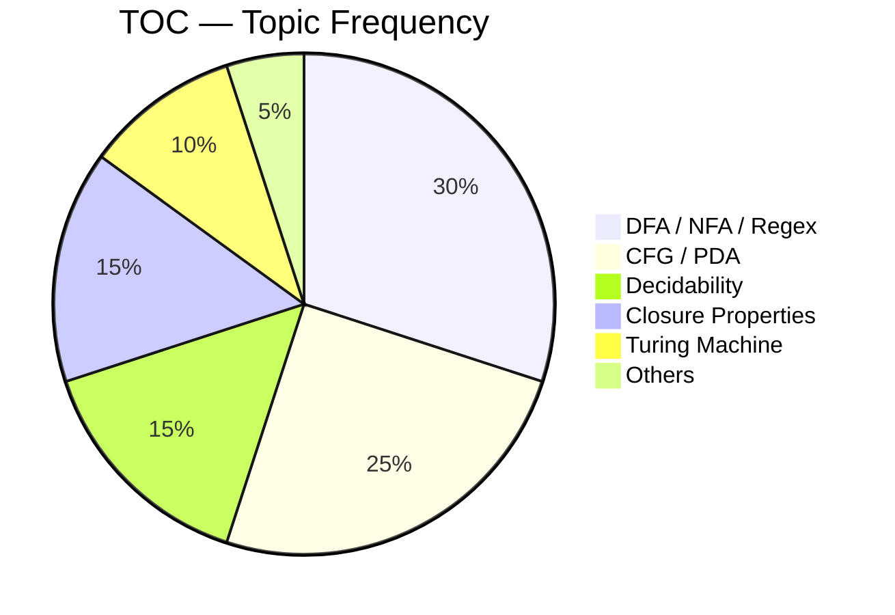
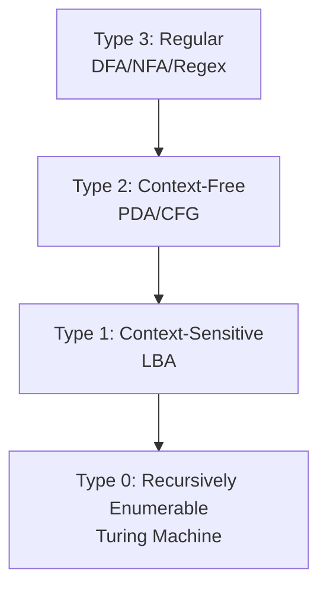
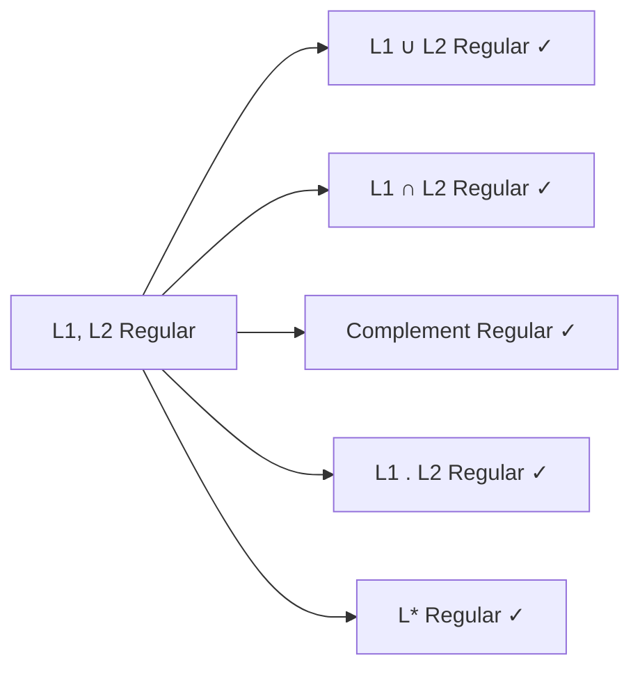
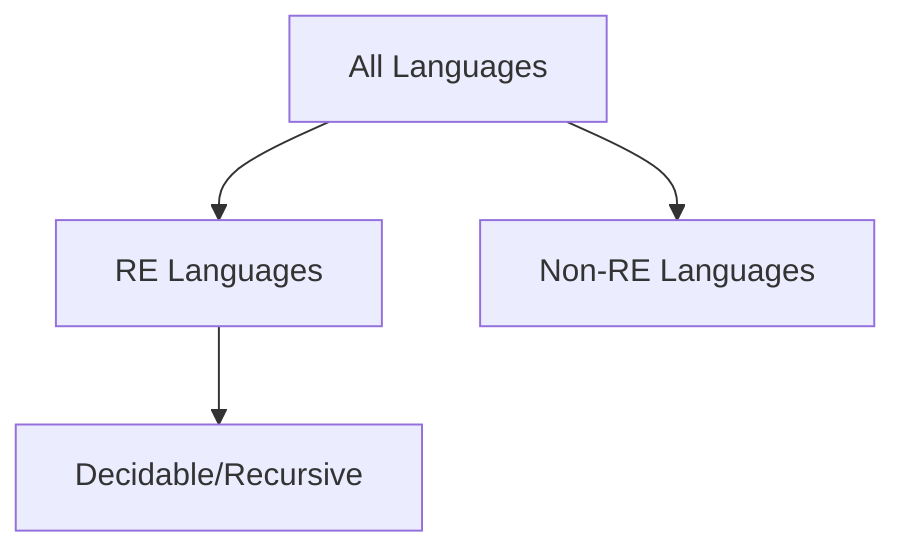
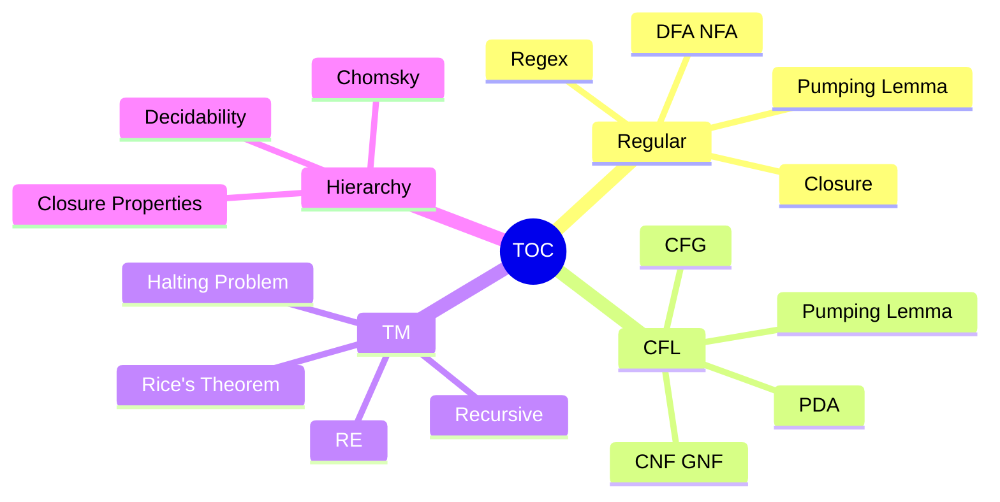

# Theory of Computation — GATE CSE 🧮

> **Priority:** 🟡 Medium-High | **Avg Marks:** 7 | **Difficulty:** Hard
> TOC সবচেয়ে abstract subject। কিন্তু properties ও patterns মুখস্থ করলে সহজ।

---

## 📚 1. Syllabus Overview

1. **Regular Languages** — Regular expressions, Finite automata (DFA, NFA)
2. **Context-Free Languages (CFL)** — CFG, PDA, Parsing
3. **Context-Sensitive Languages** — LBA
4. **Recursively Enumerable (RE)** — Turing machines
5. **Decidability and Undecidability**
6. **Pumping Lemma** (for regular and CFL)
7. **Closure Properties**

---

## 📊 2. Weightage Analysis

| Year | Marks | Most Asked |
|------|-------|------------|
| 2024 | 7 | DFA, CFG |
| 2023 | 8 | Regular expressions, Turing |
| 2022 | 7 | Closure properties, PDA |
| 2021 | 6 | DFA minimization |
| 2020 | 7 | Decidability |



---

## 🧠 3. Core Concepts

### 3.1 Chomsky Hierarchy



| Type | Language | Machine | Grammar |
|------|----------|---------|---------|
| Type 3 | Regular | DFA, NFA | Regular grammar |
| Type 2 | Context-Free | PDA | CFG |
| Type 1 | Context-Sensitive | LBA | CSG |
| Type 0 | Recursively Enumerable | TM | Unrestricted |

**Subset relation:** Regular ⊂ CFL ⊂ CSL ⊂ RE

---

### 3.2 Finite Automata

#### DFA (Deterministic Finite Automaton)

**5-tuple:** (Q, Σ, δ, q₀, F)
- Q = states
- Σ = input alphabet
- δ: Q × Σ → Q (transition function)
- q₀ = start state
- F ⊆ Q = accepting states

**"Deterministic":** Each state + input → exactly one state

#### NFA (Non-deterministic)

- δ: Q × Σ → 2^Q (can go to multiple states)
- ε-transitions allowed

**Fact:** NFA and DFA accept the **same class** of languages (regular)। But DFA may have exponentially more states.

#### Conversion: NFA → DFA (Subset Construction)

**Worst case:** NFA with n states → DFA with 2ⁿ states

#### DFA Minimization

Equivalent states merge। Algorithms: partition refinement, table filling।

---

### 3.3 Regular Expressions

**Operators:**
- `.` (concat) — `ab` means a then b
- `+` or `|` (union) — `a+b` means a or b
- `*` (Kleene star) — 0 or more
- `?` — 0 or 1
- `+` — 1 or more (in some notations)

#### Examples

| Regex | Language |
|-------|----------|
| `a*` | ε, a, aa, aaa, ... |
| `a+b*` | a or (0+ b's) |
| `(a+b)*` | any string over {a,b} |
| `a*b*` | 0+ a's followed by 0+ b's |
| `(a+b)*abb` | ends with abb |

#### Regex → DFA

Thompson's construction: Regex → NFA → DFA

---

### 3.4 Regular Language Properties

#### Closure Properties (MUST MEMORIZE)

Regular languages are closed under:

✅ Union, Intersection, Complement
✅ Concatenation, Kleene star
✅ Reversal, Homomorphism, Substitution
✅ Difference



#### Pumping Lemma for Regular Languages

**If L is regular**, there exists `p` (pumping length) such that for all `w ∈ L` with `|w| ≥ p`:

w can be split as `w = xyz` where:
1. `|y| ≥ 1`
2. `|xy| ≤ p`
3. `xy^i z ∈ L` for all `i ≥ 0`

**Use:** Prove L is **not regular** by contradiction।

**Example:** L = {aⁿbⁿ | n ≥ 0} is not regular। Pump y = aᵏ, get aⁿ⁺ᵏbⁿ ∉ L। ❌

---

### 3.5 Context-Free Languages

#### Context-Free Grammar (CFG)

**4-tuple:** (V, Σ, R, S)
- V = variables (non-terminals)
- Σ = terminals
- R = rules (A → α)
- S = start symbol

**Example:** L = {aⁿbⁿ | n ≥ 0}
```
S → aSb | ε
```

#### Ambiguous Grammar

One string has **multiple parse trees** = ambiguous।

**Example:**
```
E → E + E | E * E | id
```
String `id+id*id` — can parse two ways।

**Unambiguous version:**
```
E → E + T | T
T → T * F | F
F → id
```

#### Chomsky Normal Form (CNF)

All rules:
- `A → BC` (two variables)
- `A → a` (single terminal)

#### Greibach Normal Form (GNF)

All rules:
- `A → aα` (terminal followed by variables)

---

### 3.6 Pushdown Automaton (PDA)

PDA = Finite Automaton + Stack।

**7-tuple:** (Q, Σ, Γ, δ, q₀, Z₀, F)
- Γ = stack alphabet
- Z₀ = initial stack symbol

**Acceptance:**
- By final state
- By empty stack

Both are equivalent in power।

#### Deterministic vs Non-deterministic PDA

- **DPDA** accepts DCFL (subset of CFL)
- **NPDA** accepts all CFL

**Regular ⊂ DCFL ⊂ CFL**

#### CFL Closure Properties

✅ Union, Concatenation, Kleene star
✅ Reversal, Homomorphism
❌ **Intersection** — two CFLs intersection may not be CFL
❌ **Complement** — may not be CFL

**DCFL closed under complement** ✓

#### Pumping Lemma for CFL

For CFL L, there exists p such that for `w ∈ L` with `|w| ≥ p`:
w = uvxyz where:
1. `|vy| ≥ 1`
2. `|vxy| ≤ p`
3. `uv^i x y^i z ∈ L` for all i ≥ 0

**Example:** L = {aⁿbⁿcⁿ} is not CFL (but is CSL)।

---

### 3.7 Turing Machines

**7-tuple:** (Q, Σ, Γ, δ, q₀, q_acc, q_rej)

**Capabilities:**
- Infinite tape
- Read + Write + Move (L, R)
- δ: Q × Γ → Q × Γ × {L, R}

**Accepts:** Recursively Enumerable (RE) languages।

#### Variants

- **Multi-tape TM** — same power
- **Non-deterministic TM** — same power (but may be faster)
- **Universal TM (UTM)** — can simulate any TM

---

### 3.8 Decidability

#### Classes

- **Decidable (Recursive):** TM halts on all inputs with yes/no
- **Recursively Enumerable (RE):** TM halts for yes, may loop for no
- **Not RE:** No TM can recognize



#### Undecidable Problems (Famous)

1. **Halting Problem** — Does TM M halt on input w?
2. **Membership Problem** for RE (for recursive — decidable)
3. **Equivalence of TMs**
4. **Rice's Theorem:** Any **non-trivial property** of RE language is undecidable

#### Decidability Status (Important Table)

| Problem | Regular | CFL | CSL | RE |
|---------|---------|-----|-----|-----|
| Membership | Decidable | Decidable | Decidable | Undecidable |
| Emptiness | Decidable | Decidable | Undecidable | Undecidable |
| Finiteness | Decidable | Decidable | Undecidable | Undecidable |
| Equivalence | Decidable | Undecidable | Undecidable | Undecidable |

---

## 📐 4. Formulas & Shortcuts

### DFA State Count

- Divisibility (mod k) → **k states**
- nth symbol from end → **2ⁿ states**
- Contains substring of length k → up to **k+1 states**

### NFA → DFA States

- NFA with n states → DFA with at most **2ⁿ states**
- Often much fewer in practice

### Pumping Lemma Template

**Regular:** `w = xyz`, `|xy| ≤ p`, `|y| ≥ 1`, pump `y`
**CFL:** `w = uvxyz`, `|vxy| ≤ p`, `|vy| ≥ 1`, pump `v` and `y`

---

## 🎯 5. Common Question Patterns

1. **DFA minimum states** for given language
2. **NFA → DFA conversion** state count
3. **Regex equivalence** — which matches same language?
4. **CFG → CNF** conversion
5. **Prove language not regular** using pumping lemma
6. **Closure properties** — which operations preserve regularity?
7. **Decidability** — is given problem decidable?
8. **Language type** — Regular / CFL / CSL / RE?

---

## 📜 6. Previous Year Questions (PYQ)

### 🔹 Regular Languages Questions

#### PYQ 1 (GATE 2024) — DFA States

Minimum DFA states for language: `{w | w ends with "ab" over {a,b}}`?

**Solution:**
- State 0: start
- State 1: last char was 'a'
- State 2: last two chars were 'ab' (accept)
**3 states** ✅

---

#### PYQ 2 (GATE 2023) — Regex

Which regex equivalent to `L = (a+b)*abb(a+b)*`?

**Analysis:** Strings containing substring "abb"।

---

#### PYQ 3 (GATE 2022) — DFA

DFA for `{w | #a(w) mod 3 = 1}` — minimum states?

**Answer:** **3** (one per residue class) ✅

---

#### PYQ 4 (GATE 2021) — NFA to DFA

NFA with 5 states, worst case DFA?

**Answer:** `2^5 = 32 states` ✅

---

#### PYQ 5 (GATE 2020) — Regular

কোনটা regular language?
- (A) {aⁿbⁿ | n ≥ 0}
- (B) {aⁿbᵐ | n, m ≥ 0}
- (C) {aⁿbⁿcⁿ}
- (D) {ww | w ∈ {a,b}*}

**Answer:** **(B)** only — n and m independent, DFA can accept ✅

---

#### PYQ 6 (GATE 2019) — Pumping Lemma

Prove {aⁿbⁿ | n ≥ 0} not regular using pumping lemma.

**Solution:**
Assume regular, pumping length p। Take w = aᵖbᵖ।
Split w = xyz with |xy| ≤ p, |y| ≥ 1। So y = aᵏ for some k > 0।
Pump: xy²z = aᵖ⁺ᵏbᵖ ∉ L. Contradiction!
So, **not regular** ✅

---

#### PYQ 7 (GATE 2018) — Closure

Regular languages intersection regular?

**Answer:** **Yes** (closed under intersection) ✅

---

### 🔹 Context-Free Questions

#### PYQ 8 (GATE 2024) — CFG

Which language is CFL but not regular?

- (A) {aⁿ | n ≥ 0}
- (B) {aⁿbⁿ | n ≥ 0}
- (C) {aⁿbⁿcⁿ}
- (D) {(ab)ⁿ}

**Answer:** **(B)** — CFG: S → aSb | ε, but not regular (pumping lemma fails) ✅

---

#### PYQ 9 (GATE 2023) — Ambiguous Grammar

Grammar: `E → E + E | E * E | id`. Ambiguous?

**Answer:** **Yes** — "id+id*id" has multiple parse trees ✅

---

#### PYQ 10 (GATE 2022) — CFL Closure

CFL closed under কোনটা?

- (A) Intersection
- (B) Complement
- (C) Union
- (D) Intersection with Regular

**Answer:** **(C) Union, (D) Intersection with Regular** ✅
(NOT intersection or complement in general)

---

#### PYQ 11 (GATE 2021) — PDA

PDA এ deterministic vs nondeterministic — difference in power?

**Answer:** NPDA accepts all CFL, DPDA only DCFL (subset) ✅

---

#### PYQ 12 (GATE 2020) — CNF

Grammar:
```
S → aA | b
A → bB | a
B → S
```
In CNF?

**Answer:** No — `S → b`, `A → a` okay, but `S → aA` not CNF (terminal + variable)। Need conversion। ✅

---

### 🔹 Turing Machine Questions

#### PYQ 13 (GATE 2023) — RE

Which property of RE languages is undecidable?

**Answer:** By Rice's theorem, **all non-trivial properties** undecidable ✅

---

#### PYQ 14 (GATE 2022) — TM Power

Multi-tape TM's power compared to single-tape?

**Answer:** **Same** (both accept RE languages)। Multi-tape faster by quadratic factor। ✅

---

#### PYQ 15 (GATE 2021) — Halting

Halting problem কী?

**Answer:** Given TM M and input w, does M halt on w? **Undecidable**। ✅

---

#### PYQ 16 (GATE 2020) — Decidability

কোনটা decidable?

- (A) Does TM M accept w?
- (B) Does DFA M accept w?
- (C) Are two TMs equivalent?
- (D) Is L(M) empty for TM?

**Answer:** **(B)** DFA membership decidable। Others undecidable। ✅

---

### 🔹 Language Classification

#### PYQ 17 (GATE 2024) — Language Type

L = {aⁿbⁿcⁿ | n ≥ 0}। Which class?

**Answer:** **CSL (Context-Sensitive)** — not CFL (pumping lemma fails), but CSG exists ✅

---

#### PYQ 18 (GATE 2023) — Regular or not

L = {a^(2n) | n ≥ 0} regular?

**Answer:** Yes। Regex: `(aa)*`। DFA: 2 states। ✅

---

#### PYQ 19 (GATE 2022) — Hierarchy

Chomsky hierarchy এ subset order?

**Answer:** Regular ⊂ CFL ⊂ CSL ⊂ RE ⊂ All languages ✅

---

### 🔹 DFA Construction

#### PYQ 20 (GATE 2021) — DFA Construct

DFA for L = {w | w contains "ab"}? Min states?

**Solution:**
- q0: haven't seen 'a' (start)
- q1: just saw 'a'
- q2: saw "ab" (accept, stays)

**Answer: 3 states** ✅

---

#### PYQ 21 (GATE 2020) — DFA Minimization

DFA with 6 states minimize হলে minimum?

_(Apply partition algorithm on specific DFA)_

---

#### PYQ 22 (GATE 2019) — Concatenation

Two DFAs with m, n states। Concatenation DFA max states?

**Answer:** `m × n` states (product construction, actually we need NFA first then DFA which can be 2^(m+n))। For regular concatenation directly it's complex. ✅

---

### 🔹 Closure Properties

#### PYQ 23 (GATE 2023) — Not Closed

CFL NOT closed under?

- (A) Union
- (B) Concatenation
- (C) Intersection
- (D) Kleene star

**Answer:** **(C) Intersection** ✅

---

#### PYQ 24 (GATE 2021) — Regular Closure

Regular languages under reversal?

**Answer:** **Closed** (construct reverse automaton) ✅

---

### 🔹 Grammar Simplification

#### PYQ 25 (GATE 2022) — Ambiguity Removal

Make grammar unambiguous:
```
E → E + E | E * E | (E) | id
```

**Solution:**
```
E → E + T | T
T → T * F | F
F → (E) | id
```

---

#### PYQ 26 (GATE 2020) — Useless symbols

Grammar:
```
S → Aa | bB
A → bB
B → Cc
C → c
```
Reachable এবং productive symbols?

_(Analyze step-by-step)_

---

### 🔹 Miscellaneous

#### PYQ 27 (GATE 2024) — Rice's Theorem

Rice's theorem বলে?

**Answer:** Any non-trivial property of **language of TM** is undecidable ✅

---

#### PYQ 28 (GATE 2023) — RE vs Decidable

Difference between RE and Recursive?

**Answer:**
- **Recursive:** TM halts for both yes and no
- **RE:** TM halts for yes, may loop forever for no ✅

---

## 🏋️ 7. Practice Problems

1. DFA for L = {w over {0,1} | w starts with 0 and ends with 1}। Min states?
2. NFA with 3 states — worst case DFA size?
3. Regex for `L = {w | |w| is even}` over {a,b}?
4. Is {a^n b^(n+1) | n ≥ 0} regular? CFL?
5. Prove {ww | w ∈ {a,b}*} is not CFL.
6. Rice's theorem: is "L(M) = ∅" decidable? Why?
7. CFG for L = {a^n b^n c^m | n,m ≥ 0}?

<details>
<summary>💡 Answers</summary>

1. 4 states
2. 2^3 = 8 (worst case)
3. `((a+b)(a+b))*`
4. Not regular, but CFL. CFG: S → aSb | b
5. Apply CFL pumping lemma
6. Non-trivial, undecidable
7. S → TC, T → aTb | ε, C → cC | ε

</details>

---

## ⚠️ 8. Traps & Common Mistakes

- ❌ **NFA ≠ NFA with ε** — both same power as DFA though
- ❌ **DFA minimization** — eliminate unreachable states first
- ❌ **Regular vs CFL**: {aⁿbⁿ} is CFL, not regular
- ❌ **CFL NOT closed under intersection** (only intersection with regular)
- ❌ **CFL NOT closed under complement** (but DCFL is)
- ❌ **Pumping lemma proves non-regularity**, not regularity
- ❌ **Halting problem** undecidable, but decidable for specific TMs
- ❌ **Rice's theorem** applies to non-trivial properties only
- ❌ **Membership** decidable for Regular, CFL, CSL — undecidable for RE
- ❌ **Ambiguity** is a property of grammar, not language

---

## 📝 9. Quick Revision Summary

### Mindmap



### Must-Remember Facts

- ✅ **DFA = NFA = ε-NFA** in power (regular languages)
- ✅ **NFA → DFA** worst case 2ⁿ states
- ✅ **Regular closed** under all standard operations
- ✅ **CFL closed** under union, concat, star, reversal
- ✅ **CFL NOT closed** under intersection, complement
- ✅ **DCFL closed** under complement (not intersection)
- ✅ **Pumping lemma** proves non-regularity/non-CFL
- ✅ **Halting problem undecidable**
- ✅ **Rice's theorem:** Non-trivial RE properties undecidable
- ✅ **aⁿbⁿ** → CFL not regular
- ✅ **aⁿbⁿcⁿ** → CSL not CFL

### Decidability Cheat Sheet

| Problem | Regular | CFL | RE |
|---------|---------|-----|-----|
| Membership | D | D | U |
| Emptiness | D | D | U |
| Finiteness | D | D | U |
| Equivalence | D | U | U |

(D = Decidable, U = Undecidable)

---

## 🔗 Navigation

- [🏠 Master Index](00-master-index.md)
- [◀ Previous: Algorithms](05-algorithms.md)
- [▶ Next: Compiler Design](07-compiler-design.md)

---

**Tip:** TOC এ properties ও decidability table মুখস্থ রাখা must। Pumping lemma এর মূল idea বুঝলে proofs সহজ। 💡
