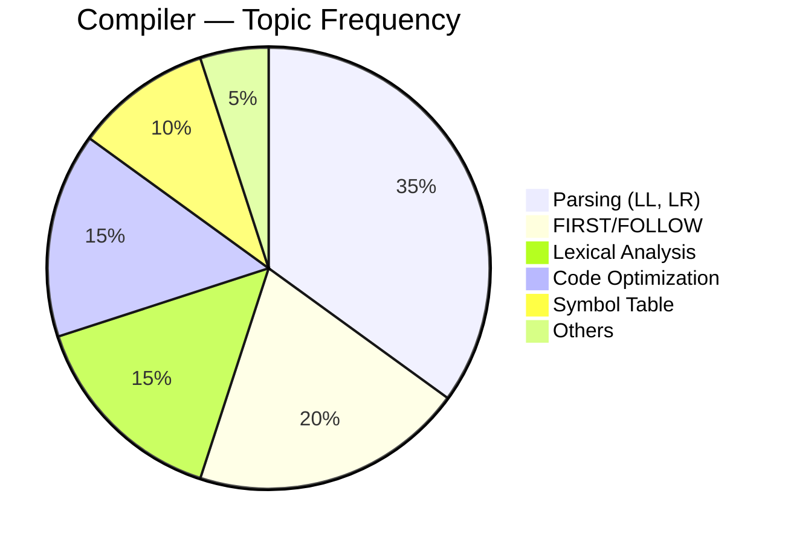
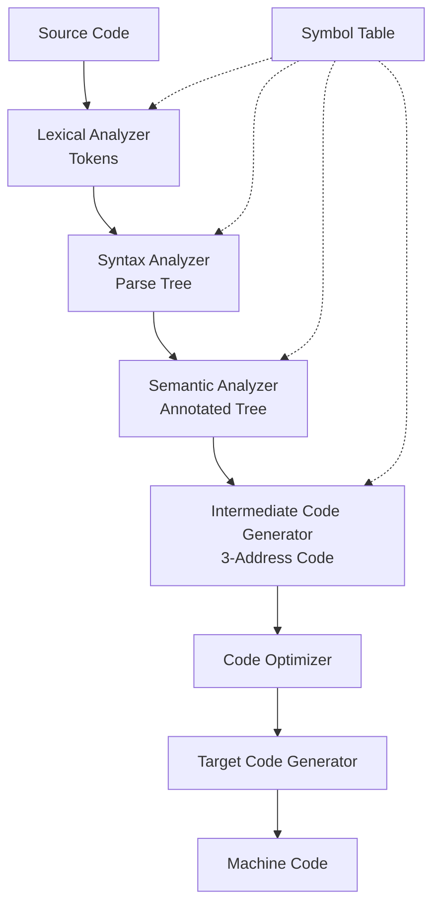

# Compiler Design — GATE CSE ⚙️

> **Priority:** 🟢 Medium-Low | **Avg Marks:** 5 | **Difficulty:** Medium
> Compiler smaller subject কিন্তু fixed patterns — কিছু topics মুখস্থ + practice।

---

## 📚 1. Syllabus Overview

1. **Lexical Analysis** — Tokens, Regex, DFA
2. **Parsing** — Top-down, Bottom-up
3. **Syntax-Directed Translation**
4. **Runtime Environment**
5. **Intermediate Code Generation**
6. **Local Optimization, Code Generation**

---

## 📊 2. Weightage Analysis

| Year | Marks | Most Asked |
|------|-------|------------|
| 2024 | 5 | Parsing, LR |
| 2023 | 6 | SLR/LR(1) |
| 2022 | 5 | FIRST/FOLLOW |
| 2021 | 4 | Syntax analysis |
| 2020 | 5 | Type checking |



---

## 🧠 3. Core Concepts

### 3.1 Compiler Phases



**Phases এবং কাজ:**

| Phase | Input | Output |
|-------|-------|--------|
| Lexical Analysis | Source code | Tokens |
| Syntax Analysis | Tokens | Parse tree |
| Semantic Analysis | Parse tree | Annotated tree |
| Intermediate Code | Annotated tree | IR (3AC) |
| Optimization | IR | Optimized IR |
| Code Generation | IR | Target code |

---

### 3.2 Lexical Analysis

**কাজ:** Source code কে **tokens** এ convert করা।

**Token** = (token name, attribute value)

**Example:**
```c
int x = 10;
```
Tokens: `<KEYWORD, int>`, `<ID, x>`, `<OP, =>`, `<NUM, 10>`, `<SEMI, ;>`

**Tools:** Regex দিয়ে token specify করা হয়, DFA দিয়ে recognize।

---

### 3.3 Parsing

**কাজ:** Tokens থেকে parse tree বানানো।

**Types:**
1. **Top-down parsing** — start থেকে derivation (LL)
2. **Bottom-up parsing** — input থেকে start (LR)

---

### 3.4 FIRST and FOLLOW

#### FIRST(α)

Set of terminals that can begin strings derived from α।

**Rules:**
1. If X is terminal, FIRST(X) = {X}
2. If X → ε, add ε
3. If X → Y1 Y2 ... Yn:
   - FIRST(X) includes FIRST(Y1) except ε
   - If ε ∈ FIRST(Y1), add FIRST(Y2), etc.

#### FOLLOW(A)

Set of terminals that can appear immediately after A in some sentential form।

**Rules:**
1. Start symbol: add `$` (end marker)
2. For A → αBβ, add FIRST(β) except ε to FOLLOW(B)
3. For A → αB or A → αBβ where ε ∈ FIRST(β), add FOLLOW(A) to FOLLOW(B)

#### Example

Grammar:
```
E → TE'
E' → +TE' | ε
T → FT'
T' → *FT' | ε
F → (E) | id
```

**FIRST:**
- FIRST(F) = {(, id}
- FIRST(T) = FIRST(F) = {(, id}
- FIRST(E) = FIRST(T) = {(, id}
- FIRST(E') = {+, ε}
- FIRST(T') = {*, ε}

**FOLLOW:**
- FOLLOW(E) = {$, )}
- FOLLOW(E') = FOLLOW(E) = {$, )}
- FOLLOW(T) = FIRST(E') \ {ε} ∪ FOLLOW(E) = {+, $, )}
- FOLLOW(T') = FOLLOW(T) = {+, $, )}
- FOLLOW(F) = FIRST(T') \ {ε} ∪ FOLLOW(T) = {*, +, $, )}

---

### 3.5 Top-Down Parsing (LL)

#### Recursive Descent Parser

Each non-terminal → recursive function।

#### LL(1) Parser

- **L**eft-to-right scan
- **L**eftmost derivation
- **1** token lookahead

**Requirement:** Grammar must be LL(1)।

#### LL(1) Condition

For A → α | β:
1. FIRST(α) ∩ FIRST(β) = ∅
2. If ε ∈ FIRST(β), then FIRST(α) ∩ FOLLOW(A) = ∅

**Left recursion** must be removed।
**Left factoring** required।

#### Left Recursion Removal

`A → Aα | β` becomes:
```
A → βA'
A' → αA' | ε
```

---

### 3.6 Bottom-Up Parsing (LR)

Powerful than LL। Most compilers use these।

#### Types

1. **LR(0)** — no lookahead
2. **SLR(1)** — simple LR with 1 lookahead using FOLLOW
3. **LR(1)** — canonical LR
4. **LALR(1)** — look-ahead LR (merged LR(1))

**Power comparison:** LR(0) ⊂ SLR(1) ⊂ LALR(1) ⊂ LR(1)

#### Items

An item = production with dot:
- `A → .αβ` (dot at beginning)
- `A → α.β` (dot in middle)
- `A → αβ.` (reduction possible)

#### Actions

- **Shift** — token stack এ push
- **Reduce** — production apply
- **Accept** — parsing complete
- **Error** — syntax error

#### Conflicts

- **Shift-Reduce** — both shift and reduce possible
- **Reduce-Reduce** — multiple reductions possible

---

### 3.7 Syntax-Directed Translation (SDT)

Grammar + semantic rules → translation during parsing।

**Attributes:**
- **Synthesized** — from children (bottom-up)
- **Inherited** — from parent/siblings (top-down)

**S-attributed:** Only synthesized (LR easy)
**L-attributed:** Synthesized + inherited with order (LL)

#### Example: Infix to Postfix

```
E → E + T    { E.val = E.val + T.val; print('+'); }
E → T        { E.val = T.val; }
T → num      { T.val = num.val; print(num); }
```

---

### 3.8 Intermediate Code

#### Three-Address Code (3AC)

Format: `x = y op z` (at most 3 addresses)।

**Example:**
```
x = a * b + c / d
```

3AC:
```
t1 = a * b
t2 = c / d
t3 = t1 + t2
x = t3
```

---

### 3.9 Code Optimization

#### Common Optimizations

1. **Constant folding** — `x = 3*4` → `x = 12`
2. **Constant propagation** — replace with known value
3. **Common subexpression elimination** — avoid recomputation
4. **Dead code elimination** — unused code removed
5. **Loop optimization** — code motion, strength reduction
6. **Strength reduction** — `x*2` → `x+x` or `x<<1`

#### Basic Blocks

Sequence of instructions with:
- Single entry (first)
- Single exit (last)

**Flow graph:** Basic blocks as nodes, control flow as edges।

---

### 3.10 Runtime Environment

#### Activation Record (Stack Frame)

Function call এ create হয়:
- Return address
- Parameters
- Local variables
- Saved registers

#### Scope

- **Static (lexical)** scope — nesting determines access
- **Dynamic** scope — call chain determines access

---

## 📐 4. Formulas & Shortcuts

### Parser Power

LR(0) < SLR(1) < LALR(1) < LR(1) < CFG

### Grammar Types

```
Regular ⊂ LL(k) ⊂ LR(k) ⊂ CFG
```

### FIRST/FOLLOW Quick Rules

- Terminal FIRST = itself
- Epsilon production adds ε
- FOLLOW of start includes `$`

---

## 🎯 5. Common Question Patterns

1. **FIRST / FOLLOW** computation
2. **LL(1) check** — is grammar LL(1)?
3. **LR parsing table** — shift/reduce entries
4. **Parsing conflicts** — shift-reduce, reduce-reduce
5. **Three-address code generation**
6. **Basic block identification**
7. **Left recursion removal**
8. **Grammar classification** — LL, LR, ambiguous

---

## 📜 6. Previous Year Questions (PYQ)

### 🔹 Parsing Questions

#### PYQ 1 (GATE 2024) — Parser Types

Which parser is more powerful?

- (A) LR(0)
- (B) SLR(1)
- (C) LALR(1)
- (D) LR(1)

**Answer:** **(D) LR(1)** most powerful ✅

---

#### PYQ 2 (GATE 2023) — FIRST/FOLLOW

Grammar:
```
S → aAb | bBa
A → a | ε
B → b | ε
```
FIRST(S)?

**Answer:** **{a, b}** ✅

---

#### PYQ 3 (GATE 2022) — LL(1)

Grammar LL(1) হতে কী requirement?

**Answer:**
1. No left recursion
2. Left factored
3. FIRST(α) ∩ FIRST(β) = ∅ for A → α | β ✅

---

#### PYQ 4 (GATE 2021) — Left Recursion

`A → Aa | b` remove left recursion।

**Solution:**
```
A → bA'
A' → aA' | ε
```
✅

---

#### PYQ 5 (GATE 2020) — Bottom-up

Bottom-up parser এ rightmost derivation **reverse** order এ produce করে — T/F?

**Answer:** **True** ✅

---

### 🔹 Lexical Analysis

#### PYQ 6 (GATE 2024) — Tokens

`int a = b + c * 3;` — tokens count?

**Solution:**
int, a, =, b, +, c, *, 3, ; → **9 tokens** ✅

---

#### PYQ 7 (GATE 2022) — Regex

Identifier regex: `letter (letter | digit)*`। Valid identifier?

**Answer:** Starts with letter, followed by letters/digits ✅

---

### 🔹 LR Parsing

#### PYQ 8 (GATE 2024) — LR Conflict

SLR(1) এ grammar parse হলে, LALR(1) এ কী হবে?

**Answer:** Also parseable (LALR ⊇ SLR) ✅

---

#### PYQ 9 (GATE 2023) — Items

LR(0) item A → α . β এ dot কী indicate করে?

**Answer:** Current parsing position ✅

---

#### PYQ 10 (GATE 2022) — SLR Table

Shift-reduce conflict কেন হয়?

**Answer:** Same state এ shift এবং reduce দুটো possible, parser decide করতে পারে না ✅

---

#### PYQ 11 (GATE 2021) — LR(1) States

LR(1) parser এ LR(0) এর চেয়ে বেশি states — কেন?

**Answer:** Each item carries lookahead set, causing more distinct items ✅

---

### 🔹 SDT Questions

#### PYQ 12 (GATE 2023) — Synthesized

```
E → E + T { E.val = E1.val + T.val; }
```
E.val কী type attribute?

**Answer:** **Synthesized** (computed from children) ✅

---

#### PYQ 13 (GATE 2020) — L-attributed

L-attributed grammar এ কী constraint?

**Answer:** Inherited attributes only from left siblings / parent ✅

---

### 🔹 Code Generation

#### PYQ 14 (GATE 2024) — 3AC

`a = b * c + d`। 3AC?

**Solution:**
```
t1 = b * c
t2 = t1 + d
a = t2
```
✅

---

#### PYQ 15 (GATE 2022) — Operator Precedence

`a + b * c - d` এর parse tree অনুযায়ী precedence?

**Answer:** * > +/- (left-associative), result evaluated correctly ✅

---

### 🔹 Optimization Questions

#### PYQ 16 (GATE 2023) — Common Subexpression

```
x = a + b
y = a + b + c
```
Optimization?

**Solution:**
```
t = a + b
x = t
y = t + c
```
Common subexpression eliminated ✅

---

#### PYQ 17 (GATE 2021) — Dead Code

```
x = 5
x = 10
print(x)
```
Optimized?

**Solution:**
```
x = 10
print(x)
```
First assignment dead ✅

---

#### PYQ 18 (GATE 2020) — Constant Folding

`x = 2 * 3 + 4` → optimized?

**Answer:** `x = 10` (compile-time evaluation) ✅

---

### 🔹 Grammar Questions

#### PYQ 19 (GATE 2024) — Ambiguous

Grammar:
```
S → if E then S | if E then S else S | a
```
Ambiguous?

**Answer:** **Yes** — dangling else problem ✅

---

#### PYQ 20 (GATE 2022) — LL vs LR

LL parse top-down, LR bottom-up — কোনটা powerful?

**Answer:** LR > LL (LR handles more grammars) ✅

---

### 🔹 Symbol Table

#### PYQ 21 (GATE 2023) — Storage

Symbol table এ কী store?

**Answer:** Identifiers, types, scope, addresses ✅

---

#### PYQ 22 (GATE 2021) — Scope

Nested scopes — implementation?

**Answer:** Stack of symbol tables বা chained hash tables ✅

---

## 🏋️ 7. Practice Problems

1. Grammar: `S → aB | Bc`, `B → b | ε`। FIRST(S), FOLLOW(S)?
2. Remove left recursion: `E → E + T | T`।
3. `A → A α | β` এর LL(1) conversion?
4. 3AC: `if a > b then x = a + b * c else x = 0`।
5. Common subexpression find করুন:
   ```
   t1 = a + b
   t2 = a + b
   t3 = t1 * t2
   ```
6. SLR vs LALR — difference in handling conflicts?
7. Left factor: `A → ab | ac | ad`।

<details>
<summary>💡 Answers</summary>

1. FIRST(S) = {a, b, c}, FOLLOW(S) = {$}
2. `E → TE'`, `E' → +TE' | ε`
3. Same as above pattern
4. 3AC with temp vars and labels
5. Merge t1 and t2
6. LALR merges LR(1) states with same core items
7. `A → aB`, `B → b | c | d`

</details>

---

## ⚠️ 8. Traps & Common Mistakes

- ❌ **LL(1) removes left recursion**, LR handles it
- ❌ **FIRST of production = FIRST of first non-ε symbol**, includes ε only if all derive ε
- ❌ **FOLLOW never contains ε**
- ❌ **Shift-reduce conflict** happens in parser, not grammar
- ❌ **Ambiguity vs conflict** — grammar ambiguous vs parser confused
- ❌ **LR(1) ⊇ LALR(1)** — LR(1) more states
- ❌ **SDT evaluated at parse time**, not after
- ❌ **Synthesized attr** bottom-up, **inherited** top-down
- ❌ **Basic block** has single entry AND single exit
- ❌ **3AC max 3 operands**, sometimes less

---

## 📝 9. Quick Revision Summary

### Parser Comparison

| Parser | Direction | Power | Uses |
|--------|-----------|-------|------|
| Recursive Descent | Top-down | Small | Educational |
| LL(1) | Top-down | Medium | XML, simple |
| LR(0) | Bottom-up | Small | — |
| SLR(1) | Bottom-up | Medium | — |
| LALR(1) | Bottom-up | Large | **Yacc, Bison** |
| LR(1) | Bottom-up | Largest | Full CFG |

### Compiler Phase Summary

```
Source → Lexer → Parser → SemAn → IR → Opt → CodeGen → Target
          ↑        ↑        ↑       ↑
        Tokens  Parse    Annot    3AC
                Tree     Tree
```

### Must-Remember

- ✅ FIRST set includes ε if production derives ε
- ✅ FOLLOW never has ε
- ✅ Left recursion removed for LL, not LR
- ✅ LR(1) > LALR(1) > SLR(1) > LR(0) in power
- ✅ Shift-reduce by default shift (Yacc rule)
- ✅ Synthesized = bottom-up, Inherited = top-down
- ✅ 3AC = at most 3 addresses per statement
- ✅ Basic block: single entry, single exit

---

## 🔗 Navigation

- [🏠 Master Index](00-master-index.md)
- [◀ Previous: Theory of Computation](06-theory-of-computation.md)
- [▶ Next: Operating System](08-operating-system.md)

---

**Tip:** FIRST/FOLLOW এবং LR items practice করুন — প্রতি বছর এই দুটো থেকে প্রশ্ন আসে। ⚙️
