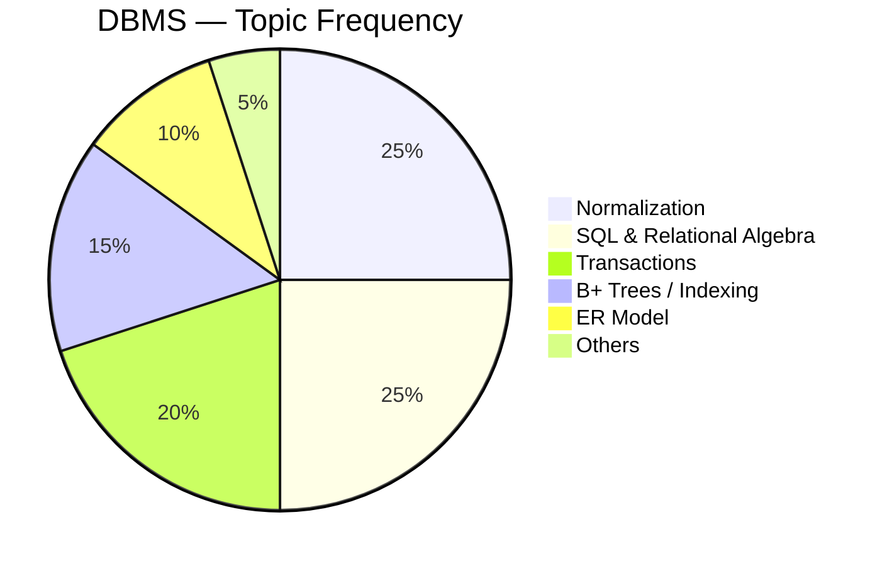
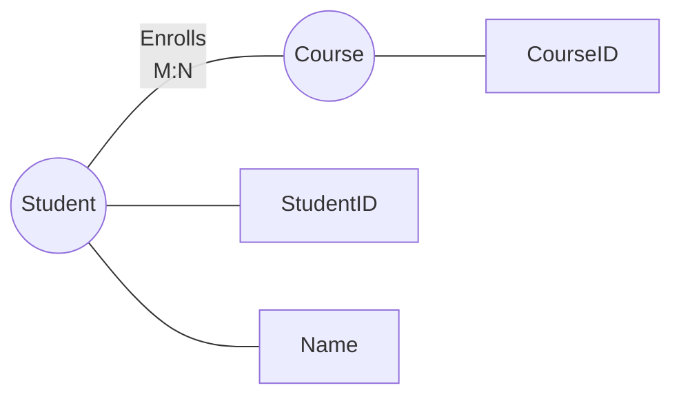
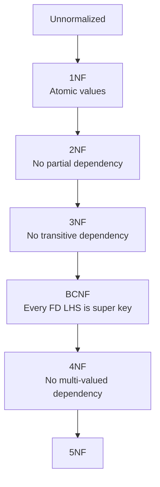
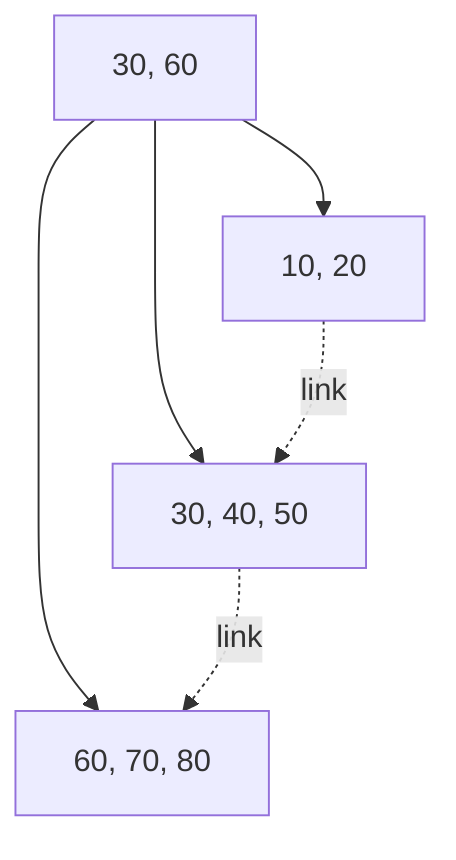
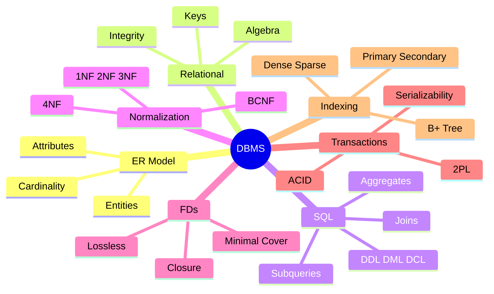

# Database Management Systems — GATE CSE 🗄️

> **Priority:** 🔴 High | **Avg Marks:** 8 | **Difficulty:** Medium
> DBMS comparatively সহজ এবং scoring subject। Concepts clear থাকলে ৭-৮ marks নিশ্চিত।

---

## 📚 1. Syllabus Overview

1. **ER Model** — Entities, Attributes, Relationships
2. **Relational Model** — Relational algebra, Tuple calculus
3. **SQL** — DDL, DML, DCL, Queries, Joins
4. **Integrity Constraints** — Primary key, Foreign key, Referential
5. **Normalization** — 1NF, 2NF, 3NF, BCNF, 4NF
6. **Functional Dependencies** — Closure, Decomposition
7. **Transactions** — ACID properties, Serializability, Recovery
8. **Concurrency Control** — Locking, Timestamp, 2PL
9. **File Organization** — Indexing, B-Trees, B+ Trees, Hashing

---

## 📊 2. Weightage Analysis

| Year | Marks | Most Asked |
|------|-------|------------|
| 2024 | 8 | SQL, Normalization |
| 2023 | 9 | Serializability, FDs |
| 2022 | 7 | B+ tree, SQL |
| 2021 | 8 | Normalization, Joins |
| 2020 | 7 | Transactions, Locking |



---

## 🧠 3. Core Concepts

### 3.1 ER Model

**ER (Entity-Relationship) Model** real-world data কে diagram এ represent করে।

#### Components

- **Entity** — Real world object (Student, Course)
- **Attribute** — Entity এর property (Name, ID)
- **Relationship** — Entities এর মধ্যে link (Student enrolls Course)

#### Attribute Types

| Type | Description | Example |
|------|-------------|---------|
| **Simple** | Atomic, can't divide | Age |
| **Composite** | Divisible | Name (first+last) |
| **Single-valued** | One value | DOB |
| **Multi-valued** | Multiple values | Phone numbers |
| **Derived** | Calculated from others | Age (from DOB) |
| **Key** | Uniquely identifies | Student ID |

#### Cardinality

- **1:1** — One-to-one (Person ↔ Passport)
- **1:N** — One-to-many (Department → Employees)
- **M:N** — Many-to-many (Students ↔ Courses)



---

### 3.2 Relational Model

Data stored as **tables (relations)**। Rows = **tuples**, Columns = **attributes**।

#### Keys

| Key | Definition |
|-----|------------|
| **Super Key** | Set of attributes that uniquely identifies tuple |
| **Candidate Key** | Minimal super key |
| **Primary Key** | Chosen candidate key |
| **Alternate Key** | Unchosen candidate keys |
| **Foreign Key** | References another relation's primary key |

**Memory tip:** Super ⊇ Candidate ⊇ Primary

---

### 3.3 Relational Algebra

SQL এর theoretical foundation। Query expression এ use হয়।

#### Basic Operations

| Operation | Symbol | Purpose |
|-----------|--------|---------|
| Selection | σ | Rows filter |
| Projection | π | Columns select |
| Union | ∪ | Combine |
| Intersection | ∩ | Common tuples |
| Difference | − | Only in first |
| Cartesian product | × | All combinations |
| Join | ⋈ | Combine by condition |
| Rename | ρ | Rename relation |

#### Examples

**σ_(age>18)(Student):** Students with age > 18
**π_(Name, Age)(Student):** Only Name and Age columns
**Student ⋈ Course:** Join based on common attribute

---

### 3.4 SQL (Must Know!)

#### Basic Queries

```sql
SELECT column1, column2
FROM table
WHERE condition
GROUP BY column
HAVING group_condition
ORDER BY column;
```

#### Joins

| Join | Description |
|------|-------------|
| **INNER JOIN** | Matching rows only |
| **LEFT JOIN** | All from left + matching right |
| **RIGHT JOIN** | All from right + matching left |
| **FULL OUTER JOIN** | All from both |
| **CROSS JOIN** | Cartesian product |
| **SELF JOIN** | Table joined with itself |

#### Aggregate Functions

- `COUNT`, `SUM`, `AVG`, `MIN`, `MAX`

#### GROUP BY and HAVING

```sql
SELECT dept, COUNT(*)
FROM Employee
GROUP BY dept
HAVING COUNT(*) > 5;
```

#### Subqueries

```sql
SELECT name FROM Employee
WHERE salary > (SELECT AVG(salary) FROM Employee);
```

#### WHERE vs HAVING

- **WHERE** — Filter rows **before** grouping
- **HAVING** — Filter groups **after** GROUP BY

---

### 3.5 Functional Dependencies (FD)

**FD:** If two tuples have same value for X, they must have same value for Y. Write as `X → Y`।

**Example:** `StudentID → Name` (ID same হলে name same)

#### Armstrong's Axioms

1. **Reflexivity:** If Y ⊆ X, then X → Y
2. **Augmentation:** If X → Y, then XZ → YZ
3. **Transitivity:** If X → Y and Y → Z, then X → Z

#### Closure (X⁺)

X⁺ = সব attributes যা X থেকে derive করা যায়।

**Example:**
FDs: `A → B`, `B → C`, `A → D`
A⁺ = {A, B, C, D}

---

### 3.6 Normalization

**কেন?** Redundancy এবং anomalies (insertion, update, deletion) কমাতে।

#### Normal Forms



#### 1NF (First Normal Form)

- Atomic values (no arrays/multi-valued attributes in single cell)

**Violates 1NF:**
| StudentID | Phones |
|-----------|--------|
| 1 | 123, 456 |

**In 1NF:**
| StudentID | Phone |
|-----------|-------|
| 1 | 123 |
| 1 | 456 |

#### 2NF

- In 1NF
- **No partial dependency** — non-key attribute can't depend on part of composite primary key

**Violates 2NF:**
Primary key: (StudentID, CourseID)
FD: `CourseID → CourseName` (partial dependency!)

**Fix:** Separate Courses table।

#### 3NF

- In 2NF
- **No transitive dependency** — non-key attr can't depend on another non-key attr

**Violates 3NF:**
FDs: `StudentID → DeptID`, `DeptID → DeptName`
`StudentID → DeptName` is transitive!

**Fix:** Separate Department table।

#### BCNF (Boyce-Codd Normal Form)

- **For every FD `X → Y`, X must be super key**

**Stricter than 3NF**. Sometimes 3NF relation not in BCNF।

---

### 3.7 Transactions & ACID

**Transaction:** Logical unit of work (group of operations)।

#### ACID Properties

| Property | Meaning |
|----------|---------|
| **Atomicity** | All or nothing |
| **Consistency** | DB moves from one valid state to another |
| **Isolation** | Concurrent transactions don't interfere |
| **Durability** | Committed changes persist |

#### Schedule Types

- **Serial:** One after another (safe but slow)
- **Concurrent:** Interleaved operations (fast but risky)

#### Serializability

**Goal:** Concurrent schedule এর result serial schedule এর মতোই হোক।

**Types:**

**1. Conflict Serializability** — Conflict graph acyclic হলে।

**Two operations conflict if:**
- From different transactions
- On same data
- At least one is write

**2. View Serializability** — Initial read, final write, intermediate reads matched।

**Conflict ⊆ View Serializability**

---

### 3.8 Concurrency Control

#### Lock-based Protocols

- **Shared (S) lock:** Multiple transactions can read
- **Exclusive (X) lock:** Only one transaction can write

#### 2PL (Two-Phase Locking)

1. **Growing phase:** Only acquire locks
2. **Shrinking phase:** Only release locks

**Strict 2PL:** Hold all X locks until commit (prevents cascading rollback)।

#### Deadlock in DBMS

Wait-for graph cycle = deadlock। Resolve by **rollback** one transaction।

#### Timestamp Ordering

Each transaction gets timestamp। Older transactions priority পায়।

---

### 3.9 Indexing & B+ Trees

#### Why Index?

Quick lookup। Linear search O(n) → Index দিয়ে O(log n)।

#### Primary vs Secondary Index

- **Primary:** On primary key, sorted
- **Secondary:** On non-key attribute, separate sorted structure

#### Dense vs Sparse

- **Dense:** Entry for every record
- **Sparse:** Entry for some records (block anchor)

#### B+ Tree (Most Important)

- All data in **leaves**
- Internal nodes store only keys for routing
- Leaves linked (sequential access easy)
- Order m = max children per node
- **Height = O(log_m n)**



#### Properties

- **Max keys per node** = m-1
- **Min keys** = ⌈m/2⌉ - 1 (except root)
- **Min children** = ⌈m/2⌉

---

## 📐 4. Formulas & Shortcuts

### Normalization Quick Rules

| To check | What to verify |
|----------|----------------|
| **1NF** | Atomic values |
| **2NF** | Every non-prime attr fully depends on candidate key |
| **3NF** | For each FD X→Y: X is super key, OR Y is prime attribute |
| **BCNF** | For each FD X→Y: X is super key |

### B+ Tree Calculations

- Records per block = Block size / Record size
- Number of blocks = Records / Records per block
- Height = ⌈log_m (Records)⌉ roughly

### Transactions

- Conflict pairs: (R-W), (W-R), (W-W) on same data
- N transactions → N! possible serial schedules

---

## 🎯 5. Common Question Patterns

1. **SQL query output prediction**
2. **Relational algebra ↔ SQL translation**
3. **Find closure of attribute set**
4. **Determine highest normal form**
5. **Conflict serializability check** (precedence graph)
6. **B+ tree insert/delete**
7. **Count tuples in join result**
8. **Lossless decomposition check**

---

## 📜 6. Previous Year Questions (PYQ)

### 🔹 ER & Relational Model

#### PYQ 1 (GATE 2023) — Cardinality

Relationship "Manages" between Employee and Department। Each dept has one manager, each manager manages one dept। Cardinality?

**Answer:** **1:1** ✅

---

#### PYQ 2 (GATE 2022) — Keys

Relation R(A, B, C, D) with FDs: `AB → C`, `C → D`, `D → A`. Candidate keys?

**Solution:**

- AB⁺ = {A,B,C,D} — super key
- CB⁺ = {A,B,C,D} (since C→D→A, then AB→C extends, etc.) → candidate
- DB⁺ = {A,B,C,D} (D→A, then AB→C→D) → candidate

**Candidates: AB, BC, BD** ✅

---

### 🔹 SQL Questions

#### PYQ 3 (GATE 2024) — Join Output

```sql
SELECT COUNT(*) FROM A, B;
```
If |A|=5, |B|=7. Output?

**Answer:** Cartesian product = **5 × 7 = 35** ✅

---

#### PYQ 4 (GATE 2023) — GROUP BY

```sql
SELECT dept, AVG(salary) FROM Employee
GROUP BY dept HAVING AVG(salary) > 50000;
```

Selects what?

**Answer:** Departments with avg salary > 50,000 ✅

---

#### PYQ 5 (GATE 2022) — NULL

```sql
SELECT COUNT(*) FROM T WHERE col IS NULL;
SELECT COUNT(col) FROM T;
```

Difference?

**Answer:**
- `COUNT(*)` counts all rows (including NULL col)
- `COUNT(col)` counts non-NULL values ✅

---

#### PYQ 6 (GATE 2021) — Outer Join

LEFT OUTER JOIN কী return করে?

**Answer:** Left table এর সব rows + right table এর matched rows (unmatched এ NULL) ✅

---

#### PYQ 7 (GATE 2020) — Subquery

```sql
SELECT name FROM Emp
WHERE salary > ALL (SELECT salary FROM Emp WHERE dept='IT');
```

**Meaning:** Emp যার salary IT dept এর সবার চেয়ে বেশি ✅

---

### 🔹 Normalization Questions

#### PYQ 8 (GATE 2024) — Normal Form

Relation R(A,B,C,D) with FDs `A→B`, `B→C`, `A→D`. Highest normal form?

**Solution:**

- Candidate key: A (A⁺ = {A,B,C,D})
- Check 2NF: No composite key, trivially 2NF ✓
- Check 3NF: `B→C` — B is not super key, C is not prime. **Violates 3NF** ❌

**Answer: 2NF** ✅

---

#### PYQ 9 (GATE 2023) — BCNF

Relation R(A,B,C) with FDs `AB→C`, `C→A`. Is it in BCNF?

**Solution:**
- Candidate keys: AB (AB⁺={A,B,C}), CB (CB⁺={A,B,C})
- Check BCNF for each FD:
  - `AB→C`: AB is super key ✓
  - `C→A`: C is NOT super key ❌

**Answer: Not in BCNF, but in 3NF** (since A is prime) ✅

---

#### PYQ 10 (GATE 2022) — Closure

R(A,B,C,D,E), FDs: `A→B`, `B→C`, `CD→E`, `E→A`. Find (AB)⁺.

**Solution:**
- (AB)⁺ = {A, B}
- A→B: already
- B→C: add C → {A,B,C}
- CD→E: D not in set, skip
- E→A: E not in set, skip

**(AB)⁺ = {A, B, C}** ✅

---

#### PYQ 11 (GATE 2021) — Lossless Decomposition

R(A,B,C) decomposed into R1(A,B), R2(B,C). FD: `B→C`. Lossless?

**Solution:** R1 ∩ R2 = {B}. B → C (for R2 attributes via FD)।

Lossless condition: intersection should be super key of at least one relation।
- B → BC (for R2) ✓

**Lossless** ✅

---

### 🔹 Transactions & Serializability

#### PYQ 12 (GATE 2023) — Conflict Serializability

Schedule:
```
T1: R(A), W(A)
T2:            R(A), W(A)
```
Conflict serializable?

**Solution:**

Precedence graph:
- T1 R(A), T2 W(A): conflict, T1 → T2
- T1 W(A), T2 R(A): conflict, T1 → T2
- T1 W(A), T2 W(A): conflict, T1 → T2

All edges T1 → T2. No cycle. **Serializable as T1, T2** ✅

---

#### PYQ 13 (GATE 2022) — View vs Conflict

View-serializable কিন্তু conflict-serializable না — এমন schedule কোথায় পাওয়া যায়?

**Answer:** **Blind writes** (write without read). Example:
```
T1: W(A)
T2:      W(A)
T3:            W(A)
```

---

#### PYQ 14 (GATE 2021) — ACID

Atomicity ensure করে কোনটা?

- (A) Write-ahead logging
- (B) Two-phase commit
- (C) Both

**Answer:** Both (WAL for durability+atomicity, 2PC for distributed atomicity) ✅

---

#### PYQ 15 (GATE 2020) — 2PL

Strict 2PL ensure করে?

**Answer:**
- Conflict serializability
- No cascading rollback
- Recoverability ✅

---

### 🔹 Indexing & B+ Trees

#### PYQ 16 (GATE 2024) — B+ Tree Height

10,000 records, block size 4 KB, key size 10 B, pointer size 6 B. B+ tree height?

**Solution:**

Order = Block size / (Key + Pointer) = 4000/16 = 250
So each internal node holds ~250 children।

Height ≈ ⌈log₂₅₀(10000)⌉ = **2** ✅

---

#### PYQ 17 (GATE 2022) — Index Types

Primary index কোথায় থাকে?

**Answer:** On sorted attribute (usually primary key)। Sparse index common। ✅

---

#### PYQ 18 (GATE 2021) — B+ Insert

B+ tree of order 4, insert key 25 into existing nodes। Node split হবে কি?

_(Depends on current state — if node full with 3 keys, split)_

---

### 🔹 Relational Algebra

#### PYQ 19 (GATE 2023) — Division

R(A,B) ÷ S(B) returns কী?

**Answer:** A values that have all B values in S. "For all" quantifier implementation। ✅

---

#### PYQ 20 (GATE 2020) — Projection

R has 10 tuples. π_A(R) max tuples?

**Answer:** 10 (max, if all A distinct)। Min = 1 (if all A same)। ✅

---

### 🔹 Functional Dependencies

#### PYQ 21 (GATE 2024) — FD Implication

Given FDs: `A→B`, `BC→D`. Does `AC→D` follow?

**Solution:**
- From A→B: AC → BC (augmentation)
- From BC→D: BC → D
- Transitivity: AC → D ✓

**Yes** ✅

---

#### PYQ 22 (GATE 2022) — Minimal Cover

F = {A→B, AB→C, B→D}. Minimal cover?

**Solution:**
- A→B, AB→C: since A→B, AB→C simplifies to A→C (extraneous B)
- Result: `A→B, A→C, B→D`
- Check further: can any be removed?

**Minimal: {A→B, A→C, B→D}** ✅

---

#### PYQ 23 (GATE 2021) — Lossless Join

R(A,B,C,D), FDs A→B, C→D। Decompose into R1(A,B), R2(C,D)। Lossless?

**Solution:**
R1 ∩ R2 = {} (empty!) → **Lossy!** ❌

---

### 🔹 Miscellaneous

#### PYQ 24 (GATE 2023) — ACID violation

Hard disk crash ঘটলে কোন property violate?

**Answer:** **Durability** — committed data হারালে ✅

---

#### PYQ 25 (GATE 2022) — Weak Entity

Weak entity সনাক্তকরণের জন্য কী লাগে?

**Answer:** Strong entity এর primary key + partial discriminator ✅

---

#### PYQ 26 (GATE 2021) — Cascading Delete

Foreign key constraint এ ON DELETE CASCADE কী করে?

**Answer:** Parent row delete হলে child rows ও delete হবে ✅

---

## 🏋️ 7. Practice Problems

1. R(A,B,C,D,E) with FDs `A→BC`, `CD→E`, `B→D`, `E→A`. Find candidate keys।
2. SQL: Employee table থেকে highest salary employee find করুন।
3. Schedule conflict serializable কিনা check করুন (precedence graph draw)।
4. R(A,B,C,D) with FDs `A→B`, `B→C`, `D→A` — highest NF?
5. B+ tree order 5, height 3 — max records?
6. Lossless decomposition check for R1, R2 given।
7. Relational algebra: "All students enrolled in ALL courses of CSE dept" — express।

<details>
<summary>💡 Answers</summary>

1. Keys: {A, E, CD, BC, BD}... (compute systematically)
2. `SELECT name FROM Emp WHERE salary = (SELECT MAX(salary) FROM Emp);`
3. Check for cycles
4. 2NF (B→C transitive if A is only key)
5. Order 5 → 5⁴ = 625 leaves × entries per leaf
6. R1∩R2 should be super key
7. Division operator: Enrollment ÷ CSE_Courses

</details>

---

## ⚠️ 8. Traps & Common Mistakes

- ❌ **COUNT(*) vs COUNT(col)** — NULL handling differs
- ❌ **WHERE vs HAVING** — WHERE before GROUP BY, HAVING after
- ❌ **Closure calculation** — transitively apply all FDs
- ❌ **3NF vs BCNF** — 3NF allows `X→Y` where Y is prime attribute
- ❌ **Conflict serializability** uses precedence graph, not timestamps
- ❌ **2PL doesn't prevent deadlock** — just ensures serializability
- ❌ **Strict 2PL prevents cascading rollback**, not 2PL in general
- ❌ **Lossless decomposition** needs intersection to be super key of at least one
- ❌ **B+ tree leaves linked**, B-tree leaves are not
- ❌ **NULL comparison** — `NULL = NULL` gives UNKNOWN, not TRUE

---

## 📝 9. Quick Revision Summary

### Mindmap



### Must-Remember Facts

- ✅ Primary key = NOT NULL + UNIQUE
- ✅ Foreign key can be NULL
- ✅ 3NF: for each X→Y, either X is super key OR Y is prime attribute
- ✅ BCNF: for each X→Y, X is super key
- ✅ ACID: Atomicity, Consistency, Isolation, Durability
- ✅ Conflict Serializability via precedence graph cycle check
- ✅ 2PL ensures conflict serializability
- ✅ B+ tree height O(log n), much less than binary tree
- ✅ Lossless decomposition: intersection = super key of one relation
- ✅ Union, intersection, difference need **same schema** (union compatible)

### Normalization Memory Aid

| NF | Eliminates |
|----|-----------|
| 1NF | Repeating groups |
| 2NF | Partial dependencies |
| 3NF | Transitive dependencies |
| BCNF | All non-trivial FDs X→Y where X isn't super key |

---

## 🔗 Navigation

- [🏠 Master Index](00-master-index.md)
- [◀ Previous: Operating System](08-operating-system.md)
- [▶ Next: Computer Networks](10-computer-networks.md)

---

**Tip:** DBMS এ PYQ বেশি solve করুন — patterns repeat হয়। Normalization এবং serializability দুটোই must master করতে হবে। 🎯
