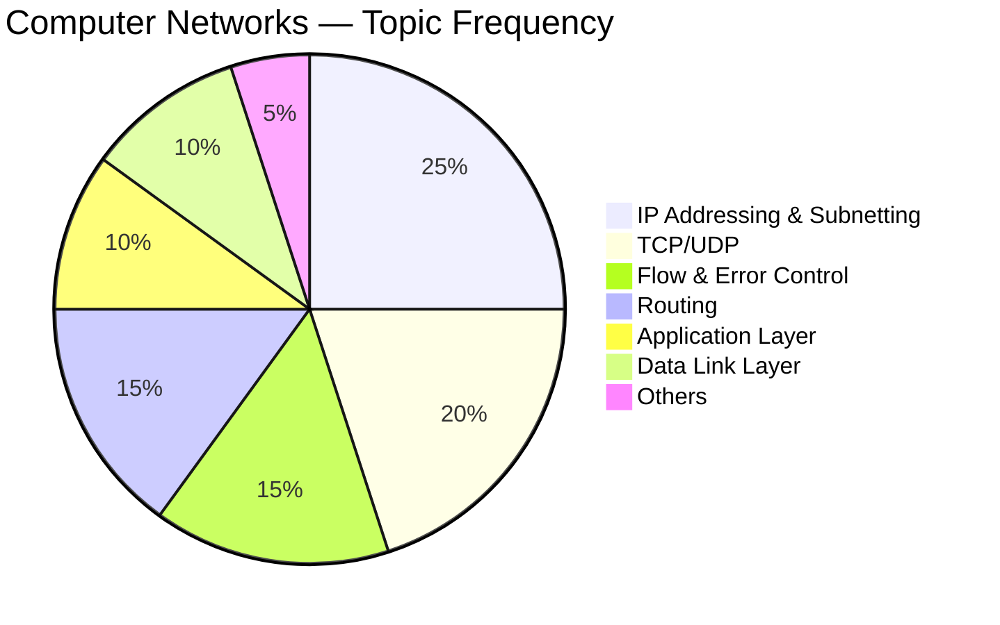
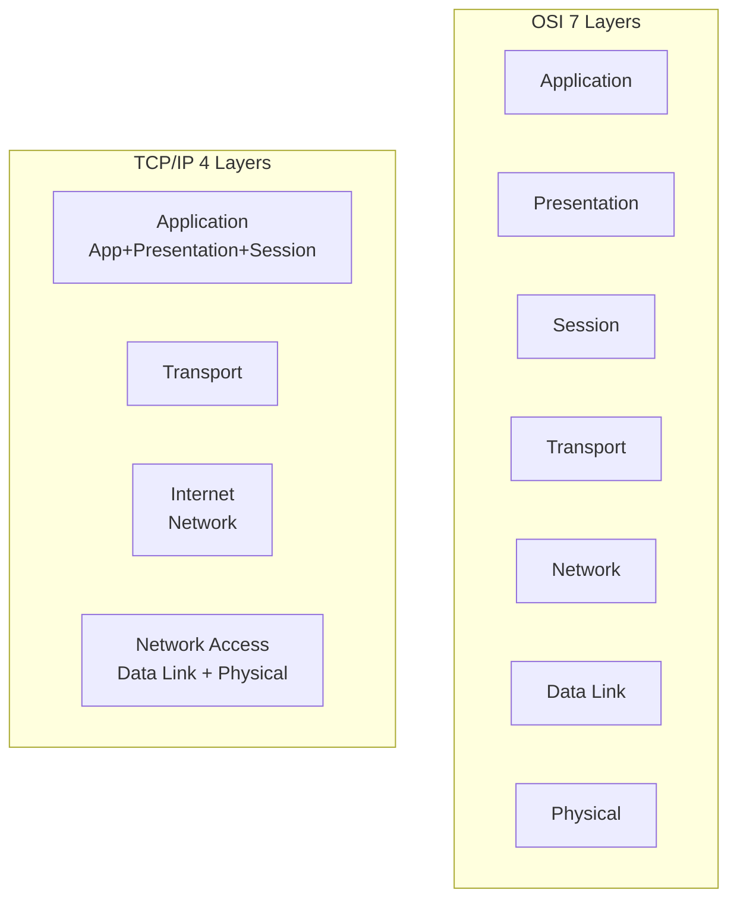
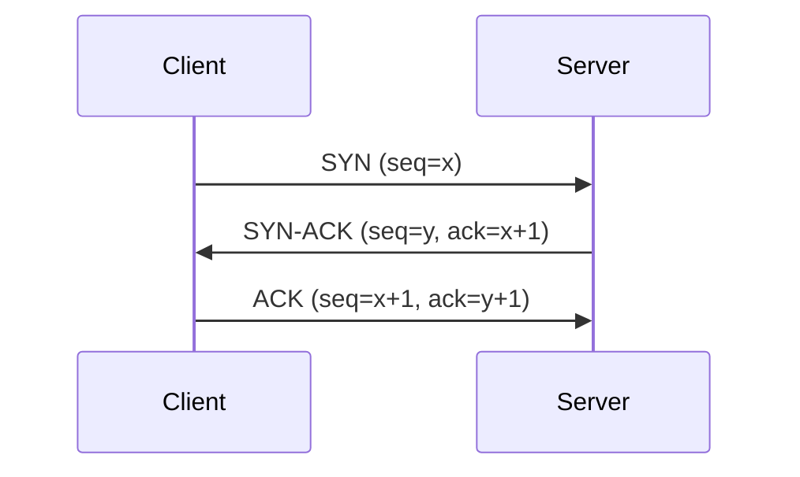
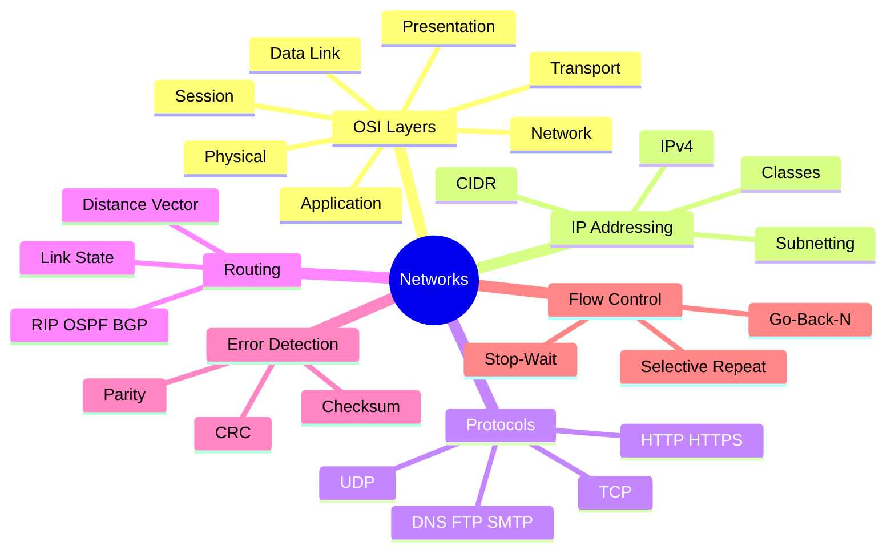

# Computer Networks — GATE CSE 🌐

> **Priority:** 🔴 High | **Avg Marks:** 7 | **Difficulty:** Medium
> Networks conceptual + calculation এর mix। Formulas ও layers ঠিক মুখস্থ রাখলে সহজ।

---

## 📚 1. Syllabus Overview

1. **Concept of Layering** — OSI, TCP/IP models
2. **LAN Technologies** — Ethernet
3. **Flow Control, Error Control** — Stop-and-Wait, Sliding Window
4. **Switching** — Circuit, Packet, Virtual circuit
5. **IPv4, IPv6 Addressing** — Subnetting, CIDR
6. **Routing** — Distance vector, Link state
7. **TCP, UDP**
8. **Application Layer** — DNS, HTTP, FTP, SMTP, Email
9. **Network Security** — Public key, Symmetric key basics
10. **Wireless** — Basic concepts

---

## 📊 2. Weightage Analysis

| Year | Marks | Most Asked |
|------|-------|------------|
| 2024 | 7 | Subnetting, TCP |
| 2023 | 8 | Flow control, Routing |
| 2022 | 7 | CIDR, HTTP |
| 2021 | 7 | Sliding window, Subnetting |
| 2020 | 8 | TCP, IP |



---

## 🧠 3. Core Concepts

### 3.1 Network Layering — OSI vs TCP/IP



#### Layer Responsibilities (মুখস্থ MUST)

| Layer | Responsibility | Example Protocols |
|-------|---------------|-------------------|
| **Application** | User services | HTTP, FTP, SMTP, DNS |
| **Presentation** | Data format, encryption | SSL/TLS |
| **Session** | Session management | NetBIOS |
| **Transport** | End-to-end delivery | TCP, UDP |
| **Network** | Routing, addressing | IP, ICMP |
| **Data Link** | Frame, error detection | Ethernet, PPP |
| **Physical** | Bits transmission | Cables, Hubs |

#### Mnemonic: "All People Seem To Need Data Processing" (top to bottom)

---

### 3.2 Data Link Layer

#### Framing

Bit stream কে frames এ ভাগ করা।
- **Character stuffing**
- **Bit stuffing**

#### Error Detection

1. **Parity bit**
2. **Checksum**
3. **CRC (Cyclic Redundancy Check)** — polynomial division

**CRC Example:**
Data: `1101011011`, Generator: `10011`
- Append 4 zeros: `11010110110000`
- Divide by generator (XOR)
- Remainder = CRC

#### Flow Control Protocols

##### Stop-and-Wait

Sender sends one frame, waits for ACK।

**Efficiency:** `η = Tt / (Tt + 2Tp)`

- Tt = Transmission time = L/B (packet length / bandwidth)
- Tp = Propagation time

##### Sliding Window

Multiple frames send without waiting।

**Go-Back-N:**
- Window size `N`
- ACK lost → retransmit all from lost frame
- Sequence bits needed: `⌈log₂(N+1)⌉`

**Selective Repeat:**
- Only retransmit lost frame
- Receiver buffers out-of-order frames
- Window size ≤ 2^(m-1) where m = seq bits

---

### 3.3 Efficiency Calculations

**Bandwidth-Delay Product (BDP):**
BDP = B × RTT` = max bits in pipe

**Efficiency:**
```
η = Window_size / (1 + 2a)
```
where `a = Tp/Tt`

**Throughput:**
```
Throughput = η × B
```

---

### 3.4 MAC Protocols (Medium Access)

| Protocol | Type | Description |
|----------|------|-------------|
| **ALOHA** | Random | Send whenever ready |
| **Slotted ALOHA** | Random | Send at time slots |
| **CSMA** | Carrier sense | Listen before sending |
| **CSMA/CD** | Carrier sense + collision detect | Ethernet |
| **CSMA/CA** | Carrier sense + collision avoid | Wi-Fi |

**Max efficiency:**
- Pure ALOHA: 18%
- Slotted ALOHA: 37%
- CSMA/CD: depends on a=Tp/Tt

---

### 3.5 IP Addressing

#### IPv4

32-bit address, 4 octets (0-255 each)।
Example: `192.168.1.1`

#### Classes (Obsolete but GATE asks)

| Class | Range | Default Mask | Use |
|-------|-------|--------------|-----|
| A | 0-127 | /8 (255.0.0.0) | Large networks |
| B | 128-191 | /16 (255.255.0.0) | Medium |
| C | 192-223 | /24 (255.255.255.0) | Small |
| D | 224-239 | — | Multicast |
| E | 240-255 | — | Reserved |

#### CIDR (Classless Inter-Domain Routing)

Format: `IP/prefix_length`
Example: `192.168.1.0/24`

**Number of hosts** = `2^(32-prefix) - 2` (minus network & broadcast)

---

### 3.6 Subnetting

**Problem:** 192.168.1.0/24 কে 4 subnet এ ভাগ করুন।

**Solution:**

- 4 subnets → need 2 bits borrow → new prefix = /24 + 2 = /26
- Each subnet: 2^(32-26) = 64 addresses
- Usable hosts per subnet: 64 - 2 = 62

**Subnets:**
- 192.168.1.0/26 (0-63)
- 192.168.1.64/26 (64-127)
- 192.168.1.128/26 (128-191)
- 192.168.1.192/26 (192-255)

#### VLSM (Variable Length Subnet Mask)

Different subnets with different sizes।

---

### 3.7 Routing

#### Distance Vector (Bellman-Ford)

Each router maintains table: (destination, next_hop, cost)।
Exchanges with neighbors periodically।

**Problems:** Slow convergence, count-to-infinity।

#### Link State (Dijkstra)

Each router knows **full topology**।
Floods link state info। Runs Dijkstra locally।

**Protocol:** OSPF।

#### Routing Protocols Summary

| Protocol | Type | Metric |
|----------|------|--------|
| RIP | Distance Vector | Hop count (max 15) |
| OSPF | Link State | Cost (bandwidth) |
| BGP | Path Vector | AS path |

---

### 3.8 Transport Layer

#### TCP vs UDP

| Feature | TCP | UDP |
|---------|-----|-----|
| **Connection** | Connection-oriented | Connectionless |
| **Reliability** | Reliable | Unreliable |
| **Ordering** | In-order | No order |
| **Speed** | Slower | Faster |
| **Header** | 20 bytes min | 8 bytes |
| **Use** | HTTP, FTP, Email | DNS, video streaming |

#### TCP Header Fields (important)

- Source/Dest Port (16 bits each)
- Sequence Number (32 bits)
- ACK Number (32 bits)
- Flags: SYN, ACK, FIN, RST, PSH, URG
- Window Size
- Checksum

#### TCP 3-Way Handshake



#### TCP Connection Termination (4-Way)

- FIN → ACK (Client closes)
- FIN → ACK (Server closes)

#### TCP Congestion Control

- **Slow Start** — cwnd starts at 1, doubles per RTT
- **Congestion Avoidance** — cwnd increases linearly (AIMD)
- **Fast Retransmit** — 3 duplicate ACKs
- **Fast Recovery** — halve cwnd instead of reset

---

### 3.9 Application Layer

#### HTTP

- **Port 80** (HTTP), **443** (HTTPS)
- **Stateless** — each request independent
- **Methods:** GET, POST, PUT, DELETE

**Response codes:**
- 1xx Informational
- 2xx Success (200 OK)
- 3xx Redirect (301 Moved)
- 4xx Client error (404 Not Found)
- 5xx Server error (500 Internal)

#### DNS

Domain name → IP translation। **Port 53**।

**Types of records:**
- A — IPv4 address
- AAAA — IPv6
- CNAME — alias
- MX — mail server
- NS — name server

#### Email

- **SMTP** (port 25) — sending
- **POP3** (port 110) — receiving
- **IMAP** (port 143) — receiving (keeps on server)

#### FTP

- Control channel: port 21
- Data channel: port 20

---

### 3.10 Network Security (Brief)

- **Symmetric key** — same key for encrypt/decrypt (AES, DES)
- **Asymmetric (Public Key)** — different keys (RSA)
- **Digital signature** — authenticate sender
- **Hash functions** — MD5, SHA

---

## 📐 4. Formulas & Shortcuts

### Transmission Formulas

| Formula | Purpose |
|---------|---------|
| `Tt = L/B` | Transmission time |
| `Tp = d/v` | Propagation time |
| `a = Tp/Tt` | Bandwidth-delay ratio |
| `RTT = 2 × Tp` | Round trip time |
| `BDP = B × RTT` | Bandwidth-delay product |

### Efficiency Formulas

| Protocol | Efficiency |
|----------|-----------|
| Stop-and-Wait | `1/(1+2a)` |
| Go-Back-N | `N/(1+2a)` if N < 1+2a, else 1 |
| Selective Repeat | `N/(1+2a)` if N < 1+2a, else 1 |

### Sequence Number Bits

- Go-Back-N: `m ≥ ⌈log₂(N+1)⌉`
- Selective Repeat: `m ≥ ⌈log₂(2N)⌉`

### Subnetting Quick

- **Hosts in /n network** = `2^(32-n) - 2`
- **Subnets from /m to /n** = `2^(n-m)`

---

## 🎯 5. Common Question Patterns

1. **Subnet calculation** — hosts, broadcast, network address
2. **CIDR aggregation** — super-netting
3. **Efficiency of sliding window** protocols
4. **Hamming / CRC** error detection
5. **Routing table** calculation
6. **TCP window size, congestion control**
7. **DNS recursive/iterative query**
8. **Layer identification** of protocols

---

## 📜 6. Previous Year Questions (PYQ)

### 🔹 OSI & Layering

#### PYQ 1 (GATE 2023) — Layers

Which layer is responsible for end-to-end delivery?

**Answer:** **Transport layer** ✅

---

#### PYQ 2 (GATE 2022) — Protocol Layers

HTTP কোন layer এ?

**Answer:** Application layer (uses TCP on port 80) ✅

---

### 🔹 IP & Subnetting Questions

#### PYQ 3 (GATE 2024) — CIDR

`192.168.1.0/26` subnet এ usable hosts?

**Solution:** `2^(32-26) - 2 = 64 - 2 = 62` ✅

---

#### PYQ 4 (GATE 2023) — Subnetting

/24 network কে 8 subnet এ ভাগ করলে each subnet এ কতটা usable host?

**Solution:**
- 8 subnets → 3 bits → new mask /27
- Each: 2^5 - 2 = **30 hosts** ✅

---

#### PYQ 5 (GATE 2022) — Subnet Mask

10.0.0.0/255.240.0.0 এর CIDR notation?

**Solution:** 255.240.0.0 = 11111111.11110000.00000000.00000000
Total 1's = 8+4 = 12 → **/12** ✅

---

#### PYQ 6 (GATE 2021) — Network Address

IP 192.168.5.139/27 এর network address?

**Solution:**
/27 mask: 255.255.255.224 → last octet 224 = 11100000
139 in binary: 10001011
AND: 10001011 & 11100000 = 10000000 = **128**

Network: **192.168.5.128** ✅

---

#### PYQ 7 (GATE 2020) — Broadcast Address

192.168.1.128/26 এর broadcast address?

**Solution:**
Block size = 64
Broadcast = 128 + 63 = **191**
Address: **192.168.1.191** ✅

---

### 🔹 Flow Control & Sliding Window

#### PYQ 8 (GATE 2024) — Stop-and-Wait Efficiency

B = 1 Mbps, Tt = 1 ms, Tp = 20 ms. Stop-and-wait efficiency?

**Solution:**
a = Tp/Tt = 20
η = 1/(1+2a) = 1/41 ≈ **2.44%** ✅

---

#### PYQ 9 (GATE 2023) — Window Size

Bandwidth 10 Mbps, RTT 40 ms, packet size 1 KB। Optimal window size?

**Solution:**
BDP = 10 × 10⁶ × 0.04 = 400,000 bits = 50,000 bytes
Window size = 50,000 / 1024 ≈ **49 packets** ✅

---

#### PYQ 10 (GATE 2022) — Go-Back-N

Go-Back-N with window 4. Sequence bits required?

**Solution:**
m ≥ ⌈log₂(4+1)⌉ = ⌈log₂5⌉ = **3 bits** ✅

---

#### PYQ 11 (GATE 2021) — SR Window

Selective Repeat with 3 bits seq number. Max window?

**Solution:**
N ≤ 2^(m-1) = 2^2 = **4** ✅

---

### 🔹 Error Detection

#### PYQ 12 (GATE 2023) — CRC

Data 110101, generator 1001. CRC bits?

**Solution:**

```
110101000 ÷ 1001

  110101000
- 1001
---------
  011011000
  1001
  ---------
   010010000
    1001
    -----
     001100
     1001
     ----
      0011

CRC = 011
```

Transmitted: **110101011** (approx) ✅

---

#### PYQ 13 (GATE 2021) — Parity

Even parity for 1011001?

**Solution:**
1+0+1+1+0+0+1 = 4 (even). Parity bit = **0** (to keep even) ✅

---

#### PYQ 14 (GATE 2020) — Hamming Distance

Hamming distance between 10110 and 11011?

**Solution:**
Differ at positions 2, 3, 5 → **3** ✅

---

### 🔹 TCP & UDP

#### PYQ 15 (GATE 2024) — TCP vs UDP

Video streaming এ usually কোনটা use হয়?

**Answer:** **UDP** (speed > reliability) ✅

---

#### PYQ 16 (GATE 2023) — TCP Handshake

TCP connection establishment এ কতটা packet?

**Answer:** **3** (SYN, SYN-ACK, ACK) ✅

---

#### PYQ 17 (GATE 2022) — TCP Congestion

Slow start phase এ cwnd কীভাবে বাড়ে?

**Answer:** Exponential (doubles per RTT) ✅

---

#### PYQ 18 (GATE 2021) — TCP Window

cwnd = 8 KB, ssthresh = 16 KB. Duplicate ACKs (3 টা) পাওয়ার পর ssthresh এবং cwnd?

**Solution:**
- ssthresh = cwnd/2 = **4 KB**
- cwnd = ssthresh = **4 KB** (fast recovery) ✅

---

### 🔹 Routing

#### PYQ 19 (GATE 2024) — Dijkstra

Given weighted graph, shortest path from A to F using Dijkstra's.

_(Graph-specific — apply Dijkstra step by step)_

---

#### PYQ 20 (GATE 2023) — Distance Vector

Router X has routes to Y (cost 5), Z (cost 7). Z tells X it can reach destination D with cost 3. X's cost to D via Z?

**Solution:** Cost via Z = 7 + 3 = **10** ✅

---

#### PYQ 21 (GATE 2021) — OSPF

OSPF uses which algorithm?

**Answer:** Dijkstra's (Link State) ✅

---

#### PYQ 22 (GATE 2020) — Count-to-Infinity

Which problem in distance vector?

**Answer:** Count-to-infinity (slow convergence when link fails)। Solved by: split horizon, poison reverse ✅

---

### 🔹 Application Layer

#### PYQ 23 (GATE 2022) — DNS

DNS recursive vs iterative — difference?

**Answer:**
- **Recursive:** Server resolves fully on behalf of client
- **Iterative:** Server returns referral, client queries next server ✅

---

#### PYQ 24 (GATE 2021) — HTTP

HTTP stateless — মানে কী?

**Answer:** Each request is independent; server doesn't remember previous requests। Cookies দিয়ে state maintain করা যায়। ✅

---

#### PYQ 25 (GATE 2020) — Ports

FTP data channel port?

**Answer:** **20** (control on 21) ✅

---

### 🔹 Miscellaneous

#### PYQ 26 (GATE 2023) — Bandwidth Calculation

100 Mbps link, 1 Gbit file transfer time?

**Solution:**
Time = 10⁹ / 10⁸ = **10 seconds** ✅

---

#### PYQ 27 (GATE 2022) — MAC

CSMA/CD কোথায় use হয়?

**Answer:** Wired Ethernet (wireless এ CSMA/CA) ✅

---

#### PYQ 28 (GATE 2021) — Switching

Circuit vs Packet switching—একটা advantage of packet switching?

**Answer:** Better bandwidth utilization, no dedicated path needed ✅

---

## 🏋️ 7. Practice Problems

1. 192.168.1.0/24 কে 16 subnets এ ভাগ করুন। Each subnet এ usable hosts?
2. Bandwidth 100 Mbps, Tp 10 ms, L = 1000 bytes. Stop-and-Wait efficiency?
3. Sliding window size = 10, a = 2. Efficiency?
4. Data 1011001, CRC generator 1001. Transmitted bit stream?
5. TCP cwnd 16, loss detected via timeout. New cwnd, ssthresh?
6. DNS query cache TTL 30 min. Repeat query এ traffic কত?
7. Wait state after FIN in TCP?

<details>
<summary>💡 Answers</summary>

1. /28 → 14 hosts per subnet
2. η = 1/(1+2×125) ≈ 0.4%
3. η = 10/(1+4) = 200% (actually capped at 1/100%)
4. Compute CRC: append 000 → divide → remainder
5. cwnd=1, ssthresh=8
6. First query only; cached for 30 min
7. TIME_WAIT (2 MSL duration)

</details>

---

## ⚠️ 8. Traps & Common Mistakes

- ❌ **Host bits vs Network bits** — /24 means 24 network bits, 8 host bits
- ❌ **Network address (all 0s)** and **broadcast (all 1s)** not usable for hosts
- ❌ **a = Tp/Tt**, not Tt/Tp — common confusion
- ❌ **Efficiency formula:** Stop-wait `1/(1+2a)`, sliding `N/(1+2a)` capped at 1
- ❌ **Go-Back-N seq bits:** ⌈log₂(N+1)⌉, not ⌈log₂N⌉
- ❌ **SR window ≤ 2^(m-1)**, not 2^m
- ❌ **TCP reliable** but not secure (TLS separate)
- ❌ **UDP header 8 bytes**, TCP 20-60 bytes
- ❌ **DNS uses UDP** for queries (fast), TCP for zone transfers
- ❌ **Ethernet MAC addresses** are 48 bits (6 bytes), not 32
- ❌ **Switch works at L2**, Router at L3

---

## 📝 9. Quick Revision Summary

### Mindmap



### Must-Remember Facts

- ✅ OSI = 7 layers, TCP/IP = 4 layers
- ✅ HTTP port 80, HTTPS 443, FTP 21/20, SSH 22, SMTP 25, DNS 53
- ✅ TCP = connection oriented, UDP = connectionless
- ✅ TCP 3-way handshake (SYN, SYN-ACK, ACK)
- ✅ Stop-and-wait efficiency: `1/(1+2a)`
- ✅ Go-Back-N window ≤ 2^m - 1, SR ≤ 2^(m-1)
- ✅ CSMA/CD = Ethernet, CSMA/CA = Wi-Fi
- ✅ Dijkstra = Link State, Bellman-Ford = Distance Vector
- ✅ IPv4 32 bits, IPv6 128 bits
- ✅ MAC address 48 bits

### Protocol Ports Cheat Sheet

| Port | Protocol |
|------|----------|
| 20, 21 | FTP |
| 22 | SSH |
| 23 | Telnet |
| 25 | SMTP |
| 53 | DNS |
| 80 | HTTP |
| 110 | POP3 |
| 143 | IMAP |
| 443 | HTTPS |

---

## 🔗 Navigation

- [🏠 Master Index](00-master-index.md)
- [◀ Previous: DBMS](09-dbms.md)
- [▶ Next: General Aptitude](11-general-aptitude.md)

---

**Tip:** Networks এ subnetting এবং sliding window numerical problems প্রতি বছর আসে — এগুলো master করুন। 🌐
