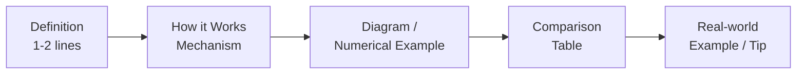
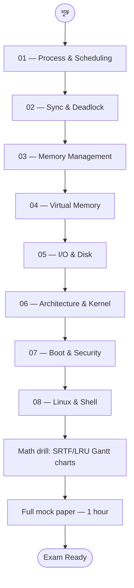
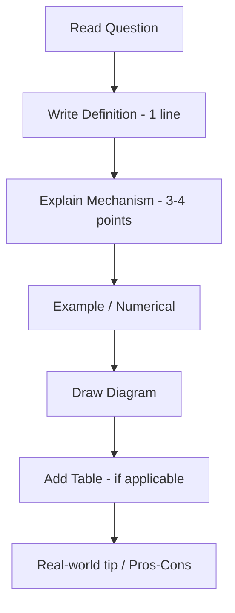

# Operating System for Bangladesh Bank IT/AME Exam — Master Index 🖥️

> Bangladesh Bank Officer (IT) এবং Assistant Maintenance Engineer (AME) post-এর written exam-এর জন্য complete OS study material।
> Gemini-র সাথে real Q&A session থেকে নেওয়া — মোট **৩৩টা written question + numerical examples + Gantt charts**, যেগুলো প্রতি বছর প্রায় same pattern-এ আসছে।

---

## 🎯 এই Course কেন?

বাংলাদেশ ব্যাংক, NBFI, এবং অন্যান্য commercial bank-এর **IT Officer** ও **AME** post-এর exam-এ Operating System একটা mandatory section। প্রতিটা paper-এ ৩০-৪০% question OS থেকে আসে — process scheduling, memory management, deadlock, Linux command, paging math।

এই course-এর target audience হলো:

- **"Weak student"** যারা OS textbook-এ struggle করেছেন
- যাদের আগে theoretical pad-up হয়নি, exam-এর কাছাকাছি সময়ে quick prep দরকার
- যারা Bangla-তে concept বুঝে English-এ answer লিখতে চান

প্রতিটা topic আগে Bangla-তে intuitive intro, তারপর Gemini-র verbatim English answer (exam-এ যেমনভাবে লিখবেন), শেষে comparison table + diagram।

---

## 📋 Exam Pattern at a Glance

| বিষয় | Details |
|------|---------|
| **Exam name** | BB Officer (IT) / Assistant Director (IT) / AME (IT) |
| **OS weight** | প্রায় 30-40% of technical paper |
| **Question style** | Definition + Diagram + Numerical (Gantt chart, Page table) |
| **Mark range per Q** | 2 / 5 / 10 marks |
| **Recommended answer length** | 5 mark = ১ পৃষ্ঠা with diagram + table |
| **Language** | English (technical), Bangla allowed for explanation |

### 5-mark answer-এর golden structure

প্রতিটা OS question-এ অন্তত একটা diagram বা table থাকা উচিত — visual element examiner-এর marking-এ সাহায্য করে।

---

## 📚 Chapter Map

৩৩টা Q&A topic অনুযায়ী ৮টা chapter-এ ভাগ করা হয়েছে।

| # | Chapter | Topics covered | Q count |
|---|---------|----------------|---------|
| 01 | [Process Management & CPU Scheduling](01-process-scheduling.md) | Process states, PCB, Context Switch, FCFS, SJF, Round Robin, SRTF (Gantt chart math), Multiprogramming/Multitasking/Multiprocessing | 3 |
| 02 | [Synchronization & Deadlock](02-sync-deadlock.md) | 4 deadlock conditions, RAG diagram, Critical Section, Mutual Exclusion, Semaphore (Binary/Counting), P/V operations | 3 |
| 03 | [Memory Management](03-memory-management.md) | Paging, Page Table, Internal/External Fragmentation, Segmentation vs Paging, Logical vs Physical Address, MMU | 4 |
| 04 | [Virtual Memory & Page Replacement](04-virtual-memory.md) | Virtual Memory, Demand Paging, Thrashing (cycle), FIFO + LRU (with numerical), Belady's Anomaly | 3 |
| 05 | [I/O Systems, Disk & Storage](05-io-disk-storage.md) | Disk Scheduling (FCFS/SSTF), I/O methods (Programmed/Interrupt/DMA), RAID 0/1/5/10, Spooling vs Buffering, Interrupts | 5 |
| 06 | [OS Architecture, Kernel & System Calls](06-architecture-kernel.md) | OS Functions (6 categories), System Calls + types, Monolithic vs Microkernel, Cache Memory + Locality, FAT vs i-node | 5 |
| 07 | [Boot Process, System Modes & Security](07-boot-modes-security.md) | Booting (BIOS/POST/MBR/Bootloader), 32 vs 64 bit, Dual Boot vs VM, Plug & Play, Sleep/Hibernate/Shutdown, OS Security | 6 |
| 08 | [Linux File System, Commands & Shell](08-linux-shell.md) | Linux hierarchy (/bin /etc /home), basic commands (ls cd cp mkdir grep), file permissions (rwx/octal 755), Shell (Bash/Zsh) | 4 |

মোট প্রশ্ন: **33** (৭ + ২৬, dual round Q&A)

---

## 🛣️ Recommended Study Path

প্রথম ৪টা chapter heavy theoretical + numerical। Chapter 5-6 architectural। Chapter 7-8 মুখস্থ-নির্ভর — exam-এর কাছাকাছি সময়ে revise করুন।

---

## 🧮 Numerical Practice Topics

OS-এর সবচেয়ে important "trap" — math-based questions। এই topics-এ অন্তত ৩-৪ বার hand-practice করুন:

| Numerical | Where | Formula / Trick |
|-----------|-------|-----------------|
| **FCFS Gantt + AWT** | Ch 01 | Wait Time = Start Time − Arrival Time |
| **Round Robin** | Ch 01 | Quantum-এ rotate; queue maintain |
| **SRTF (preemptive SJF)** | Ch 01 | প্রতিটা arrival-এ remaining-time compare |
| **TAT / WT formula** | Ch 01 | TAT = Exit − Arrival; WT = TAT − Burst |
| **FIFO Page Replacement** | Ch 04 | Oldest page evict |
| **LRU Page Replacement** | Ch 04 | Least recently used evict |
| **Belady's Anomaly** | Ch 04 | FIFO-তে frame বাড়ালে fault বাড়ে |
| **Page Table Entries** | Ch 03 | 2^(addr_bits − offset_bits) |
| **Internal Fragmentation** | Ch 03 | Block size − Process size |

---

## 🔑 Key Formulas Quick Sheet

### Process Scheduling

$$\text{Turnaround Time (TAT)} = \text{Exit Time} - \text{Arrival Time}$$

$$\text{Waiting Time (WT)} = \text{TAT} - \text{Burst Time}$$

$$\text{Average WT} = \frac{\sum \text{WT}}{n}$$

### Memory / Paging

$$\text{Offset bits} = \log_2(\text{page size})$$

$$\text{Page Table Entries} = \frac{\text{Logical Address Space}}{\text{Page Size}} = 2^{(\text{addr bits} - \text{offset bits})}$$

$$\text{Internal Fragmentation} = \text{Block Size} - \text{Process Size}$$

### Linux Permissions

$$\text{Octal} = 4 \cdot r + 2 \cdot w + 1 \cdot x$$

| Octal | rwx |
|-------|-----|
| 7 | rwx |
| 6 | rw- |
| 5 | r-x |
| 4 | r-- |

---

## 🧠 Preparation Strategy

### 1. Diagram practice জরুরি

প্রতিটা OS question-এ একটা diagram থাকলে মার্ক বাড়ে:

- **Process State Diagram** — 5 states + transitions
- **Resource Allocation Graph (RAG)** — deadlock-এর জন্য
- **Paging Mechanism** — logical addr → page table → physical addr
- **Boot sequence** — BIOS → POST → Bootloader → Kernel
- **Memory Hierarchy** — Register → Cache → RAM → SSD → HDD

### 2. Comparison table-এর punchline মুখস্থ রাখুন

প্রতিটা chapter-এ comparison-জোড়া আছে — এদের এক-লাইন difference মুখস্থ:

| Pair | Punchline |
|------|-----------|
| Preemptive vs Non-preemptive | "OS জোর করে নিতে পারে কি না" |
| Internal vs External fragmentation | "Block-এর ভেতরে wastage" vs "Block-এর মাঝে holes" |
| Paging vs Segmentation | "Fixed size hardware-driven" vs "Variable size programmer-driven" |
| FIFO vs LRU | "Oldest out" vs "Least recently used out" |
| Monolithic vs Microkernel | "All in kernel" vs "Drivers in user space" |
| FAT vs i-node | "Linked-list table (Windows)" vs "Index node (Linux)" |
| Spooling vs Buffering | "Disk intermediate (printer)" vs "RAM temp (speed-match)" |
| Sleep vs Hibernate | "RAM powered" vs "RAM saved to disk" |

### 3. "5-mark structure" follow করুন

### 4. Linux command মুখস্থ list

| Task | Command |
|------|---------|
| Listing files | `ls`, `ls -l`, `ls -a` |
| Navigation | `cd`, `pwd`, `cd ..` |
| Manipulation | `cp`, `mv`, `rm`, `mkdir` |
| Permissions | `chmod`, `chown`, `chgrp` |
| Search | `grep`, `find` |
| Process | `ps`, `top`, `kill`, `renice` |
| File view | `cat`, `less`, `head`, `tail` |
| System info | `df`, `du`, `free`, `uname` |

---

## ⚠️ Top Mistakes to Avoid

1. **শুধু definition লেখা** — মার্ক কম। Mechanism + diagram + example চাই।
2. **Gantt chart-এ time mismatch** — Total Burst Time ≠ End Time হলে addition error। Verify before submit।
3. **"Preemption" বনাম "No Preemption" gulf** — Q3 deadlock-এর শর্ত হলো *No Preemption*, শুধু "Preemption" না।
4. **Belady's anomaly direction ভুল** — frame *বাড়ালে* fault *বাড়ে* (FIFO-তে), কমে না।
5. **Internal vs External fragmentation মেলানো** — উল্টোটা মুখস্থ করলে disastrous।
6. **Linux case-sensitivity ভোলা** — `File.txt` ≠ `file.txt`। Windows-এ একই, Linux-এ আলাদা।
7. **Octal permission ভুল** — `chmod 6` মানে rw- (read+write, no execute)। 7 না, 6।
8. **"Spooling" বনাম "Buffering" gulf** — Spooling disk-এ, Buffering RAM-এ। Speed-match-এর জন্য buffering, async হওয়ার জন্য spooling।

---

## 📖 কীভাবে এই material ব্যবহার করবেন

1. **Round 1:** প্রথমে ৮টা chapter পরপর পড়ুন (sequence-এ)। প্রতিটা chapter-এ ৪০-৬০ মিনিট দিন।
2. **Round 2:** প্রতিটা Q-এর Bangla intro পড়ার পর English answer-টা **নিজে hand-write** করার চেষ্টা করুন। এতে exam-এ লেখার speed গড়ে উঠবে।
3. **Round 3 (Math drill):** Ch 01 + Ch 04-এর সব numerical (FCFS, SRTF, FIFO, LRU) আবার hand-practice।
4. **Round 4 (Mock):** ৬টা question random pick করে ১ ঘণ্টায় full answer লিখুন। শেষে নিজে evaluate।

---

## 🔗 External References

- **Operating System Concepts** by Silberschatz, Galvin, Gagne — bible-তম textbook
- **Modern Operating Systems** by Tanenbaum — concise, exam-friendly
- **GeeksforGeeks OS section** — extra numerical practice
- This site-এর companion course: [Operating System MCQ Practice](/sections/operating-system-mcq) — ৭০টা MCQ-এর সাথে এটা pair করুন

---

**শেষ কথা:** OS-এ "weak student" বলে কিছু নেই — শুধু explanation যেটা click করেনি সেটা না-হওয়া। এই ৩৩টা question পুরোপুরি cover করলে written paper-এ confident answer লেখা সম্ভব। প্রতিটা concept-এ Bangla intuition + English keyword + diagram = ✅ pass।

> ✨ **Best of luck for your BB IT / AME exam!** ✨
