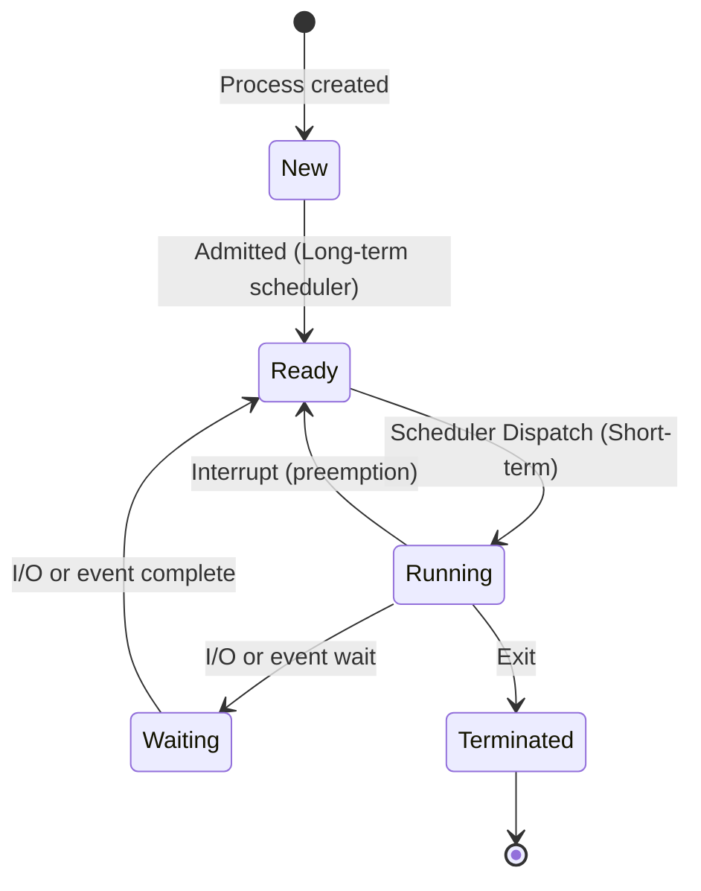
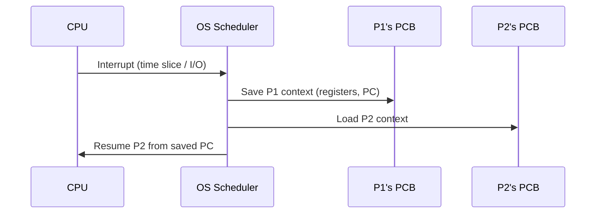
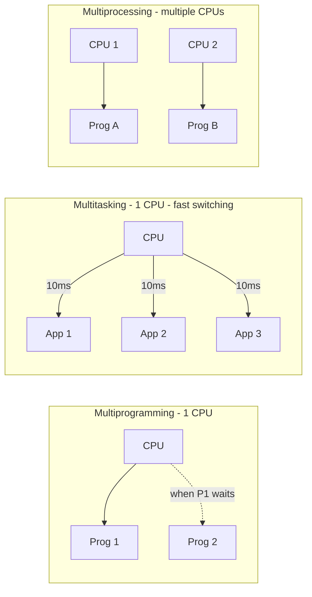

# Chapter 01 — Process Management & CPU Scheduling 🔄

> Process states, PCB, Context Switch, এবং সব scheduling algorithm-এর Gantt chart math। এই chapter-এর numerical example exam-এ সরাসরি আসে — তাই hand-practice করুন।

---

## 📚 What you will learn

এই chapter-এর শেষে আপনি পারবেন:

1. **Process এবং Program-এর difference** স্পষ্ট করে বলতে
2. **5-state process model** আঁকতে এবং প্রতিটা state কী বোঝায় explain করতে
3. **PCB (Process Control Block)**-এ কী থাকে enumerate করতে
4. **Context Switching** কেন overhead সেটা argue করতে
5. **Preemptive vs Non-preemptive scheduling**-এর মধ্যে compare করতে — example-সহ
6. **FCFS / Round Robin / SRTF Gantt chart** আঁকতে এবং AWT, ATT calculate করতে
7. **Multiprogramming, Multitasking, Multiprocessing**-এর difference বলতে

---

## 🎯 Question 1 — Process States + PCB + Context Switch

### কেন এটা important?

প্রায় প্রতিটা BB IT / AME exam-এ এটা আসে। সাধারণত 5-10 marks। Diagram + PCB-এর fields + transition explanation চাই।

> **Q1: Define a Process and explain the different states of a Process with a diagram.**

### 1. Process Definition

A **process** is essentially a *program in execution*. While a program is a "passive" entity (like a file stored on a disk), a process is an "active" entity that includes the current activity, represented by:

- The value of the **Program Counter** (PC)
- The contents of the **processor's registers**
- The **stack** (function calls, local variables)
- The **heap** (dynamically allocated memory)
- The **data section** (global variables)

| | Program | Process |
|--|---------|---------|
| Storage | Disk | RAM |
| State | Static (passive) | Dynamic (active) |
| Resource | None | CPU, RAM, files, devices |
| Lifetime | Permanent | Temporary |

### 2. The Five States of a Process



**Detailed description of each state:**

- **New:** Initial phase. OS picks up the program from secondary storage (HDD/SSD). The **Long-Term Scheduler (Job Scheduler)** decides which processes are brought into the Ready queue based on available memory.

- **Ready:** Process is loaded into main memory (RAM) and placed in a Ready Queue. It waits here until the **Short-Term Scheduler (CPU Scheduler)** selects it.

- **Running:** CPU is currently processing instructions. In a single-processor system, only one process can be in this state at a time.

- **Waiting (Blocked):** Process needs an I/O operation (file read, user input). Since I/O is slower than CPU, the process is moved out to avoid wasting CPU.

- **Terminated:** Process finishes its last instruction or is killed. OS deallocates memory and removes the entry from the process table.

### 3. State Transitions Summary

| Trigger | From | To |
|---------|------|-----|
| Admitted (memory available) | New | Ready |
| Scheduler dispatch | Ready | Running |
| Time slice expired / preempt | Running | Ready |
| I/O request | Running | Waiting |
| I/O complete | Waiting | Ready |
| `exit()` call | Running | Terminated |

### 4. Process Control Block (PCB)

Each process is represented in the OS by a **PCB** (also called a **Task Control Block**). It contains:

| Field | Description |
|-------|-------------|
| **Process State** | New, Ready, Running, Waiting, Terminated |
| **Program Counter** | Address of next instruction to execute |
| **CPU Registers** | Accumulators, index registers, stack pointers |
| **CPU Scheduling Info** | Priority, scheduling queue pointers |
| **Memory Management Info** | Page tables, segment tables, base/limit registers |
| **I/O Status** | List of open files, allocated I/O devices |
| **Accounting Info** | CPU usage, real time used, account number |

> **Exam tip:** Always mention PCB even if the question only asks about states — it shows depth of understanding (extra marks)।

### 5. Context Switching — The "How"

When the OS moves a process from Running → Ready (interrupt) or Running → Waiting (I/O), it performs a **Context Switch**:



> **Critical point for exam:** Context switching is **pure overhead** — the system does **no useful work** while switching. Frequent switches reduce throughput.

### Written Exam Tip

5-mark answer-এর recommended structure:

1. Definition (Process vs Program) — 1 line
2. Five states — list + 1-line each
3. State diagram (mermaid above)
4. PCB fields — table
5. Context switching — 2 lines + "overhead" emphasis

---

## 🎯 Question 2 — CPU Scheduling: Preemptive vs Non-Preemptive (with Gantt Chart Math)

### কেন এটা important?

এটা সবচেয়ে heavy numerical question। FCFS / Round Robin / SRTF-এর Gantt chart আঁকা + AWT calculate করা মাস্ট। 10 marks পর্যন্ত আসে।

> **Q2: What is CPU Scheduling? Compare Preemptive and Non-Preemptive Scheduling with examples.**

### 1. CPU Scheduling Definition

CPU Scheduling is the process by which the OS decides which process in the **Ready Queue** will be allocated the CPU for execution. The main goal:

- **Maximize:** CPU utilization, throughput
- **Minimize:** waiting time, turnaround time, response time

### 2. Non-Preemptive Scheduling

In this scheme, **once the CPU is allocated, the process keeps it** until it either:
- Terminates, or
- Switches to Waiting state (for I/O)

The OS **cannot forcibly take the CPU away**.

| | Pros | Cons |
|--|------|------|
| | Low overhead (no context switching mid-execution) | "Convoy Effect" — short jobs wait behind long ones |
| | Simple to implement | Lower CPU utilization |

**Example algorithms:**
- **First-Come, First-Served (FCFS)** — execute in arrival order
- **Shortest Job First (SJF)** — pick smallest burst time

### 3. Preemptive Scheduling

The OS **can interrupt a running process** and give the CPU to another (usually higher priority).

| | Pros | Cons |
|--|------|------|
| | Better responsiveness | High overhead due to context switching |
| | Essential for real-time / time-sharing | Risk of starvation (low-priority) |

**Example algorithms:**
- **Round Robin (RR)** — fixed time quantum per process
- **Shortest Remaining Time First (SRTF)** — preemptive SJF
- **Preemptive Priority** — highest priority gets CPU

### 4. Comparison Table for Written Exams

| Feature | Non-Preemptive | Preemptive |
|---------|----------------|------------|
| Interruption | Cannot be interrupted | OS can interrupt |
| Efficiency | Lower (CPU may sit idle) | Higher (CPU better utilized) |
| Flexibility | Rigid | Flexible, responsive |
| Risk | Convoy Effect | Starvation (low priority) |
| Environment | Batch systems | Interactive / Time-sharing |

### 5. Numerical Example #1 — FCFS (Non-Preemptive)

3 processes arriving at Time = 0:

| Process | Burst Time |
|---------|-----------|
| P1 | 24 ms |
| P2 | 3 ms |
| P3 | 3 ms |

**Gantt Chart:**

```
| P1 (24ms) | P2 (3ms) | P3 (3ms) |
0          24         27        30
```

**Calculations:**

$$WT_{P1} = 0, \quad WT_{P2} = 24, \quad WT_{P3} = 27$$

$$\text{Average Waiting Time} = \frac{0 + 24 + 27}{3} = \frac{51}{3} = 17 \text{ ms}$$

> **Convoy Effect demonstrated:** P2 ও P3 মাত্র 3 ms-এর কাজ, কিন্তু P1-এর জন্য ২৪+ ms wait। এটাই FCFS-এর সবচেয়ে বড় সমস্যা।

### 6. Numerical Example #2 — Round Robin (Preemptive)

Same 3 processes, **Time Quantum = 4 ms**.

**Gantt Chart logic:**
- P1 runs for 4 ms (20 ms left)
- P2 runs for 3 ms (finished!)
- P3 runs for 3 ms (finished!)
- P1 returns and finishes remaining 20 ms

```
| P1 | P2 | P3 |        P1 (20ms)        |
0    4    7   10                       30
```

**Why this is better:** No one waits too long to start. Mouse click would feel responsive — RR is perfect for **time-sharing**.

### 7. Numerical Example #3 — SRTF (Hybrid Preemptive)

This is the **most-asked Gantt chart problem** in BB IT exams.

> Calculate AWT and ATT using SRTF for:

| Process | Arrival Time | Burst Time |
|---------|-------------|-----------|
| P1 | 0 | 8 |
| P2 | 1 | 4 |
| P3 | 2 | 9 |
| P4 | 3 | 5 |

**Step-by-step logic:**

| Time | Event | Decision |
|------|-------|----------|
| 0 | Only P1 here | P1 runs |
| 1 | P2 arrives (need 4); P1 has 7 left | P2 shorter → preempt P1, run P2 |
| 2 | P3 arrives (need 9); P2 has 3 left | P2 shortest → continue |
| 3 | P4 arrives (need 5); P2 has 2 left | P2 shortest → continue |
| 5 | P2 finishes; remaining: P1=7, P3=9, P4=5 | P4 shortest → run P4 |
| 10 | P4 finishes; remaining: P1=7, P3=9 | P1 shorter → run P1 |
| 17 | P1 finishes | Run P3 |
| 26 | P3 finishes | Done |

**Gantt Chart:**

```
| P1 |   P2   |   P4   |     P1     |     P3     |
0    1        5        10           17           26
```

**Calculation Table:**

| Process | Arrival | Burst | Finish | TAT (Finish − Arrival) | WT (TAT − Burst) |
|---------|---------|-------|--------|------------------------|------------------|
| P1 | 0 | 8 | 17 | 17 − 0 = 17 | 17 − 8 = 9 |
| P2 | 1 | 4 | 5 | 5 − 1 = 4 | 4 − 4 = 0 |
| P3 | 2 | 9 | 26 | 26 − 2 = 24 | 24 − 9 = 15 |
| P4 | 3 | 5 | 10 | 10 − 3 = 7 | 7 − 5 = 2 |

**Final Answers:**

$$\text{ATT} = \frac{17 + 4 + 24 + 7}{4} = \frac{52}{4} = 13 \text{ ms}$$

$$\text{AWT} = \frac{9 + 0 + 15 + 2}{4} = \frac{26}{4} = 6.5 \text{ ms}$$

> **Verification trick:** Total Burst Time = 8 + 4 + 9 + 5 = **26**, must equal end of Gantt chart (**26**)। যদি না মিলে, addition error আছে।

### 8. Important Formulas (মুখস্থ চাই)

$$\text{Turnaround Time (TAT)} = \text{Exit Time} - \text{Arrival Time}$$

$$\text{Waiting Time (WT)} = \text{TAT} - \text{Burst Time}$$

$$\text{Response Time} = \text{First CPU} - \text{Arrival Time}$$

### Memory hooks (Bangla)

- **Non-Preemptive (FCFS, SJF):** Bank-এর polite queue। Counter-এ গেলে শেষ না হওয়া পর্যন্ত যাচ্ছেন না।
- **Preemptive (Round Robin, SRTF):** Busy doctor। Patient-দের ৫ মিনিট করে দেখেন, emergency এলে current patient-কে রেখে চলে যান।

---

## 🎯 Question 3 — Multiprogramming vs Multitasking vs Multiprocessing

### কেন এটা important?

Three "M" terms — students সবচেয়ে বেশি confuse করে। 5-mark "compare" question।

> **Q3: Explain the difference between Multiprogramming, Multitasking, and Multiprocessing.**

| Term | Concept | Main Goal | Hardware |
|------|---------|-----------|----------|
| **Multiprogramming** | Multiple programs **kept in main memory** at the same time. While one waits for I/O, CPU executes another. | Maximize **CPU utilization** | Single CPU |
| **Multitasking** | Logical extension of multiprogramming where the CPU **switches between jobs so frequently** that users can interact with each program. | Minimize **response time** | Single CPU (time-sharing) |
| **Multiprocessing** | A system that has **two or more CPUs** in close communication, sharing the same memory and bus. | Increase **throughput (speed)** | Multiple CPUs |

### Visual difference



### Memory hook

- **Multiprogramming** = "एক CPU, multiple program in memory, switch on I/O wait"
- **Multitasking** = "एक CPU, super-fast switching, user feels parallel"
- **Multiprocessing** = "Multiple CPUs, true parallel execution"

---

## 📋 Quick Recap Table

| Concept | Key fact |
|---------|----------|
| Process | Program in execution (active entity) |
| PCB | OS-এর process record (state, PC, registers, I/O) |
| 5 states | New, Ready, Running, Waiting, Terminated |
| Context switch | PCB save + load — pure overhead |
| Convoy Effect | FCFS-এ short jobs wait behind long ones |
| FCFS AWT (24,3,3) | (0+24+27)/3 = 17 ms |
| Round Robin | Fixed quantum, fair, time-sharing |
| SRTF | Preemptive SJF — every arrival compares remaining time |
| TAT formula | Exit − Arrival |
| WT formula | TAT − Burst |
| Multiprogramming | I/O wait-এ অন্য program-এ switch |
| Multitasking | Fast switching → user-perceived parallel |
| Multiprocessing | Multiple CPU, true parallel |

---

## 🔁 Next Chapter

পরের chapter-এ **Synchronization & Deadlock** — Critical Section, Mutual Exclusion, Semaphore (Binary/Counting), 4 deadlock conditions, RAG diagram।

→ [Chapter 02: Synchronization & Deadlock](02-sync-deadlock.md)
