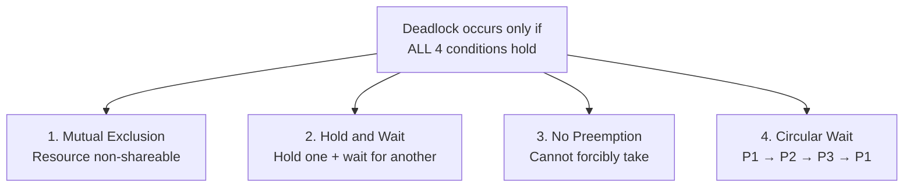
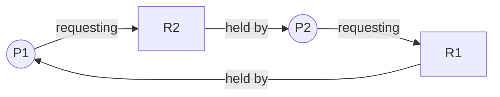

# Chapter 02 — Synchronization & Deadlock 🔒

> Deadlock-এর ৪ শর্ত (Coffman conditions), Resource Allocation Graph, Critical Section, Mutual Exclusion, Semaphore (Binary vs Counting) — sync-deadlock-এর ৩টা flagship written question।

---

## 📚 What you will learn

1. **Deadlock-এর definition** + 4 necessary conditions বলতে পারা
2. **Resource Allocation Graph (RAG)** আঁকতে এবং cycle-detect করতে পারা
3. **Critical Section ও Mutual Exclusion** explain করতে পারা
4. **Semaphore** কী এবং Binary বনাম Counting-এর difference
5. **Deadlock handling strategies** (Prevention, Avoidance, Detection, Ostrich)

---

## 🎯 Question 1 — Deadlock + 4 Conditions + RAG Diagram

### কেন এটা important?

প্রায় প্রতি বছর। 5-10 marks। Definition + 4 conditions + diagram + handling strategies — সবগুলো একসাথে আনলে full marks।

> **Q1: What is a Deadlock? Explain the four necessary conditions for a Deadlock to occur.**

### 1. Definition

A **Deadlock** is a situation where a set of processes are blocked because each process is holding a resource and waiting for another resource held by some other process in the set. None of the processes can move forward, and the system hangs.

> **Simple analogy:** A four-way traffic jam where every car is waiting for the one in front to move, but nobody can move because the intersection is blocked in a circle।

### 2. The Four Necessary Conditions (Coffman Conditions)

For a deadlock to occur, **all four conditions must hold simultaneously**. Breaking any one prevents deadlock।



**A. Mutual Exclusion**
At least one resource must be held in a **non-shareable mode**. Only one process can use it at a time (e.g., a Printer)। Others must wait।

**B. Hold and Wait**
A process holds at least one resource and is waiting to acquire additional resources currently held by other processes।

**C. No Preemption**
Resources cannot be **forcibly taken** from a process। Released only voluntarily after task completion।

**D. Circular Wait**
A set of processes {P₀, P₁, ..., Pₙ} exists such that P₀ waits for a resource held by P₁, P₁ waits for P₂, ..., Pₙ waits for P₀ — forming a closed loop।

### 3. Resource Allocation Graph (RAG) — Visual

In a formal exam, you should draw a **Resource Allocation Graph**:

- **Circles** represent **Processes**
- **Rectangles** represent **Resources**
- **Arrow from Resource → Process** = Process holds the resource (Assignment edge)
- **Arrow from Process → Resource** = Process is requesting (Request edge)



**Cycle:** P1 → R2 → P2 → R1 → P1 → **Deadlock confirmed**.

> **Rule:**
> - **No cycle in graph** → definitely **no deadlock**
> - **Cycle + single instance per resource** → **deadlock**
> - **Cycle + multiple instances** → may or may not be deadlock (need further check)

### 4. Classic Example — Two Processes, Two Resources

Imagine you are editing a photo and printing it.

- **Process 1 (P1):** Needs both Scanner and Printer
- **Process 2 (P2):** Needs both Scanner and Printer

**Sequence to deadlock:**

| Step | Action |
|------|--------|
| 1 | P1 requests Scanner → gets it (Scanner locked by P1) |
| 2 | P2 requests Printer → gets it (Printer locked by P2) |
| 3 | P1 requests Printer → waits (held by P2) |
| 4 | P2 requests Scanner → waits (held by P1) |
| 5 | **Both wait forever — DEADLOCK** |

### 5. Real-World Bridge Example

Two cars meeting on a narrow bridge from opposite directions:

- **Resource:** Bridge space
- **Process:** The cars
- **Conflict:** Neither car can move forward without the other backing up। Unless one "preempts" (backs up), they stay there forever।

### 6. Deadlock Handling Strategies (Bonus marks!)

| Strategy | Approach | Tradeoff |
|----------|----------|----------|
| **Prevention** | Design system so one of the 4 conditions can never hold | Conservative, low resource utilization |
| **Avoidance** | Use **Banker's Algorithm** to check "Safe State" before granting resources | Computation overhead |
| **Detection + Recovery** | Let it happen, detect via RAG cycle search, kill a process to recover | System inconsistency risk |
| **Ostrich Algorithm** | Pretend the problem doesn't exist (used by Windows/Linux) | Reboot if hangs |

> **For exam answer:** Always mention all 4 strategies briefly — examiner sees breadth of knowledge.

### 7. How to Break a Deadlock

If question asks "how to solve":

1. **Process Termination** — Kill one of the processes (P1 or P2)। Releases resources for others।
2. **Resource Preemption** — Forcibly take resource from one process। Process must roll back its work।

> **Trap:** Killing process can cause data corruption (transaction half-done)। In banking systems, very dangerous।

---

## 🎯 Question 2 — Critical Section + Mutual Exclusion + Semaphore (intro)

### কেন এটা important?

5 marks "synchronization basics" question। Definition + Rule + Solution structure।

> **Q2: What is a "Critical Section" and "Mutual Exclusion" in Process Synchronization?**

### 1. Critical Section (CS)

A **Critical Section** is a segment of code where a process accesses **shared resources** (a shared variable, a printer, a database row)।

```c
// Example: shared counter
int counter = 0;

void increment() {
    // ===== Critical Section starts =====
    int temp = counter;
    temp = temp + 1;
    counter = temp;
    // ===== Critical Section ends =====
}
```

If two threads run `increment()` simultaneously, **race condition** can give wrong result (counter = 1 instead of 2)।

**The Rule:** To prevent errors, **only one process should be in its Critical Section at a time**.

### 2. Mutual Exclusion

The requirement that **if Process A is executing its critical section, no other process (Process B) can be allowed to execute its critical section**.

This is the most fundamental synchronization requirement।

### 3. Three Requirements for Critical Section Solution

| Requirement | What it ensures |
|-------------|-----------------|
| **Mutual Exclusion** | Only one process inside CS at a time |
| **Progress** | If no one in CS, an interested process must be allowed in |
| **Bounded Waiting** | A process should not wait indefinitely; bound on wait time |

### 4. Solution: Semaphore (introduction)

A **Semaphore** is an integer variable used to solve the critical section problem। It supports two atomic operations:

- **Wait (P) operation** — decrements the value। If value < 0, the process blocks।
- **Signal (V) operation** — increments the value। Wakes up a waiting process।

```c
semaphore mutex = 1;  // initially "lock open"

producer() {
    wait(mutex);     // P — try to enter, block if busy
    // ----- Critical Section -----
    signal(mutex);   // V — release lock
}
```

> **Memory hook:** Dijkstra introduced semaphore in Dutch:
> - **P** = *Probeer* (to test/decrement)
> - **V** = *Verhoog* (to increment)

### 5. Bonus: FAT32 vs NTFS (Practical exam tip)

If they ask about File Systems alongside, mention:

| | FAT32 | NTFS |
|--|-------|------|
| Era | Older | Modern (Windows) |
| Max file size | 4 GB | Petabytes |
| Security/encryption | নেই | আছে |
| Journaling | নেই | আছে |

---

## 🎯 Question 3 — Semaphore: Binary vs Counting

### কেন এটা important?

3-5 marks "comparison" question। Almost guaranteed in BB IT exam।

> **Q3: What is a Semaphore? Explain the difference between Binary and Counting Semaphores.**

### 1. Definition

A **Semaphore** is a synchronization tool (an integer variable) used to solve the Critical Section problem। It helps multiple processes coordinate so they don't access shared data simultaneously।

### 2. Binary Semaphore

- Value can only be **0 or 1**
- Acts like a **lock**: 1 = available, 0 = busy
- Often used for **Mutual Exclusion (MUTEX)**

```c
semaphore lock = 1;       // 1 = unlocked

process_A() {
    wait(lock);           // lock becomes 0
    // critical section
    signal(lock);         // lock becomes 1
}
```

### 3. Counting Semaphore

- Value can range over an **unrestricted domain** (any non-negative integer)
- Used to manage a resource with **multiple instances**

```c
semaphore printers = 5;   // 5 printers available

print_job() {
    wait(printers);       // grab one (becomes 4)
    // print task
    signal(printers);     // release (back to 5)
}
```

### 4. Comparison Table

| Feature | Binary Semaphore | Counting Semaphore |
|---------|------------------|--------------------|
| Value range | 0 or 1 | Any non-negative integer |
| Use case | Mutual exclusion (one resource) | Multiple instances of resource |
| Same as | Mutex (informally) | Resource counter |
| Initial value | 1 | N (count of resources) |
| Example | Lock for shared variable | 5 printers, 10 DB connections |

### 5. P / V (Wait / Signal) Operation Details

```
P(S):                       V(S):
    S = S - 1                   S = S + 1
    if S < 0:                   if S <= 0:
        block process               wake up one blocked
        add to queue                process from queue
```

> **Why both must be atomic:** If two processes simultaneously execute P, both might see S=1, both decrement to 0, both enter critical section → race condition। Hardware support (test-and-set, compare-and-swap) ensures atomicity।

### Producer-Consumer Example

Classic textbook problem solved with semaphores:

```c
semaphore empty = N;    // empty buffer slots
semaphore full  = 0;    // filled slots
semaphore mutex = 1;    // mutual exclusion

producer() {
    while (true) {
        produce_item(item);
        wait(empty);    // wait for empty slot
        wait(mutex);    // lock buffer
        add_to_buffer(item);
        signal(mutex);  // release buffer
        signal(full);   // signal consumer
    }
}

consumer() {
    while (true) {
        wait(full);     // wait for filled slot
        wait(mutex);    // lock buffer
        item = remove_from_buffer();
        signal(mutex);  // release
        signal(empty);  // signal producer
        consume(item);
    }
}
```

---

## 📋 Quick Recap Table

| Concept | Key fact |
|---------|----------|
| Deadlock definition | Set of processes blocked, each holds + waits |
| 4 Conditions | Mutual Exclusion, Hold-Wait, **No** Preemption, Circular Wait |
| RAG cycle (single instance) | Deadlock confirmed |
| Ostrich Algorithm | Ignore — Windows / Linux approach |
| Banker's Algorithm | Avoidance via Safe State check |
| Critical Section | Code accessing shared resource |
| Mutual Exclusion | One process at a time in CS |
| Semaphore | Integer variable with atomic P/V |
| Binary Semaphore | 0/1, used for mutex |
| Counting Semaphore | Any non-negative, manages N resources |
| P (Wait) | Decrement, block if negative |
| V (Signal) | Increment, wake one waiter |

---

## 🔁 Next Chapter

পরের chapter-এ **Memory Management** — Paging, Page Table, Fragmentation (Internal/External), Segmentation, Logical vs Physical Address।

→ [Chapter 03: Memory Management](03-memory-management.md)
