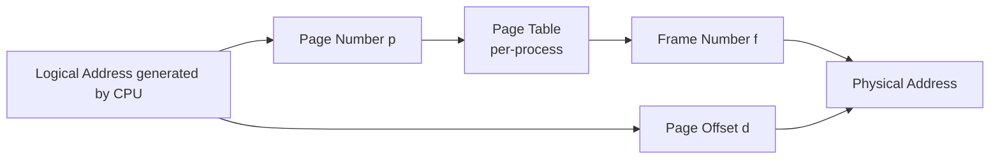
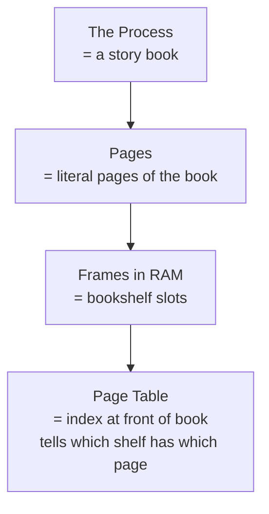
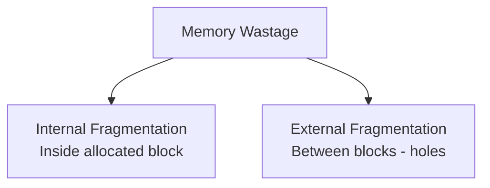
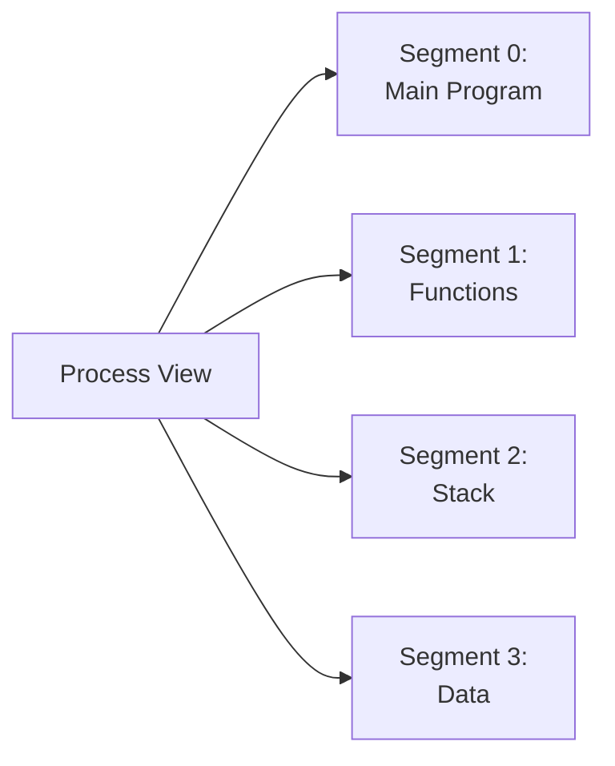
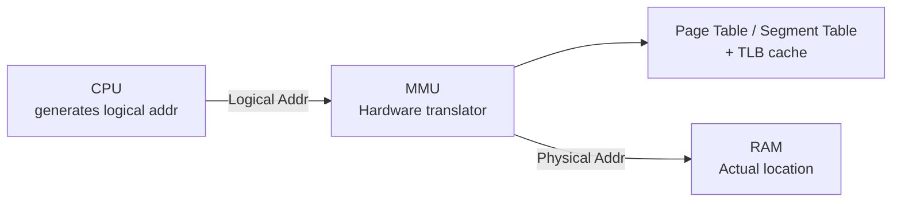

# Chapter 03 — Memory Management 💾

> Paging, Page Table, Internal vs External Fragmentation, Segmentation, Logical vs Physical Address, MMU। Memory chapter-এ ৪টা flagship written question।

---

## 📚 What you will learn

1. **Paging mechanism** explain করা — page, frame, page table
2. **Internal vs External fragmentation**-এর difference + কোন strategy কোনটা solve করে
3. **Segmentation** কী এবং Paging-এর সাথে কীভাবে আলাদা
4. **Logical address vs Physical address** + MMU-এর role

---

## 🎯 Question 1 — Paging

### কেন এটা important?

Memory management-এর সবচেয়ে heavy question। Paging-এর mechanism, advantages, disadvantages — সবগুলো একসাথে চাই। 5-10 marks।

> **Q1: What is Paging? Explain how the Paging mechanism works with its advantages and disadvantages.**

### 1. What is Paging?

**Paging** is a memory management scheme that **eliminates the need for contiguous allocation** of physical memory। It permits the physical address space of a process to be **non-contiguous**.

| | Logical Memory (Process) | Physical Memory (RAM) |
|--|--------------------------|------------------------|
| Divided into | Fixed-size blocks called **Pages** | Fixed-size blocks called **Frames** |
| The Rule | **Page size = Frame size** | (typically 4 KB) |

### 2. How Paging Works

When a process is to be executed, its pages are loaded into any available memory frames from secondary storage। OS maintains a **Page Table** to track where each page is stored।



**Logical Address structure:**

```
| Page Number (p) | Page Offset (d) |
```

- **Page Number (p):** Used as an index into the page table
- **Page Offset (d):** Combined with the base address to define the physical memory address

**Page Table:** Contains the base address of each page in physical memory (the Frame number)।

**Physical Address = Frame number + Offset**

### 3. Address Translation Example

Suppose:
- Logical address space: 16 KB (14 bits)
- Page size: 4 KB → Offset = 12 bits
- Page number bits = 14 − 12 = 2 bits → 4 pages

Logical address `0x1234`:
- Binary: `01 0010 0011 0100`
- Page number: `01` = 1
- Offset: `001000110100` = 0x234

Page Table:

| Page # | Frame # |
|--------|---------|
| 0 | 5 |
| 1 | **2** |
| 2 | 7 |
| 3 | 9 |

Page 1 → Frame 2। Physical address = (Frame 2 base) + Offset 0x234।

### 4. Advantages of Paging

✅ **No External Fragmentation:** Any page can be placed in any available frame — no need for a single contiguous block।

✅ **Simplified Swapping:** Swap chunks of a process in/out of disk easily — they're all the same size।

✅ **Efficient Memory Use:** Better utilization of available RAM।

### 5. Disadvantages of Paging

❌ **Internal Fragmentation:** If a process needs 10.5 pages, OS gives 11 pages। The last half-page remains empty।

❌ **Memory Overhead:** The Page Table itself requires memory storage।

❌ **Performance Impact:** Accessing the page table adds an extra memory access per reference (usually mitigated by **TLB — Translation Lookaside Buffer**)।

### 6. The Book Analogy (For "Weak" Students)



| Element | Maps to |
|---------|---------|
| Process | The story |
| Pages | Pages of the book |
| Physical Memory (RAM) | Bookshelf |
| Page Table | Index — "page 5 is on shelf 2" |

### Written Exam Tip

5-mark answer structure:
1. Definition (1 line)
2. Page vs Frame, page size = frame size
3. Mechanism (with logical → page table → physical diagram)
4. 3 Advantages, 3 Disadvantages
5. TLB mention for bonus

---

## 🎯 Question 2 — Fragmentation: Internal vs External

### কেন এটা important?

5 marks "compare" question। This is where most "weak" students lose marks — they swap the definitions।

> **Q2: What is Fragmentation? Explain the difference between Internal and External Fragmentation.**

### 1. Definition

**Fragmentation** = wastage of memory due to allocation strategies।



### 2. Comparison Table

| Feature | Internal Fragmentation | External Fragmentation |
|---------|------------------------|------------------------|
| **Occurrence** | When memory is divided into **fixed-size blocks** | When memory is divided into **variable-size blocks** |
| **Definition** | Space wasted **inside** an allocated block | Space wasted **between** allocated blocks |
| **Example** | Give 12 KB block to 10 KB process → **2 KB wasted inside** | 50 KB free, but in 10 small gaps; can't fit 40 KB process |
| **Visible** | Inside block, unused | Between blocks, scattered |
| **Solution** | Use variable-size partitions, smaller pages | **Compaction** or **Paging** |
| **Memory model** | Fixed partitioning, Paging (last page) | Dynamic partitioning, Segmentation |

### 3. Internal Fragmentation — Visual

```
Block size = 12 KB, process = 10 KB
┌──────────────────────────────┐
│ Process (10 KB used)        │░░│
└──────────────────────────────┘
                                ↑
                              Wasted 2 KB
                              (Internal Fragmentation)
```

**Calculation:** Internal Fragmentation = Block Size − Process Size

### 4. External Fragmentation — Visual

```
Free memory total = 50 KB but fragmented:

[ Used ][8KB][ Used ][12KB][ Used ][30KB]
                                       ↑
              No single 40 KB block exists!
              External Fragmentation.
```

### 5. Solutions

| Problem | Solution |
|---------|----------|
| **Internal Fragmentation** | Use smaller fixed block sizes (more overhead but less wastage) |
| **External Fragmentation** | **Compaction** — shuffle memory to put all free space together |
| **External Fragmentation (alternative)** | **Paging** — fixed-size pages avoid the variable-block problem entirely |

> **Memory hook:**
> - Internal = "ভেতরে wastage"
> - External = "বাইরে scattered holes"

---

## 🎯 Question 3 — Segmentation vs Paging

### কেন এটা important?

5 marks comparison question। Architecture-level concept।

> **Q3: What is Segmentation? How does it differ from Paging?**

### 1. Segmentation Definition

**Segmentation** is a memory management scheme that supports the **user's view of memory**। A process is divided into logical units like:

- Main Program
- Function (Subroutine)
- Stack
- Data / Variables
- Heap

Each unit is a **Segment** with **variable size**।



### 2. Segmentation Address Translation

Logical address = `<segment-number, offset>`

**Segment Table** holds:
- **Base** address of segment in physical memory
- **Limit** (size) of segment

Physical address = `Base + Offset` (with limit check)।

### 3. Comparison: Paging vs Segmentation

| Feature | Paging | Segmentation |
|---------|--------|--------------|
| **Block size** | Fixed (e.g., 4 KB) | Variable |
| **Driven by** | OS / Hardware | Programmer / Compiler |
| **Logical view** | Linear (just bytes) | Logical units (functions, stack) |
| **Address** | Page # + Offset | Segment # + Offset |
| **Fragmentation** | **Internal** (last page) | **External** (variable size) |
| **Sharing/protection** | Difficult (mid-page) | Easy (per logical segment) |
| **Speed** | Faster page lookup | Slightly slower (limit check) |

### 4. Memory Hook

| | Paging | Segmentation |
|--|--------|--------------|
| Block | Fixed-size box | Logical-unit box (variable) |
| Who decides | OS hidden from programmer | Programmer-aware |
| Fragment | Internal | External |

> **Real OS:** Modern systems use a **hybrid** — segment + page। Each segment is divided into pages। This combines logical clarity with no external fragmentation।

---

## 🎯 Question 4 — Logical vs Physical Address + MMU

### কেন এটা important?

3-5 marks definition + difference question। MMU-এর mention extra credit।

> **Q4: What is the difference between a Logical Address and a Physical Address?**

### 1. Logical Address (Virtual Address)

- **Generated by the CPU** while a program is running
- The user/programmer **only sees** logical addresses
- The set of all logical addresses = **Logical Address Space**

```c
int x;
int *p = &x;     // &x is a logical address
printf("%p", p); // shows logical, not physical
```

### 2. Physical Address

- The **actual location in RAM**
- The user **never sees** physical addresses directly
- The set of all physical addresses = **Physical Address Space**

### 3. The Bridge: MMU (Memory Management Unit)

The **MMU** is a **hardware device** that converts logical addresses to physical addresses **at runtime**।



### 4. Comparison Table

| Feature | Logical Address | Physical Address |
|---------|-----------------|------------------|
| Generated by | CPU during execution | After MMU translation |
| Visible to | User / Programmer | OS / Hardware only |
| Where | Software level | Hardware (RAM) |
| Translation | Done by **MMU** | Final destination |
| Also called | Virtual address | Real / RAM address |

### 5. Why this Separation?

✅ **Process isolation** — Process A's logical address `0x1000` and Process B's logical `0x1000` map to **different physical addresses** → no cross-contamination

✅ **Memory protection** — MMU enforces read/write permissions at frame level

✅ **Virtual memory** — Logical address space can be **larger** than physical RAM (page on disk)

✅ **Easier programming** — Programmer doesn't worry about physical RAM layout

> **Exam tip:** Always mention MMU and add a tiny diagram with CPU → MMU → RAM flow।

---

## 📋 Quick Recap Table

| Concept | Key fact |
|---------|----------|
| Paging | Fixed-size pages, non-contiguous physical |
| Page = Frame size | Mandatory |
| Page Table | Maps logical page → physical frame |
| TLB | Cache for page table (in MMU) |
| Internal Fragmentation | Wastage inside fixed block |
| External Fragmentation | Wastage between variable blocks |
| Compaction | Solves external fragmentation |
| Segmentation | Variable-size logical units |
| Paging fragmentation | Internal (last page) |
| Segmentation fragmentation | External |
| MMU | Hardware: logical → physical |
| Logical address | CPU sees |
| Physical address | RAM real location |

---

## 🔁 Next Chapter

পরের chapter-এ **Virtual Memory & Page Replacement** — Demand Paging, Page Fault, Thrashing detail, FIFO + LRU page replacement (with numerical), Belady's Anomaly।

→ [Chapter 04: Virtual Memory & Page Replacement](04-virtual-memory.md)
