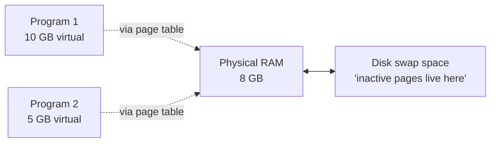
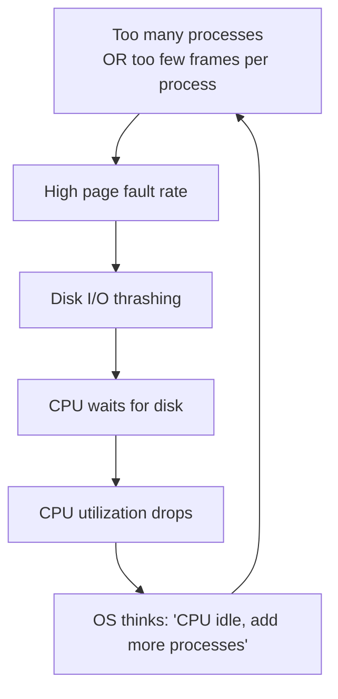
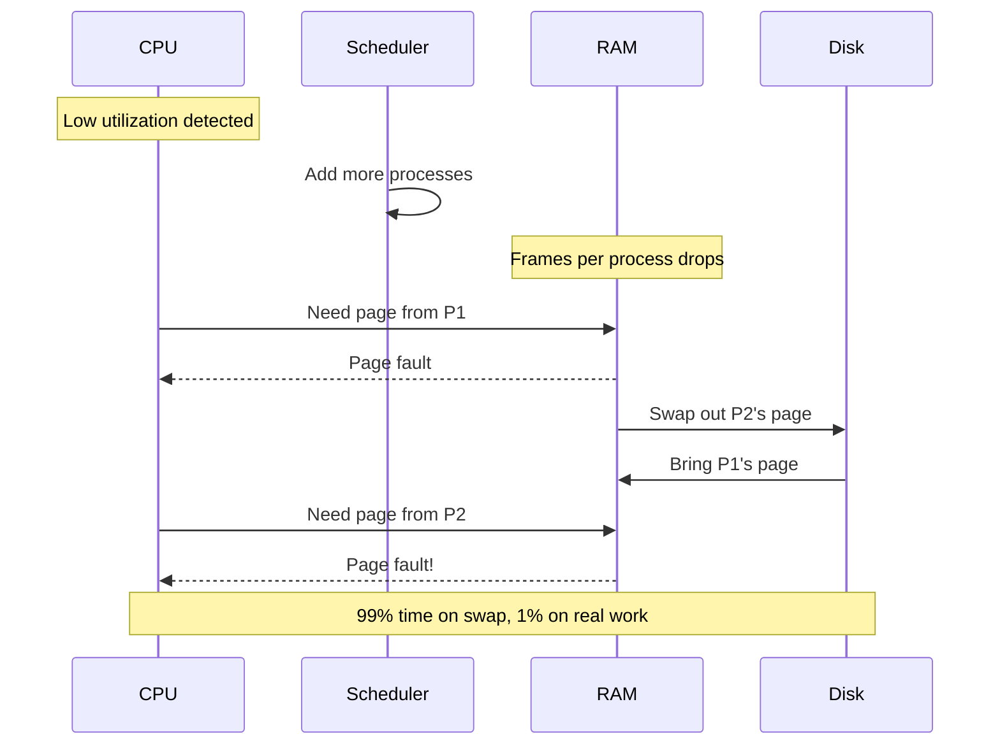
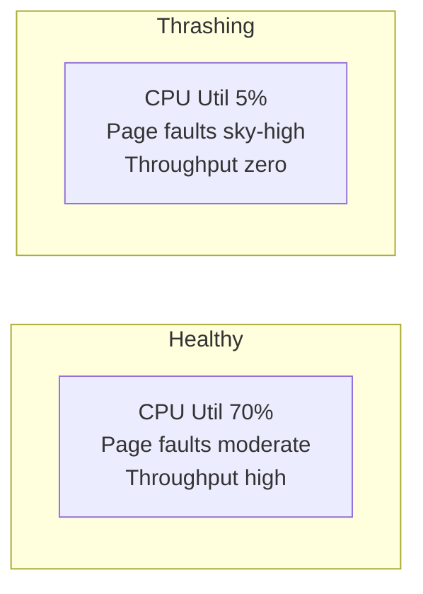

# Chapter 04 — Virtual Memory & Page Replacement 🪟

> Virtual Memory, Demand Paging, Thrashing (with cycle), FIFO + LRU page replacement (numerical), Belady's Anomaly। ৩টা closely-linked written question।

---

## 📚 What you will learn

1. **Virtual Memory** কী এবং কেন এটা "magic"
2. **Thrashing** কীভাবে ঘটে (cycle) এবং কীভাবে এড়ানো যায়
3. **FIFO Page Replacement** numerical example সহ
4. **Belady's Anomaly** কী এবং কোন algorithm-এ ঘটে
5. **LRU Page Replacement** numerical এবং FIFO-এর সাথে comparison

---

## 🎯 Question 1 — Virtual Memory + Thrashing + FIFO

### কেন এটা important?

3-in-1 question — সব memory management interview-এর কেন্দ্রবিন্দু। 5-10 marks।

> **Q1: What is Virtual Memory and Thrashing? Explain any one Page Replacement Algorithm.**

### 1. Virtual Memory

**Virtual Memory** is a technique that allows the execution of processes that are **not completely in main memory**। It separates user logical memory from physical memory।

| | Without VM | With VM |
|--|------------|---------|
| Program size limit | ≤ Physical RAM | Can exceed physical RAM |
| Multiprogramming | Limited by RAM | Many more processes fit |
| User experience | "Out of memory" frequently | Smooth |

**Benefit:** Run a 16 GB game on a computer with only 8 GB RAM, because OS only loads parts of the program currently being used।

**Implementation:** Mostly via **Demand Paging** — bringing a page into memory only when it is needed (not pre-loading)।

### 2. Thrashing

**Thrashing** occurs when a system spends **more time swapping pages in and out of disk** than actually executing instructions।

**Why it happens:**

**The cycle:**

1. Process A needs a page → Page Fault
2. OS swaps out Process B's page to make room for A
3. Now Process B needs **its** page back → another Page Fault
4. CPU spends 99% time moving data, 1% doing real work
5. System performance drops to almost zero

**Solutions:**

- **Reduce degree of multiprogramming** — fewer concurrent processes
- **Add more physical RAM**
- **Working Set Model** — track each process's active pages, ensure each gets enough frames
- **Page Fault Frequency (PFF)** monitor — if fault rate too high, allocate more frames

### 3. Page Replacement Algorithm: FIFO

When RAM is full and OS needs to bring in a new page, it must "kick out" an existing page। **FIFO** is the simplest strategy।

**Logic:** The **oldest** page in memory is replaced first।

### 4. FIFO Numerical Example

**Reference string:** `7, 0, 1, 2, 0, 3` with **3 frames**।

| Step | Page | Frames | Status |
|------|------|--------|--------|
| 1 | 7 | [7, _, _] | Page Fault |
| 2 | 0 | [7, 0, _] | Page Fault |
| 3 | 1 | [7, 0, 1] | Page Fault |
| 4 | 2 | [**2**, 0, 1] | Page Fault — 7 was oldest, replaced |
| 5 | 0 | [2, 0, 1] | **Hit!** 0 already there |
| 6 | 3 | [2, **3**, 1] | Page Fault — 0 was next oldest, replaced |

**Total Page Faults = 5, Hits = 1**

### 5. Belady's Anomaly (Bonus marks!)

Usually, **increasing the number of RAM frames should decrease page faults**।

However, in **FIFO**, sometimes **increasing frames actually increases page faults** — this strange behavior is called **Belady's Anomaly**।

**Classic example:** Reference string `1, 2, 3, 4, 1, 2, 5, 1, 2, 3, 4, 5`

| Frames | Page Faults |
|--------|-------------|
| 3 frames | 9 faults |
| 4 frames | **10 faults** ⚠️ |

**Why FIFO suffers:** It only tracks "when arrived", ignoring "how often used"।

> **Stack algorithms** (LRU, Optimal) **never** suffer Belady's anomaly।

### 6. Memory Hooks for "Weak" Students

- **Virtual Memory:** "Fake" memory larger than real RAM
- **Page Fault:** Looking for a book on the shelf and realizing it's still in the box (disk)
- **Thrashing:** Computer is "choking" — too busy moving boxes, no time to read books

---

## 🎯 Question 2 — LRU (Least Recently Used) Page Replacement

### কেন এটা important?

LRU-র numerical exam-এ asked frequently। FIFO-এর সাথে comparison অপরিহার্য।

> **Q2: Explain the LRU (Least Recently Used) Page Replacement Algorithm with an example.**

### 1. The Logic of LRU

LRU replaces the page that **has not been used for the longest period of time**।

- **FIFO** looks at *when arrived*
- **LRU** looks at *when last touched*

**Why it's better:** Assumes if you used a page recently, you'll likely use it again soon (temporal locality)।

### 2. LRU Numerical Example

**Reference string:** `7, 0, 1, 2, 0, 3, 0, 4` with **3 frames**।

| Step | Page | Frames | Status | Reasoning |
|------|------|--------|--------|-----------|
| 1 | 7 | [7, _, _] | Page Fault | First |
| 2 | 0 | [7, 0, _] | Page Fault | First |
| 3 | 1 | [7, 0, 1] | Page Fault | First |
| 4 | 2 | [**2**, 0, 1] | Page Fault | LRU = 7 (used at step 1), replaced |
| 5 | 0 | [2, 0, 1] | **Hit!** | 0 in frames |
| 6 | 3 | [2, 0, **3**] | Page Fault | LRU = 1 (last used step 3), replaced |
| 7 | 0 | [2, 0, 3] | **Hit!** | 0 in frames |
| 8 | 4 | [**4**, 0, 3] | Page Fault | LRU = 2 (last used step 4), replaced |

**Total Page Faults = 6, Hits = 2**

> **At each step, look "back" to find which page was least recently used (smallest "last used" timestamp)।**

### 3. Comparison Table — Three Algorithms

| Algorithm | Logic | Advantage | Disadvantage |
|-----------|-------|-----------|--------------|
| **FIFO** | Oldest page out | Very simple to code | Suffers from Belady's Anomaly |
| **LRU** | Least recently used out | Generally fewer page faults | Harder to implement (needs stack/counter) |
| **Optimal** | Page not needed for longest time in **future** | Best theoretical performance | **Impossible** — can't see future |

### 4. LRU Implementation Approaches

| Method | Idea |
|--------|------|
| **Stack** | Maintain stack of pages; on access, push to top; LRU = bottom |
| **Counter** | Each page has a "last used" timer; on access, update; LRU = smallest |
| **Approximation: Clock / Second-chance** | Reference bit + circular pointer (cheaper hardware) |

True LRU has high hardware overhead — most real OS use approximations like Clock।

---

## 🎯 Question 3 — Thrashing in Detail

### কেন এটা important?

5-mark dedicated thrashing question। Detail-এ explain চাই।

> **Q3: Explain the concept of "Thrashing" in detail.**

### 1. The Cause

Thrashing happens when a system is **overloaded**:

- The OS thinks the CPU is idle (low utilization), so it adds **more processes**
- But there isn't enough RAM for everyone
- Each process can't keep its working set in memory → constant page faults

### 2. The Cycle

**Step-by-step:**

1. Process A needs a page → Page Fault
2. OS swaps out Process B's page to help A
3. Now Process B needs its page back → Page Fault
4. CPU spends 99% of its time moving data between RAM and Disk and 1% doing real work।

### 3. The Solution

| Solution | What it does |
|----------|--------------|
| **Reduce Degree of Multiprogramming** | Fewer concurrent processes — each gets enough frames |
| **Add More Physical RAM** | More frames available |
| **Working Set Model** | Allocate frames based on each process's "active" page set |
| **Page Fault Frequency (PFF)** | Monitor fault rate; if too high, increase frames |

### 4. Quick "Bank IT" Exam Keywords

| Concept | One-liner |
|---------|-----------|
| **Context Switching** | Saving state of one process so another can run — pure **overhead** |
| **Belady's Anomaly** | More RAM frames → more page faults (FIFO only) |
| **Safe State** | Sequence of processes can all finish without deadlock |
| **Working Set** | Set of pages a process actively uses in a time window |

### 5. Visual: Healthy vs Thrashing System

> **In thrashing, the CPU is busy waiting for the disk, not executing instructions।**

### Written Exam Tip

5-mark thrashing answer structure:

1. Definition (1 line)
2. The cause — degree of multiprogramming
3. The cycle (with diagram)
4. The result — performance crash
5. Solutions — 3-4 listed

---

## 📋 Quick Recap Table

| Concept | Key fact |
|---------|----------|
| Virtual Memory | Run programs larger than RAM via disk swap |
| Demand Paging | Load page only when needed |
| Page Fault | Trap when page not in RAM |
| Thrashing | More time on swap than execution |
| Thrashing solution | Reduce processes, add RAM, working set |
| FIFO | Oldest page evicted |
| Belady's anomaly | More frames → more faults (FIFO only) |
| LRU | Least recently used evicted |
| Optimal | Future-knowledge required (theoretical) |
| Stack algorithms | LRU + Optimal — no Belady's anomaly |

---

## 🔁 Next Chapter

পরের chapter-এ **I/O Systems, Disk Scheduling & Storage** — DMA, Polling, Interrupt I/O, FCFS / SSTF disk scheduling, RAID 0/1/5/10, Spooling vs Buffering, Interrupts।

→ [Chapter 05: I/O Systems, Disk & Storage](05-io-disk-storage.md)
