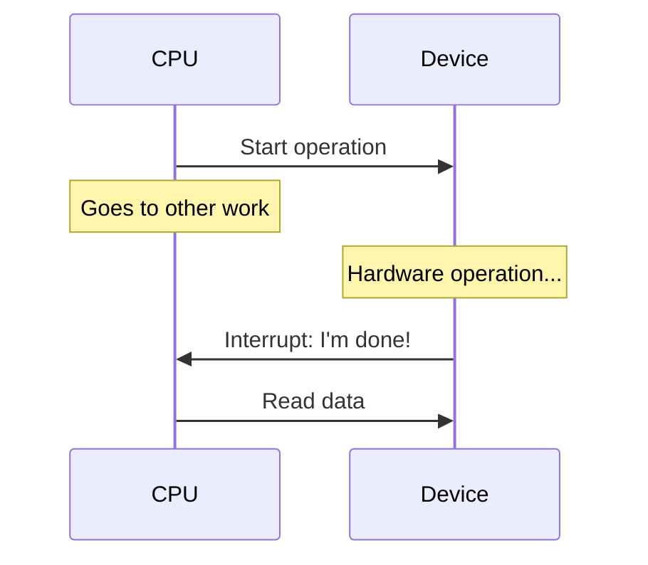
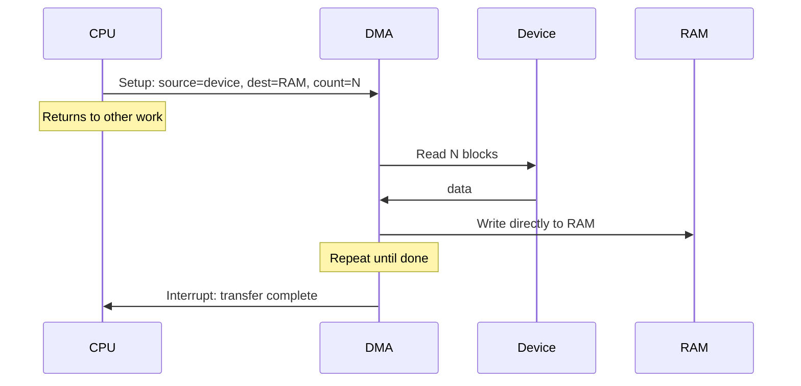
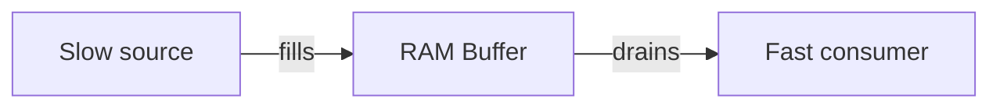
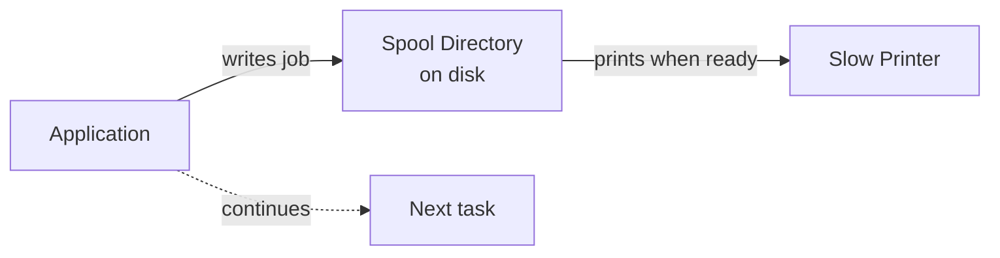
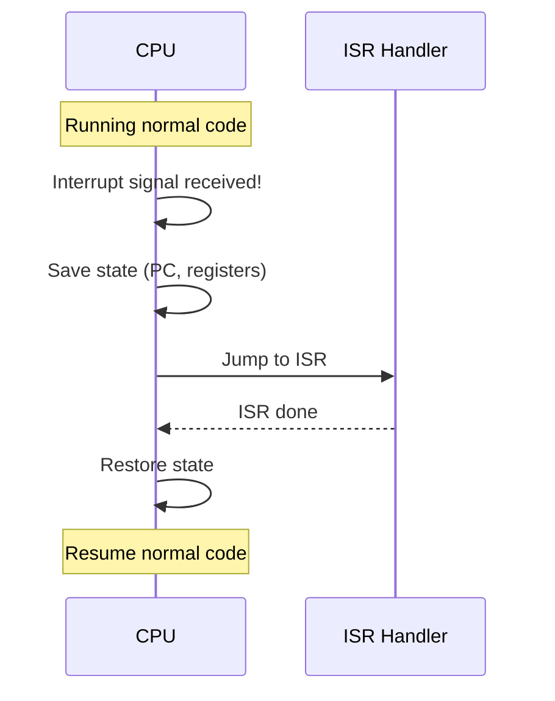

# Chapter 05 — I/O Systems, Disk & Storage 💿

> Disk Scheduling (FCFS, SSTF), I/O Methods (Programmed / Interrupt-driven / DMA), RAID 0/1/5/10, Spooling vs Buffering, Interrupts। ৫টা closely-related written question।

---

## 📚 What you will learn

1. **Disk scheduling algorithms** — FCFS এবং SSTF
2. **I/O Data Transfer methods** — Programmed I/O, Interrupt-Driven, DMA
3. **RAID levels** (0, 1, 5, 10) — কোনটা কখন
4. **Spooling vs Buffering** — কোথায় কোনটা use হয়
5. **Interrupt** এবং তার types

---

## 🎯 Question 1 — Disk Scheduling: FCFS + SSTF

### কেন এটা important?

Disk efficiency-এর core question। Numerical example-সহ আসতে পারে।

> **Q1: What is Disk Scheduling? Explain FCFS and SSTF algorithms.**

### 1. Definition

**Disk Scheduling** is the OS's responsibility to use hardware efficiently। For disk drives, this means **fast access time**। Disk scheduling decides **which pending I/O request should be serviced next** to minimize **Seek Time**।

**Disk Access Time = Seek Time + Rotational Latency + Transfer Time**

| Component | Definition |
|-----------|-----------|
| **Seek Time** | Time to move read/write head to correct track (slowest part) |
| **Rotational Latency** | Wait for correct sector to rotate under head |
| **Transfer Time** | Actual data read/write speed |

### 2. FCFS (First-Come, First-Served)

Service requests in **arrival order**। No optimization — just strict FIFO।

**Pros:** Simple, fair।
**Cons:** Random head movement, slow।

**Example:** Head at track 53; requests arrive: 98, 183, 37, 122, 14, 124, 65, 67।

```
FCFS path: 53 → 98 → 183 → 37 → 122 → 14 → 124 → 65 → 67
Total seek = 45+85+146+85+108+110+59+2 = 640 tracks
```

### 3. SSTF (Shortest Seek Time First)

The OS selects the request **closest to the current head position**।

**Pros:** Reduces total head movement compared to FCFS।
**Cons:** Can cause **Starvation** — if requests keep arriving near current position, far-away requests may never be serviced।

**Same example:** Head at 53, requests: 98, 183, 37, 122, 14, 124, 65, 67।

```
SSTF path: 53 → 65 → 67 → 37 → 14 → 98 → 122 → 124 → 183
Total seek = 12+2+30+23+84+24+2+59 = 236 tracks
```

> **Improvement:** 640 (FCFS) → 236 (SSTF) — significantly less head movement।

### 4. Other Disk Scheduling Algorithms (mention briefly)

| Algorithm | Strategy |
|-----------|----------|
| **SCAN (Elevator)** | Sweep from one end to other, service on the way; reverse direction at end |
| **C-SCAN (Circular)** | Sweep one direction only, jump back to start |
| **LOOK** | SCAN but stop at last request (don't go to disk edge) |
| **C-LOOK** | C-SCAN variant — stop at last request, jump |

### Written Exam Tip

5-mark answer:
1. Definition + Seek time importance
2. FCFS — explain + 1-line example
3. SSTF — explain + starvation issue
4. Compare table
5. Mention SCAN/C-SCAN for bonus

---

## 🎯 Question 2 — I/O Data Transfer Methods

### কেন এটা important?

Examiner-এর favorite — system efficiency-এর basic test।

> **Q2: Explain the different methods of I/O Data Transfer (Programmed I/O, Interrupt-Driven I/O, and DMA).**

### 1. Programmed I/O (Polling)

**Concept:** The CPU stays in a loop, **constantly checking** the status of the I/O device। This is called **Polling**।

```c
while (device_status != READY) {
    // CPU does nothing — just checking
}
read_data();
```

**Drawback:** Wastes huge CPU time waiting for slow devices (printer, keyboard)।

### 2. Interrupt-Driven I/O

**Concept:** CPU tells the device to perform a task, then **goes back to other work**। When device is finished, it sends an **Interrupt signal** to the CPU।



**Benefit:** CPU is not wasted; only stops when data is actually ready।

### 3. Direct Memory Access (DMA)

**Concept:** For large data movements (Disk → RAM), the CPU gives the **start address** and **size** to a **DMA Controller**। The controller moves data directly **without bothering the CPU for every byte**।



**Benefit:** Maximum efficiency। CPU only interrupted **once** when entire block transfers।

### 4. Comparison Table

| Method | CPU Involvement | Speed | Use Case |
|--------|-----------------|-------|----------|
| **Programmed I/O (Polling)** | 100% — busy wait | Slow | Simple, low-volume devices |
| **Interrupt-Driven** | Setup + interrupt response | Medium | Keyboard, mouse |
| **DMA** | Only setup + final interrupt | **Fast** | Disk, network, GPU — bulk transfer |

### 5. Real-World Example

| Operation | Best method |
|-----------|-------------|
| Copy 1 GB file from disk to RAM | **DMA** (CPU sleeps during transfer) |
| Read keyboard input | Interrupt-driven |
| Old printer port that has no buffer | Programmed I/O |

---

## 🎯 Question 3 — RAID Levels

### কেন এটা important?

Storage reliability — banking system-এর crucial topic।

> **Q3: What is RAID? Explain the different RAID levels (RAID 0, 1, 5, and 10).**

### 1. Definition

**RAID** = **Redundant Array of Independent Disks**। A technology used to **improve data reliability or performance** by combining multiple physical disk drives into one or more logical units।

### 2. RAID 0 — Striping

**How:** Data is **split** across two or more disks।

```
File: ABCDEFGH
Disk 1: A C E G
Disk 2: B D F H
```

| | |
|--|--|
| ✅ Benefit | Very fast read/write speeds |
| ❌ Drawback | **No redundancy** — one disk fails, all data lost |
| Min disks | 2 |

**Use case:** Video editing scratch disk, gaming temp cache।

### 3. RAID 1 — Mirroring

**How:** Data is **cloned (mirrored)** onto two disks।

```
File: ABCDEFGH
Disk 1: ABCDEFGH
Disk 2: ABCDEFGH (exact copy)
```

| | |
|--|--|
| ✅ Benefit | High data safety — one disk fails, other has perfect copy |
| ❌ Drawback | Expensive — pay for 2 TB, get 1 TB usable |
| Min disks | 2 |

**Use case:** Critical OS partition, banking servers।

### 4. RAID 5 — Striping with Parity

**How:** Data and **parity (recovery info)** spread across **three or more disks**।

```
Disk 1: A1   B1   P3   D1
Disk 2: A2   P2   C1   D2
Disk 3: P1   B2   C2   D3
       (P = parity for that stripe)
```

| | |
|--|--|
| ✅ Benefit | Balanced speed and safety; can survive **1 disk failure** without losing data |
| ❌ Drawback | Slower writes (parity calculation) |
| Min disks | 3 |

**Use case:** File server, mid-tier database।

### 5. RAID 10 (1+0) — Mirror + Stripe

**How:** Combination of **Mirroring (RAID 1) and Striping (RAID 0)**।

```
Pair 1 (mirror): Disk 1 == Disk 2
Pair 2 (mirror): Disk 3 == Disk 4
Stripe across pairs.
```

| | |
|--|--|
| ✅ Benefit | Best performance + high redundancy |
| ❌ Drawback | Most expensive (need 4+ disks, half capacity loss) |
| Min disks | 4 |

**Use case:** High-end transaction servers, banking core systems।

### 6. Comparison Summary

| RAID | Min Disks | Redundancy | Performance | Storage Efficiency |
|------|-----------|------------|-------------|---------------------|
| **0** | 2 | নেই | ⚡⚡⚡ | 100% |
| **1** | 2 | 1 disk | ⚡⚡ | 50% |
| **5** | 3 | 1 disk | ⚡⚡ | (n−1)/n |
| **10** | 4 | 1 per pair | ⚡⚡⚡ | 50% |

> **Bank IT exam tip:** Usually mentions banking context — RAID 1 or RAID 10 for critical data; RAID 5 for mid-tier।

---

## 🎯 Question 4 — Spooling vs Buffering

### কেন এটা important?

Students confuse these two। 3-5 marks "compare" question।

> **Q4: What is "Spooling" vs "Buffering"?**

### 1. Buffering

**Buffering** stores data **temporarily** as it is being transferred:
- Between two devices, OR
- Between a device and an application

**Purpose:** **Even out speed differences**।

**Example:** Video streaming buffer — video doesn't lag if internet briefly slows down।



**Storage location:** Usually **RAM** (small, temporary)।

### 2. Spooling

**SPOOLing** = **Simultaneous Peripheral Operations On-Line**।
A process where **data is sent to a disk** (intermediate storage) before being sent to a slow device like a printer।

**Purpose:** Allows the CPU to finish its job quickly and move to another task while the printer works in the background।



**Storage location:** **Disk** (larger, persistent)।

### 3. Comparison Table

| Feature | Buffering | Spooling |
|---------|-----------|----------|
| **Storage** | RAM | Disk |
| **Purpose** | Speed-match between devices | Async job queue (CPU free, printer slow) |
| **Capacity** | Small | Large |
| **Use case** | Video stream, network packets | Print jobs, batch jobs |
| **Synchronicity** | Synchronous (fills as drains) | Asynchronous (drop-and-go) |

### 4. Memory Hook

- **Buffering** = "তাৎক্ষণিক RAM-এ অপেক্ষা" (immediate RAM hold)
- **Spooling** = "Disk-এ queue করে রেখে চলে যাও" (queue on disk, walk away)

> **Print spooling:** When you click "Print" in Word, the document goes to the spool directory। Word continues। Printer slowly picks up jobs from the spool।

---

## 🎯 Question 5 — Interrupts

### কেন এটা important?

3-5 marks "what is + types" question।

> **Q5: What is an Interrupt? Explain the types of Interrupts.**

### 1. Definition

An **Interrupt** is a signal sent to the processor by hardware or software indicating an event that needs **immediate attention**।

When an interrupt occurs, the CPU:

1. Suspends current activity
2. Saves its state
3. Executes a function called **Interrupt Service Routine (ISR)**
4. Resumes original work



### 2. Types of Interrupts

| Type | Source | Example |
|------|--------|---------|
| **Hardware Interrupt** | External devices | Keyboard press, mouse click, disk I/O complete |
| **Software Interrupt** | Programs (system calls) | Read file, write to display |
| **Trap (Exception)** | Errors during execution | Division by zero, invalid memory access (segfault) |

### 3. Hardware Interrupt Examples

- **Keyboard interrupt** — when you press a key
- **Mouse interrupt** — on click or move
- **Timer interrupt** — periodic, drives scheduler
- **Disk controller interrupt** — DMA transfer done

### 4. Software Interrupt Examples

- A program calls `read()` to read a file
- A program calls `printf()` (eventually triggers `write()` syscall)
- These are also called **system calls**

### 5. Trap (Exception) Examples

- **Divide by zero** — hardware traps to handler
- **Page Fault** — page not in RAM
- **Invalid Opcode** — CPU doesn't recognize instruction
- **Segfault** — accessing memory not allocated to process

> **Difference from interrupt:** Hardware interrupt = **external event**; Trap = **error inside the running program**।

---

## 📋 Quick Recap Table

| Concept | Key fact |
|---------|----------|
| Disk seek time | Slowest part of disk access |
| FCFS disk | Simple, fair, slow |
| SSTF disk | Closest first; can starve far requests |
| Programmed I/O | CPU loops checking — wasteful |
| Interrupt-Driven I/O | Device signals when ready |
| DMA | CPU-free bulk transfer |
| RAID 0 | Striping, no redundancy |
| RAID 1 | Mirroring, 100% redundant |
| RAID 5 | Stripe + parity, 1 disk fault tolerance |
| RAID 10 | Mirror + stripe, best of both |
| Buffering | RAM, speed-match |
| Spooling | Disk, async job queue (printer) |
| Hardware interrupt | External device (keyboard, disk) |
| Software interrupt | System call from program |
| Trap | Error during execution (div by zero) |

---

## 🔁 Next Chapter

পরের chapter-এ **OS Architecture, Kernel & System Calls** — OS Functions, System Call types, Monolithic vs Microkernel, Cache Memory + Locality, FAT vs i-node।

→ [Chapter 06: OS Architecture, Kernel & System Calls](06-architecture-kernel.md)
