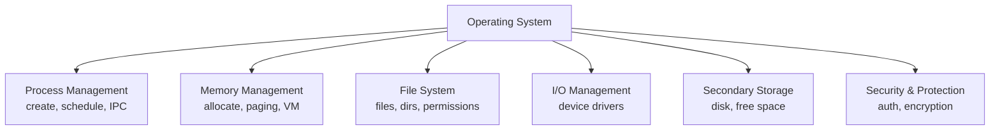
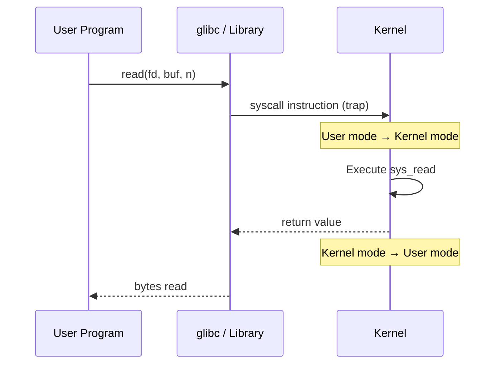
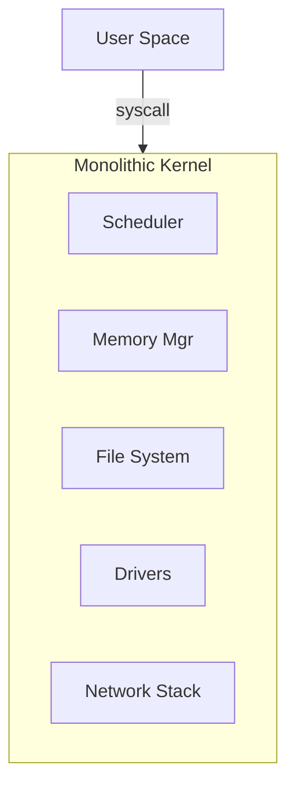
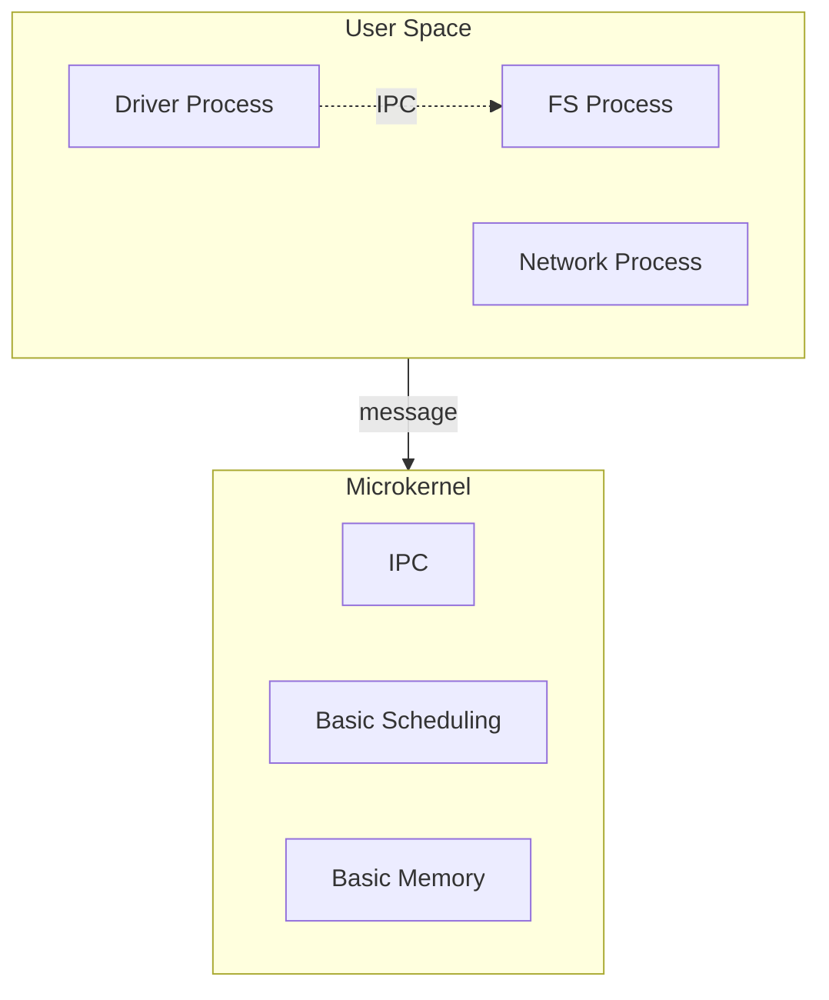
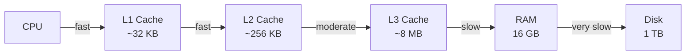

# Chapter 06 — OS Architecture, Kernel & System Calls 🛠️

> OS Functions, System Calls + types, Monolithic vs Microkernel, Cache Memory + Locality, FAT vs i-node। ৫টা architecture-level written question।

---

## 📚 What you will learn

1. **OS-এর primary functions** — 6 categories
2. **System Call** কী এবং কীভাবে kernel mode-এ transition হয়
3. **Monolithic vs Microkernel** structure-এর difference
4. **Cache Memory** এবং **Principle of Locality** (Temporal + Spatial)
5. **FAT vs i-node** — Windows বনাম Linux file metadata

---

## 🎯 Question 1 — Primary Functions of an Operating System

### কেন এটা important?

Classic "broad" question — OS-এর role জানার test। 5-mark answer-এ **categorize** করে লিখলে marks বেশি, just list করলে কম।

> **Q1: What are the primary functions of an Operating System?**

### 1. Process Management

The OS manages the **creation, scheduling, and deletion** of processes। It ensures each process gets enough CPU time and manages **Inter-Process Communication (IPC)**।

**Includes:** Creating PCB, scheduling, context switch, IPC mechanisms (pipes, message queues, shared memory)।

### 2. Memory Management

The OS keeps track of every memory location — whether it is allocated or free। It decides:
- Which process gets memory
- When and how much
- How to handle paging / segmentation
- Virtual memory mapping

### 3. File System Management

Manages how data is organized into files and directories। This includes:
- Creating, deleting, searching files
- Controlling access permissions (read/write/execute)
- File metadata (inode, FAT entries)

### 4. I/O Device Management

The OS hides the complexities of hardware from the user। Uses **Device Drivers** to communicate with hardware (keyboards, printers, monitors, network cards)।

### 5. Secondary Storage Management

Since main memory (RAM) is volatile and small, OS manages disks (HDD/SSD) for:
- Permanent storage
- Free space management
- Disk scheduling

### 6. Security and Protection

The OS protects:
- Data and programs of one user from being accessed/modified by another unauthorized user
- System resources via authentication, authorization, encryption

### Visual Summary



> **Exam tip:** Use the **6 categories** above। Each gets 1-2 lines explanation। Total = 5-mark answer।

---

## 🎯 Question 2 — System Calls

### কেন এটা important?

User mode ↔ Kernel mode transition বুঝার core concept। 5 marks definition + types question।

> **Q2: What is a System Call? Describe the different types of System Calls.**

### 1. Definition

A **System Call** is the programmatic way in which a computer program **requests a service from the kernel** of the operating system। It acts as an **interface between a process and the operating system**।

### 2. How System Calls Work

When a user program needs a service (like reading a file), it executes a system call। The CPU **switches from User Mode to Kernel Mode** to perform the task securely।



| Mode | Capabilities |
|------|--------------|
| **User Mode** | Restricted; cannot access hardware directly |
| **Kernel Mode (Privileged)** | Can execute any instruction, access any memory |

### 3. Types of System Calls

| Category | Examples |
|----------|----------|
| **Process Control** | `load`, `execute`, `abort`, `end`, `wait event`, `allocate memory` |
| **File Management** | `create file`, `delete file`, `open`, `close`, `read`, `write` |
| **Device Management** | `request device`, `release device`, `read`, `write` |
| **Information Maintenance** | `get time/date`, `get system data` |
| **Communications** | `create connection`, `send/receive messages`, `transfer status` |

### 4. Real Linux System Calls (examples)

```c
#include <unistd.h>

int fd = open("file.txt", O_RDONLY);   // file management
read(fd, buffer, 100);                  // file management
close(fd);                              // file management

pid_t pid = fork();                     // process control
exit(0);                                // process control
```

### 5. Why System Calls Matter

User programs **cannot** directly access:
- Hardware (disk, network, memory)
- Other process memory
- Privileged CPU instructions

**System calls** are the **only safe way** for user programs to ask the kernel to do these things।

---

## 🎯 Question 3 — Kernel: Monolithic vs Microkernel

### কেন এটা important?

OS architecture-এর foundational question। 5-mark "compare" with examples।

> **Q3: What is a "Kernel" and explain the difference between Monolithic and Microkernel.**

### 1. The Kernel

The **Kernel** is the **"heart"** of the Operating System। It is the **first program loaded after the bootloader** and manages communication between software and hardware।

**Always in memory** during system uptime।

### 2. Monolithic Kernel

**Structure:** All OS services (File system, CPU scheduling, Memory management, Device drivers) run in a **single large space** in the kernel।



| | Pros | Cons |
|--|------|------|
| | Very fast — everything in one place, no context switching between subsystems | If one service (driver) crashes → **whole system crashes** |
| | Simpler design | Hard to maintain (huge codebase) |

**Examples:** **Linux, traditional Unix, Windows (mostly hybrid but kernel-heavy)**

### 3. Microkernel

**Structure:** Only the most essential services run in the kernel। Other services (device drivers, file systems, network stack) run as **user processes**।



| | Pros | Cons |
|--|------|------|
| | **Highly stable and secure** — driver crash = isolated, system stays alive | **Slower** — frequent IPC between user and kernel space |
| | Modular, easier to maintain | Higher complexity for system designers |

**Examples:** **L4, QNX, Minix**

### 4. Comparison Table

| Feature | Monolithic | Microkernel |
|---------|------------|-------------|
| Size | Large kernel | Small kernel |
| Service location | All in kernel space | Most in user space |
| Speed | Fast (no IPC) | Slower (lots of IPC) |
| Stability | One driver crash = system crash | Driver crash isolated |
| Maintenance | Hard | Easier |
| Examples | Linux, BSD | QNX, Minix, L4 |

### 5. Modern Reality: Hybrid Kernels

Most production OS today use **hybrid** approach:

- **Linux:** Mostly monolithic + loadable kernel modules (drivers can be loaded at runtime)
- **Windows NT:** Hybrid (monolithic core + microkernel-style subsystems)
- **macOS / iOS:** Hybrid (XNU = Mach microkernel + BSD monolithic)

> **Exam tip:** Modern OS = compromise। Pure microkernel real-time OS (QNX) used in cars, medical devices where stability > speed।

---

## 🎯 Question 4 — Cache Memory + Principle of Locality

### কেন এটা important?

Memory hierarchy বুঝার core। Banking IT-তে regular।

> **Q4: Explain the concept of Cache Memory and the "Principle of Locality."**

### 1. Cache Memory

A **small, high-speed memory located close to the CPU**। It stores **frequently accessed data** so the CPU doesn't have to wait for the slower main memory (RAM)।



| Level | Size | Speed | Closer to CPU |
|-------|------|-------|---------------|
| Register | Bytes | 1 cycle | Inside CPU |
| L1 | 32-64 KB | 4 cycles | Inside CPU |
| L2 | 256 KB-1 MB | 10 cycles | Inside CPU |
| L3 | 8-32 MB | 40 cycles | Inside CPU |
| RAM | 8-32 GB | 200 cycles | Off-chip |
| Disk | TB | 10ⁿ cycles | I/O bus |

### 2. Principle of Locality

**Why cache memory works so well।** It has two types:

#### A. Temporal Locality

If a memory location is referenced, **it is likely to be referenced again soon**।

**Example:** A loop variable accessed thousands of times in a loop।

```c
for (int i = 0; i < 1000000; i++) {
    sum += i;     // 'sum' and 'i' accessed every iteration
}
```

#### B. Spatial Locality

If a memory location is referenced, **nearby memory locations are likely to be referenced soon**।

**Example:** Iterating through array elements।

```c
int arr[1000];
for (int i = 0; i < 1000; i++) {
    arr[i] = i;   // arr[0], arr[1], arr[2]... all close in memory
}
```

### 3. Comparison Table

| Type | Logic | Example | Cache benefit |
|------|-------|---------|---------------|
| **Temporal** | Same location, soon | Loop variable, function call | Re-use cached value |
| **Spatial** | Nearby locations, soon | Array iteration, sequential code | Cache fetches a "line" (64 bytes) — covers neighbors |

### 4. Why Cache Hardware Exploits Both

When CPU requests memory address `0x1000`:
1. Cache fetches **64 bytes** starting at `0x1000` (spatial locality bet)
2. Keeps those bytes in cache for next access (temporal locality bet)

> **Memory hook:** Temporal = **Time** (same place again soon)। Spatial = **Space** (nearby places soon)।

---

## 🎯 Question 5 — FAT vs i-node

### কেন এটা important?

Linux vs Windows file system difference — interview-favorite।

> **Q5: What is a "File Allocation Table (FAT)" and "i-node"?**

These are the **"maps"** the OS uses to find files on a disk।

### 1. FAT (File Allocation Table)

- **Common in Windows** (FAT32, exFAT)
- A simple table where **each entry points to the next "cluster"** of a file on disk — like a **linked list**

**Structure:**

```
FAT entry: Cluster N → Cluster M (next) → ... → EOF marker
```

**Example:** File "report.docx" stored in clusters 5, 8, 12, 15:

| Cluster | Next Cluster |
|---------|-------------|
| 5 | 8 |
| 8 | 12 |
| 12 | 15 |
| 15 | EOF |

The directory entry for "report.docx" points to the **first cluster (5)**, and the FAT linked list traverses to find all data।

### 2. i-node (Index Node)

- **Common in Unix/Linux** (ext2/3/4, XFS, etc.)
- Each file has an **i-node** that contains:
  - Metadata (size, owner, permissions, timestamps)
  - **A list of disk block addresses** where the actual data is stored

**Structure:**

```
i-node 1234:
  - Owner: alice
  - Permissions: rw-r--r--
  - Size: 4096 bytes
  - Modified: 2026-05-01
  - Data blocks: [102, 305, 410, 588]
```

The directory entry stores `(filename → i-node number)`। i-node holds everything else।

### 3. Comparison Table

| Feature | FAT | i-node |
|---------|-----|--------|
| **OS** | Windows (FAT32, exFAT) | Unix / Linux |
| **Structure** | Linked list table | Index of block pointers |
| **Filename storage** | Inside table | In directory entry only |
| **Permissions** | Limited (FAT32) | Full (read/write/exec for user/group/other) |
| **Max file size** | 4 GB (FAT32) | Petabytes (ext4) |
| **Performance** | Slow for large files (linked list traversal) | Fast (direct block index) |
| **Use case** | USB drives, SD cards (cross-platform) | Modern Unix/Linux servers |

### 4. Hard / Soft Links (Linux only)

i-node design enables:

- **Hard link:** Two filenames pointing to **same i-node** → same file। Source delete → other still works।
- **Soft (symbolic) link:** A file containing the **path** to another file। Source delete → broken link।

```bash
# Hard link — same i-node
ln file.txt link.txt

# Soft link — separate i-node, contains path
ln -s file.txt symlink.txt
```

### 5. Quick "Definition" Bonus Topics

In a written exam, also mention:

| Concept | One-line definition |
|---------|---------------------|
| **GUI** | Graphical User Interface — visual icons (Windows) |
| **CLI** | Command Line Interface — text commands (Linux Terminal) |
| **Kernel Mode (Privileged)** | CPU can execute any instruction, access any memory |
| **User Mode** | CPU restricted; cannot access hardware directly — must ask kernel via syscall |

---

## 📋 Quick Recap Table

| Concept | Key fact |
|---------|----------|
| 6 OS Functions | Process, Memory, FileSystem, I/O, Storage, Security |
| System Call | User → Kernel interface |
| User mode | Restricted, no hardware access |
| Kernel mode | Privileged, full access |
| Monolithic kernel | All in kernel — fast but fragile |
| Microkernel | Drivers in user space — stable but slower |
| Linux kernel type | Monolithic + loadable modules |
| L4 / QNX / Minix | Microkernels |
| Cache memory | Small fast memory near CPU |
| Temporal locality | Same location reused soon |
| Spatial locality | Nearby locations soon |
| FAT | Linked-list table (Windows) |
| i-node | Index node (Linux) — metadata + block pointers |
| Hard link | Same i-node |
| Soft link | Path string |

---

## 🔁 Next Chapter

পরের chapter-এ **Boot Process, System Modes & Security** — Booting (BIOS / POST / MBR / Bootloader / Kernel), 32 vs 64 bit, Dual Boot vs VM, Plug & Play, Sleep / Hibernate / Shutdown, OS Security।

→ [Chapter 07: Boot Process, System Modes & Security](07-boot-modes-security.md)
