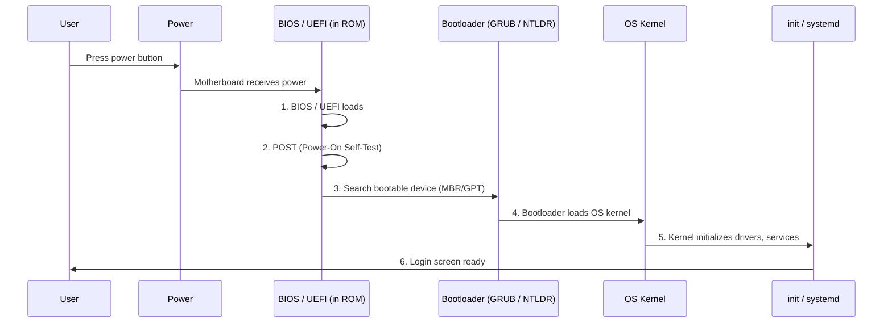
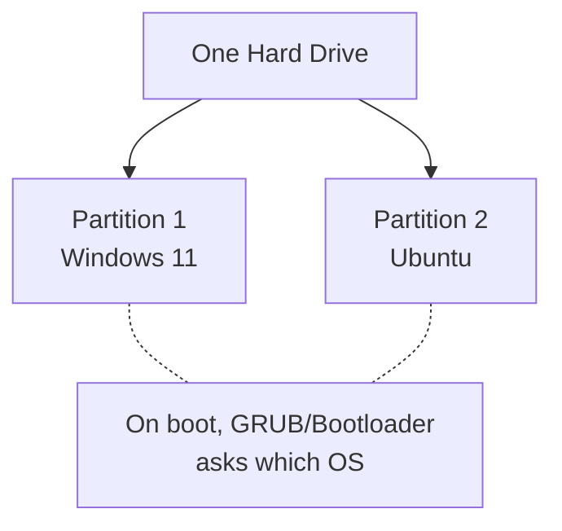
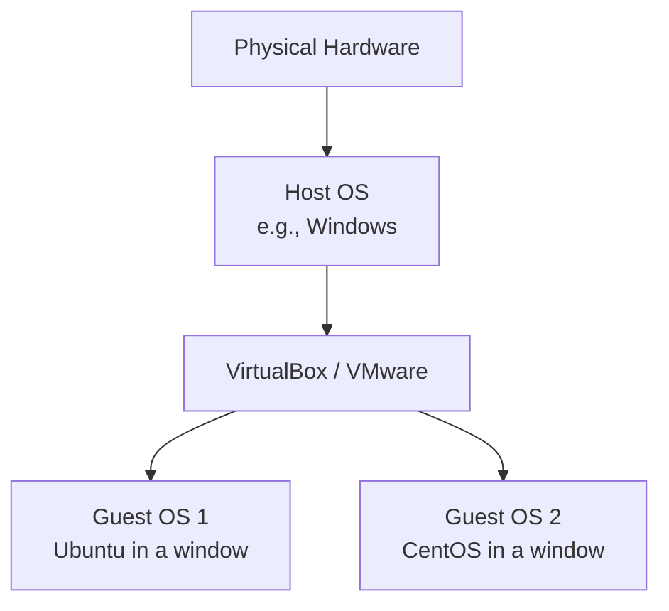
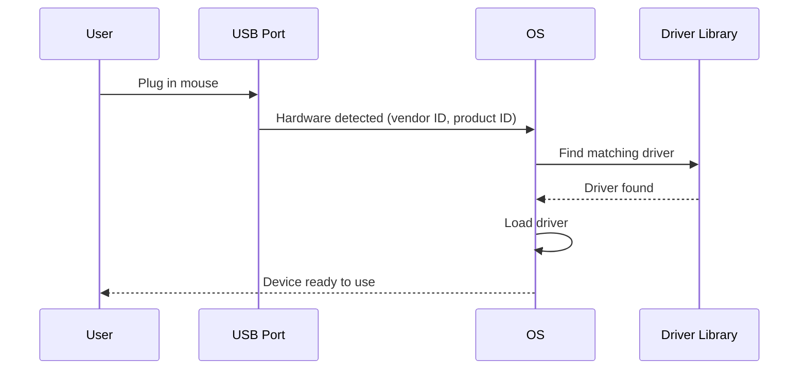
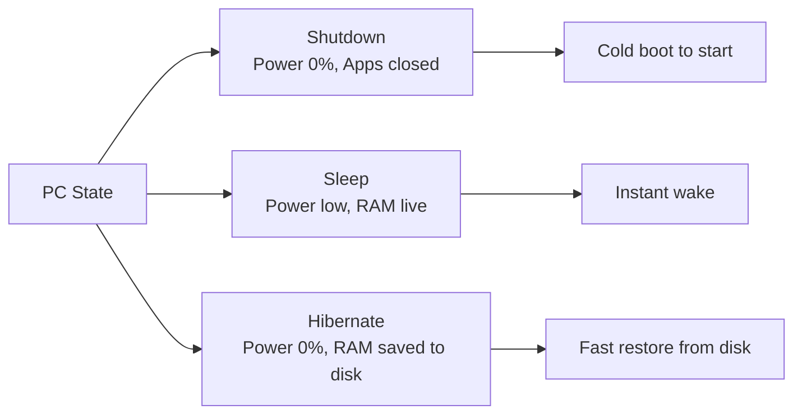
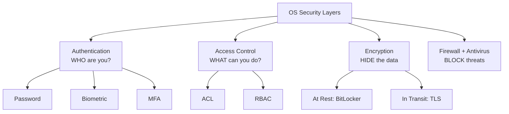

# Chapter 07 — Boot Process, System Modes & Security 🛡️

> Booting Process (BIOS → POST → MBR → Bootloader → Kernel), 32 vs 64 bit, Dual Boot vs Virtual Machine, Plug and Play, Sleep / Hibernate / Shutdown, OS Security। ৬টা practical written question।

---

## 📚 What you will learn

1. **Booting Process** — PC on করার পর কী হয় step-by-step
2. **32-bit vs 64-bit OS**-এর difference
3. **Dual Boot vs Virtual Machine** comparison
4. **Plug and Play (PnP)** কী
5. **Sleep, Hibernate, Shutdown**-এর mode difference
6. **OS Security** — Authentication, ACL, Encryption, Firewall

---

## 🎯 Question 1 — The Booting Process

### কেন এটা important?

"How does PC start?" — practical question, প্রায়ই asked। Sequence-এ explain চাই।

> **Q1: Explain the step-by-step process of what happens when you turn on a PC (The Booting Process).**

### 1. Six-Step Booting Sequence



### 2. Detailed Steps

**Step 1 — Power On & BIOS/UEFI Load**

The motherboard receives power and triggers the **BIOS** (Basic Input/Output System) or the modern **UEFI** (Unified Extensible Firmware Interface), which is stored on a small chip (ROM/Flash on motherboard)।

> **Why ROM?** BIOS must persist even when power is off।

**Step 2 — POST (Power-On Self-Test)**

The BIOS performs a **quick diagnostic check** to ensure hardware is working:

- RAM check
- Keyboard / mouse detection
- Disk drives connected
- Display output

If POST fails, you hear **beep codes** (specific patterns indicate which hardware failed)।

**Step 3 — Boot Sector Search**

The BIOS looks for a **bootable device** (SSD, HDD, USB) in the order configured in BIOS settings। It looks specifically for:

- **MBR (Master Boot Record)** — legacy systems, first 512 bytes of disk
- **GPT (GUID Partition Table)** — modern UEFI systems

**Step 4 — Bootloader Load**

Once the bootable disk is found, BIOS loads the **bootloader** into RAM:

- **Linux:** GRUB (GRand Unified Bootloader)
- **Windows:** Windows Boot Manager (BOOTMGR)
- **Older Linux:** LILO

**Step 5 — Kernel Loading**

The bootloader finds the **OS Kernel** image on disk (e.g., `/boot/vmlinuz` for Linux) and loads it into RAM। Then transfers control to the kernel।

**Step 6 — OS Initialization**

The kernel takes over:

- Initializes device drivers
- Mounts the root filesystem
- Starts system services (network, login manager, etc.)
- Spawns the **first user-space process**: `init` (older) or `systemd` (modern)
- Eventually shows the login screen

### 3. Mnemonic for Boot Sequence

```
BIOS → POST → MBR → Bootloader → Kernel → Init
"Bunch Of People Make Boots Kick Inside"
```

> **Pro Tip:** Always mention **ROM (Read Only Memory)** in your answer — BIOS/UEFI is stored in ROM because it needs to stay even when power is off।

---

## 🎯 Question 2 — 32-bit vs 64-bit OS

### কেন এটা important?

Common "Short Note" / "Difference" question। 3-5 marks।

> **Q2: What is the difference between 32-bit and 64-bit Operating Systems?**

### 1. Data Processing

| | 32-bit OS | 64-bit OS |
|--|-----------|-----------|
| **Word size** | Processes data in 32-bit chunks | 64-bit chunks |
| **Speed** | Slower for complex tasks | Much faster |

### 2. RAM Support

| | 32-bit OS | 64-bit OS |
|--|-----------|-----------|
| **Max RAM** | 2³² bytes = **4 GB** | 2⁶⁴ bytes = theoretically 16 EB (practically 128 GB-many TB) |
| **Use of more RAM** | Even if 16 GB installed, only 4 GB used | Can use all installed RAM |

### 3. Software Compatibility

| | 32-bit OS | 64-bit OS |
|--|-----------|-----------|
| Run 32-bit software | ✓ | ✓ (with compatibility layer) |
| Run 64-bit software | ✗ | ✓ |

### 4. Quick Comparison Table

| Feature | 32-bit | 64-bit |
|---------|--------|--------|
| Max RAM | 4 GB | 16 EB (theoretical) |
| Word size | 4 bytes | 8 bytes |
| CPU registers | 32-bit | 64-bit |
| Address space | 2³² | 2⁶⁴ |
| Software | Old, narrow | Modern, wide |
| Examples | Windows XP 32-bit | Windows 11, modern Linux distros |

> **Today:** Almost all modern OS are 64-bit। 32-bit gradually being phased out (Apple has fully removed support, Linux distros dropping)।

---

## 🎯 Question 3 — Dual Boot vs Virtual Machine

### কেন এটা important?

Practical concept — students often ask this। 5 marks।

> **Q3: What is a "Dual Boot" system and "Virtual Machine"?**

### 1. Dual Boot

**Installing two operating systems** (e.g., Windows 11 and Ubuntu Linux) on the same hard drive, but in **different partitions**।



**Key points:**

- When you turn on the PC, the **bootloader** asks which OS to start
- **Only ONE OS runs at a time** — restart needed to switch
- Each OS gets its own partition with its own filesystem

**Pros:**
- Native performance (real hardware, no virtualization overhead)
- Both OS independent

**Cons:**
- Restart needed to switch
- Disk partition setup risky for beginners

### 2. Virtual Machine (VM)

**Running an OS inside another OS** using software like **VMware**, **VirtualBox**, **Hyper-V**, or **QEMU/KVM**।



**Key terms:**

- **Host OS** — your main system running on real hardware
- **Guest OS** — runs inside the VM, in a window
- **Hypervisor** — software that creates and manages VMs

**Pros:**

- Run **multiple OS simultaneously**
- No restart needed
- Snapshot / rollback features
- Safe sandboxing for testing

**Cons:**

- Requires a lot of RAM (host + each guest)
- Slower than native (virtualization overhead)
- Some hardware features unavailable

### 3. Comparison Table

| Feature | Dual Boot | Virtual Machine |
|---------|-----------|-----------------|
| **Concurrent OS** | One at a time | Multiple simultaneously |
| **Performance** | Native (full speed) | Slower (overhead) |
| **Switching** | Restart required | Window switch |
| **RAM usage** | One OS uses all | Shared between host and guests |
| **Data sharing** | Need shared partition | Easy via shared folders |
| **Use case** | Want native gaming + Linux dev | Test multiple OS, sandbox |

> **Modern hybrid:** WSL (Windows Subsystem for Linux) — runs a Linux kernel inside Windows without VM overhead। Best of both worlds।

---

## 🎯 Question 4 — Plug and Play (PnP)

### কেন এটা important?

3 marks short note। Definition + benefit।

> **Q4: What is "Plug and Play" (PnP)?**

### 1. Definition

**Plug and Play** is a capability of the OS that allows it to **automatically detect and configure** a new hardware device (USB Mouse, Printer, Pen Drive) **without the user having to manually install drivers or restart** the computer।

### 2. How It Works



### 3. Benefits

✅ **Convenience** — no manual driver installation for common devices
✅ **No reboot** — hot-pluggable
✅ **User-friendly** — anyone can use
✅ **Automatic resource allocation** — OS assigns IRQ, DMA channels

### 4. Common PnP Devices

- USB drives, mice, keyboards
- Printers (modern)
- Bluetooth devices
- Webcams
- External hard drives

> **Older systems (pre-Windows 95):** Required manual driver installation, IRQ/DMA configuration, and often a reboot। PnP made plug-in devices "just work"।

---

## 🎯 Question 5 — Sleep vs Hibernate vs Shutdown

### কেন এটা important?

Practical user-level concept। 3-5 marks comparison।

> **Q5: What is the difference between "Sleep", "Hibernate", and "Shutdown"?**

### Comparison Table

| Feature | Shutdown | Sleep | Hibernate |
|---------|----------|-------|-----------|
| **Power Consumption** | **Zero** | Low (RAM still powered) | **Zero** |
| **Data Storage** | Everything closed | Kept in **RAM** | Kept on **Hard Disk** |
| **Startup Speed** | Slow (full boot) | **Instant** | Fast (faster than reboot, slower than sleep) |
| **Open programs** | Closed | Open (in RAM) | Open (saved to disk) |
| **If power lost** | No data loss | **Data lost** (RAM volatile) | No data loss |
| **Best Use Case** | Not using for days | Short breaks (lunch) | Long break, but want to keep apps open |

### Detailed Explanation

**Shutdown:**
- All open applications close
- OS terminates and powers off completely
- Cold boot needed next time
- Use when leaving computer for **days**

**Sleep:**
- CPU goes to low-power state
- RAM stays powered (so data preserved)
- Display off, fans down
- **Wakes up instantly** — apps where you left them
- ⚠️ If power cut, all unsaved RAM data lost!
- Use for **short breaks** (15 min – few hours)

**Hibernate:**
- RAM contents are **written to disk** (`hiberfil.sys` in Windows)
- Computer fully powered off
- On wake-up, RAM contents restored from disk
- Slower than Sleep but no power use, no risk of data loss
- Use when **away for hours** but want apps preserved

### Visual



> **Modern laptops:** Often use **"Hybrid Sleep"** — RAM is preserved AND saved to disk। Power loss-safe + fast wake। Best of both।

---

## 🎯 Question 6 — Operating System Security

### কেন এটা important?

Banking exam-এর high-priority topic। 5-10 marks।

> **Q6: What are the different ways to protect an Operating System (Security)?**

### 1. Authentication

**Ensuring the person logging in is who they claim to be।**

**Methods:**

| Method | Type | Example |
|--------|------|---------|
| **Password** | Something you know | Login password |
| **Biometric** | Something you are | Fingerprint, Iris scan, Face ID |
| **MFA (Multi-Factor Authentication)** | Multiple of the above | Password + OTP |

### 2. Access Control (Authorization)

**Once logged in, what can the user do?**

- **Access Control List (ACL):** A table that tells the OS which users have access to which files (Read, Write, Execute)।
- **Role-Based Access Control (RBAC):** Permissions tied to roles (Admin, User, Guest) instead of individuals।

```bash
# Linux ACL example
$ ls -l report.docx
-rw-r--r-- 1 alice users 1234 ...
# Owner alice: read+write
# Group users: read only
# Others: read only
```

### 3. Encryption

**Protecting data by converting it into unreadable code without a key।**

| Type | What it protects | Example |
|------|------------------|---------|
| **At Rest** | Data on disk | BitLocker (Windows), FileVault (Mac), LUKS (Linux) |
| **In Transit** | Data over network | SSL/TLS, HTTPS, VPN |

### 4. Firewalls and Antivirus

| Tool | Purpose |
|------|---------|
| **Firewall** | Monitors **incoming and outgoing network traffic**, blocks unauthorized connections |
| **Antivirus** | Scans files for **known malicious signatures** (Viruses, Trojans, Worms, Ransomware) |

### 5. Bonus Quick Definitions

| Concept | One-liner |
|---------|-----------|
| **GUI vs CLI** | GUI = visual icons (Windows); CLI = text commands (Linux Terminal) |
| **Safe State** | OS can allocate resources to all processes in some order without deadlock |
| **Ready Queue** | Processes in RAM waiting for CPU |
| **Waiting Queue** | Processes waiting for I/O device |

### 6. Visual Summary



> **Banking exam tip:** Mention **2016 Bangladesh Bank heist** as a real-world example where weak authentication on SWIFT operator account led to $81M loss। This is **why** OS security matters in banking।

---

## 📋 Quick Recap Table

| Concept | Key fact |
|---------|----------|
| Boot order | BIOS → POST → MBR → Bootloader → Kernel → Init |
| BIOS storage | ROM (persistent without power) |
| MBR | First 512 bytes, legacy boot |
| GPT | Modern UEFI replacement for MBR |
| Bootloader Linux | GRUB |
| 32-bit max RAM | 4 GB |
| 64-bit max RAM | 16 EB (theoretical), practically TB-range |
| Dual boot | Two OS, one at a time |
| VM | OS inside OS, simultaneous |
| Plug and Play | Auto-detect + configure hardware |
| Shutdown | Power off, apps closed |
| Sleep | RAM live, instant wake |
| Hibernate | RAM saved to disk, no power |
| Authentication | Password / biometric / MFA |
| ACL | Per-file permission table |
| Firewall | Network traffic filter |

---

## 🔁 Next Chapter

পরের chapter-এ — শেষ chapter — **Linux File System, Commands & Shell** — Linux directory hierarchy (/bin, /etc, /home), basic commands (ls, cd, cp, mkdir, grep), file permissions (rwx + octal 755), Shell (Bash, Zsh)।

→ [Chapter 08: Linux File System, Commands & Shell](08-linux-shell.md)
