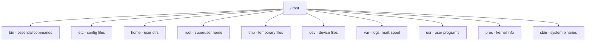
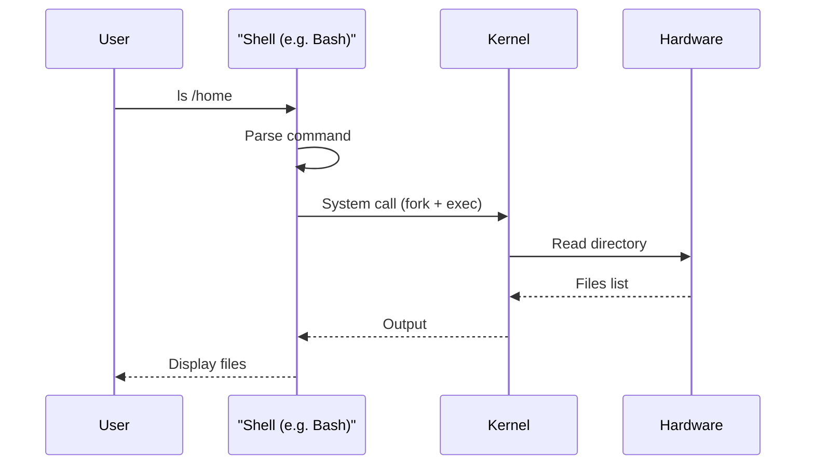

# Chapter 08 — Linux File System, Commands & Shell 🐧

> Linux directory hierarchy (/bin, /etc, /home), basic commands (ls, cd, cp, mkdir, grep), file permissions (rwx + octal 755), Shell (Bash, Zsh)। ৪টা practical Linux question — মুখস্থ-নির্ভর but easy।

---

## 📚 What you will learn

1. **Linux File System Hierarchy** — / থেকে বের হওয়া সব directory
2. **Common Linux commands** — ls, cd, cp, mv, rm, chmod, grep
3. **File Permissions (rwx)** — octal calculation (755, 644, ইত্যাদি)
4. **Shell** কী এবং Bash, Zsh-এর difference

---

## 🎯 Question 1 — Linux File System Hierarchy

### কেন এটা important?

Linux know-how-এর foundation। 5 marks definition + listing।

> **Q1: Explain the Linux File System Hierarchy.**

### 1. Single-Tree Structure

Unlike Windows (which uses C:, D: drives), Linux uses a **single tree structure** starting from the **Root (`/`)**।



### 2. Key Directories — Detailed

| Directory | Purpose | Example contents |
|-----------|---------|------------------|
| **`/`** | Root of everything | All others nested here |
| **`/bin`** | Essential **bin**ary executables | `ls`, `cp`, `mv`, `cat`, `bash` |
| **`/sbin`** | **S**ystem **bin**aries (admin only) | `fdisk`, `mount`, `iptables` |
| **`/etc`** | System configuration files | `/etc/passwd`, `/etc/hosts`, `/etc/fstab` |
| **`/home`** | Personal directories for users | `/home/alice`, `/home/bob` |
| **`/root`** | Home directory for **Superuser** (admin) | (separate from `/home`) |
| **`/tmp`** | Temporary files (cleared on reboot) | App scratch files |
| **`/dev`** | Device files (hardware as files) | `/dev/sda1`, `/dev/null`, `/dev/random` |
| **`/var`** | Variable files (logs, mail, spool) | `/var/log/syslog`, `/var/spool/mail` |
| **`/usr`** | User-level programs and libraries | `/usr/bin/`, `/usr/lib/` |
| **`/proc`** | **Virtual** filesystem — kernel/process info | `/proc/cpuinfo`, `/proc/[pid]/status` |
| **`/lib`** | Shared libraries for `/bin` and `/sbin` | `libc.so`, kernel modules |
| **`/boot`** | Kernel and bootloader files | `vmlinuz`, GRUB config |
| **`/media`** | Mount points for removable media | USB, DVD |
| **`/mnt`** | Temporary mount points | manually mounted disks |

### 3. Memory Hook

| Directory | Mnemonic |
|-----------|----------|
| `/bin` | "**Bin**aries (commands)" |
| `/etc` | "Et **C**etera (configs, miscellaneous)" |
| `/home` | "**Home** for users" |
| `/dev` | "**Dev**ices" |
| `/tmp` | "**Temp**orary" |
| `/var` | "**Var**iable (changes a lot)" |
| `/proc` | "**Proc**ess info (virtual)" |

### 4. Linux vs Windows Differences

| | Linux | Windows |
|--|-------|---------|
| Top of tree | `/` | `C:\`, `D:\`, etc. |
| Drive letters | None | C, D, E... |
| Case sensitivity | **YES** (`File.txt` ≠ `file.txt`) | No (same file) |
| Path separator | `/` (forward slash) | `\` (backslash) |
| Hidden files | Start with `.` (e.g., `.bashrc`) | Set "hidden" attribute |

> **Critical exam point:** Linux is **case-sensitive**। `Report.txt` and `report.txt` are **two different files**। On Windows they'd be the same।

---

## 🎯 Question 2 — Common Linux Commands

### কেন এটা important?

3-5 marks "list and explain" question। মুখস্থ + use case।

> **Q2: List and explain common Linux Commands.**

### 1. Essential Commands Cheat Sheet

| Command | Action | Memory Trick |
|---------|--------|--------------|
| `ls` | **L**i**s**t all files in current folder | "List" |
| `cd` | **C**hange **D**irectory | "Change Dir" |
| `pwd` | **P**rint **W**orking **D**irectory | "Print Working Dir" |
| `mkdir` | **M**a**k**e **Dir**ectory | "Make Dir" |
| `rmdir` | **R**e**m**ove empty **Dir**ectory | |
| `rm` | **R**e**m**ove file | "Remove" |
| `cp` | **C**o**p**y file | "Copy" |
| `mv` | **M**o**v**e or rename file | "Move" |
| `cat` | Display / con**cat**enate file content | |
| `chmod` | **Ch**ange file **mod**e (permissions) | "Change Mode" |
| `chown` | **Ch**ange **own**er | "Change Owner" |
| `grep` | Search text inside files | **G**lobal **R**egular **E**xpression **P**rint |
| `find` | Find files by name/attribute | |
| `man` | Show **man**ual page of any command | "Manual" |

### 2. Common Usage Examples

```bash
# Listing
ls                  # files in current directory
ls -l               # long format (permissions, size, date)
ls -a               # show hidden files (starting with .)
ls -lh              # human-readable size

# Navigation
pwd                 # /home/alice
cd /etc             # absolute path
cd ..               # parent directory
cd ~                # home directory
cd -                # last directory

# File manipulation
cp file.txt copy.txt              # copy
cp -r folder/ backup/             # recursive copy
mv old.txt new.txt                # rename
mv file.txt /home/alice/          # move
rm file.txt                       # delete
rm -rf folder/                    # recursive force delete (dangerous!)
mkdir -p path/to/dir              # create with parents

# Viewing files
cat file.txt                      # show all content
less file.txt                     # paged view (q to quit)
head -n 10 file.txt               # first 10 lines
tail -n 10 file.txt               # last 10 lines
tail -f log.txt                   # follow new lines (live log)

# Searching
grep "error" log.txt              # find lines with "error"
grep -r "pattern" .               # recursive in current dir
grep -i "Hello" file.txt          # case-insensitive
find . -name "*.md"               # find all .md files

# Permissions
chmod 755 script.sh               # rwxr-xr-x
chmod +x script.sh                # add execute for all
chown alice file.txt              # change owner
chgrp users file.txt              # change group

# Help
man ls                            # manual for ls
ls --help                         # quick help
```

### 3. Process Commands (Bonus)

| Command | Action |
|---------|--------|
| `ps` | List current processes (snapshot) |
| `top` | Live process monitor |
| `htop` | Top with colors and scrolling |
| `kill <PID>` | Terminate process |
| `nice -n 10 ./prog` | Start with priority |
| `renice 5 -p 1234` | Change running process priority |

### 4. System Info Commands

| Command | Action |
|---------|--------|
| `df` | Disk free (per filesystem) |
| `du -sh dir/` | Disk usage of a directory |
| `free -h` | Memory usage |
| `uname -a` | System info (kernel, hostname) |
| `whoami` | Current username |
| `date` | Current date/time |
| `uptime` | System uptime |

---

## 🎯 Question 3 — Linux File Permissions (rwx + octal)

### কেন এটা important?

High-value question — definition + numerical। 5 marks।

> **Q3: How do Linux File Permissions work?**

### 1. The Three User Types

In Linux, every file has permissions for three types of users:

| Type | Symbol | Description |
|------|--------|-------------|
| **Owner** | `u` (user) | The person who created the file |
| **Group** | `g` | A collection of users sharing the file |
| **Others** | `o` | Everyone else on the system |

### 2. The Three Permissions (rwx format)

| Permission | Letter | Numeric Value | Meaning |
|------------|--------|---------------|---------|
| **Read** | `r` | **4** | View file content / list directory |
| **Write** | `w` | **2** | Modify file / create-delete in directory |
| **Execute** | `x` | **1** | Run as program / enter directory |

### 3. Reading `ls -l` Output

```
-rwxr-xr-- 1 alice users 1234 May 1 12:00 script.sh
 │└┬┘└┬┘└┬┘
 │ │  │  └── Others: r-- (read only)
 │ │  └────── Group: r-x (read + execute)
 │ └───────── Owner: rwx (read + write + execute)
 └────────── File type (- = file, d = dir, l = link)
```

### 4. Octal Permission Calculation

Add up the numbers for each user type:

| Permission | Octal |
|------------|-------|
| `---` (none) | 0 |
| `--x` | 1 |
| `-w-` | 2 |
| `-wx` | 3 |
| `r--` | 4 |
| `r-x` | 5 |
| `rw-` | 6 |
| `rwx` | 7 |

### 5. Common Examples

**Example 1: `chmod 755`**

| Position | Number | Permission |
|----------|--------|------------|
| Owner | 7 = 4+2+1 | rwx (full) |
| Group | 5 = 4+1 | r-x (read+execute, no write) |
| Others | 5 = 4+1 | r-x (read+execute, no write) |

→ `rwxr-xr-x` — typical for scripts and executables

**Example 2: `chmod 644`**

| Position | Number | Permission |
|----------|--------|------------|
| Owner | 6 = 4+2 | rw- (read + write) |
| Group | 4 | r-- (read only) |
| Others | 4 | r-- (read only) |

→ `rw-r--r--` — typical for config files

**Example 3: `chmod 600`**

| Position | Number | Permission |
|----------|--------|------------|
| Owner | 6 | rw- |
| Group | 0 | --- |
| Others | 0 | --- |

→ `rw-------` — owner only (e.g., SSH private keys)

**Example 4: `chmod 777`** ⚠️

→ `rwxrwxrwx` — everyone can do everything। **Insecure!** Avoid in production।

### 6. Symbolic chmod (Alternative)

```bash
chmod u+x file.sh          # add execute for owner
chmod g-w file.sh          # remove write from group
chmod o=r file.sh          # set others to read only
chmod a+r file.sh          # add read for all (a = u+g+o)
```

### 7. Summary Trick

> **মুখস্থ ছড়া:** "৪ পড়ো, ২ লিখো, ১ চালাও।"
>
> Read = 4, Write = 2, Execute = 1
>
> চাইলে যেকোনো combination যোগ করো।

---

## 🎯 Question 4 — Shell

### কেন এটা important?

3-5 marks "definition + types" question।

> **Q4: What is a "Shell" in an Operating System?**

### 1. Definition

The **Shell** is a special user program that provides an **interface to use operating system services**। It takes **human-readable commands** from the user and converts them into something the **kernel can understand**।

### 2. How Shell Works



### 3. Common Shells

| Shell | Where | Notes |
|-------|-------|-------|
| **Bash (Bourne Again Shell)** | Most common in Linux | Default in Ubuntu, Debian, RHEL |
| **Zsh (Z Shell)** | macOS default; popular for customization | Oh My Zsh framework popular |
| **Fish (Friendly Interactive Shell)** | Modern alternative | Auto-suggestions, syntax highlighting |
| **Sh (Bourne Shell)** | Original POSIX shell | Minimal, scripting compatibility |
| **PowerShell** | Advanced shell for Windows | Object-based instead of text |
| **Cmd / cmd.exe** | Windows old | Legacy command prompt |

### 4. Shell Capabilities

✅ **Command execution** — run programs
✅ **Scripting** — `.sh` files automate tasks
✅ **I/O redirection** — `>`, `>>`, `<`, `|` (pipe)
✅ **Variable expansion** — `$HOME`, `$PATH`
✅ **Job control** — `bg`, `fg`, `jobs`, `&`
✅ **History** — up arrow, `Ctrl+R` search
✅ **Tab completion**

### 5. Example: Bash Script

```bash
#!/bin/bash
# Simple backup script

DATE=$(date +%Y-%m-%d)
mkdir -p ~/backup
cp -r ~/Documents/ ~/backup/docs_$DATE
echo "Backup done: $DATE"
```

### 6. Final "Bank Exam" Concept: Case Sensitivity

> **Linux is case-sensitive, Windows is not.**
>
> In Linux: `File.txt` and `file.txt` are **two completely different files**।
> In Windows: same file।

---

## 📋 Quick Recap Table

| Concept | Key fact |
|---------|----------|
| Linux root | `/` (single tree, no drive letters) |
| `/bin` | Essential commands |
| `/etc` | System config |
| `/home` | User personal dirs |
| `/dev` | Device files |
| `/proc` | Virtual filesystem (kernel info) |
| Case sensitivity | YES in Linux |
| `ls` | List files |
| `cd` | Change directory |
| `cp` / `mv` / `rm` | Copy / move / delete |
| `chmod` | Change permissions |
| `chown` | Change owner |
| `grep` | Search inside files |
| `man` | Show manual |
| Read | 4 |
| Write | 2 |
| Execute | 1 |
| 755 | rwxr-xr-x (executables) |
| 644 | rw-r--r-- (configs) |
| 600 | rw------- (private) |
| Shell | Command interpreter |
| Bash | Default Linux shell |
| Zsh | Default macOS shell |
| PowerShell | Windows advanced shell |

---

## 🎓 কোর্স শেষ — পরের ধাপ

🎉 **Congratulations!** ৩৩টা written question + ৮টা chapter সম্পূর্ণ। এখন:

1. **Math drill (most important):**
   - SRTF Gantt chart — ৫টা different example দিয়ে practice
   - LRU page replacement — ৫ frame, ১০ page reference string
   - Internal fragmentation calculation
   - chmod 755 / 644 / 600-এর rwx breakdown

2. **Diagram practice:**
   - Process state diagram (5 states + transitions)
   - Resource Allocation Graph (cycle drawing)
   - Boot sequence (BIOS → POST → MBR → Bootloader → Kernel)
   - Memory hierarchy (Register → Cache → RAM → Disk)

3. **Mock test:**
   - Random ৫টা question pick করুন
   - ৬০ মিনিটে full answer লিখুন (per Q ১২ মিনিট)
   - নিজে evaluate — definition + diagram + table আছে কিনা

### Self-Assessment Checklist

| Topic | Confident (Y/N) |
|-------|-----------------|
| Process states diagram | __ |
| PCB fields | __ |
| FCFS / RR / SRTF Gantt math | __ |
| 4 deadlock conditions | __ |
| RAG diagram drawing | __ |
| Semaphore P/V operation | __ |
| Paging mechanism | __ |
| Internal vs External fragmentation | __ |
| Logical vs Physical address + MMU | __ |
| Virtual memory + Thrashing cycle | __ |
| FIFO + LRU numerical | __ |
| Belady's anomaly | __ |
| FCFS / SSTF disk scheduling | __ |
| RAID 0/1/5/10 | __ |
| Spooling vs Buffering | __ |
| 6 OS functions | __ |
| Monolithic vs Microkernel | __ |
| Cache + Locality (Temporal/Spatial) | __ |
| FAT vs i-node | __ |
| Boot sequence | __ |
| chmod octal (755, 644, 600) | __ |
| Linux directory hierarchy | __ |

৩-এর কম confident? সেই chapter আবার read করুন। ৪-৫ confident? অন্য practice দিন।

---

> ✨ **Best of luck for your Bangladesh Bank Officer (IT) / AME (IT) written exam!** আপনি weak student না — শুধু এই material-টা পেতে দেরি হয়েছিল। এখন প্রস্তুতি complete। ✨

→ [Back to Master Index](00-master-index.md)
