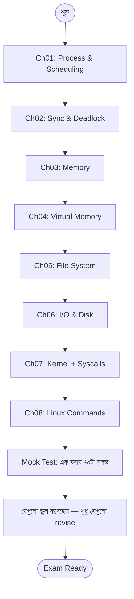

# Operating System MCQ Practice — Master Index 🖥️

> ৭০টা high-quality OS MCQ — Process / Scheduling / Sync / Deadlock / Memory / Virtual Memory / File System / I/O / Linux — সব standard topic cover।
> Bank IT, BCS Computer, NTRCA, university viva, GATE preliminary — যেকোনো IT competitive exam-এর জন্য fast revision-এর tool।

---

## 🎯 এই Practice Set কেন?

Operating System theory পড়ে শেষ করার পর সবাই একই সমস্যায় পড়ে — **প্রশ্ন দেখলে উত্তর দিতে পারি না।** কারণ পড়াশোনাটা ছিল passive — পড়েছি, কিন্তু "এই concept-টা কীভাবে question আকারে আসতে পারে" সেটা train করিনি।

এই 70-question set তৈরি Gemini-র সাথে interactive Q&A session থেকে — প্রতিটা প্রশ্ন এমনভাবে structured যেটা **previous year exam pattern**-এর সাথে মেলে। প্রতিটা MCQ-এর সাথে:

- ✅ Correct answer marked
- 🇧🇩 Bangla-তে concept-এর ব্যাখ্যা
- 🎯 কেন বাকি options ভুল — quick rejection logic
- 🔁 Related concept reference (যেটা একই exam-এ পরের প্রশ্ন হিসেবে আসতে পারে)

---

## 📋 Exam-এ এই MCQ গুলো কোথায় কাজে লাগবে

| Exam | OS-এর weight | এই set-এর coverage |
|------|--------------|--------------------|
| **Bangladesh Bank Officer (IT) / AD (IT)** | 15-20% MCQ | প্রায় ১০০% — process, memory, file system, Linux command |
| **BCS Computer (Technical)** | প্রায় ২০টা MCQ | ৭০টা থেকে ৪০-৫০টা directly applicable |
| **NTRCA Computer/IT** | OS chapter | scheduling + memory অংশ পুরোপুরি |
| **University Final / Viva** | textbook চ্যাপ্টার | concept verification |
| **GATE Prelim / Online IT job** | algorithmic + conceptual | numerical সহ পুরোটাই |

---

## 📚 Chapter Map

৭০টা MCQ topic অনুযায়ী ৮টা chapter-এ ভাগ করা হয়েছে।

| # | Chapter | Topics covered | Q count |
|---|---------|----------------|---------|
| 01 | [Process Management & CPU Scheduling](01-process-scheduling.md) | Process states, threads, context switch, FCFS, SJF, RR, HRRN, Multi-level Queue, Convoy Effect, Preemption | 14 |
| 02 | [Synchronization & Deadlock](02-sync-deadlock.md) | Critical section, Semaphore, Mutex, P/V operation, 4 deadlock conditions, Banker's, Ostrich algorithm, Progress | 12 |
| 03 | [Memory Management & Fragmentation](03-memory-management.md) | Paging, page table, internal/external fragmentation, compaction, swapping, locality, offset bits | 10 |
| 04 | [Virtual Memory & Page Replacement](04-virtual-memory.md) | Virtual memory, demand paging, page fault, TLB, FIFO/LRU/Optimal, Belady's anomaly, dirty bit, thrashing, inverted page table | 9 |
| 05 | [File Systems & Storage](05-file-systems.md) | FAT, inode, superblock, hard/soft links, RAID 0/1/5/6, volatile vs non-volatile | 5 |
| 06 | [I/O Systems & Disk Scheduling](06-io-disk.md) | SSTF, SCAN, C-SCAN, LOOK, DMA, cycle stealing, polling, interrupt I/O | 4 |
| 07 | [OS Architecture, Kernel & System Calls](07-kernel-syscalls.md) | Bootloader, kernel role, microkernel, fork/exec/wait/exit, IPC, system call interface | 6 |
| 08 | [Linux Commands, Shell & Security](08-linux-shell-security.md) | chmod / chown / top / ps / renice / man, file permissions (rwx → octal), shell, /etc, Least Privilege | 10 |

মোট প্রশ্ন: **70**

---

## 🛣️ Suggested Practice Sequence

প্রথম ৪টা chapter সবচেয়ে heavy — এগুলো ২-৩ বার করে practice করুন। শেষের ৪টা compact, এক sitting-এ শেষ করা যায়।

---

## 🧠 Key Patterns Examiner-রা ভালোবাসেন

### 1. "NOT" / "EXCEPT" type questions

> "Which of the following is **NOT** one of the four necessary conditions for a Deadlock?"

এই ধরনের প্রশ্নে আপনাকে চেনা ৩টা option বাদ দিয়ে **odd one out** খুঁজতে হবে। Trap: যে option-টা শুনতে অনেকটা মিল লাগে কিন্তু আসল না (যেমন "Preemption" বনাম "No Preemption")।

### 2. Numerical with quick formulas

> "Page size 4 KB হলে offset কত bit?"

মুখস্থ formula: `offset = log₂(page size)`। 4 KB = 2¹² → 12 bits।

| Page size | Offset bits |
|-----------|-------------|
| 1 KB | 10 |
| 4 KB | 12 |
| 8 KB | 13 |
| 16 KB | 14 |
| 64 KB | 16 |

### 3. Concept comparison

> "Mutex বনাম Semaphore-এর মধ্যে primary difference কী?"

মুখস্থ ১টা punchline থাকা চাই: **"Mutex-এর ownership থাকে, Semaphore-এর থাকে না।"**

### 4. Edge case / extreme value behavior

> "Round Robin-এ time quantum extremely large হলে কী হয়?"

Trick: extreme-এ algorithm-টা অন্য algorithm-এর মতো behave করে। বড় quantum → FCFS, ছোট quantum → বেশি context switch।

### 5. Linux command identification

> "File permission change করার command কোনটা?"

মুখস্থ ছোট cheat sheet:

| Action | Command |
|--------|---------|
| Permission change | `chmod` |
| Owner change | `chown` |
| Group change | `chgrp` |
| Process list (snapshot) | `ps` |
| Process list (live) | `top` / `htop` |
| Priority change (running) | `renice` |
| Priority set (start) | `nice` |
| Help / manual | `man` |

---

## 🔥 Most Asked Concepts (priority list)

আগের ৫ বছরের bank/BCS exam analyze করে এই concept গুলো প্রথমে শক্ত করুন:

1. **Process states + transitions** (5-state model) — Ch 01
2. **CPU scheduling algorithms tradeoff** — Ch 01
3. **Four conditions of deadlock + Banker's** — Ch 02
4. **Semaphore vs Mutex difference** — Ch 02
5. **Page table mapping + offset calculation** — Ch 03
6. **Internal vs External fragmentation** — Ch 03
7. **Page replacement (FIFO, LRU, Optimal) + Belady's** — Ch 04
8. **Thrashing** — Ch 04
9. **fork() / exec() system calls** — Ch 07
10. **chmod permission octal (rwx = 4+2+1)** — Ch 08

এই ১০টা concept-এ যদি দখল থাকে, ৭০টার মধ্যে অন্তত ৫০টা সরাসরি সলভ হয়ে যাবে।

---

## ⚠️ Common Mistakes / Traps

1. **"Preemption" vs "No Preemption"** — deadlock-এর condition হলো *No Preemption*, শুধু "Preemption" নয়। এই word-এর negation মিস করলে Q3 মতো প্রশ্নে ভুল হবে।

2. **Belady's Anomaly direction** — frame *বাড়ালে* page fault *বাড়ে*, কমে না। FIFO-তে এটা ঘটে, LRU-তে না।

3. **Internal vs External fragmentation** —
   - Internal = block বড়, process ছোট, ভেতরে wastage
   - External = total free যথেষ্ট, কিন্তু scattered
   উল্টোটা মুখস্থ থাকলে গণ্ডগোল হয়।

4. **Octal permission** — read=4, write=2, execute=1। `chmod 6` মানে rw- (read + write, no execute), না rwx।

5. **Hard link vs Symbolic link** — hard link inode-share করে, soft link path-store করে। Source file delete করলে hard link কাজ করে, soft link ভেঙে যায়।

---

## 📖 কীভাবে এই material ব্যবহার করবেন

### Round 1 — Concept-first read

প্রতিটা chapter-এর top-এ "Concept Refresher" আছে — সেটা পড়ুন আগে। তারপর questions।

### Round 2 — Answer-first solve

Question দেখে নিজে answer পিক করুন, তারপর correct উত্তর মেলান। যেগুলো ভুল করেছেন, সেগুলো highlight করুন।

### Round 3 — Wrong-only revise

শুধু আপনার ভুল করা questions-এর explanation আবার পড়ুন। এতে weakness pattern বেরিয়ে আসবে।

### Round 4 — Mock test (timed)

৭০টা প্রশ্ন এক বসায় ৬০ মিনিটে solve করুন (per question 50 sec)। Score ৭০-এর মধ্যে কত পেলেন note করুন। ৫৫+ মানে exam-ready।

---

## 🔗 External References

- **Operating System Concepts** by Silberschatz, Galvin, Gagne — standard textbook
- **Modern Operating Systems** by Tanenbaum — concise alternate
- **GeeksforGeeks OS section** — extra examples + numerical
- This site-এর full OS course: [Operating System (gated section)](/sections/operating-system) — full theory chapter সহ

---

**শেষ কথা:** OS-এ সবচেয়ে বড় challenge হলো terminology। ৭০টা MCQ একবার সলভ করলেই terminology-র সাথে মানসিকভাবে relation তৈরি হয়। প্রতিটা ভুল answer একটা mental hook — সেই hook-গুলোই exam-এ সঠিক উত্তর দিতে সাহায্য করবে।

> ✨ **Best of luck for your IT/Bank/BCS exam!** ✨
