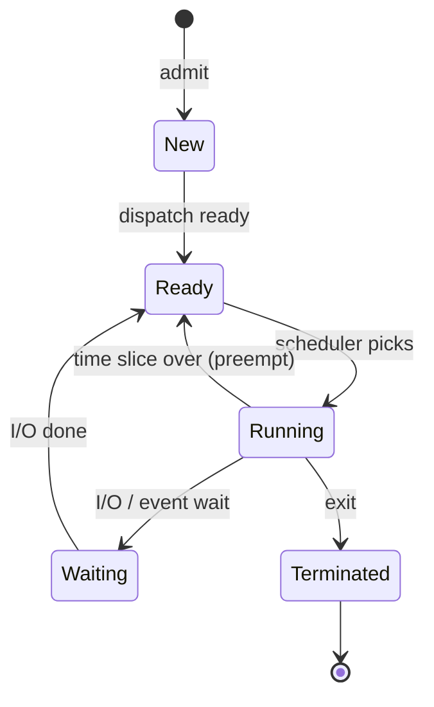
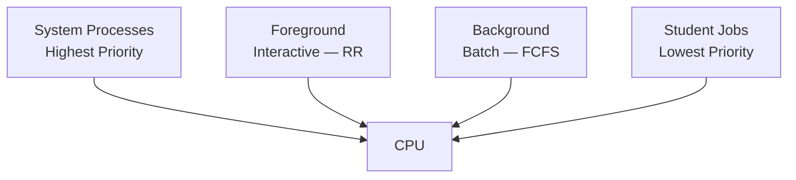
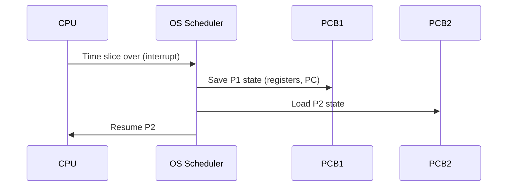

# Chapter 01 — Process Management & CPU Scheduling 🔄

> Process state, thread, context switch, এবং সব major scheduling algorithm — এই chapter-এ ১৪টা MCQ যেগুলো প্রায় প্রতিটা IT exam-এ আসে।

---

## 📚 Concept Refresher (পড়ুন আগে)

### Process States — 5-state model

| State | মানে |
|-------|------|
| **New** | Process তৈরি হচ্ছে, এখনো admit হয়নি |
| **Ready** | RAM-এ আছে, CPU-র জন্য queue-তে অপেক্ষা |
| **Running** | এখন CPU-তে execute হচ্ছে |
| **Waiting** | I/O বা event-এর জন্য থেমে আছে |
| **Terminated** | শেষ হয়ে গেছে |

### Process vs Thread

| | Process | Thread |
|--|---------|--------|
| Memory space | আলাদা | একই process-এর মধ্যে share |
| Creation cost | বেশি | কম |
| Communication | IPC লাগে | direct memory access |
| Crash impact | একটা মরলে অন্যটা বাঁচে | একই process-এর সব thread পড়ে |

### CPU Scheduling Algorithms — quick comparison

| Algorithm | Preemptive? | Best for | Drawback |
|-----------|-------------|----------|----------|
| **FCFS** | না | simplicity | Convoy effect (long জব আগে এলে সব আটকে যায়) |
| **SJF** | হতে পারে | minimize average wait | Long process-এর starvation |
| **Round Robin** | হ্যাঁ | time-sharing | quantum tuning critical |
| **Priority** | হতে পারে | important কাজ আগে | Low priority starvation |
| **HRRN** | না | balance wait+service | computation overhead |
| **Multi-level Queue** | depends | foreground vs background | inflexible |

---

## 🎯 Q1 — Process state: ready বনাম waiting

> **Q1:** Which of the following process states describes a process that is in main memory and waiting for the CPU to become available?

- A. Waiting
- B. New
- **C. Ready** ✅
- D. Running

**Answer:** C

**ব্যাখ্যা:** Ready state-এ process পুরোপুরি প্রস্তুত — RAM-এ লোড আছে, সব resource হাতে, শুধু CPU-র dispatch-এর অপেক্ষায়। *Waiting* state হলো ভিন্ন — তখন process কোনো I/O বা event-এর জন্য আটকে থাকে, CPU পেলেও কাজ করতে পারবে না।

> **Trap:** "Waiting" শব্দটা শুনলে মনে হয় CPU-র জন্য অপেক্ষা — কিন্তু OS terminology-তে Waiting = I/O-র অপেক্ষা।

---

## 🎯 Q2 — Convoy Effect

> **Q2:** Which CPU scheduling algorithm is most likely to cause the 'Convoy Effect'?

- A. Round Robin
- B. Shortest Job First
- C. Priority Scheduling
- **D. First-Come, First-Served (FCFS)** ✅

**Answer:** D

**ব্যাখ্যা:** Convoy effect মানে — একটা long-running process আগে এসে CPU দখল করলে পেছনের সব short process আটকে যায়, পুরো convoy (সারি) আটকে থাকে। FCFS-এ preemption নেই, তাই এটা সবচেয়ে বেশি ঘটে।

```mermaid
gantt
    title FCFS Convoy Effect
    dateFormat X
    axisFormat %s
    section CPU
    Long Process P1 (24s) :a1, 0, 24
    Short P2 (3s) :a2, 24, 27
    Short P3 (3s) :a3, 27, 30
    Short P4 (3s) :a4, 30, 33
```

P2/P3/P4 প্রত্যেকে মাত্র 3 sec-এর কাজ, কিন্তু P1-এর জন্য ২৪ সেকেন্ড অপেক্ষা।

---

## 🎯 Q7 — Round Robin extreme: large quantum

> **Q7:** In a Round Robin scheduling system, what happens when the 'Time Quantum' is made extremely large (e.g., larger than any process's burst time)?

- A. It eliminates the possibility of starvation
- B. It reduces the context switching overhead to zero
- **C. It becomes the same as First-Come, First-Served (FCFS)** ✅
- D. It becomes the same as Shortest Job First

**Answer:** C

**ব্যাখ্যা:** Quantum যদি যেকোনো process-এর burst time-এর চেয়ে বড় হয়, তাহলে কোনো process-ই preempt হবে না — পুরো burst time চালিয়ে শেষ করবে। ফলে effectively FCFS।

| Quantum extreme | Behavior |
|-----------------|----------|
| Very large (>burst) | FCFS এর মতো |
| Very small (≈context switch time) | overhead-এ গিলে ফেলে, কোনো useful কাজ হয় না |
| Optimal | 80% process burst time-এর চেয়ে quantum বড় থাকা ভালো |

---

## 🎯 Q24 — SJF-এর প্রধান সমস্যা

> **Q24:** What is the primary disadvantage of using the 'Shortest Job First' (SJF) scheduling algorithm?

- **A. Starvation of long processes** ✅
- B. High context switching overhead
- C. Poor CPU utilization
- D. It is too simple to implement

**Answer:** A

**ব্যাখ্যা:** SJF-এ যদি short job-গুলো একের পর এক আসতে থাকে, তাহলে long process queue-এর শেষে থাকেই — কখনো CPU পায় না। এটাই **starvation**।

> **Solution:** Aging — যত বেশি wait করছে, ততই priority বাড়িয়ে দাও। শেষমেশ সবার সিরিয়াল আসবেই।

---

## 🎯 Q27 — Hard Real-Time OS

> **Q27:** Which of the following is a characteristic of a 'Hard Real-Time' Operating System?

- **A. Strict adherence to deadlines is mandatory for system safety** ✅
- B. It focuses on giving all users an equal share of the CPU
- C. It can only run one process at a time
- D. Missing a deadline is acceptable occasionally

**Answer:** A

**ব্যাখ্যা:** Hard real-time OS-এ deadline miss করা মানে catastrophic failure — যেমন airbag deployment, flight control, pacemaker। 1ms দেরি = জীবনের ঝুঁকি।

| Real-Time Type | Deadline miss-এর consequence | Example |
|----------------|------------------------------|---------|
| **Hard** | System failure, ক্ষতি | Airbag, flight control |
| **Firm** | Result useless, কিন্তু ক্ষতি নেই | Live streaming frame drop |
| **Soft** | Quality drop, কাজ চলবে | Video playback, gaming |

---

## 🎯 Q34 — Multi-level Queue

> **Q34:** Which of the following is an example of a 'Multi-level Queue' scheduling policy?

- A. A system that uses only Round Robin for all tasks
- B. A system that only runs one process at a time until it finishes
- **C. A system that separates foreground (interactive) and background (batch) processes into different queues** ✅
- D. A system that deletes processes if they take too long

**Answer:** C

**ব্যাখ্যা:** Multi-level queue-এর মূল idea — process-এর nature অনুযায়ী আলাদা queue। সাধারণ ভাগ:

প্রতিটা queue-এর নিজের scheduling algorithm থাকতে পারে। উপরের queue খালি না হওয়া পর্যন্ত নিচেরটা CPU পায় না (strict priority)।

---

## 🎯 Q35 — Program বনাম Process

> **Q35:** What is the difference between a 'Program' and a 'Process'?

- A. There is no difference; the terms are interchangeable
- B. A program is written in C#, but a process is written in Java
- C. A program is active, and a process is passive
- **D. A program is a passive entity stored on disk, while a process is an active entity in execution** ✅

**Answer:** D

**ব্যাখ্যা:** Program = disk-এ পড়ে থাকা একটা executable file (যেমন `chrome.exe`)। যখন double-click করলেন, OS সেটাকে memory-তে load করে, একটা PCB বানায় — তখন সেটা **process**। একই program multiple process হতে পারে (২টা Chrome window = ২টা process)।

| | Program | Process |
|--|---------|---------|
| Storage | Disk | RAM |
| State | Static | Dynamic (states change) |
| Resource | None | CPU time, memory, files, devices |
| Lifetime | Permanent (delete না করা পর্যন্ত) | Temporary (exit হলেই শেষ) |

---

## 🎯 Q47 — Time-sharing-এর জন্য কোন algorithm?

> **Q47:** Which scheduling algorithm is designed specifically for time-sharing systems?

- A. SJF
- B. FCFS
- **C. Round Robin** ✅
- D. Priority Scheduling

**Answer:** C

**ব্যাখ্যা:** Time-sharing system-এর goal — সব user-কে CPU-র সমান share দেওয়া যাতে interactive feel আসে। Round Robin-এ fixed quantum-এ rotate হয়, প্রত্যেকে সমান turn পায়।

> **Bonus:** Linux desktop-এ scheduler হলো **CFS (Completely Fair Scheduler)** — এটা RR-এর evolved form, virtual runtime-এর basis-এ schedule করে।

---

## 🎯 Q52 — Ready state-এ কীসের অপেক্ষা?

> **Q52:** In the 'Ready' state, a process is waiting for which resource?

- A. A User Input
- B. Main Memory (RAM)
- **C. The CPU** ✅
- D. The I/O Device

**Answer:** C

**ব্যাখ্যা:** Q1-এর confirm version। Ready = RAM-এ আছে, সব resource ready, শুধু CPU-র জন্য অপেক্ষা। User input বা I/O-র জন্য অপেক্ষা হলে process *Waiting* state-এ যেত।

---

## 🎯 Q57 — Thread vs Process

> **Q57:** Which of the following is true about 'Threads' compared to 'Processes'?

- A. Threads cannot run on multiple CPU cores.
- B. Threads are more expensive to create than processes.
- **C. Threads within the same process share the same memory space.** ✅
- D. Threads are completely independent of each other.

**Answer:** C

**ব্যাখ্যা:** Thread-এর সবচেয়ে বড় বৈশিষ্ট্য — same process-এর সব thread একই address space share করে (heap, code, data segment)। এতে communication সহজ, কিন্তু concurrency bug-ও বেশি (race condition)।

| Property | Process | Thread |
|----------|---------|--------|
| Memory | আলাদা | shared (heap/data/code) |
| Stack | আলাদা | প্রতি thread-এর নিজস্ব stack |
| Creation cost | বেশি | কম (~১০x faster) |
| CPU cores | multiple processes ✓ | multiple threads ✓ (modern) |
| Crash isolation | আছে | নেই — এক thread crash = process crash |

---

## 🎯 Q58 — Preemption কী?

> **Q58:** What is 'Preemption' in the context of CPU scheduling?

- A. Deleting a process from the hard drive
- B. Increasing the priority of a process as it waits
- **C. The ability of the OS to stop a running process to give the CPU to another process** ✅
- D. Allowing a process to run until it finishes voluntarily

**Answer:** C

**ব্যাখ্যা:** Preemption = OS-এর ক্ষমতা যে যেকোনো সময় চলমান process-কে থামিয়ে CPU অন্য process-কে দিতে পারে। এটা Round Robin, SRTF, Preemptive Priority-তে আছে। FCFS / non-preemptive SJF-এ নেই।

> **Trap:** "Increasing priority as it waits" হলো **Aging**, preemption না।

---

## 🎯 Q64 — HRRN (Highest Response Ratio Next)

> **Q64:** Which scheduling algorithm is non-preemptive and selects the process with the smallest ratio of (Waiting Time + Service Time) / Service Time?

- A. Multilevel Feedback Queue
- **B. Highest Response Ratio Next (HRRN)** ✅
- C. Shortest Remaining Time First (SRTF)
- D. Priority Scheduling

**Answer:** B

**ব্যাখ্যা:** Question-এ একটা ছোট ভুল আছে — actual HRRN formula:

$$\text{Response Ratio} = \frac{\text{Waiting Time} + \text{Service Time}}{\text{Service Time}}$$

এবং algorithm **highest** ratio-র process পিক করে (smallest না)। Question-এ "smallest" বলা থাকলেও, available options-এর মধ্যে HRRN-ই formula-র সাথে match করে।

**HRRN-এর সুবিধা:** SJF-এর starvation problem solve করে। যত বেশি wait, তত response ratio বাড়ে → eventually CPU পাবেই।

---

## 🎯 Q68 — Context Switch

> **Q68:** What happens during a 'Context Switch' between two processes?

- A. The operating system kernel is reinstalled from the disk.
- **B. The state of the current process is saved, and the state of the next process is loaded.** ✅
- C. The CPU cache is entirely cleared and replaced with zeros.
- D. All open files are automatically closed and saved.

**Answer:** B

**ব্যাখ্যা:** Context switch-এ OS:

1. বর্তমান process-এর সব register, PC, stack pointer-এর state PCB-তে save করে
2. পরের process-এর PCB থেকে state restore করে
3. PC re-load করে — নতুন process যেখানে থেমেছিল সেখান থেকে চলে

**Context switch overhead** — এই save/restore-এ CPU cycle যায়, কোনো useful কাজ হয় না। তাই খুব ঘন ঘন switch করলে throughput কমে।

---

## 🎯 Q70 — Running → Ready transition

> **Q70:** In the 'Five-State' process model, which transition occurs when a process in the 'Running' state is interrupted by the scheduler because its time slice has expired?

- A. Running to Terminated
- **B. Running to Ready** ✅
- C. Running to Waiting
- D. Waiting to Ready

**Answer:** B

**ব্যাখ্যা:** Time slice শেষ হলে process এখনো কাজ শেষ করেনি, এখনো CPU দরকার — তাই *Ready* queue-তে ফিরে যায়। যদি I/O-র জন্য থামত, তাহলে *Waiting*। যদি `exit()` call করত, তাহলে *Terminated*।

| Trigger | From | To |
|---------|------|-----|
| Time slice expired | Running | Ready |
| I/O request | Running | Waiting |
| `exit()` call | Running | Terminated |
| I/O complete | Waiting | Ready |
| Scheduler dispatch | Ready | Running |
| Process created | New | Ready |

---

## 📋 Quick Recap Table

| Concept | Key fact |
|---------|----------|
| Convoy Effect | FCFS-এ short job-রা long job-এর পেছনে আটকা |
| RR with large quantum | FCFS-এর মতো হয়ে যায় |
| SJF main issue | Long process starvation |
| HRRN trick | Wait time বাড়লে priority বাড়ে — SJF-এর starvation fix |
| Hard real-time | Deadline miss = catastrophic |
| Thread share | Same process-এর memory (heap/data/code) |
| Preemption | OS ক্ষমতা — running process থামিয়ে অন্যকে CPU দেওয়া |
| Context switch | PCB-তে state save + load |
| Running→Ready | Time slice expire হলে |
| Running→Waiting | I/O request করলে |

---

## 🔁 Next Chapter

পরের chapter-এ আমরা দেখব **Synchronization & Deadlock** — যখন একাধিক process একই resource-এর জন্য লড়াই করে কী হয়, এবং OS সেটা কীভাবে সামাল দেয়।

→ [Chapter 02: Synchronization & Deadlock](02-sync-deadlock.md)
