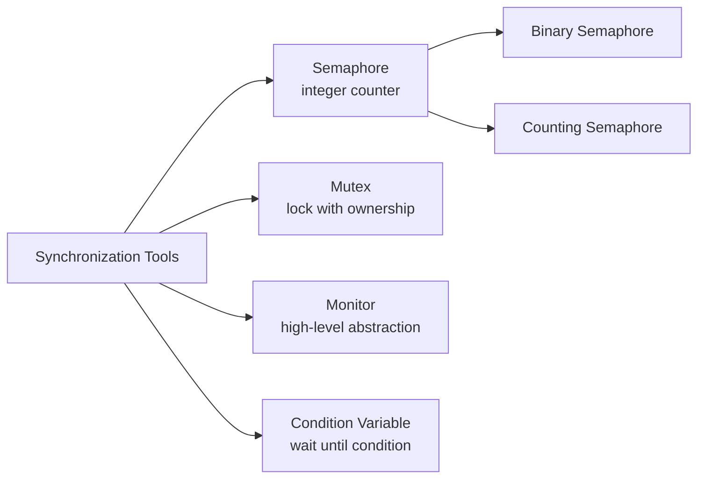
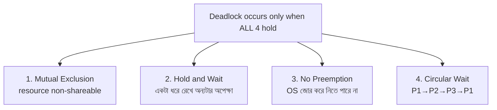
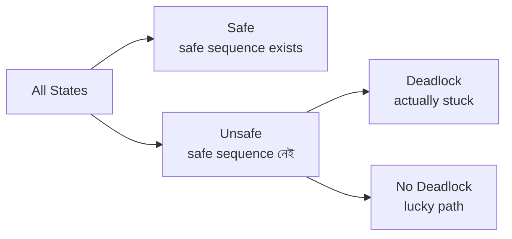

# Chapter 02 — Synchronization & Deadlock 🔒

> Critical section, Semaphore, Mutex, Deadlock-এর চারটা শর্ত, Banker's Algorithm — process synchronization আর deadlock-এর ১২টা MCQ।

---

## 📚 Concept Refresher

### Critical Section Problem

একসাথে অনেক process একটা shared resource ব্যবহার করতে চাইলে race condition হয়। তিনটা শর্ত পূরণ করতে হবে:

| শর্ত | কী চায় |
|------|---------|
| **Mutual Exclusion** | একই সময়ে শুধু একটাই critical section-এ |
| **Progress** | যদি কেউ critical section-এ না থাকে, যেকোনো interested process ঢুকতে পারবে — outsider কাউকে block করবে না |
| **Bounded Waiting** | কেউ চাইলে limited সময়ের মধ্যে ঢোকার সুযোগ পাবে — চিরকাল wait না |

### Synchronization Tools



| Tool | কী | কখন ব্যবহার |
|------|-----|------------|
| **Semaphore** | Integer counter — `wait()` (P), `signal()` (V) | resource pool, producer-consumer |
| **Mutex** | একটা lock যেটা **ownership** রাখে — যে lock করেছে, সে-ই unlock করতে পারে | critical section protect |
| **Monitor** | Object-oriented sync construct (Java synchronized) | abstract করে সহজে coding |
| **Spinlock** | Mutex-এর variant, busy-wait করে | very short critical section |

### Deadlock — চার শর্ত



চারটার যেকোনো একটা ভাঙলে deadlock impossible।

### Deadlock Handling Strategies

| Strategy | Approach | Tradeoff |
|----------|----------|----------|
| **Prevention** | চার শর্তের একটা স্থায়ীভাবে ভাঙো | conservative, resource utilization কম |
| **Avoidance** | runtime-এ check (Banker's algo) | computation overhead |
| **Detection + Recovery** | হোক, পরে fix করব | system inconsistency-র ঝুঁকি |
| **Ostrich** | উপেক্ষা করো | মাঝেমাঝে hang হবে, reboot |

---

## 🎯 Q3 — Deadlock-এর শর্ত নয় কোনটা?

> **Q3:** Which of the following is NOT one of the four necessary conditions for a Deadlock to occur?

- **A. Preemption** ✅
- B. Hold and Wait
- C. Mutual Exclusion
- D. Circular Wait

**Answer:** A

**ব্যাখ্যা:** Deadlock-এর শর্ত হলো **No Preemption** — OS resource জোর করে কেড়ে নিতে পারে না। Question-এর "Preemption" শব্দটা এর উল্টো — যদি preemption থাকে, deadlock break হবে। তাই এটাই odd one out।

> **Trap:** এক word-এর negation মিস করলে ভুল হবে। "Preemption" ≠ "No Preemption"।

---

## 🎯 Q6 — Resource জোর করে নেওয়া যায় না — কোন শর্ত?

> **Q6:** Which of the following conditions for deadlock refers to the situation where a resource cannot be forcibly taken from a process?

- A. Circular Wait
- **B. No Preemption** ✅
- C. Hold and Wait
- D. Mutual Exclusion

**Answer:** B

**ব্যাখ্যা:** শব্দটাই বলে দেয় — "No Preemption" মানে preemption নেই, অর্থাৎ resource কেড়ে নেওয়া যায় না। Process নিজে ছাড়লে তবেই অন্য কেউ পাবে।

| শর্ত | এক লাইনে |
|------|----------|
| **Mutual Exclusion** | একসাথে দুজন ব্যবহার করতে পারে না |
| **Hold and Wait** | একটা ধরে রেখে অন্যটার জন্য অপেক্ষা |
| **No Preemption** | জোর করে কেড়ে নেওয়া যায় না |
| **Circular Wait** | একটা loop তৈরি — A→B→C→A |

---

## 🎯 Q19 — Ostrich Algorithm

> **Q19:** What is the 'Ostrich Algorithm' in deadlock management?

- A. A method to detect deadlocks using resource allocation graphs
- **B. An algorithm that ignores the problem and pretends it never happens** ✅
- C. A complex algorithm to prevent deadlocks from ever occurring
- D. A way to speed up process execution by 50%

**Answer:** B

**ব্যাখ্যা:** Ostrich (উটপাখি) বালিতে মাথা গুঁজে দিয়ে বিপদ থেকে লুকায় — এই algorithm-ও ঠিক তেমনই। OS deadlock-কে ignore করে। Linux, Windows-এও মূলত ostrich approach — কারণ deadlock খুব rare, prevention-এর cost বেশি।

> **কেন এটা valid strategy:** Real systems-এ deadlock-এর frequency এত কম যে detection-এর overhead এতেই বেশি। Hang করলে user reboot করবে।

---

## 🎯 Q23 — Proactive deadlock strategy

> **Q23:** Which of the following is a proactive strategy for dealing with deadlocks by ensuring at least one of the four necessary conditions cannot hold?

- A. Deadlock Recovery
- B. Deadlock Detection
- C. The Ostrich Algorithm
- **D. Deadlock Prevention** ✅

**Answer:** D

**ব্যাখ্যা:** **Prevention** = আগে থেকে design করেই চারটা শর্তের একটা অসম্ভব করে দেওয়া। *Avoidance* হলো runtime check (যেমন Banker's), *Detection* হলো ঘটার পর খুঁজে বের করা।

| Strategy | Timing | Example |
|----------|--------|---------|
| **Prevention** | Static design-time | Hold-Wait এড়াতে শুরুতেই সব resource নাও |
| **Avoidance** | Runtime, before allocation | Banker's algorithm |
| **Detection** | After it happens | Resource allocation graph cycle search |
| **Recovery** | After detection | Process kill / rollback |

---

## 🎯 Q32 — Semaphore কী?

> **Q32:** What is a 'Semaphore' in process synchronization?

- A. A command used to delete temporary system files
- B. A hardware device used to speed up the CPU
- **C. An integer variable used to manage access to shared resources by multiple processes** ✅
- D. A type of virus that locks the computer's screen

**Answer:** C

**ব্যাখ্যা:** Semaphore = integer counter + দুটো atomic operation:

- **wait()** / **P()** → counter কমাও, যদি negative হয় block
- **signal()** / **V()** → counter বাড়াও, blocked process থাকলে wake up

```c
// Producer-Consumer using semaphore
semaphore empty = N;   // empty slots
semaphore full = 0;    // filled slots
semaphore mutex = 1;   // exclusive access

producer() {
    wait(empty);    // slot পেলে এগোও
    wait(mutex);    // queue lock
    add_item();
    signal(mutex);
    signal(full);
}
```

**Binary semaphore** = 0/1 only (mutex-এর মতো)। **Counting semaphore** = কোনো integer।

---

## 🎯 Q36 — wait() / P() operation

> **Q36:** What is the function of the 'Wait' (or P) operation in a Binary Semaphore?

- A. It forces the CPU to restart the current process
- B. It increments the semaphore value
- **C. It decrements the semaphore value and blocks if it becomes negative** ✅
- D. It deletes the semaphore from the system memory

**Answer:** C

**ব্যাখ্যা:** P operation pseudocode:

```
P(S):
    S = S - 1
    if S < 0:
        block current process, add to queue
```

V operation উল্টো — S বাড়ায়, queue-এ কেউ থাকলে wake up করে।

> **Memory hook:** P = Probeer (Dutch for "to test/decrement"), V = Verhoog ("to increment")। Dijkstra-র ভাষা।

---

## 🎯 Q37 — Direct deadlock solution

> **Q37:** Which of the following is a 'Direct' way to solve the Deadlock problem by making a process release its resources?

- A. Safe State Analysis
- B. Mutual Exclusion
- **C. Resource Preemption** ✅
- D. Deadlock Avoidance

**Answer:** C

**ব্যাখ্যা:** Resource preemption = directly process থেকে resource জোর করে নিয়ে নাও — এতে "No Preemption" শর্ত ভাঙে, deadlock break হয়। সবচেয়ে aggressive cure।

**Drawback:** Process-এর কাজ অর্ধেক, rollback করতে হবে। Banking transaction হলে dangerous।

---

## 🎯 Q42 — Mutex বনাম Semaphore

> **Q42:** In the context of process synchronization, what is the primary difference between a Mutex and a Binary Semaphore?

- A. Semaphores are hardware-based, while Mutexes are software-based.
- **B. A Mutex has the concept of ownership; only the thread that locked it can unlock it.** ✅
- C. A Mutex can be used by multiple processes simultaneously.
- D. Mutexes are only used in non-preemptive kernels.

**Answer:** B

**ব্যাখ্যা:** Mutex = "Mutual Exclusion lock" — যে thread `lock()` করেছে, **শুধু সে-ই** `unlock()` করতে পারে। এটাই **ownership**।

Binary semaphore-এ ownership নেই — যেকোনো thread `signal()` করতে পারে, এমনকি যে `wait()` করেনি।

| Feature | Mutex | Binary Semaphore |
|---------|-------|------------------|
| Ownership | আছে | নেই |
| Use case | Critical section lock | Signaling between processes |
| Priority inheritance | Support করে | করে না (সাধারণত) |
| Initial value | unlocked = 1 | যেকোনো 0/1 |

> **Practical:** Mutex-কে "এক জনের চাবি" ভাবুন — যে চাবি নিয়েছে সে-ই তালা খুলবে। Semaphore-কে "ট্রাফিক সিগন্যাল" — যে কেউ green দিতে পারে।

---

## 🎯 Q45 — Banker's Algorithm: Available < Need

> **Q45:** In a Banker's Algorithm, if the 'Available' resources are less than the 'Need' of all processes, what can be concluded?

- A. The CPU will automatically reboot.
- **B. The system is in an 'Unsafe State'.** ✅
- C. The system is in a 'Safe State'.
- D. The system is definitely in a Deadlock.

**Answer:** B

**ব্যাখ্যা:** Banker's algorithm-এ **safe state** মানে — এমন একটা sequence খুঁজে পাওয়া যায় যাতে সব process এক এক করে complete করতে পারে। যদি কোনো process-এর Need-ই Available-এর চেয়ে বেশি, কেউ এগোতে পারবে না — **unsafe**।

> **Important:** Unsafe state ≠ deadlock। Unsafe = deadlock-এর সম্ভাবনা আছে। Deadlock সত্যিই হবে কিনা depend করে runtime resource request-এর উপর।



---

## 🎯 Q53 — Mutual Exclusion describe

> **Q53:** Which of the following describes the 'Mutual Exclusion' condition of deadlock?

- **A. At least one resource must be held in a non-shareable mode.** ✅
- B. Resources can only be released voluntarily by the process holding them.
- C. There must be a closed chain of processes waiting for each other.
- D. A process must be holding one resource and waiting for another.

**Answer:** A

**ব্যাখ্যা:** Mutual Exclusion = এমন একটা resource আছে যেটা একসাথে দুজন ব্যবহার করতে পারে না (printer, write-lock-on-file)। যদি সব resource shareable হতো (read-only file), কেউ আটকে যেত না।

বাকি options অন্য তিনটা শর্তের definition:

- B → No Preemption
- C → Circular Wait
- D → Hold and Wait

---

## 🎯 Q62 — Mutex (lock for one)

> **Q62:** Which of the following is a synchronization tool that essentially functions as a 'lock' that can only be held by one thread at a time, often used for protecting critical sections?

- **A. Mutex** ✅
- B. Spinlock
- C. Condition Variable
- D. Monitor

**Answer:** A

**ব্যাখ্যা:** এই definition exactly mutex-এর। Spinlock-ও same কাজ করে কিন্তু waiting-এ busy-loop চালায় (CPU burn করে)। Condition variable হলো "wait until এই condition" — lock না। Monitor হলো high-level construct যেটার ভেতরে mutex+condition variable থাকে।

> **পার্থক্য মনে রাখার trick:**
> - Mutex = "ঘুমিয়ে wait"
> - Spinlock = "জেগে wait" (busy loop)
> - Condition variable = "signal না হলে ঘুমিয়ে wait"
> - Monitor = পুরো package wrapper

---

## 🎯 Q66 — Progress শর্ত

> **Q66:** In the context of the Critical Section Problem, what does 'Progress' ensure?

- A. There is a limit on the number of times a process can enter before others.
- B. Only one process can be in the critical section at a time.
- C. The CPU is always executing at 100% efficiency.
- **D. A process outside its critical section cannot block other processes from entering theirs.** ✅

**Answer:** D

**ব্যাখ্যা:** তিনটা CS শর্তের মধ্যে confusion সবচেয়ে বেশি হয়:

| শর্ত | কী guarantee করে |
|------|-------------------|
| **Mutual Exclusion** | একসাথে শুধু একজন CS-এ |
| **Progress** | CS খালি থাকলে আগ্রহী কেউ ঢুকতে পারবে — outsider-রা decision আটকাবে না |
| **Bounded Waiting** | কেউ অসীমকাল wait করবে না — fixed bound আছে |

Option A → bounded waiting, Option B → mutual exclusion, Option D → progress।

> **মনে রাখার trick:** Progress = "যদি কেউ CS-এ না থাকে, তাহলে অগ্রগতি (progress) থামবে না।"

---

## 📋 Quick Recap Table

| Concept | Key fact |
|---------|----------|
| 4 deadlock conditions | Mutual Exclusion, Hold-and-Wait, **No** Preemption, Circular Wait |
| Ostrich | Ignore the problem |
| Prevention | Static — break a condition by design |
| Avoidance | Runtime — Banker's algo |
| Banker's: Avail < Need | Unsafe state |
| Semaphore | Integer + atomic P/V |
| Mutex vs Sem | Mutex-এর ownership আছে |
| P / wait() | Decrement, block if negative |
| V / signal() | Increment, wake one if blocked |
| Progress | Outsider ঢোকার decision আটকাবে না |

---

## 🔁 Next Chapter

পরের chapter-এ আমরা দেখব **Memory Management** — paging, segmentation, fragmentation, এবং OS কীভাবে limited RAM-এ সব process fit করায়।

→ [Chapter 03: Memory Management](03-memory-management.md)
