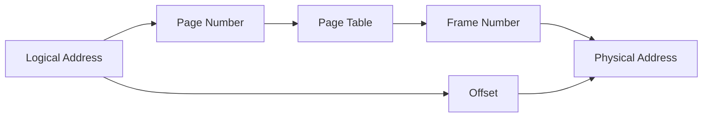
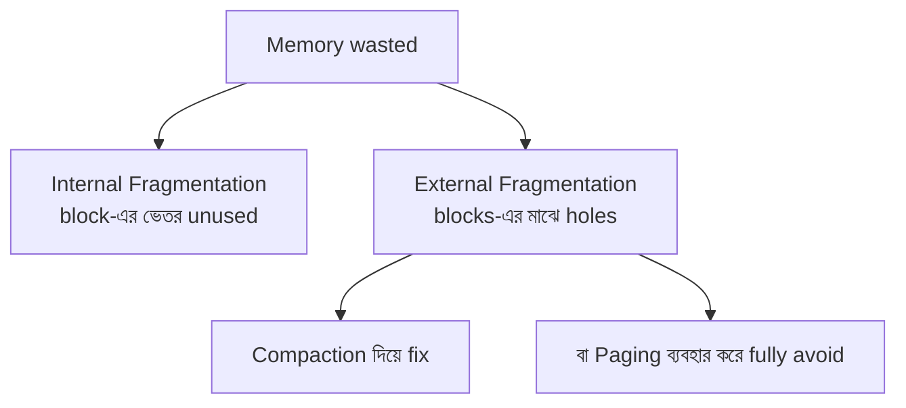
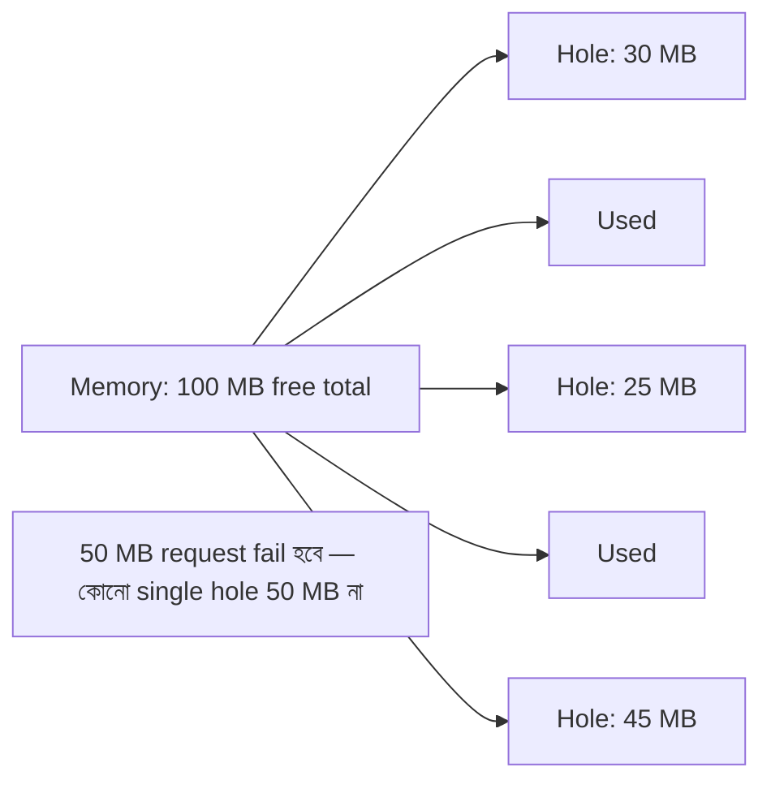
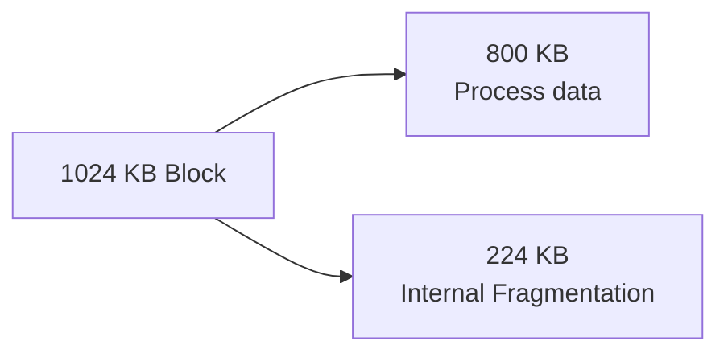
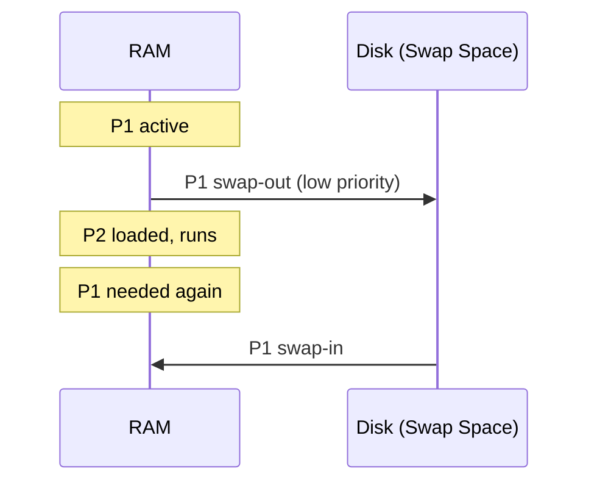

# Chapter 03 — Memory Management & Fragmentation 💾

> Paging, page table, fragmentation (internal/external), compaction, swapping, locality, offset bits — memory-র ১০টা MCQ।

---

## 📚 Concept Refresher

### Logical vs Physical Address


CPU যে address generate করে = **logical / virtual address**। MMU (Memory Management Unit) সেটাকে physical address-এ translate করে। মাঝে থাকে **page table**।

### Paging — basics

- **Logical address space** → equal-sized **pages**
- **Physical memory** → equal-sized **frames** (same size)
- **Page table** = page → frame mapping



**Address split:**
- Page size 4 KB = 2¹² bytes → offset 12 bits
- 32-bit address − 12 bit offset = 20 bit page number → 2²⁰ pages

### Fragmentation

| Type | মানে | কোথায় ঘটে |
|------|------|-----------|
| **Internal** | block বড়, process ছোট, ভেতরে wastage | Fixed-size partition / paging-এর last page |
| **External** | total free যথেষ্ট, কিন্তু scattered, contiguous block নেই | Variable-size partition / segmentation |



### Locality of Reference

| Type | মানে | Example |
|------|------|---------|
| **Temporal** | একটা location recently access হয়েছে → আবার হবে | Loop variable, frequently called function |
| **Spatial** | একটা location access হয়েছে → কাছেরগুলোও হবে | Array iteration, sequential code |

Cache এই দুই locality-র ওপর নির্ভর করে কাজ করে।

---

## 🎯 Q4 — Page Table-এর কাজ

> **Q4:** What is the primary purpose of the 'Page Table' in a Paging system?

- A. To prevent viruses from entering the RAM
- B. To store the actual data of the process
- C. To handle CPU scheduling
- **D. To map logical addresses to physical addresses** ✅

**Answer:** D

**ব্যাখ্যা:** Page table হলো একটা lookup structure — প্রতিটা logical page-এর জন্য সেটা কোন physical frame-এ আছে সেটা বলে। প্রতিটা process-এর নিজস্ব page table থাকে। Page table নিজেও memory-তে থাকে — সেটা access করতে আবার একটা memory lookup, তাই TLB cache use করে speedup।

```c
// Conceptually
frame_number = page_table[page_number];
physical_addr = frame_number * page_size + offset;
```

---

## 🎯 Q13 — Spatial Locality

> **Q13:** Which of the following describes 'Spatial Locality' in the context of memory access?

- A. The process of moving a program from the disk to the RAM
- **B. The tendency to access memory locations that are physically near a recently accessed location** ✅
- C. Accessing the same memory location multiple times in a short period
- D. The ability to run multiple processes in different physical locations

**Answer:** B

**ব্যাখ্যা:** Spatial = "জায়গা সংক্রান্ত" → কাছাকাছি memory locations। যখন একটা byte access হয়, cache সাধারণত পুরো cache line (যেমন ৬৪ bytes) তুলে আনে — কারণ পরের কয়েক bytes-ও অচিরেই লাগবে এই assumption-এ।

> **Trap:** Option C হলো *temporal* locality (একই location reuse), spatial না।

---

## 🎯 Q17 — External Fragmentation

> **Q17:** What is 'External Fragmentation'?

- A. When a user plugs in an external hard drive that is not formatted
- B. A situation where the hard drive becomes too full to save files
- **C. The total free memory is enough to satisfy a request, but it is not contiguous** ✅
- D. Waste of space within an allocated memory block

**Answer:** C

**ব্যাখ্যা:** External fragmentation মানে — total free space যথেষ্ট (যেমন 100 MB scattered), কিন্তু একসাথে contiguous 50 MB block পাওয়া যাচ্ছে না। এটা variable-size partition allocation-এ ঘটে।



**Solutions:**
1. **Compaction** — free spaces একসাথে সরিয়ে আনা
2. **Paging** — fixed-size frame-এ contiguous-এর ঝামেলা শেষ
3. **Best-fit / First-fit** — strategy দিয়ে কমানো (সম্পূর্ণ solve নয়)

---

## 🎯 Q21 — Temporal Locality

> **Q21:** Which of the following describes 'Temporal Locality' in memory access?

- A. The speed at which the RAM refreshes its data
- **B. The tendency to reuse a memory location that was recently accessed** ✅
- C. The time it takes to move data from the disk to the CPU
- D. Accessing memory locations that are physically close to each other

**Answer:** B

**ব্যাখ্যা:** Temporal = "সময় সংক্রান্ত" → একই location আবার লাগবে নিকট ভবিষ্যতে। উদাহরণ: loop counter `i` প্রতিটা iteration-এ access হচ্ছে। এই pattern-এর কারণে CPU cache কাজ করে।

> **মুখস্থ ছড়া:** Temporal = Time, Spatial = Space।

---

## 🎯 Q22 — Internal Fragmentation calculation

> **Q22:** If a system uses fixed-size memory blocks of 1024 KB and a process of 800 KB is loaded, how much Internal Fragmentation is created?

- **A. 224 KB** ✅
- B. 0 KB
- C. 800 KB
- D. 1024 KB

**Answer:** A

**ব্যাখ্যা:** Internal fragmentation = block size − process size = 1024 − 800 = **224 KB**। এই 224 KB block-এর ভেতরে আছে কিন্তু process ব্যবহার করছে না, অন্য কেউ-ও না (block fixed হয়ে allocate হয়ে গেছে)।



---

## 🎯 Q30 — Swapping

> **Q30:** What does 'Swapping' mean in the context of memory management?

- A. Deleting a file and immediately creating a new one
- **B. Moving an entire process from main memory to disk to free up space** ✅
- C. Connecting two computers to share a single keyboard
- D. Exchanging two processes between different users

**Answer:** B

**ব্যাখ্যা:** Swapping = পুরো process RAM থেকে disk-এর swap space-এ পাঠিয়ে দেওয়া (swap-out), এবং দরকার হলে আবার ফেরত আনা (swap-in)। এতে অন্য process-এর জন্য RAM-এ space হয়।



> **Paging vs Swapping:** Paging = page-by-page (smaller unit), Swapping = পুরো process। Modern OS দুটোই combine করে।

---

## 🎯 Q33 — Compaction

> **Q33:** In memory management, what is 'Compaction' used for?

- A. To solve Internal Fragmentation
- B. To compress files on the hard drive to save space
- C. To increase the speed of the CPU clock
- **D. To solve External Fragmentation by shuffling memory contents to place all free memory together** ✅

**Answer:** D

**ব্যাখ্যা:** Compaction = scattered free space-গুলো একসাথে নিয়ে আসা। সব process-কে memory-র এক প্রান্তে গুছিয়ে রাখো, তাহলে অন্য প্রান্তে একটা বড় contiguous free block পাওয়া যায়।

```
Before:  [P1][hole][P2][hole][P3][hole]
After:   [P1][P2][P3][big free block]
```

> **Drawback:** খুব expensive — process move করতে CPU time লাগে, dynamic relocation support থাকতে হবে। তাই modern OS paging use করে এই সমস্যা avoid করে।

---

## 🎯 Q60 — Page Size 4 KB → Offset bits

> **Q60:** In paging, if the page size is 4 KB (2¹² bytes), how many bits are used for the 'Offset'?

- **A. 12 bits** ✅
- B. 32 bits
- C. 16 bits
- D. 8 bits

**Answer:** A

**ব্যাখ্যা:** Page-এর ভেতরে যেকোনো byte address করতে হলে enough bit লাগবে। Page size = 2¹² bytes → 0 থেকে 2¹²−1 পর্যন্ত index করতে **12 bits**।

$$\text{Offset bits} = \log_2(\text{page size in bytes})$$

| Page size | Offset bits |
|-----------|-------------|
| 1 KB = 2¹⁰ | 10 |
| 2 KB = 2¹¹ | 11 |
| 4 KB = 2¹² | 12 |
| 8 KB = 2¹³ | 13 |
| 16 KB = 2¹⁴ | 14 |
| 64 KB = 2¹⁶ | 16 |

---

## 🎯 Q61 — Page Table Entries calculation

> **Q61:** A system uses a 32-bit logical address space and a page size of 8 KB (2¹³ bytes). How many entries will be in a standard (single-level) page table for a process?

- A. 2¹⁶
- B. 2¹⁷
- **C. 2¹⁹** ✅
- D. 2³²

**Answer:** C

**ব্যাখ্যা:** 

$$\text{Page table entries} = \frac{\text{logical address space}}{\text{page size}} = \frac{2^{32}}{2^{13}} = 2^{19}$$

**Steps:**
- 32-bit address → 2³² bytes total addressable
- Page size 8 KB = 2¹³ bytes → offset 13 bits
- Page number bits = 32 − 13 = 19 bits → 2¹⁹ entries

প্রতিটা entry কয়েক bytes (e.g., 4 bytes) → page table নিজেও কয়েক MB। তাই multi-level page table / inverted page table-এর দরকার পড়ে।

> **Note:** Original quiz-এ option text rendering bug-এ সব option "2" দেখাচ্ছিল, কিন্তু standard formula অনুযায়ী answer 2¹⁹।

---

## 🎯 Q65 — Internal Fragmentation characteristic

> **Q65:** What is the primary characteristic of 'Internal Fragmentation' in memory management?

- A. The process is swapped out to the disk unnecessarily.
- B. Memory is wasted because free space is broken into small, non-contiguous holes.
- C. The CPU cannot access the memory because the page table is corrupted.
- **D. Memory is wasted because a process is assigned a block slightly larger than it needs.** ✅

**Answer:** D

**ব্যাখ্যা:** Internal = ভেতরে। Process-কে যে block দেওয়া হয়েছে সেটা প্রয়োজনের চেয়ে বড় — বাকিটা block-এর ভেতরে wasted, কেউ ব্যবহার করতে পারছে না।

> **Trap:** Option B হলো *external* fragmentation। এই দুটো word-এর meaning উল্টো করে দেওয়া trap।

| | Internal | External |
|--|----------|----------|
| Where waste | Inside allocated block | Between blocks |
| Cause | Block bigger than needed | Variable allocation creating holes |
| Fix | Smaller blocks (less wasteful but more overhead) | Compaction / paging |

---

## 📋 Quick Recap Table

| Concept | Formula / Fact |
|---------|----------------|
| Page table purpose | Logical → Physical address mapping |
| Offset bits | log₂(page size) |
| Page table entries | 2^(virtual_addr_bits − offset_bits) |
| Internal fragmentation | Block size − process size |
| External fragmentation | Total free যথেষ্ট, কিন্তু non-contiguous |
| Compaction | External fragmentation-এর fix |
| Swapping | পুরো process disk-এ |
| Spatial locality | কাছের location |
| Temporal locality | একই location-এর reuse |

---

## 🔁 Next Chapter

পরের chapter-এ **Virtual Memory & Page Replacement** — RAM-এর চেয়ে বড় program কীভাবে চালানো যায়, page fault হলে কী হয়, এবং কোন page-কে kick out করতে হবে সেই decision।

→ [Chapter 04: Virtual Memory & Page Replacement](04-virtual-memory.md)
