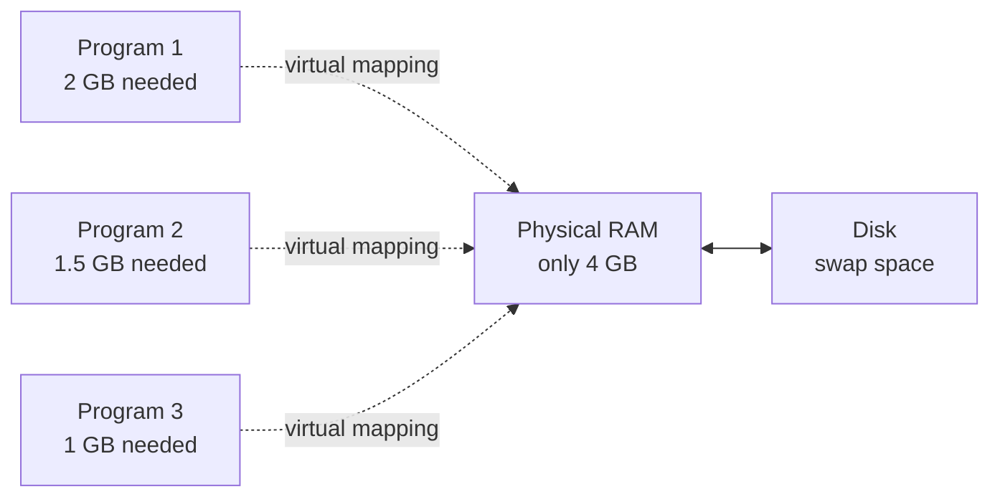
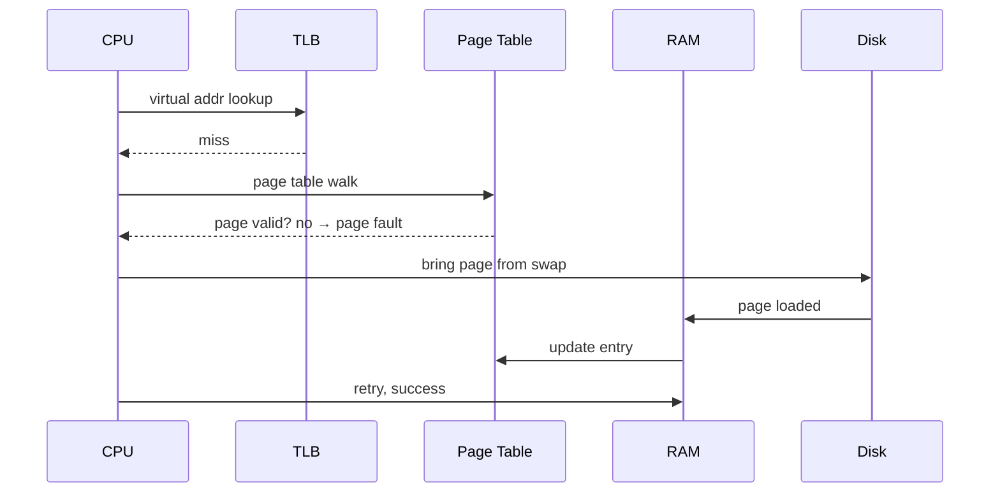
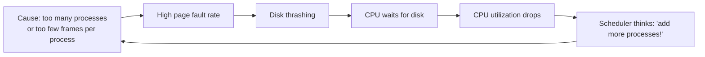
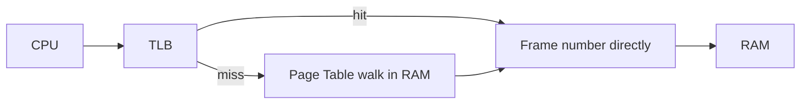
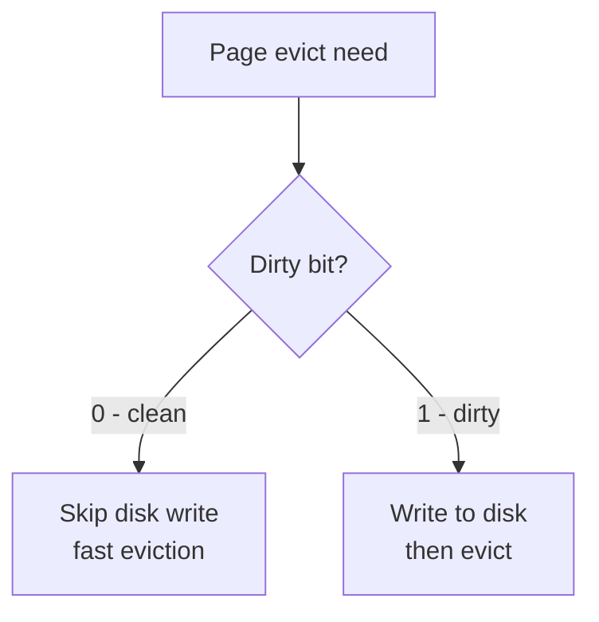

# Chapter 04 — Virtual Memory & Page Replacement 🪟

> Virtual memory, demand paging, page fault, TLB, page replacement (FIFO/LRU/Optimal), Belady's anomaly, dirty bit, thrashing, inverted page table — ৯টা MCQ।

---

## 📚 Concept Refresher

### Virtual Memory — কেন দরকার

Virtual memory-র মূল কাজ — programs RAM-এর চেয়ে বড় হলেও চালানো। Process মনে করে তার পুরো virtual address space-টা available, আসলে যে page এখন দরকার শুধু সেটাই RAM-এ থাকে।

### Demand Paging

Page লোড হবে শুধু যখন **চাইবে** (demand করবে), আগে থেকে নয়। যদি page RAM-এ না থাকে → **page fault** → OS disk থেকে আনবে।

### Page Replacement Algorithms

যখন RAM full আর নতুন page আনতে হবে — কাকে kick out করব?

| Algorithm | Strategy | Pros / Cons |
|-----------|----------|-------------|
| **FIFO** | First-in, first-out | Simple, কিন্তু Belady's anomaly আছে |
| **LRU** | Least Recently Used | Locality use করে, hardware overhead |
| **Optimal** | যেটা future-এ দীর্ঘতম পরে দরকার | Theoretical, future লাগে |
| **MRU** | Most Recently Used | Sequential scan-এ ভালো |
| **Clock / Second-chance** | FIFO + reference bit | LRU-র cheap approximation |

---

## 🎯 Q8 — Thrashing

> **Q8:** What occurs when a system spends more time swapping pages in and out of memory than actually executing processes?

- A. Paging
- B. Fragmentation
- C. Segmentation
- **D. Thrashing** ✅

**Answer:** D

**ব্যাখ্যা:** Thrashing = OS বেশি সময় page swap করতেই গিলে ফেলছে, useful কাজ হচ্ছে না। CPU utilization low, disk activity high।

**Solution:**
- **Working set model** — প্রতিটা process-কে enough frames দাও তার active pages রাখার জন্য
- **Page Fault Frequency (PFF)** — fault rate উপরে গেলে frame বাড়াও, নিচে নামলে কমাও
- **Process suspension** — কিছু process-কে temporarily সরিয়ে নাও

---

## 🎯 Q15 — Belady's Anomaly

> **Q15:** What is 'Belady's Anomaly'?

- A. Increasing the number of frames reduces the number of page faults
- B. Decreasing the RAM size makes the computer faster
- C. The process of a CPU overheating due to too many processes
- **D. Increasing the number of frames increases the number of page faults** ✅

**Answer:** D

**ব্যাখ্যা:** স্বাভাবিক intuition — frame বেশি = fault কম। Belady দেখালেন: **FIFO algorithm-এ** কখনো কখনো frame বাড়ালে fault বেড়ে যায়।

**Classic example:** Reference string `1, 2, 3, 4, 1, 2, 5, 1, 2, 3, 4, 5`

| Frames | Page faults |
|--------|-------------|
| 3 frames | 9 faults |
| 4 frames | 10 faults ⚠️ |

LRU এবং Optimal algorithm এই anomaly থেকে মুক্ত (এদের বলে **stack algorithm**)।

> **Why FIFO suffers:** FIFO recency-র কোনো ধারণা রাখে না — page কতটুকু ব্যবহার হচ্ছে সেটা ignore করে শুধু entry order দেখে।

---

## 🎯 Q28 — TLB-এর কাজ

> **Q28:** What is the purpose of a 'Translation Lookaside Buffer' (TLB)?

- A. To store backup copies of files
- B. To manage the power settings of the monitor
- **C. To speed up the translation of logical addresses to physical addresses** ✅
- D. To prevent unauthorized access to the internet

**Answer:** C

**ব্যাখ্যা:** Page table memory-তে থাকে। প্রতিটা memory access-এ আগে page table-এ গিয়ে translation, তারপর actual access — মানে **2x memory access**! TLB হলো একটা small fast cache যেটা recent page-table entries রাখে।

**TLB hit ratio** এত important যে modern CPU-তে ৯৮%+ hit rate target করা হয়। TLB miss হলে page walk extra cycle খায়।

---

## 🎯 Q38 — Page Fault

> **Q38:** In a Paging system, what is a 'Page Fault'?

- A. A mistake in the code that causes the program to crash
- B. When the printer runs out of paper during a print job
- C. A hardware error where the RAM chip is physically broken
- **D. An event that occurs when a program tries to access a page that is not currently in main memory** ✅

**Answer:** D

**ব্যাখ্যা:** Page fault = একটা **trap / interrupt** — হার্ডওয়্যার OS-কে বলে "এই page valid bit 0 আছে, RAM-এ নেই"। OS তখন:

1. Page disk-এ আছে কি না check করে
2. Free frame খোঁজে; না থাকলে replacement algorithm দিয়ে একটা page evict করে
3. Disk থেকে page load করে
4. Page table update
5. Faulting instruction restart

> **Soft page fault:** Page RAM-এ আছে কিন্তু process-এর page table-এ entry update হয়নি। Cheap fix।
> **Hard page fault:** Disk থেকে আনতে হবে। Slow।

> **Trap:** Page fault মানে program crash না — এটা normal mechanism। শুধু slow।

---

## 🎯 Q39 — Demand Paging-এর benefit

> **Q39:** What is the primary benefit of 'Demand Paging'?

- A. It prevents the user from opening too many tabs in a browser
- B. It uses less CPU power
- **C. It allows the OS to load only the parts of a program that are actually needed** ✅
- D. It makes the hard drive spin faster

**Answer:** C

**ব্যাখ্যা:** Demand paging = page লাগলে তবেই RAM-এ আনব। অনেক program-এর কিছু অংশ কখনো execute হয় না (error handlers, optional features) — সেগুলো কখনোই RAM-এ আসে না।

**Benefits:**
- কম RAM-এ বেশি program চালানো যায়
- Process startup দ্রুত (পুরো program লোড হবে না)
- Multiprogramming level বাড়ে

> **Cost:** Page fault-এর latency। তাই প্রায়ই-ব্যবহৃত pages prefetch করার strategy ব্যবহার হয়।

---

## 🎯 Q41 — Inverted Page Table

> **Q41:** Which of the following describes the 'Inverted Page Table' structure?

- A. It is stored entirely within the CPU's internal registers.
- B. It uses a LIFO approach to manage page entries.
- **C. It contains one entry for each real page (frame) of memory.** ✅
- D. It contains one entry for each page of the logical address space.

**Answer:** C

**ব্যাখ্যা:** Standard page table-এ **প্রতি logical page-এর জন্য** একটা entry। 64-bit address space-এ এটা insanely বড়। **Inverted page table** উল্টো — **প্রতি physical frame-এর জন্য** একটা entry, যেটা বলে এই frame-এ কোন process-এর কোন page আছে।

| | Standard PT | Inverted PT |
|--|-------------|-------------|
| Size | প্রতি process-এর জন্য বড় | পুরো system-এর জন্য একটাই, RAM size-এর proportional |
| Lookup | direct index | hash search (slow) |
| Memory cost | বেশি | কম |
| Used in | Most systems | PowerPC, IA-64 |

---

## 🎯 Q43 — Belady-suffering algorithm

> **Q43:** Which page replacement algorithm suffers from 'Belady's Anomaly'?

- A. Optimal Page Replacement
- B. MRU (Most Recently Used)
- **C. FIFO (First-In, First-Out)** ✅
- D. LRU (Least Recently Used)

**Answer:** C

**ব্যাখ্যা:** FIFO হলো একমাত্র common algorithm যেটা Belady's anomaly দেখায়। LRU আর Optimal হলো **stack algorithms** — frame-এর number বাড়ালে যে pages থাকত, সেটার superset থাকবে নতুন config-এও — তাই fault কখনো বাড়ে না।

> **মুখস্থ:** "FIFO has Belady's Anomaly. LRU and Optimal don't."

---

## 🎯 Q46 — Dirty Bit

> **Q46:** What does the 'Dirty Bit' (Modify Bit) in a page table indicate?

- **A. The page has been modified since it was loaded into memory.** ✅
- B. The page is ready to be deleted.
- C. The page has been corrupted by a virus.
- D. The page is shared by multiple processes.

**Answer:** A

**ব্যাখ্যা:** Dirty bit OS-কে optimization-এ সাহায্য করে। যখন একটা page evict করা হবে:

- **Dirty bit = 0** → page disk-এর copy-র সাথে identical → শুধু overwrite করো (write-back দরকার নেই)
- **Dirty bit = 1** → page modified → disk-এ write back করতে হবে evict-এর আগে

> **Page table entry-তে যা থাকে:** Frame number, Valid bit, Dirty bit, Reference bit, Protection bits।

---

## 🎯 Q69 — Virtual Memory benefit

> **Q69:** Which of the following is a benefit of using 'Virtual Memory'?

- A. It increases the physical speed of the CPU.
- B. It guarantees that no page faults will ever occur.
- C. It eliminates the need for any physical RAM.
- **D. It allows programs larger than physical memory to be executed.** ✅

**Answer:** D

**ব্যাখ্যা:** Virtual memory-র সবচেয়ে বড় advantage — physical RAM-এর সীমা ছাড়িয়ে যাওয়া। 4 GB RAM-এ 8 GB program চালানো সম্ভব — disk-এর swap space ব্যবহার করে।

**Other benefits:**
- **Process isolation** — একটা process অন্যটার memory-তে hand দিতে পারে না
- **Memory protection** — read-only, executable bits enforce
- **Shared memory** — একই page multiple process-এ map করা যায় (shared library)
- **COW (Copy-on-Write)** — `fork()`-এ memory duplicate না করে শুধু page table copy

> **Trap:** Option B ভুল — virtual memory page fault eliminate করে না, বরং page fault-ই virtual memory-র mechanism!

---

## 📋 Quick Recap Table

| Concept | Key fact |
|---------|----------|
| Thrashing | Swap-এ গিলে ফেলা, real কাজ হচ্ছে না |
| Belady's anomaly | FIFO-তে frame বাড়ালে fault বাড়ে |
| TLB | Page table-এর fast cache (in CPU) |
| Page fault | Page RAM-এ নেই → trap → load |
| Demand paging | যখন দরকার তখনই load |
| Inverted page table | One entry per **frame** (not per page) |
| Dirty bit | Modified হয়েছে কি না — eviction optimize |
| Virtual memory main benefit | RAM-এর চেয়ে বড় program চালানো |
| Stack algorithms | LRU + Optimal (no Belady's) |

---

## 🔁 Next Chapter

পরের chapter-এ আমরা **File Systems & Storage** নিয়ে কাজ করব — FAT, inode, superblock, hard/soft link, RAID levels।

→ [Chapter 05: File Systems & Storage](05-file-systems.md)
