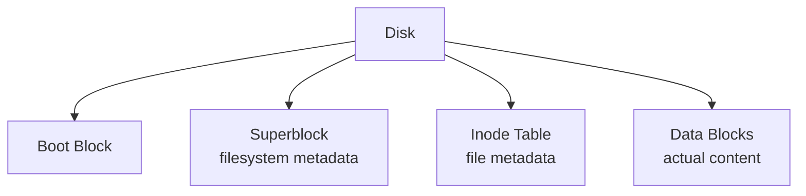
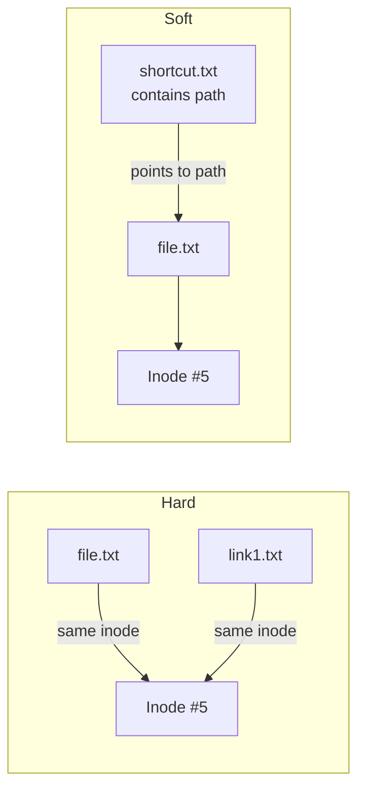
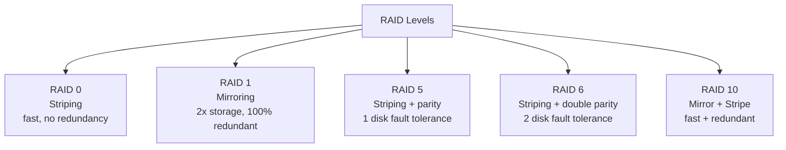

# Chapter 05 — File Systems & Storage 📁

> FAT, inode, superblock, hard/soft links, RAID levels, volatile vs non-volatile — file system আর storage-এর ৫টা MCQ।

---

## 📚 Concept Refresher

### File System Anatomy (Unix-style)



| Block | কী থাকে |
|-------|---------|
| **Boot block** | OS load করার boot loader |
| **Superblock** | Filesystem-এর meta — total size, block size, free count, inode count |
| **Inode** | প্রতি file-এর meta — owner, size, permissions, timestamp, data block pointer (filename **নেই**!) |
| **Data block** | Actual file contents |

### Hard Link vs Soft (Symbolic) Link



| | Hard link | Soft (Symbolic) link |
|--|-----------|----------------------|
| Storage | Same inode reference | Separate inode, stores path string |
| Cross filesystem | না | হ্যাঁ |
| Original delete | কিছু হয় না, link কাজ করে | broken link হয়ে যায় |
| Directory link | সাধারণত না | হ্যাঁ |
| Linux command | `ln file link` | `ln -s file link` |

### RAID Levels (most common)



| RAID | Min disks | Redundancy | Performance |
|------|-----------|------------|-------------|
| **0** | 2 | নেই | সবচেয়ে fast read+write |
| **1** | 2 | 1 disk fault | Read fast, write same |
| **5** | 3 | 1 disk fault | Read fast, write slow (parity) |
| **6** | 4 | 2 disk fault | Same as 5 but more parity |
| **10** | 4 | 1 per mirror pair | Best of both |

### Volatile vs Non-volatile Storage

| Type | Power off → data | Examples |
|------|------------------|----------|
| **Volatile** | Lost | RAM, Cache, Registers |
| **Non-volatile** | Retained | HDD, SSD, ROM, Flash, Optical disc |

---

## 🎯 Q18 — RAID 0

> **Q18:** Which of these RAID levels offers no redundancy and focuses purely on performance through data striping?

- A. RAID 6
- B. RAID 5
- **C. RAID 0** ✅
- D. RAID 1

**Answer:** C

**ব্যাখ্যা:** RAID 0-এ data বিভিন্ন disk-এ stripe করে split হয় — parallel read/write ফলে fast। কিন্তু কোনো parity বা mirror নেই — একটা disk মরলে সব data lost।

```
RAID 0 with 2 disks:
File: ABCDEFGH
Disk 1: A C E G
Disk 2: B D F H

Read: parallel from both → 2x speed
Disk 1 fails → A, C, E, G LOST forever
```

> **Use case:** Video editing scratch disk, gaming temporary cache — যেখানে speed চাই কিন্তু data lost হলে problem নেই।

---

## 🎯 Q49 — Superblock

> **Q49:** In a Linux file system, what is stored in a 'Superblock'?

- A. The passwords of all users on the system.
- B. A list of all recently deleted files.
- **C. Metadata about the file system itself, such as size, status, and type.** ✅
- D. The actual data content of the files.

**Answer:** C

**ব্যাখ্যা:** Superblock = filesystem-এর "ID card"। এতে থাকে:

- Filesystem type (ext4, xfs, etc.)
- Total size, block size, inode count
- Number of free blocks/inodes
- Mount status, last mount time
- Filesystem state (clean / dirty / errors)

`dumpe2fs /dev/sda1` দিয়ে দেখা যায় ext-filesystem-এর superblock।

> **Critical:** Superblock corrupted হলে পুরো filesystem unmount হবে না। তাই OS multiple backup superblock রাখে disk-এর অন্য locations-এ।

---

## 🎯 Q51 — Volatile storage

> **Q51:** Which of the following is an example of a 'Volatile' storage medium?

- **A. RAM (Random Access Memory)** ✅
- B. Solid State Drive (SSD)
- C. Optical Disc (DVD)
- D. Hard Disk Drive (HDD)

**Answer:** A

**ব্যাখ্যা:** Volatile = power off হলে data উড়ে যায়। RAM-এর প্রতিটা DRAM cell-এ একটা capacitor — সেটার charge ধরে রাখতে continuous refresh দরকার। Power গেল → charge গেল → data গেল।

| Storage | Volatile? | Speed | Persistence |
|---------|-----------|-------|-------------|
| **CPU Register** | হ্যাঁ | সবচেয়ে fast | None |
| **Cache (L1/L2/L3)** | হ্যাঁ | Very fast | None |
| **RAM** | হ্যাঁ | Fast | None |
| **SSD** | না | Medium-fast | Years |
| **HDD** | না | Slow | Years |
| **Optical (DVD)** | না | Slowest | Decades |

---

## 🎯 Q54 — File Allocation Table (FAT)

> **Q54:** What is the primary purpose of a 'File Allocation Table' (FAT)?

- A. To encrypt files for security
- **B. To keep track of which clusters on a disk belong to which file** ✅
- C. To compress large videos into smaller sizes
- D. To increase the speed of the internet connection

**Answer:** B

**ব্যাখ্যা:** FAT (File Allocation Table) — Microsoft-এর old filesystem (FAT12, FAT16, FAT32, exFAT)। এতে একটা table থাকে যেখানে প্রতিটা cluster-এর জন্য entry — পরের cluster কোনটা সেটা বলে দেয় (linked list-এর মতো)।

```
FAT entry: Cluster N → Cluster M (next) → ... → EOF
```

USB pen drive, SD card, camera memory card-এ এখনো FAT32 / exFAT ব্যবহার হয় — কারণ এটা সব OS-এ supported (Windows, Mac, Linux)।

> **Modern alternative:** NTFS (Windows), ext4 (Linux), APFS (Mac) — এদের metadata structure অনেক rich (journaling, ACL, compression)।

---

## 🎯 Q63 — Symbolic Link

> **Q63:** In a Linux filesystem, which of the following is a pointer or 'link' that contains the actual path to another file, rather than just pointing to an inode?

- A. Superblock
- B. Hard Link
- **C. Symbolic (Soft) Link** ✅
- D. Inode Pointer

**Answer:** C

**ব্যাখ্যা:** Soft / symbolic link = একটা special file যেটার content-ই হলো অন্য file-এর **path string**। OS read করে দেখে — "এটা symlink, target = এই path", তারপর redirected হয়ে target-এ যায়।

**Hard link:** একই inode-এ ২টা directory entry। OS-এর কাছে দুটোই original।

```bash
# Hard link
$ ln file.txt hard.txt
$ ls -i file.txt hard.txt
1234567 file.txt    1234567 hard.txt   # same inode

# Soft link
$ ln -s file.txt soft.txt
$ ls -i file.txt soft.txt
1234567 file.txt    7654321 soft.txt   # different inode
$ cat soft.txt        # works
$ rm file.txt
$ cat soft.txt        # broken!
```

| Question | Hard | Soft |
|----------|------|------|
| Original file delete হলে link কাজ করে? | হ্যাঁ | না (broken) |
| Different filesystem-এ link বানানো যায়? | না | হ্যাঁ |
| Link নিজেই কতটুকু space নেয়? | almost 0 | path string size |

---

## 📋 Quick Recap Table

| Concept | Key fact |
|---------|----------|
| RAID 0 | Striping only, no redundancy |
| RAID 1 | Mirroring, 100% redundant |
| RAID 5 | Striping + 1 parity, 1 disk fault tolerance |
| Superblock | Filesystem metadata (size, type, free count) |
| Inode | File metadata (filename **নেই** এতে) |
| FAT | File allocation linked list table |
| Hard link | Same inode, source delete OK |
| Soft link | Path string, source delete = broken |
| RAM | Volatile |
| SSD/HDD/DVD | Non-volatile |

---

## 🔁 Next Chapter

পরের chapter-এ **I/O Systems & Disk Scheduling** — DMA, polling, interrupt I/O, এবং disk arm কীভাবে move করে (SSTF, SCAN, C-SCAN)।

→ [Chapter 06: I/O Systems & Disk Scheduling](06-io-disk.md)
