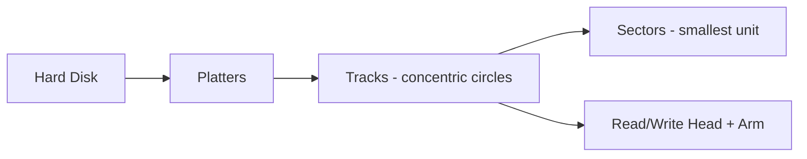
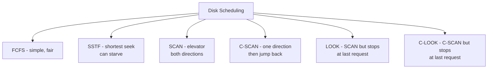
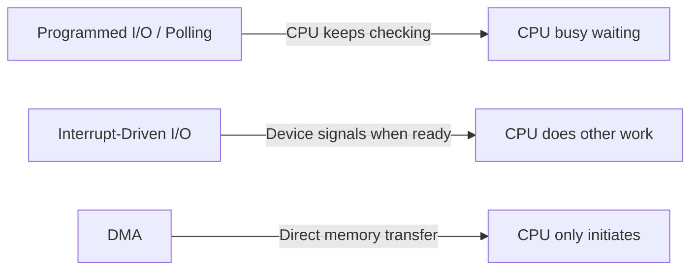
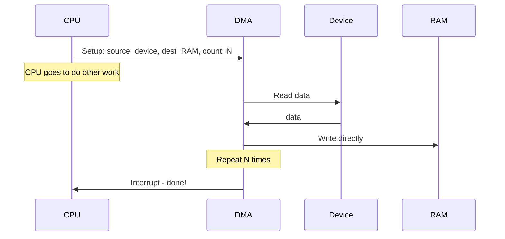
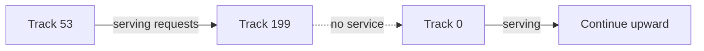

# Chapter 06 — I/O Systems & Disk Scheduling 💿

> Disk scheduling (FCFS, SSTF, SCAN, C-SCAN, LOOK), DMA, cycle stealing, programmed I/O, polling — ৪টা MCQ।

---

## 📚 Concept Refresher

### Disk Structure



**Disk access time** = Seek time + Rotational latency + Transfer time

- **Seek time** — head-কে correct track-এ নেওয়া (সবচেয়ে slow)
- **Rotational latency** — correct sector head-এর নিচে আসা পর্যন্ত wait
- **Transfer time** — actual data read/write

Disk scheduling-এর target — **seek time minimize**।

### Disk Scheduling Algorithms



| Algorithm | Strategy | Issue |
|-----------|----------|-------|
| **FCFS** | Order of arrival | Random seek pattern, slow |
| **SSTF** | Nearest request | Edge tracks starvation |
| **SCAN** | Elevator: full sweep, reverse | Middle tracks favored |
| **C-SCAN** | One direction only, jump to start | Fair wait time |
| **LOOK** | SCAN but stop at last request | Better than SCAN |

### I/O Communication Methods



| Method | CPU involvement |
|--------|-----------------|
| **Programmed I/O / Polling** | CPU keeps polling status — waste of cycles |
| **Interrupt-driven** | CPU does other work; device interrupts when ready |
| **DMA** | CPU only sets up; DMA controller transfers directly to/from RAM |

---

## 🎯 Q9 — SSTF Disk Scheduling

> **Q9:** Which Disk Scheduling algorithm selects the request with the minimum seek time from the current head position?

- A. LOOK
- B. FCFS
- **C. SSTF (Shortest Seek Time First)** ✅
- D. SCAN

**Answer:** C

**ব্যাখ্যা:** SSTF = প্রতিবার সবচেয়ে কাছের request পিক করো। SJF-এর disk version।

**Example:** Head at track 53, requests = {98, 183, 37, 122, 14, 124, 65, 67}

```
SSTF order: 53 → 65 → 67 → 37 → 14 → 98 → 122 → 124 → 183
Total seek: 12 + 2 + 30 + 23 + 84 + 24 + 2 + 59 = 236 tracks
```

**Drawback:** Edge tracks (14, 183) wait long if middle তে continuously request আসে — **starvation**।

---

## 🎯 Q11 — DMA

> **Q11:** Which of the following I/O communication techniques involves a dedicated controller that moves data blocks directly between the I/O device and main memory without continuous CPU intervention?

- A. Programmed I/O
- **B. Direct Memory Access (DMA)** ✅
- C. Polling
- D. Interrupt-Driven I/O

**Answer:** B

**ব্যাখ্যা:** DMA controller একটা specialized chip — CPU তাকে বলে দেয় "এই memory address থেকে এই device-এ এতগুলো byte পাঠাও", তারপর CPU ফ্রি, অন্য কাজ করে। DMA controller bus access নিয়ে directly transfer করে। শেষ হলে interrupt দিয়ে CPU-কে বলে।



> **Without DMA:** CPU প্রতিটা byte read+write করত — 1 GB file copy করতে CPU 100% utilized for minutes। DMA-তে CPU শুধু setup আর finish-এ involved।

---

## 🎯 Q31 — C-SCAN

> **Q31:** Which disk scheduling algorithm moves the disk arm from one end to the other, servicing requests along the way, but only in one direction, and immediately returns to the beginning without servicing requests on the way back?

- A. SCAN
- **B. C-SCAN (Circular SCAN)** ✅
- C. LOOK
- D. SSTF

**Answer:** B

**ব্যাখ্যা:** C-SCAN একটা elevator যেটা শুধু উপরে যায় — top-এ পৌঁছালে সাথে সাথে bottom-এ jump করে, return path-এ কিছু serve করে না।



**পার্থক্য:**

| Algorithm | Direction | Return |
|-----------|-----------|--------|
| **SCAN** | Both directions | Serves on return trip |
| **C-SCAN** | One direction only | No service on return (jumps to start) |
| **LOOK** | Both, but stops at last request | Doesn't go to disk edge |
| **C-LOOK** | One direction, stops at last | Jumps to first request |

**C-SCAN-এর advantage:** Wait time প্রায় uniform — middle tracks বা edge tracks সবাই equal treatment পায়। SCAN-এ middle তে বেশি service।

---

## 🎯 Q48 — Cycle Stealing (DMA)

> **Q48:** What is 'Cycle Stealing' in the context of DMA?

- **A. The DMA controller takes over the system bus from the CPU for one memory cycle.** ✅
- B. A virus that slows down the CPU clock speed.
- C. When one process steals the CPU time of another process.
- D. The process of overclocking a processor.

**Answer:** A

**ব্যাখ্যা:** DMA-র দুটো mode আছে:

1. **Burst mode** — DMA পুরো data block transfer-এর সময় bus হোল্ড করে রাখে। CPU অপেক্ষা করে।
2. **Cycle stealing mode** — DMA এক bus cycle-এ এক word transfer করে, পরের cycle-এ CPU-কে দেয়, আবার পরেরটায় DMA। এতে CPU পুরোপুরি ব্লক হয় না, একটু slow চলে।

```mermaid
gantt
    title Cycle Stealing
    dateFormat X
    axisFormat %s
    section Bus
    CPU :0, 1
    DMA (steal) :1, 2
    CPU :2, 3
    DMA (steal) :3, 4
    CPU :4, 5
```



**Trade-off:** Cycle stealing slow data transfer কিন্তু CPU also makes progress। Burst fast transfer কিন্তু CPU stalls।

---

## 📋 Quick Recap Table

| Concept | Key fact |
|---------|----------|
| Seek time | Disk scheduling-এর primary target to minimize |
| FCFS | Simple, fair, slow |
| SSTF | Nearest first, can starve edges |
| SCAN (elevator) | Sweep both directions |
| C-SCAN | One direction, jump back |
| DMA | CPU-free bulk transfer |
| Cycle stealing | DMA + CPU share bus alternately |
| Polling | CPU keeps checking — wasteful |
| Interrupt I/O | Device signals CPU |

---

## 🔁 Next Chapter

পরের chapter-এ **OS Architecture, Kernel & System Calls** — bootloader, kernel role, microkernel, fork/exec, IPC, system call interface।

→ [Chapter 07: OS Architecture, Kernel & System Calls](07-kernel-syscalls.md)
