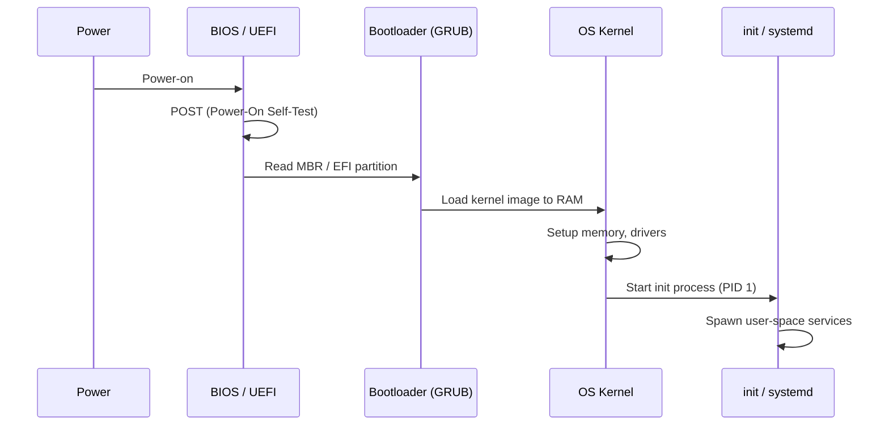
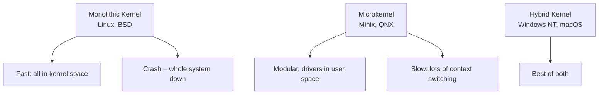
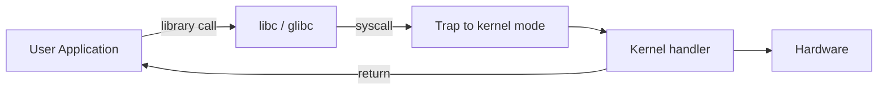
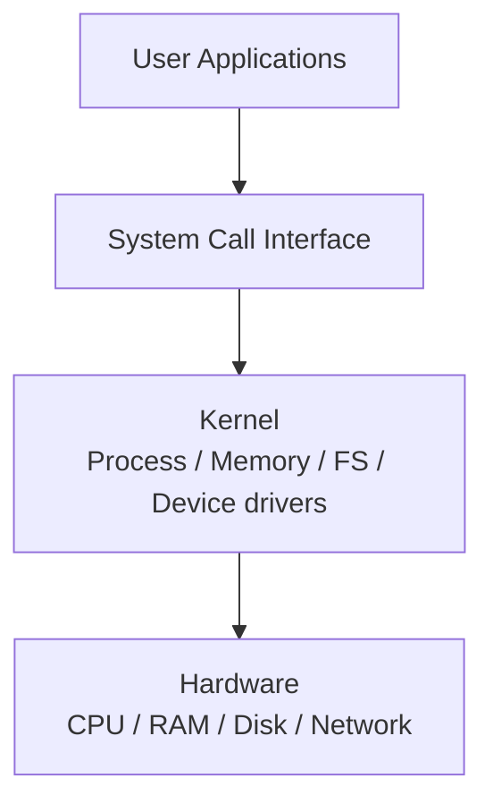
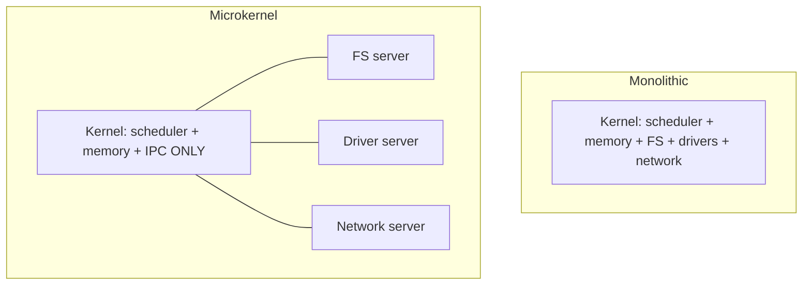
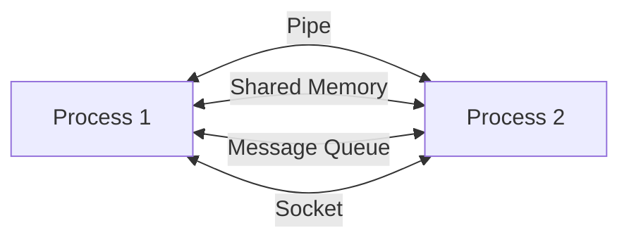
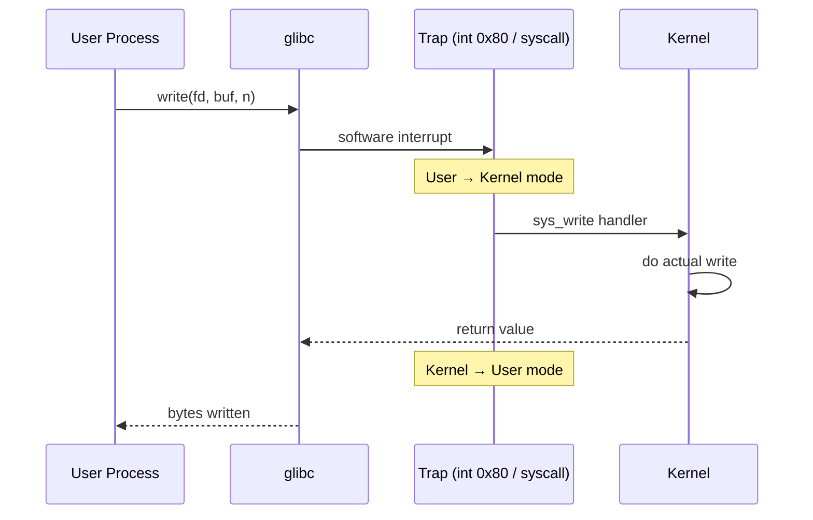

# Chapter 07 — OS Architecture, Kernel & System Calls 🛠️

> Bootloader, Kernel-এর role, monolithic vs microkernel, fork/exec/wait/exit, IPC, system call interface — ৬টা MCQ।

---

## 📚 Concept Refresher

### Boot Sequence



| Stage | কে করে |
|-------|--------|
| **Power-On** | Hardware |
| **POST** | BIOS/UEFI — hardware health check |
| **Boot device search** | BIOS — disk-এর MBR বা EFI partition খোঁজে |
| **Bootloader load** | BIOS → bootloader (GRUB, NTLDR, etc.) |
| **Kernel load** | Bootloader → kernel image RAM-এ আনে |
| **Kernel init** | Memory, drivers, scheduler setup |
| **First process** | `init` / `systemd` — সব user service-এর parent |

### Kernel Architectures



### System Call Interface



User process directly hardware-এ access করতে পারে না — সবসময় kernel-এর মাধ্যমে syscall করতে হয় (open, read, write, fork, etc.)।

### Process Creation Syscalls (Unix)

| Call | কী করে |
|------|--------|
| `fork()` | Parent-এর exact copy (child process) তৈরি |
| `exec()` | Current process-এর memory নতুন program দিয়ে replace |
| `wait()` | Parent child শেষ হওয়া পর্যন্ত wait করে |
| `exit()` | Process terminate করে |

```c
pid_t pid = fork();
if (pid == 0) {
    // child
    execlp("/bin/ls", "ls", NULL);
} else {
    // parent
    wait(NULL);
}
```

### Inter-Process Communication (IPC)

| Method | কীভাবে |
|--------|--------|
| **Pipe** | Unidirectional byte stream (parent-child) |
| **Named Pipe (FIFO)** | Pipe যেটা filesystem-এ name আছে |
| **Message Queue** | Discrete message-এর queue |
| **Shared Memory** | Direct memory area share |
| **Socket** | Network or local communication |
| **Signal** | Async notification (SIGINT, SIGKILL) |

---

## 🎯 Q10 — Bootloader-এর কাজ

> **Q10:** What is the function of the 'Bootloader' in the computer startup process?

- A. To perform the Power-On Self-Test (POST)
- **B. To load the Operating System kernel into memory** ✅
- C. To manage the connection between the CPU and the RAM
- D. To encrypt the hard drive data

**Answer:** B

**ব্যাখ্যা:** Bootloader = একটা ছোট program যেটা BIOS/UEFI-এর পরে চলে। কাজ:

1. কোন OS load করতে হবে নির্বাচন (multi-boot menu)
2. Kernel image disk থেকে RAM-এ load
3. Kernel-এ control transfer (jump to entry point)

**Examples:**

- **GRUB** — Linux-এর জনপ্রিয় bootloader
- **LILO** — পুরাতন Linux bootloader
- **Windows Boot Manager** — Windows-এ
- **systemd-boot** — modern, UEFI-only

> **Trap:** POST (Power-On Self-Test) BIOS-এর কাজ, bootloader-এর না।

---

## 🎯 Q12 — Kernel-এর primary role

> **Q12:** What is the primary role of the 'Kernel' in an Operating System?

- A. To store the user's permanent files and photos
- B. To act as the primary web browser for the system
- **C. To manage system resources and hardware-software communication** ✅
- D. To provide a user-friendly graphical interface

**Answer:** C

**ব্যাখ্যা:** Kernel = OS-এর core। হার্ডওয়্যার আর software-এর মাঝে translator। কাজ:

- **CPU scheduling** — কোন process এখন run হবে
- **Memory management** — RAM allocate/deallocate
- **Device driver** — hardware-এর সাথে কথা বলা
- **System calls** — user program-এর হার্ডওয়্যার access-এর gate
- **Process / thread creation**
- **File system management**



> **Trap:** GUI (option D) হলো user-space program (Windows Explorer, GNOME), kernel না।

---

## 🎯 Q16 — Process create syscall

> **Q16:** Which system call is used in Unix-like systems to create a new process?

- A. wait()
- B. exec()
- **C. fork()** ✅
- D. exit()

**Answer:** C

**ব্যাখ্যা:** `fork()` parent process-এর exact copy বানায় — child পায় নিজের PID, কিন্তু parent-এর memory, file descriptor, code copy পায়। `fork()` দুইবার return করে:

- Parent-এ → child-এর PID
- Child-এ → 0

```c
#include <unistd.h>
#include <stdio.h>

int main() {
    pid_t pid = fork();
    if (pid == 0) {
        printf("I am child, PID=%d\n", getpid());
    } else if (pid > 0) {
        printf("I am parent, child PID=%d\n", pid);
    } else {
        printf("fork failed\n");
    }
    return 0;
}
```

| Call | What it does |
|------|--------------|
| `fork()` | তৈরি — parent-এর copy |
| `exec()` | Replace — current process-এ নতুন program load |
| `wait()` | Wait — child শেষ না হওয়া পর্যন্ত |
| `exit()` | End — process terminate |

> **Common pattern:** `fork()` + `exec()` — child বানিয়ে তাতে অন্য program load করা। Shell `command` চালানোর মৌলিক mechanism।

---

## 🎯 Q44 — Microkernel architecture

> **Q44:** What is the primary function of a 'Microkernel' architecture?

- A. To include all system drivers and file systems within the kernel space for speed.
- **B. To move as many non-essential components as possible from the kernel into user space.** ✅
- C. To eliminate the need for system calls.
- D. To allow the OS to run without a CPU.

**Answer:** B

**ব্যাখ্যা:** Microkernel-এর philosophy — kernel-এ থাকবে শুধু **absolute essentials**:

- IPC mechanism
- Basic scheduling
- Basic memory management

বাকি সব — file system, device drivers, network stack — user space-এ separate process হিসেবে চলবে।



| | Monolithic | Microkernel |
|--|------------|-------------|
| Speed | Fast (no context switch) | Slow (lots of IPC) |
| Reliability | Driver crash = system crash | Driver crash isolated |
| Maintenance | Harder | Easier (small kernel) |
| Examples | Linux, BSD | Minix, QNX, L4 |

> **Bonus:** Linux মাঝেমাঝে module-based monolithic বলা হয় — drivers loadable kernel modules হিসেবে dynamic load/unload করা যায়, but still in kernel space।

---

## 🎯 Q50 — IPC-এর goal

> **Q50:** What is the main goal of 'Inter-Process Communication' (IPC)?

- A. To prevent processes from ever running at the same time.
- B. To increase the physical RAM of the computer.
- **C. To allow processes to share data and synchronize their actions.** ✅
- D. To convert C# code into Machine code.

**Answer:** C

**ব্যাখ্যা:** Process-গুলো isolated — প্রত্যেকের আলাদা virtual memory। কিন্তু কখনো কখনো data share করতে হয় (যেমন database server + client process)। IPC mechanisms সেই communication-এর pathway।



| Mechanism | Use case |
|-----------|----------|
| **Pipe** | Shell-এর `ls \| grep foo` |
| **Shared memory** | Database connection pool, fast read/write |
| **Message queue** | Async job systems |
| **Socket** | Network apps, microservices |
| **Signal** | Process termination, interrupt notification |

---

## 🎯 Q56 — System Call

> **Q56:** What is a 'System Call' in an Operating System?

- A. A phone call made by the system administrator
- B. An error message that appears when the computer crashes
- C. A way to upgrade the hardware without turning it off
- **D. The interface between a running program and the Operating System** ✅

**Answer:** D

**ব্যাখ্যা:** System call = user program থেকে kernel-এর service request করার আনুষ্ঠানিক উপায়। User mode থেকে kernel mode-এ transition হয় (mode switch), কারণ hardware operations বা privileged operations user-mode-এ allowed না।



**System call categories:**

| Category | Examples |
|----------|----------|
| **Process control** | `fork`, `exec`, `wait`, `exit` |
| **File management** | `open`, `read`, `write`, `close` |
| **Device management** | `ioctl` |
| **Information** | `getpid`, `time`, `uname` |
| **Communication** | `pipe`, `socket`, `shmget` |

---

## 📋 Quick Recap Table

| Concept | Key fact |
|---------|----------|
| Bootloader | Kernel-কে RAM-এ load করে |
| POST | BIOS-এর কাজ (bootloader-এর না) |
| Kernel role | Resource manager + HW-SW bridge |
| `fork()` | Process create — exact copy |
| `exec()` | Replace memory with new program |
| `wait()` | Parent waits for child |
| `exit()` | Process terminate |
| Microkernel | Drivers/FS user space-এ |
| IPC goal | Process-দের data share + sync |
| System call | User → Kernel interface |

---

## 🔁 Next Chapter

পরের chapter-এ আমাদের শেষ chapter — **Linux Commands, Shell & Security** — chmod / chown / ps / top / renice, file permissions, shell, /etc, এবং Least Privilege principle।

→ [Chapter 08: Linux Commands, Shell & Security](08-linux-shell-security.md)
