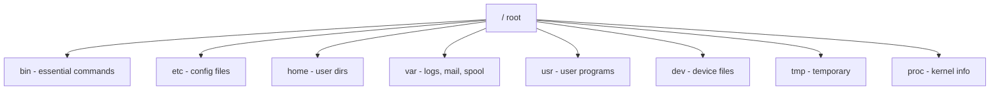
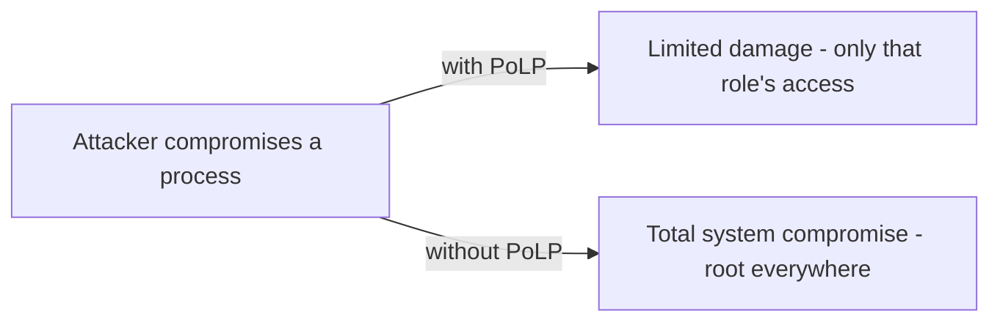
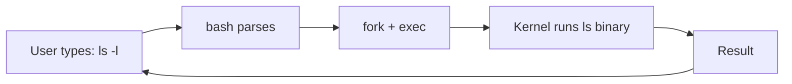

# Chapter 08 — Linux Commands, Shell & Security 🐧

> chmod / chown / top / ps / renice / man, file permissions (rwx → octal), shell, /etc directory, Least Privilege — Linux-এর ১০টা MCQ।

---

## 📚 Concept Refresher

### Linux File Permissions

প্রতিটা file/directory-এর জন্য তিনটা group permissions:

```
-rwxr-xr--    1 user  group  1234  ...  myfile
 │└┬┘└┬┘└┬┘
 │ │  │  └── Others (world)
 │ │  └────── Group
 │ └───────── Owner
 └────────── File type (- = file, d = dir, l = link)
```

প্রতিটা group-এ ৩টা bit: **r** (read), **w** (write), **x** (execute)।

### Octal Permission Encoding

| Permission | Octal | Binary |
|------------|-------|--------|
| `---` (none) | 0 | 000 |
| `--x` | 1 | 001 |
| `-w-` | 2 | 010 |
| `-wx` | 3 | 011 |
| `r--` | 4 | 100 |
| `r-x` | 5 | 101 |
| `rw-` | 6 | 110 |
| `rwx` | 7 | 111 |

**Common combinations:**

- `chmod 755 file` → `rwxr-xr-x` — owner সব, others read+execute (executables-এর standard)
- `chmod 644 file` → `rw-r--r--` — owner read/write, others read only (config-এর standard)
- `chmod 600 file` → `rw-------` — owner only (private key-এর standard)
- `chmod 777 file` → `rwxrwxrwx` — সবাই সব (insecure!)

### Permission Commands Cheat Sheet

| Command | কাজ |
|---------|-----|
| `chmod <octal/symbolic> <file>` | Permission পরিবর্তন |
| `chown <user> <file>` | Owner পরিবর্তন |
| `chgrp <group> <file>` | Group পরিবর্তন |
| `ls -l` | Long listing — permission, owner, size দেখা |

### Process Commands

| Command | কাজ |
|---------|-----|
| `ps` | Process snapshot |
| `top` | Live process monitor |
| `htop` | Top-এর fancy version |
| `kill <PID>` | Process terminate |
| `nice <command>` | Priority দিয়ে process শুরু |
| `renice <prio> <PID>` | Running process-এর priority change |

### Linux Directory Structure



| Dir | কী |
|-----|-----|
| `/etc` | System-wide configuration |
| `/bin`, `/sbin` | Essential commands |
| `/usr/bin` | User-level commands |
| `/home/user` | User's personal files |
| `/var/log` | Log files |
| `/dev` | Device files (`/dev/sda1`, `/dev/null`) |
| `/proc` | Kernel and process info (virtual filesystem) |
| `/tmp` | Temporary files (cleared on reboot) |

### Principle of Least Privilege (PoLP)

> **প্রতিটা user, process, system component-কে এমন কাজ করার যতটুকু permission দরকার ঠিক ততটুকু দাও — বেশি না।**

Examples:
- Web server-এর www-data user — শুধু web files-এ read
- Database user-এর শুধু query চালানোর permission, schema বদলানোর না
- Daily user-কে sudo না দাও — দরকার হলে temporary

---

## 🎯 Q5 — chmod command

> **Q5:** In a Linux environment, which command would you use to change the access permissions of a file?

- A. chown
- **B. chmod** ✅
- C. ls -l
- D. pwd

**Answer:** B

**ব্যাখ্যা:** `chmod` = "**ch**ange **mod**e"। Permission bits (rwx) পরিবর্তন করে।

```bash
chmod 755 script.sh        # rwxr-xr-x
chmod u+x script.sh        # owner-কে execute add
chmod g-w report.txt       # group থেকে write remove
chmod o=r config.ini       # others-এ শুধু read set
```

> **Trap:** `chown` (change owner) ভিন্ন কাজ — Q40-এ আসবে।

---

## 🎯 Q14 — Octal 6 = rw-

> **Q14:** In Linux, which permission value represents 'Read and Write' only (no Execute) for a user?

- A. 5
- **B. 6** ✅
- C. 4
- D. 7

**Answer:** B

**ব্যাখ্যা:** Read = 4, Write = 2, Execute = 1। Read + Write = 4 + 2 = **6** (binary 110)।

| Numeric | rwx | কী মানে |
|---------|-----|---------|
| 4 | r-- | Read only |
| 5 | r-x | Read + Execute |
| 6 | rw- | Read + Write |
| 7 | rwx | Read + Write + Execute |

> **মুখস্থ ছড়া:** "৪ পড়ো, ২ লিখো, ১ চালাও।" Binary positions থেকে সহজ — `100` = 4 = read, `010` = 2 = write, `001` = 1 = execute।

---

## 🎯 Q20 — man command

> **Q20:** Which command is used in Linux to see the manual/documentation of any other command?

- **A. man** ✅
- B. doc
- C. help
- D. info

**Answer:** A

**ব্যাখ্যা:** `man` = "**man**ual"। প্রায় প্রতিটা Linux command-এর manual page আছে।

```bash
man ls                    # ls command-এর manual
man 2 fork                # section 2 - system call
man -k password           # search by keyword
```

**Manual sections:**

| Section | কী |
|---------|-----|
| 1 | User commands |
| 2 | System calls |
| 3 | Library functions |
| 5 | File formats |
| 8 | System administration commands |

> **Note:** `info` command-ও আছে কিন্তু GNU project-এর — Linux-এ less common। `help` shell built-in-এর জন্য।

---

## 🎯 Q25 — Principle of Least Privilege

> **Q25:** In the Context of OS Security, what is the 'Principle of Least Privilege'?

- A. Allowing everyone to have administrator access for convenience
- B. Rotating passwords every 24 hours
- C. Giving users no access to the system at all
- **D. Users should only have the minimum permissions necessary to perform their job** ✅

**Answer:** D

**ব্যাখ্যা:** PoLP cyber security-এর foundational principle। কেউ যদি hacked হয়, attacker সেই ব্যক্তির privilege পর্যন্ত-ই access পাবে — বেশি না।

**Banking example:**

- Teller-কে শুধু account view + small transaction permission
- Manager-কে large transaction approval permission
- DBA-কে শুধু database access, source code-এ না
- Web-server-এর process root না — limited www user



> **Real incident:** 2016 Bangladesh Bank heist — SWIFT operator-এর privilege ছিল প্রয়োজনের চেয়ে বেশি। PoLP enforce থাকলে $81M loss হয়তো এড়ানো যেত।

---

## 🎯 Q26 — top command

> **Q26:** Which Linux command is used to display the current running processes and their resource usage in real-time?

- A. ps
- B. df
- C. ls
- **D. top** ✅

**Answer:** D

**ব্যাখ্যা:** `top` = continuously updating process list (default 3-second refresh)। CPU%, MEM%, PID, user দেখায়।

```
PID    USER     %CPU  %MEM    COMMAND
1234   alice    25.0  10.2    chrome
5678   bob       5.0   2.1    python
```

| Command | Snapshot vs Live | Output |
|---------|------------------|--------|
| `ps` | Snapshot (একবার) | Static list |
| `top` | Live (continuous) | Auto-refresh |
| `htop` | Live + colorful, scrollable | Modern UI |
| `df` | Disk free | Filesystem usage |
| `du` | Disk usage | Directory size |

---

## 🎯 Q29 — Execute permission = 1

> **Q29:** In Unix/Linux, which numeric code represents the 'Execute' permission?

- **A. 1** ✅
- B. 0
- C. 4
- D. 2

**Answer:** A

**ব্যাখ্যা:** Octal permissions:

- Read = 4 (binary `100`)
- Write = 2 (binary `010`)
- Execute = **1** (binary `001`)

`chmod 711 script.sh` → owner rwx (4+2+1=7), group/others execute only (1)।

---

## 🎯 Q40 — chown command

> **Q40:** Which Linux command would you use to change the 'Owner' of a file rather than its permissions?

- A. chgrp
- B. passwd
- C. chmod
- **D. chown** ✅

**Answer:** D

**ব্যাখ্যা:** `chown` = "**ch**ange **own**er"। File-এর owner বদলায়।

```bash
chown alice file.txt              # owner = alice
chown alice:devs file.txt         # owner = alice, group = devs
chown -R alice /home/alice        # recursive (folder + ভেতরের সব)
```

| Command | কাজ |
|---------|-----|
| `chown` | Owner change |
| `chgrp` | Group only change |
| `chmod` | Permission change |
| `passwd` | Password change |

> **Note:** Only `root` (superuser) chown করতে পারে। Normal user নিজের file-এর group-ই শুধু change করতে পারে (নিজের group-এর মধ্যে)।

---

## 🎯 Q55 — /etc directory

> **Q55:** In a Linux system, which directory typically contains the system configuration files?

- **A. /etc** ✅
- B. /dev
- C. /home
- D. /bin

**Answer:** A

**ব্যাখ্যা:** `/etc` (etcetera) = system-wide configuration files-এর home।

| File / Dir | কী |
|------------|-----|
| `/etc/passwd` | User accounts |
| `/etc/shadow` | Password hashes (root only) |
| `/etc/hosts` | Hostname → IP mapping |
| `/etc/fstab` | Mount points config |
| `/etc/ssh/` | SSH config |
| `/etc/nginx/` | Nginx config |
| `/etc/cron.d/` | Cron jobs |

> **Trap:**
> - `/dev` = device files
> - `/home` = user personal directories
> - `/bin` = essential binaries (ls, cat, etc.)

---

## 🎯 Q59 — Shell function

> **Q59:** What is the function of the 'Shell' in a Linux/Unix system?

- **A. To act as a command interpreter between the user and the kernel** ✅
- B. To store the computer's BIOS settings
- C. To provide a graphical user interface (GUI) with icons
- D. To protect the CPU from overheating

**Answer:** A

**ব্যাখ্যা:** Shell = command line interpreter। User-এর typed command (যেমন `ls /etc`) parse করে, system call দিয়ে kernel-কে execute করতে বলে, ফলাফল ফিরিয়ে দেয়।

**Popular shells:**

| Shell | কোথায় |
|-------|--------|
| **bash** | Linux default (Bourne Again Shell) |
| **zsh** | macOS default, very customizable |
| **fish** | Friendly, modern syntax |
| **sh** | Original POSIX shell |
| **PowerShell** | Windows |



> **Bonus:** Shell scripts (`.sh` files) দিয়ে automation করা যায় — system admin-এর mainstay।

---

## 🎯 Q67 — renice command

> **Q67:** Which Linux command is used to change the priority (niceness) of a process that is already running?

- A. top
- B. kill
- **C. renice** ✅
- D. nice

**Answer:** C

**ব্যাখ্যা:** Linux-এ process priority-কে বলে **niceness**। Range -20 (highest priority) থেকে +19 (lowest)। Default = 0।

| Command | কাজ |
|---------|-----|
| `nice -n 10 ./long-job` | নতুন process শুরু করো 10 niceness দিয়ে |
| `renice 10 -p 1234` | Running process (PID 1234)-এর niceness change |
| `renice -5 -u alice` | User alice-এর সব process priority বাড়াও (-5) |

> **Trick:** "Nice" শব্দটার logic — beশি nice হলে আপনি অন্যদের আগে যেতে দেন (নিজের priority কম)। তাই higher nice = lower priority।

> **Permission:** Normal user শুধু priority কমাতে পারে (positive nice add)। Negative nice (priority বাড়ানো) করতে root লাগে।

---

## 📋 Quick Recap Table

| Concept | Key fact |
|---------|----------|
| `chmod` | Permission change |
| `chown` | Owner change |
| `chgrp` | Group change |
| `man` | Manual pages |
| `top` | Live process monitor |
| `ps` | Snapshot of processes |
| `renice` | Running process priority change |
| `nice` | Start process with priority |
| Shell role | Command interpreter |
| `/etc` | System config files |
| Octal: r=4, w=2, x=1 | rw- = 6 |
| Least Privilege | Minimum permissions only |

---

## 🎓 কোর্স শেষ — পরের ধাপ

🎉 **Congratulations!** ৭০টা MCQ ও সব topic শেষ। এখন:

1. **Mock Test:** ৭০ মিনিটে আবার সব প্রশ্ন সলভ করুন (per Q ~১ মিনিট)
2. **Wrong-only revise:** ভুল করেছেন এমন chapter আবার scan করুন
3. **Diagram drill:** প্রতিটা mermaid diagram হাত দিয়ে এঁকে practice করুন

### Bonus — Self-Assessment Sheet

| Topic | Confidence (1-5) |
|-------|------------------|
| Process states + transitions | __ |
| Scheduling algorithms tradeoffs | __ |
| Deadlock 4 conditions | __ |
| Banker's algorithm | __ |
| Paging + offset calculation | __ |
| Internal vs External fragmentation | __ |
| Page replacement (FIFO/LRU/Optimal) | __ |
| Belady's anomaly | __ |
| TLB | __ |
| Thrashing | __ |
| Inode + superblock | __ |
| Hard vs soft link | __ |
| RAID 0/1/5 | __ |
| DMA | __ |
| Disk scheduling (SSTF/SCAN/C-SCAN) | __ |
| Bootloader → kernel → init | __ |
| fork() / exec() / wait() | __ |
| Microkernel vs monolithic | __ |
| chmod octal | __ |
| Linux dirs (/etc, /bin, /dev) | __ |

৩-এর নিচে যা আছে — সেই chapter আবার পড়ুন।

---

> ✨ **Best of luck for your IT exam — Bank, BCS, NTRCA, or whatever it is. You've got this!** ✨

→ [Back to Master Index](00-master-index.md)
