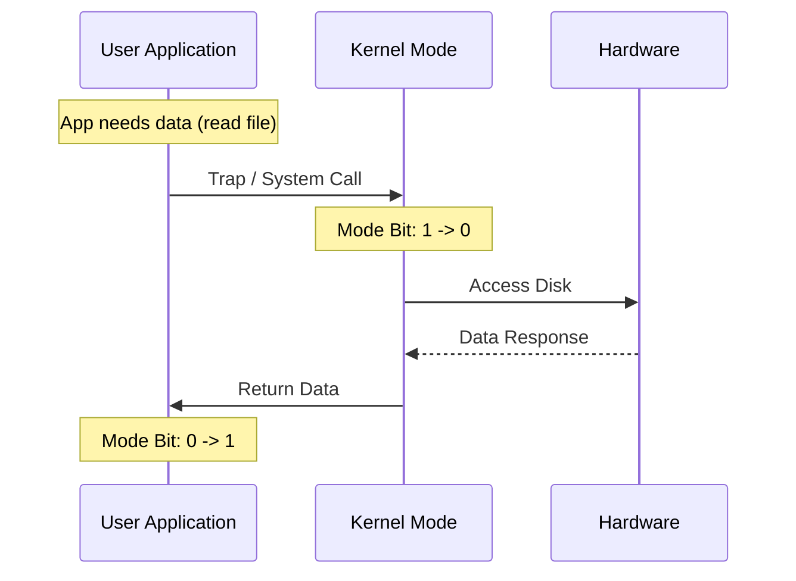
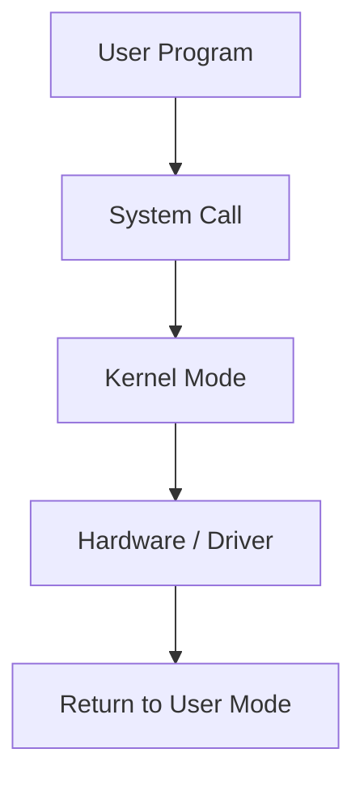

# 01 — OS Fundamentals: Kernel vs User Mode

> Operating System-এর core mechanics, privilege levels, system calls এবং Context Switching-এর গাণিতিক ব্যাখ্যা।

---

## Core Mechanics: User Mode vs Kernel Mode

Computer-এর security এবং stability নিশ্চিত করার জন্য modern OS-এ hardware level-এ **Dual Mode Operation** থাকে।

### ১. User Mode (Mode Bit = 1)
- যখন কোনো application (যেমন: Chrome, VS Code) রান করে, তখন সেটি User Mode-এ থাকে।
- এখানে application সরাসরি hardware access করতে পারে না।
- Restricted memory access থাকে।

### ২. Kernel Mode (Mode Bit = 0)
- এর অন্য নাম **Privileged Mode** বা **Supervisor Mode**।
- Hardware (RAM, CPU, Disk) এর উপর full control থাকে।
- OS Kernel এখানে রান করে।

### System Call Workflow
যখন কোনো application hardware resource চায় (যেমন: File read), তখন সে **System Call** trigger করে। এটি mode bit-কে 1 থেকে 0-তে চেইঞ্জ করে kernel mode-এ সুইচ করে।



---

## PCB & Context Switching Math

### Process Control Block (PCB)
প্রতিটি process-এর details সেভ করার জন্য RAM-এ একটি data structure থাকে যাকে **PCB** বলে।
- **PID:** Process ID
- **Program Counter:** পরের instruction-এর address।
- **Registers:** বর্তমান execution state।
- **Process State:** Ready, Running, Waiting ইত্যাদি।

### Context Switching Overhead calculation
ধরা যাক, CPU process $P_1$ থেকে $P_2$-তে সুইচ করছে। এই সময়ের মধ্যে CPU কোনো productive কাজ করে না।

**Formula:**
$$\text{CPU Utilization} = \frac{\text{Total Process Execute Time}}{\text{Total Time (Execute + Switch)}} \times 100$$

**Problem:** একটি CPU ১০ms ধরে execution করে এবং Context switch করতে ২ms সময় নেয়। CPU utilization কত?
**Solution:**
$$\text{Total Time} = 10 + 2 = 12 \text{ ms}$$
$$\text{Utilization} = \frac{10}{12} \times 100 = 83.33\%$$

---

## MCQs (Practice Set)

1. **System Call কীসের মাধ্যমে hardware access করে?**
   - (A) User application
   - (B) Kernel interface
   - (C) Pointer
   - (D) API only
   - **Ans: B**

2. **Privileged instructions কোন মোডে রান করে?**
   - (A) User mode
   - (B) Kernel mode
   - (C) Both
   - (D) RAM mode
   - **Ans: B**

3. **PCB-র মধ্যে নিচের কোনটি থাকে না?**
   - (A) Program Counter
   - (B) CPU Scheduling info
   - (C) Process State
   - (D) Desktop Background Image
   - **Ans: D**

4. **Context switching-এর সময় hardware mode bit কী হয়?**
   - (A) Always 1
   - (B) Always 0
   - (C) 1 থেকে 0 বা উল্টোটা (State অনুযায়ী)
   - (D) অপরিবর্তিত থাকে
   - **Ans: C**

5. **Mode Bit-এর মান '0' বলতে কী বোঝায়?**
   - (A) User mode
   - (B) Kernel mode
   - (C) Error
   - (D) Idle
   - **Ans: B**

6. **System Call-কে আর কী নামে ডাকা হয়?**
   - (A) Direct Call
   - (B) Trap
   - (C) Signal
   - (D) Interrupt
   - **Ans: B**

7. **নীচের কোনটি OS-এর কাজ নয়?**
   - (A) Window management
   - (B) Graphics designing
   - (C) File handling
   - (D) Resource allocation
   - **Ans: B**

8. **PCB কোথায় সংরক্ষিত থাকে?**
   - (A) Registers
   - (B) Main Memory (RAM)
   - (C) Cache
   - (D) Hard Disk
   - **Ans: B**

9. **Dispatcher কী করে?**
   - (A) Process create করে
   - (B) Context Switch হ্যান্ডেল করে
   - (C) Process terminate করে
   - (D) Memory allocate করে
   - **Ans: B**

10. **Dual mode কেন দরকার?**
    - (A) Speed বাড়ানোর জন্য
    - (B) System protection-এর জন্য
    - (C) Memory কমানোর জন্য
    - (D) GUI-এর জন্য
    - **Ans: B**

---

## Written Problems

1. **Explain the lifecycle of a System Call.**
   - **Solution:** User program syscall library call করে -> CPU trap generate করে -> Mode bit 0 হয় -> Kernel specific routine execute করে -> কাজ শেষে mode bit 1 করে result পাঠায়।

2. **What happens during a Context Switch?**
   - **Solution:** Current process-এর state PCB-তে save করা হয়, পরবর্তী process-এর state PCB থেকে রিড করে CPU register-এ লোড করা হয়। এই সময়ে CPU idle থাকে।

3. **Difference between Monolithic vs Microkernel.**
   - **Solution:** Monolithic-এ সব service kernel mode-এ থাকে (Fast but risky), Microkernel-এ শুধু essential service kernel-এ থাকে (Stable but more context switching)।

4. **Booting process (POST to Kernel load) সংক্ষেপে লেখ।**
   - **Solution:** Power on -> BIOS/UEFI starts -> POST (Hardware check) -> MBR/GPT থেকে Bootloader লোড হয় -> Kernel RAM-এ লোড হয় -> System initialize হয়।

5. **Context Switch time যদি ২০% হয়, এবং total process run time ১০০ms হয়, তবে overhead কত?**
   - **Solution:** Overhead = $100 \times 0.20 = 20 \text{ ms}$।

---

## Job Exam Special (BPSC/Bank)

- **BPSC Pattern:** System calls-এর types (Process control, File management, Device management) থেকে প্রশ্ন আসে।
- **Bank Pattern:** Shell vs Kernel-এর পার্থক্য এবং PCB-র contents মুখস্থ রাখা জরুরি।
- **Important Key:** Context switching overhead একটি critical resource consumption task।

---

## Interview Traps

- **Trap 1:** "সব কি system call দিয়ে হয়?" না, math execution kernel মোডে যাওয়ার দরকার নেই। 
- **Trap 2:** "Context switch কি multitasking বাড়ায়?" এটি illusion দেয়, আসলে যত বেশি switch তত CPU utilization কম।
- **Trap 3:** "Software Interrupt আর System call কি এক?" হ্যাঁ, syscall হলো এক ধরণের software interrupt বা trap।




- **User mode:** restricted privilege
- **Kernel mode:** full privileged access

### কেন দুই mode?
- Fault isolation
- Security boundary
- Controlled hardware access

---

## 3. Kernel Types (short)

| Type | Idea | Example |
|---|---|---|
| Monolithic | kernel-এ অনেক service built-in | Linux (modular monolithic) |
| Microkernel | minimal kernel, services user space | MINIX, QNX |
| Hybrid | mixed approach | Windows NT, XNU (macOS) |

---

## 4. System Call কী?

System call হলো user program থেকে kernel service request করার official interface।

### Common syscall groups
- Process control: `fork`, `exec`, `exit`, `wait`
- File operations: `open`, `read`, `write`, `close`
- Device ops: ioctl ধরনের control calls
- Information: `getpid`, `time`

### C example (Linux-style concept)

```c
#include <unistd.h>
#include <fcntl.h>

int main() {
    int fd = open("notes.txt", O_RDONLY);
    if (fd >= 0) {
        char buf[64];
        read(fd, buf, sizeof(buf));
        close(fd);
    }
    return 0;
}
```

---

## 5. Process Basics Snapshot

- Process = program in execution
- PCB (Process Control Block) stores state, PID, registers, memory pointers
- Basic states: New, Ready, Running, Waiting, Terminated

---

## 6. Boot Process (simplified)

1. Power on  
2. Firmware (BIOS/UEFI) hardware init  
3. Bootloader load  
4. Kernel load  
5. Init/system manager starts services  
6. User login / shell / GUI

---

## 7. MCQ (16) with Solution

**Q1.** OS মূলত কী?  
(a) শুধু compiler  
(b) resource manager ✅  
(c) শুধু antivirus  
(d) শুধু browser  
**Solution:** OS resources allocate/control করে।

**Q2.** User mode-এ direct hardware access কেমন?  
(a) full  
(b) restricted ✅  
(c) faster সবসময়  
(d) impossible সবসময়  
**Solution:** privileged instruction restricted।

**Q3.** Kernel mode-এর privilege level?  
(a) low  
(b) medium  
(c) highest ✅  
(d) none  
**Solution:** kernel mode privileged instructions execute করতে পারে।

**Q4.** System call কেন দরকার?  
(a) UI design  
(b) kernel service safely use ✅  
(c) RAM increase  
(d) CPU frequency বাড়ানো  
**Solution:** user→kernel controlled transition।

**Q5.** কোনটি file syscall?  
(a) fork  
(b) open ✅  
(c) wait  
(d) exec  
**Solution:** `open/read/write/close` file operations।

**Q6.** PCB কী store করে?  
(a) শুধু file name  
(b) process execution metadata ✅  
(c) network cable info  
(d) mouse position  
**Solution:** PID, state, registers etc.

**Q7.** Process state-এর মধ্যে কোনটা valid?  
(a) Sleeping forever  
(b) Ready ✅  
(c) Frozen stack only  
(d) Undefined  
**Solution:** Ready standard process state।

**Q8.** Bootloader-এর কাজ?  
(a) wallpaper load  
(b) kernel load ✅  
(c) file format convert  
(d) DB backup  
**Solution:** kernel memory-তে load ও transfer control।

**Q9.** Microkernel idea?  
(a) সব service kernel-এ  
(b) minimal core + rest user space ✅  
(c) no security  
(d) no IPC  
**Solution:** small trusted kernel।

**Q10.** Monolithic kernel সুবিধা?  
(a) no performance  
(b) fast internal communication ✅  
(c) no drivers  
(d) no memory mgmt  
**Solution:** service inside kernel হলে call overhead কম।

**Q11.** Context switch কবে হয়?  
(a) এক process শেষ না হলে না  
(b) CPU process বদলালে ✅  
(c) শুধু boot time  
(d) শুধু I/O device reset  
**Solution:** scheduler process বদলালে registers/state save-restore হয়।

**Q12.** `fork` সাধারণত কী করে?  
(a) file copy  
(b) child process create ✅  
(c) kernel shutdown  
(d) RAM clear  
**Solution:** parent process clone করে child তৈরি।

**Q13.** `exec` কী?  
(a) current process image replace ✅  
(b) process terminate  
(c) thread join  
(d) lock release  
**Solution:** একই PID process-এ নতুন program image run।

**Q14.** Kernel panic সাধারণত কী indicate করে?  
(a) normal state  
(b) serious kernel failure ✅  
(c) user typo  
(d) network retry  
**Solution:** unrecoverable kernel-level error।

**Q15.** OS ছাড়া কী হবে?  
(a) app সরাসরি hardware safely manage করবে  
(b) resource coordination collapse হতে পারে ✅  
(c) সব faster হবে  
(d) security বাড়বে  
**Solution:** scheduling, memory, I/O coordination কঠিন/unsafe হবে।

**Q16.** User→Kernel transition কিসে trigger হয়?  
(a) random event  
(b) system call / interrupt / exception ✅  
(c) text editor close  
(d) keyboard light  
**Solution:** controlled entry points only।

---

## 8. Written Problems (6) with Step-by-step Solution

### Problem 1: OS না থাকলে program execution-এ কী সমস্যা?
**Solution:**
1. CPU scheduling manual/unsafe  
2. memory overlap risk  
3. device sharing conflict  
4. security isolation না থাকার risk  
5. system instability high

### Problem 2: User mode + kernel mode separation explain
**Solution:**
1. user app restricted privilege  
2. sensitive operation syscall দিয়ে kernel-এ  
3. fault isolation improves  
4. malware impact limit হয়

### Problem 3: `fork` + `exec` flow explain
**Solution:**
1. parent `fork` করে child বানায়  
2. child `exec` দিয়ে নতুন program load  
3. parent `wait` করতে পারে child completion-এর জন্য

### Problem 4: Boot sequence লিখো
**Solution:**
Power on → BIOS/UEFI → Bootloader → Kernel → Init/Systemd → user session

### Problem 5: PCB কেন দরকার?
**Solution:**
CPU কে process pause/resume করতে context info লাগে (registers, state, PC)। PCB ছাড়া multitasking possible না।

### Problem 6: Syscall vs function call পার্থক্য
**Solution:**
- normal function: same user space context  
- syscall: privilege boundary cross করে kernel service invoke

---

## 9. Tricky Parts

1. Process ≠ Program (process is running instance)  
2. `fork` new process, `exec` new process না — existing process image replace  
3. User mode restriction security feature, limitation না  
4. Context switch useful হলেও overhead আছে

---

## 10. Summary

- OS role clear
- privilege model clear
- syscall lifecycle clear
- boot + process basics clear
- 16 MCQ + 6 written solved complete

---

## Navigation

- 🏠 Back to [Operating System — Master Index](00-master-index.md)
- ➡️ Next: Chapter 02 — Process & Thread

