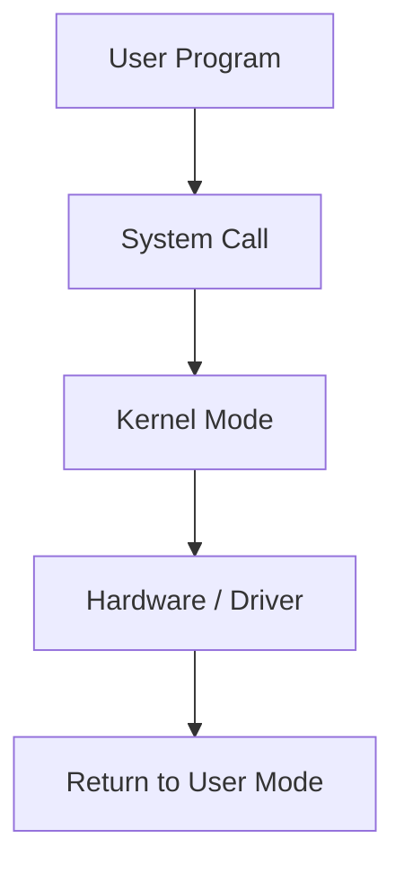

# Chapter 01 — OS Fundamentals & System Calls

> Operating System কী করে, kernel/user mode, system call flow, boot basics।

---

## 1. Operating System কী?

Operating System (OS) হলো user application আর hardware-এর মাঝে **resource manager + control layer**।

### OS-এর প্রধান কাজ
- Process management
- Memory management
- File system management
- I/O device management
- Security & protection

---

## 2. User Mode vs Kernel Mode



- **User mode:** restricted privilege
- **Kernel mode:** full privileged access

### কেন দুই mode?
- Fault isolation
- Security boundary
- Controlled hardware access

---

## 3. Kernel Types (short)

| Type | Idea | Example |
|---|---|---|
| Monolithic | kernel-এ অনেক service built-in | Linux (modular monolithic) |
| Microkernel | minimal kernel, services user space | MINIX, QNX |
| Hybrid | mixed approach | Windows NT, XNU (macOS) |

---

## 4. System Call কী?

System call হলো user program থেকে kernel service request করার official interface।

### Common syscall groups
- Process control: `fork`, `exec`, `exit`, `wait`
- File operations: `open`, `read`, `write`, `close`
- Device ops: ioctl ধরনের control calls
- Information: `getpid`, `time`

### C example (Linux-style concept)

```c
#include <unistd.h>
#include <fcntl.h>

int main() {
    int fd = open("notes.txt", O_RDONLY);
    if (fd >= 0) {
        char buf[64];
        read(fd, buf, sizeof(buf));
        close(fd);
    }
    return 0;
}
```

---

## 5. Process Basics Snapshot

- Process = program in execution
- PCB (Process Control Block) stores state, PID, registers, memory pointers
- Basic states: New, Ready, Running, Waiting, Terminated

---

## 6. Boot Process (simplified)

1. Power on  
2. Firmware (BIOS/UEFI) hardware init  
3. Bootloader load  
4. Kernel load  
5. Init/system manager starts services  
6. User login / shell / GUI

---

## 7. MCQ (16) with Solution

**Q1.** OS মূলত কী?  
(a) শুধু compiler  
(b) resource manager ✅  
(c) শুধু antivirus  
(d) শুধু browser  
**Solution:** OS resources allocate/control করে।

**Q2.** User mode-এ direct hardware access কেমন?  
(a) full  
(b) restricted ✅  
(c) faster সবসময়  
(d) impossible সবসময়  
**Solution:** privileged instruction restricted।

**Q3.** Kernel mode-এর privilege level?  
(a) low  
(b) medium  
(c) highest ✅  
(d) none  
**Solution:** kernel mode privileged instructions execute করতে পারে।

**Q4.** System call কেন দরকার?  
(a) UI design  
(b) kernel service safely use ✅  
(c) RAM increase  
(d) CPU frequency বাড়ানো  
**Solution:** user→kernel controlled transition।

**Q5.** কোনটি file syscall?  
(a) fork  
(b) open ✅  
(c) wait  
(d) exec  
**Solution:** `open/read/write/close` file operations।

**Q6.** PCB কী store করে?  
(a) শুধু file name  
(b) process execution metadata ✅  
(c) network cable info  
(d) mouse position  
**Solution:** PID, state, registers etc.

**Q7.** Process state-এর মধ্যে কোনটা valid?  
(a) Sleeping forever  
(b) Ready ✅  
(c) Frozen stack only  
(d) Undefined  
**Solution:** Ready standard process state।

**Q8.** Bootloader-এর কাজ?  
(a) wallpaper load  
(b) kernel load ✅  
(c) file format convert  
(d) DB backup  
**Solution:** kernel memory-তে load ও transfer control।

**Q9.** Microkernel idea?  
(a) সব service kernel-এ  
(b) minimal core + rest user space ✅  
(c) no security  
(d) no IPC  
**Solution:** small trusted kernel।

**Q10.** Monolithic kernel সুবিধা?  
(a) no performance  
(b) fast internal communication ✅  
(c) no drivers  
(d) no memory mgmt  
**Solution:** service inside kernel হলে call overhead কম।

**Q11.** Context switch কবে হয়?  
(a) এক process শেষ না হলে না  
(b) CPU process বদলালে ✅  
(c) শুধু boot time  
(d) শুধু I/O device reset  
**Solution:** scheduler process বদলালে registers/state save-restore হয়।

**Q12.** `fork` সাধারণত কী করে?  
(a) file copy  
(b) child process create ✅  
(c) kernel shutdown  
(d) RAM clear  
**Solution:** parent process clone করে child তৈরি।

**Q13.** `exec` কী?  
(a) current process image replace ✅  
(b) process terminate  
(c) thread join  
(d) lock release  
**Solution:** একই PID process-এ নতুন program image run।

**Q14.** Kernel panic সাধারণত কী indicate করে?  
(a) normal state  
(b) serious kernel failure ✅  
(c) user typo  
(d) network retry  
**Solution:** unrecoverable kernel-level error।

**Q15.** OS ছাড়া কী হবে?  
(a) app সরাসরি hardware safely manage করবে  
(b) resource coordination collapse হতে পারে ✅  
(c) সব faster হবে  
(d) security বাড়বে  
**Solution:** scheduling, memory, I/O coordination কঠিন/unsafe হবে।

**Q16.** User→Kernel transition কিসে trigger হয়?  
(a) random event  
(b) system call / interrupt / exception ✅  
(c) text editor close  
(d) keyboard light  
**Solution:** controlled entry points only।

---

## 8. Written Problems (6) with Step-by-step Solution

### Problem 1: OS না থাকলে program execution-এ কী সমস্যা?
**Solution:**
1. CPU scheduling manual/unsafe  
2. memory overlap risk  
3. device sharing conflict  
4. security isolation না থাকার risk  
5. system instability high

### Problem 2: User mode + kernel mode separation explain
**Solution:**
1. user app restricted privilege  
2. sensitive operation syscall দিয়ে kernel-এ  
3. fault isolation improves  
4. malware impact limit হয়

### Problem 3: `fork` + `exec` flow explain
**Solution:**
1. parent `fork` করে child বানায়  
2. child `exec` দিয়ে নতুন program load  
3. parent `wait` করতে পারে child completion-এর জন্য

### Problem 4: Boot sequence লিখো
**Solution:**
Power on → BIOS/UEFI → Bootloader → Kernel → Init/Systemd → user session

### Problem 5: PCB কেন দরকার?
**Solution:**
CPU কে process pause/resume করতে context info লাগে (registers, state, PC)। PCB ছাড়া multitasking possible না।

### Problem 6: Syscall vs function call পার্থক্য
**Solution:**
- normal function: same user space context  
- syscall: privilege boundary cross করে kernel service invoke

---

## 9. Tricky Parts

1. Process ≠ Program (process is running instance)  
2. `fork` new process, `exec` new process না — existing process image replace  
3. User mode restriction security feature, limitation না  
4. Context switch useful হলেও overhead আছে

---

## 10. Summary

- OS role clear
- privilege model clear
- syscall lifecycle clear
- boot + process basics clear
- 16 MCQ + 6 written solved complete

---

## Navigation

- 🏠 Back to [Operating System — Master Index](00-master-index.md)
- ➡️ Next: Chapter 02 — Process & Thread

