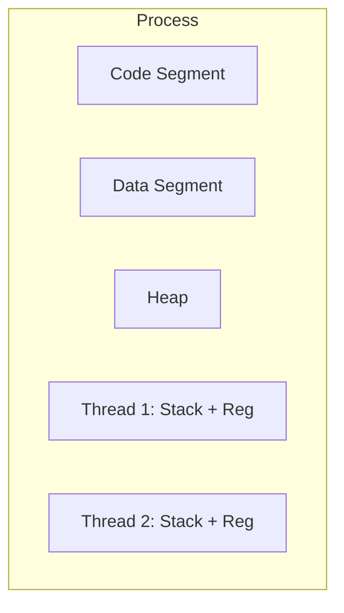

# 02 — Processes & Threads: Deep Dive

> Process creation, Threads vs Processes, এবং Context Switching-এর গাণিতিক বিশ্লেষণ।

---

## Core Mechanics: Processes vs Threads

### ১. Process (Heavyweight)
একটি প্রোগ্রাম যখন রান করে তখন তাকে **Process** বলে। এর নিজস্ব address space, text, data, and stack থাকে।
- **Creation:** `fork()` system call দিয়ে লিনাক্সে process তৈরি হয়।
- **Isolation:** এক প্রসেস অন্য প্রসেসের মেমোরিতে সরাসরি হাত দিতে পারে না।

### ২. Thread (Lightweight)
একটি প্রসেসের ভিতর অনেকগুলো independent execution path থাকতে পারে, যাদের **Thread** বলে।
- **Shared Memory:** একই প্রসেসের থ্রেডগুলো Code, Data, এবং Open files শেয়ার করে।
- **Stack:** প্রতিটি থ্রেডের নিজস্ব Stack এবং Registers থাকে।



---

## Numerical: Context Switching Math (Part 2)

**Problem:** 
একটি প্রসেসর প্রতি ৫ms পর পর Context switch করে। প্রতিটি সুইচ করতে ১ms সময় লাগে। ১ সেকেন্ডের মধ্যে CPU কতটুকু প্রডাক্টিভ কাজ (Utilized) করে?

**Calculation:**
- মোট সময় = ১০০০ ms
- একটি সাইকেল = ৫ ms (run) + ১ ms (switch) = ৬ ms।
- সাইকেল সংখ্যা = $1000 / 6 \approx 166$ বার।
- প্রডাক্টিভ কাজ = $166 \times 5 = 830 \text{ ms}$।
- **CPU Utilization:** $(830 / 1000) \times 100 = 83\%$।

---

## MCQs (Practice Set)

1. **কোনটি থ্রেডগুলো শেয়ার করে না?**
   - (A) Address Space
   - (B) Files
   - (C) Stack
   - (D) Code
   - **Ans: C**

2. **Linux-এ নতুন প্রসেস তৈরিতে কোন syscall ব্যবহৃত হয়?**
   - (A) create()
   - (B) fork()
   - (C) start()
   - (D) process()
   - **Ans: B**

3. **fork() কল করলে child প্রসেস এ রিটার্ন ভ্যালু কত হয়?**
   - (A) 0
   - (B) -1
   - (C) Child PID
   - (D) Parent PID
   - **Ans: A**

4. **Multi-threading-এর সব বড় সুবিধা কী?**
   - (A) Isolation
   - (B) Resource Sharing
   - (C) No Context Switch
   - (D) Low Memory usage
   - **Ans: B**

5. **Zombie Process কী?**
   - (A) শেষ হয়ে গেছে কিন্তু parent হারায়নি
   - (B) যে প্রসেস অনেক মেমোরি নেয়
   - (C) যে প্রসেস চলতে চলতে থেমে যায়
   - (D) Parent ছাড়া প্রসেস
   - **Ans: A**

6. **Orphan Process-কে কে অ্যাডপ্ট করে?**
   - (A) OS
   - (B) Init Process (PID 1)
   - (C) Root
   - (D) Hardware
   - **Ans: B**

7. **Context Switch-এর সময় CPU কোন মোডে থাকে?**
   - (A) User mode
   - (B) Kernel mode
   - (C) Standby mode
   - (D) Input mode
   - **Ans: B**

8. **নিচের কোনটি Lightweight Process?**
   - (A) Fork
   - (B) Thread
   - (C) Shell
   - (D) Daemon
   - **Ans: B**

9. **Context Switching Overhead কমানোর উপায় কী?**
   - (A) বড় কোয়ান্টাম টাইম
   - (B) ছোট RAM
   - (C) বেশি হার্ডডিস্ক
   - (D) কম প্রসেস রান করা
   - **Ans: A**

10. **Thread Control Block (TCB)-এ কী থাকে না?**
    - (A) Thread ID
    - (B) Register set
    - (C) Global data
    - (D) Thread State
    - **Ans: C** (এটি প্রসেস লেভেলে থাকে)

---

## Written Problems

1. **Describe the Process States (5-state model).**
   - **Solution:** 
     1. New: Process তৈরি হচ্ছে।
     2. Ready: RAM-এ আছে, CPU পাওয়ার অপেক্ষায়।
     3. Running: CPU-তে instruction রান করছে।
     4. Waiting: I/O বা অন্য ইভেন্টের অপেক্ষায়।
     5. Terminated: কাজ শেষ।

2. **fork() কেন ব্যবহার করা হয়? একটি ডায়াগ্রামে দেখাও।**
   - **Solution:** Parent প্রসেস হুবহু নিজের একটি কপি (Child) তৈরি করতে fork ব্যবহার করে। 
   - `if(fork() == 0)` হলে সেটি child।

3. **Threads vs Processes পার্থক্য ছক করে দেখাও।**
   - **Solution:** Process-এর isolation বেশি কিন্তু context switch costly; Thread-এর overhead কম কিন্তু synchronization কঠিন।

4. **What is Pre-emptive vs Non-preemptive scheduling?**
   - **Solution:** Pre-emptive-এ OS জোর করে CPU কেড়ে নিতে পারে (যেমন: Round Robin), Non-preemptive-এ প্রসেস নিজে না ছাড়লে নেওয়া যায় না (যেমন: FCFS)।

5. **PCB এবং TCB-র রিলেশন কী?**
   - **Solution:** প্রতিটি PCB-র আন্ডারে একাধিক TCB থাকতে পারে যদি প্রসেসটি multi-threaded হয়।

---

## Job Exam Special (BPSC/Bank)

- **Exam Note:** "Ready to Running" ট্রানজিশন কে হ্যান্ডেল করে?—**Dispatcher**।
- **Bank Logic:** থ্রেড শেয়ারিং এবং fork() রিটার্ন ভ্যালু থেকে অনেকবার প্রশ্ন এসেছে।

---

## Interview Traps

- **Trap 1:** "গুগল ক্রেম কি multi-process নাকি multi-thread?" এটি মূলত multi-process (প্রতিটি ট্যাব আলাদা প্রসেস) সিকিউরিটির জন্য।
- **Trap 2:** "Thread কি প্রসেসের চেয়ে ফাস্ট রান করে?" না, কোড রান করার স্পিড এক, কিন্তু সুইচিং এবং ক্রিয়েশন ফাস্ট।
- **Trap 3:** "Zombie process মেমোরি লিক করে?" না, এটি শুধু PCB-র একটি এন্ট্রি ব্লক করে রাখে।

    printf("Thread running: %d\n", *(int*)arg);
    return NULL;
}

int main() {
    pthread_t t1, t2;
    int a = 1, b = 2;

    pthread_create(&t1, NULL, worker, &a);
    pthread_create(&t2, NULL, worker, &b);

    pthread_join(t1, NULL);
    pthread_join(t2, NULL);
    return 0;
}
```

---

## 8. MCQ (16) with Solution

**Q1.** Process কী?  
(a) static file  
(b) program in execution ✅  
(c) শুধু thread list  
(d) শুধু stack  
**Solution:** running entity হলো process।

**Q2.** Thread কী share করে?  
(a) সব register  
(b) process address space ✅  
(c) own PID always  
(d) own executable file  
**Solution:** threads same process memory share করে।

**Q3.** Context switch-এ কী save হয়?  
(a) keyboard layout  
(b) CPU state (PC/register) ✅  
(c) monitor brightness  
(d) BIOS settings  
**Solution:** execution resume করতে CPU context লাগে।

**Q4.** কোনটা বেশি costly?  
(a) thread switch  
(b) process switch ✅  
(c) function call  
(d) cache hit  
**Solution:** process switch-এ address space changeসহ overhead বেশি।

**Q5.** PCB full form?  
(a) Process Code Base  
(b) Process Control Block ✅  
(c) Program Core Buffer  
(d) Priority CPU Block  
**Solution:** OS process metadata structure।

**Q6.** Running → Waiting transition কবে?  
(a) CPU faster হলে  
(b) I/O request করলে ✅  
(c) RAM full হলে  
(d) compile error হলে  
**Solution:** blocking event এ process অপেক্ষায় যায়।

**Q7.** Ready state মানে?  
(a) running now  
(b) terminated  
(c) CPU পাওয়ার অপেক্ষায় ✅  
(d) disk write করছে  
**Solution:** ready queue-তে wait করে।

**Q8.** Thread advantage?  
(a) communication harder  
(b) lower creation overhead ✅  
(c) no synchronization needed  
(d) no shared memory  
**Solution:** lightweight entity হওয়ায় cost কম।

**Q9.** Multi-thread risk?  
(a) race condition ✅  
(b) no bug possible  
(c) no deadlock  
(d) no shared state  
**Solution:** shared memory এ sync না করলে race হয়।

**Q10.** Parent process child তৈরি করে কোন syscall-এ?  
(a) exec  
(b) fork ✅  
(c) wait  
(d) open  
**Solution:** `fork()` child create করে।

**Q11.** `exec` কাজ?  
(a) child create  
(b) current process image replace ✅  
(c) block queue clear  
(d) lock release  
**Solution:** নতুন program load হয় same process context-এ।

**Q12.** Kernel thread scheduling কে করে?  
(a) app নিজে  
(b) kernel scheduler ✅  
(c) compiler  
(d) linker  
**Solution:** kernel-managed thread scheduling।

**Q13.** Thread-এর own resource সাধারণত কী?  
(a) heap shared না  
(b) stack ✅  
(c) code segment  
(d) global data  
**Solution:** stack/register per-thread।

**Q14.** Excessive context switch effect?  
(a) throughput বাড়ে সবসময়  
(b) overhead বাড়ে ✅  
(c) RAM free বাড়ে  
(d) syscall কমে  
**Solution:** useful work সময় কমে।

**Q15.** Terminated state মানে?  
(a) ready  
(b) blocked  
(c) execution finished ✅  
(d) running  
**Solution:** process complete/aborted।

**Q16.** User thread major limitation?  
(a) খুব slow create  
(b) blocking syscall পুরো process block করতে পারে ✅  
(c) no portability  
(d) no library  
**Solution:** kernel unaware model-এ common issue।

---

## 9. Written Problems (6) with Step-by-step Solution

### Problem 1: Process আর thread difference explain (interview short)
**Solution:**
1. Process = resource container + isolation  
2. Thread = execution unit inside process  
3. Process switch costly, thread switch cheaper  
4. Threads share memory তাই sync দরকার

### Problem 2: State transition trace
Given: process start → CPU পেল → disk read request → disk done → CPU পেল → finish  
**Solution:** New → Ready → Running → Waiting → Ready → Running → Terminated

### Problem 3: কেন multi-threaded server ব্যবহার হয়?
**Solution:**
1. concurrency improve  
2. blocking I/O তে অন্য thread কাজ চালায়  
3. better responsiveness  
4. resource sharing সহজ

### Problem 4: Context switch steps লিখো
**Solution:**
1. interrupt/timer event  
2. current context PCB-তে save  
3. scheduler next pick  
4. next context restore  
5. resume execution

### Problem 5: Race condition ছোট উদাহরণ
**Solution:** দুই thread same counter increment করলে lost update হতে পারে; mutex use করে protect করতে হবে।

### Problem 6: `fork` + `exec` + `wait` flow
**Solution:**
1. parent `fork` child create  
2. child `exec` new program run  
3. parent `wait` child completion  
4. zombie avoid হয়

---

## 10. Tricky Parts

1. Thread lightweight মানে free না — sync cost থাকে  
2. Shared memory = fast communication + race risk  
3. `fork` new process, `exec` নতুন image  
4. Ready ≠ Running  
5. Context switch reduce না করলে CPU waste বাড়ে

---

## 11. Summary

- Process/thread model clear
- PCB + state machine clear
- context switch mechanism clear
- practical interview Q/A readiness improved
- 16 MCQ + 6 written solved complete

---

## Navigation

- 🏠 Back to [Operating System — Master Index](00-master-index.md)
- ⬅️ [Chapter 01](01-os-fundamentals-system-calls.md)
- ➡️ Next: Chapter 03 — CPU Scheduling

