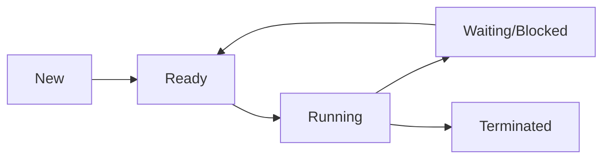
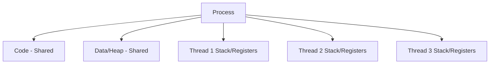

# Chapter 02 — Process, Thread & Context Switch

> Process/thread fundamentals + lifecycle + context switching + interview-oriented practice।

---

## 1. Process vs Thread

| বিষয় | Process | Thread |
|---|---|---|
| Definition | running program instance | process-এর execution unit |
| Address space | আলাদা | same process memory share |
| Creation cost | বেশি | কম |
| Context switch cost | বেশি | তুলনামূলক কম |
| Failure impact | isolated | same process threads affected হতে পারে |

---

## 2. Process States



---

## 3. PCB (Process Control Block)

PCB সাধারণত রাখে:
- PID
- Process state
- Program counter
- CPU registers
- Scheduling info (priority, queue pointer)
- Memory info (page table pointer)
- I/O status info

---

## 4. Thread Model

### Single-threaded process
- একটাই control flow

### Multi-threaded process
- একাধিক parallel/overlapped execution path
- একই code segment, data segment share
- প্রতি thread-এর own stack + registers



---

## 5. Context Switch

Context switch = CPU এক execution entity (process/thread) থেকে অন্যটিতে যাওয়ার সময়:
1. old context save
2. scheduler next নির্বাচন
3. new context restore

### কেন switch হয়?
- time quantum শেষ
- I/O wait
- higher priority process arrival
- interrupt

### Overhead
Context switch productive computation না; তাই excessive switching performance কমায়।

---

## 6. User Thread vs Kernel Thread (short)

| Model | Pros | Cons |
|---|---|---|
| User-level thread | fast create/switch | blocking syscall পুরো process block করতে পারে |
| Kernel-level thread | true parallelism + better scheduling | higher overhead |

---

## 7. Basic C Snippet (conceptual)

```c
#include <stdio.h>
#include <pthread.h>

void* worker(void* arg) {
    printf("Thread running: %d\n", *(int*)arg);
    return NULL;
}

int main() {
    pthread_t t1, t2;
    int a = 1, b = 2;

    pthread_create(&t1, NULL, worker, &a);
    pthread_create(&t2, NULL, worker, &b);

    pthread_join(t1, NULL);
    pthread_join(t2, NULL);
    return 0;
}
```

---

## 8. MCQ (16) with Solution

**Q1.** Process কী?  
(a) static file  
(b) program in execution ✅  
(c) শুধু thread list  
(d) শুধু stack  
**Solution:** running entity হলো process।

**Q2.** Thread কী share করে?  
(a) সব register  
(b) process address space ✅  
(c) own PID always  
(d) own executable file  
**Solution:** threads same process memory share করে।

**Q3.** Context switch-এ কী save হয়?  
(a) keyboard layout  
(b) CPU state (PC/register) ✅  
(c) monitor brightness  
(d) BIOS settings  
**Solution:** execution resume করতে CPU context লাগে।

**Q4.** কোনটা বেশি costly?  
(a) thread switch  
(b) process switch ✅  
(c) function call  
(d) cache hit  
**Solution:** process switch-এ address space changeসহ overhead বেশি।

**Q5.** PCB full form?  
(a) Process Code Base  
(b) Process Control Block ✅  
(c) Program Core Buffer  
(d) Priority CPU Block  
**Solution:** OS process metadata structure।

**Q6.** Running → Waiting transition কবে?  
(a) CPU faster হলে  
(b) I/O request করলে ✅  
(c) RAM full হলে  
(d) compile error হলে  
**Solution:** blocking event এ process অপেক্ষায় যায়।

**Q7.** Ready state মানে?  
(a) running now  
(b) terminated  
(c) CPU পাওয়ার অপেক্ষায় ✅  
(d) disk write করছে  
**Solution:** ready queue-তে wait করে।

**Q8.** Thread advantage?  
(a) communication harder  
(b) lower creation overhead ✅  
(c) no synchronization needed  
(d) no shared memory  
**Solution:** lightweight entity হওয়ায় cost কম।

**Q9.** Multi-thread risk?  
(a) race condition ✅  
(b) no bug possible  
(c) no deadlock  
(d) no shared state  
**Solution:** shared memory এ sync না করলে race হয়।

**Q10.** Parent process child তৈরি করে কোন syscall-এ?  
(a) exec  
(b) fork ✅  
(c) wait  
(d) open  
**Solution:** `fork()` child create করে।

**Q11.** `exec` কাজ?  
(a) child create  
(b) current process image replace ✅  
(c) block queue clear  
(d) lock release  
**Solution:** নতুন program load হয় same process context-এ।

**Q12.** Kernel thread scheduling কে করে?  
(a) app নিজে  
(b) kernel scheduler ✅  
(c) compiler  
(d) linker  
**Solution:** kernel-managed thread scheduling।

**Q13.** Thread-এর own resource সাধারণত কী?  
(a) heap shared না  
(b) stack ✅  
(c) code segment  
(d) global data  
**Solution:** stack/register per-thread।

**Q14.** Excessive context switch effect?  
(a) throughput বাড়ে সবসময়  
(b) overhead বাড়ে ✅  
(c) RAM free বাড়ে  
(d) syscall কমে  
**Solution:** useful work সময় কমে।

**Q15.** Terminated state মানে?  
(a) ready  
(b) blocked  
(c) execution finished ✅  
(d) running  
**Solution:** process complete/aborted।

**Q16.** User thread major limitation?  
(a) খুব slow create  
(b) blocking syscall পুরো process block করতে পারে ✅  
(c) no portability  
(d) no library  
**Solution:** kernel unaware model-এ common issue।

---

## 9. Written Problems (6) with Step-by-step Solution

### Problem 1: Process আর thread difference explain (interview short)
**Solution:**
1. Process = resource container + isolation  
2. Thread = execution unit inside process  
3. Process switch costly, thread switch cheaper  
4. Threads share memory তাই sync দরকার

### Problem 2: State transition trace
Given: process start → CPU পেল → disk read request → disk done → CPU পেল → finish  
**Solution:** New → Ready → Running → Waiting → Ready → Running → Terminated

### Problem 3: কেন multi-threaded server ব্যবহার হয়?
**Solution:**
1. concurrency improve  
2. blocking I/O তে অন্য thread কাজ চালায়  
3. better responsiveness  
4. resource sharing সহজ

### Problem 4: Context switch steps লিখো
**Solution:**
1. interrupt/timer event  
2. current context PCB-তে save  
3. scheduler next pick  
4. next context restore  
5. resume execution

### Problem 5: Race condition ছোট উদাহরণ
**Solution:** দুই thread same counter increment করলে lost update হতে পারে; mutex use করে protect করতে হবে।

### Problem 6: `fork` + `exec` + `wait` flow
**Solution:**
1. parent `fork` child create  
2. child `exec` new program run  
3. parent `wait` child completion  
4. zombie avoid হয়

---

## 10. Tricky Parts

1. Thread lightweight মানে free না — sync cost থাকে  
2. Shared memory = fast communication + race risk  
3. `fork` new process, `exec` নতুন image  
4. Ready ≠ Running  
5. Context switch reduce না করলে CPU waste বাড়ে

---

## 11. Summary

- Process/thread model clear
- PCB + state machine clear
- context switch mechanism clear
- practical interview Q/A readiness improved
- 16 MCQ + 6 written solved complete

---

## Navigation

- 🏠 Back to [Operating System — Master Index](00-master-index.md)
- ⬅️ [Chapter 01](01-os-fundamentals-system-calls.md)
- ➡️ Next: Chapter 03 — CPU Scheduling

