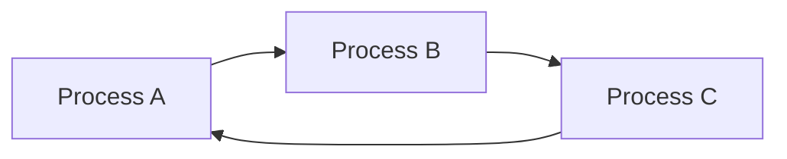

# Chapter 03 — CPU Scheduling — OS 🌐

# Topic 10: The Core Objective
CPU Scheduling-এর মূল লক্ষ্য হলো **CPU Utilization** বাড়ানো এবং **Waiting Time** কমানো।

### 10.1 Key Metrics
1.  **Arrival Time (AT):** প্রসেস কখন তৈরি হলো।
2.  **Burst Time (BT):** CPU-তে কত সময় প্রয়োজন।
3.  **Exit Time (ET):** প্রসেস কখন শেষ হলো।
4.  **Turn Around Time (TAT):** $ET - AT$
5.  **Waiting Time (WT):** $TAT - BT$

---

# Topic 11: Priority Scheduling & Round Robin
Round Robin (RR) মেকানিজম **Time Quantum** এর ওপর নির্ভর করে। এটি ফেয়ার-শেয়ার অ্যালগরিদম।

---

### 🔥 Job Exam Special (BPSC/Bank)
- **Starvation:** লো-প্রিওরিটি প্রসেস যখন সিপিপি পায় না। এর সমাধান হলো **Ageing** (সময়ের সাথে প্রসেসের অগ্রাধিকার বাড়ানো)।
- **Preemptive vs Non-preemptive:** মাঝপথে প্রসেসকে থামিয়ে দিলে তা Preemptive।

---

### 🧠 Practice Zone (Gantt Chart & MCQ)

#### 📝 Numerical Challenge: Step-by-Step Gantt Chart
**Problem:** নিচের প্রসেসগুলোর জন্য Non-preemptive **SJF (Shortest Job First)** অ্যালগোরিদম ব্যবহার করে Average Waiting Time এবং Average Turnaround Time বের করো।

| Process | Arrival Time (AT) | Burst Time (BT) |
| :--- | :--- | :--- |
| P1 | 0 | 7 |
| P2 | 2 | 4 |
| P3 | 4 | 1 |
| P4 | 5 | 4 |

**Step 1: Gantt Chart তৈরি**
1. $t=0$: শুধুমাত্র **P1** আছে। এটি শেষ হবে $t=7$ এ।
2. $t=7$: P2, P3, P4 সবাই পৌঁছে গেছে। SJF অনুযায়ী সবচেয়ে ছোট **P3** (BT=1) আগে চলবে। এটি শেষ হবে $t=8$ এ।
3. $t=8$: এখন P2 এবং P4 বাকি (উভয় BT=4)। টাই হলে ছোট ID বা Arrival অনুযায়ী **P2** আগে চলবে। এটি শেষ হবে $t=12$ এ।
4. $t=12$: সবশেষে **P4** চলবে। এটি শেষ হবে $t=16$ এ।

**Gantt Chart:**
[ P1 (0-7) | P3 (7-8) | P2 (8-12) | P4 (12-16) ]`

**Step 2: Table ক্যালকুলেশন**
- $TAT = Exit Time - AT$
- $WT = TAT - BT$

| Process | AT | BT | ET | TAT | WT |
| :--- | :--- | :--- | :--- | :--- | :--- |
| P1 | 0 | 7 | 7 | 7 | 0 |
| P2 | 2 | 4 | 12 | 10 | 6 |
| P3 | 4 | 1 | 8 | 4 | 3 |
| P4 | 5 | 4 | 16 | 11 | 7 |

- **Avg TAT:** $(7+10+4+11)/4 = 32/4 = 8$ ms
- **Avg WT:** $(0+6+3+7)/4 = 16/4 = 4$ ms

---

#### 🎯 MCQ Drill (10+ Questions)
1. **CPU Idle থাকলে কোন অবস্থা তৈরি হয়?**
   - (A) Throughput বাড়ে (B) Utilization কমে (C) Waiting time কমে **(D) Efficiency কমে**
2. **Convoy Effect কোন অ্যালগোরিদমে দেখা যায়?**
   - **(A) FCFS** (B) SJF (C) Round Robin (D) Priority
3. **SJF এর প্রি-এম্পটিভ ভার্সন কোনটি?**
   - (A) FCFS (B) RR **(C) SRTF** (D) Multilevel Queue
4. **Round Robin-এ Time Quantum খুব বড় হলে সেটি কিসের মতো কাজ করে?**
   - **(A) FCFS** (B) SJF (C) Priority (D) LIFO
5. **Ageing কিসের সমাধান হিসেবে ব্যবহৃত হয়?**
   - (A) Memory leak (B) Fragmentation **(C) Starvation** (D) Deadlock
6. **কোনটি Real-time OS-এর জন্য সবচেয়ে উপযোগী?**
   - (A) FCFS (B) Round Robin (C) SJF **(D) Preemptive Priority**
7. **Context Switching টাইম বাড়লে কী হয়?**
   - (A) CPU efficiency বাড়ে **(B) Overhead বাড়ে** (C) Throughput বাড়ে (D) Response বাড়ে
8. **নচের কোনটি Non-preemptive?**
   - (A) RR (B) SRTF **(C) FCFS** (D) Priority (Preemptive)
9. **Dispatch Latency কী?**
   - (A) প্রসেস তৈরি হতে সময় (B) প্রসেস শেষ হতে সময় **(C) এক প্রসেস থামিয়ে অন্যটি শুরু করার সময়** (D) CPU idle টাইম
10. **Multilevel Feedback Queue-র মূল সুবিধা কী?**
    - **(A) প্রসেস এক কিউ থেকে অন্য কিউতে যেতে পারে** (B) এটি শুধু ২টো কিউ ব্যবহার করে (C) এটি খুব স্লো (D) কোন সুবিধা নেই

#### ✍️ Written Questions (5+)
1. **Explain the difference between Preemptive and Non-preemptive scheduling.**
   - *Ans:* প্রি-এম্পটিভ পদ্ধতিতে CPU থেকে প্রসেসকে জোর করে সরিয়ে অন্য প্রসেস দেওয়া যায়। নন-প্রি-এম্পটিভে প্রসেস নিজে শেষ না হওয়া পর্যন্ত CPU ছাড়ে না।
2. **What is Starvation? How can it be solved?**
   - *Ans:* যখন লো-প্রিওরিটি প্রসেস অনেক সময় ধরে CPU পায় না। সমাধান হলো Ageing (সময়ের সাথে প্রসেসের অগ্রাধিকার বাড়ানো)।
3. **Explain Convoy Effect with an example.**
   - *Ans:* FCFS-এ যদি বড় Burst টাইমওয়ালা প্রসেস আগে আসে, তবে ছোট ছোট প্রসেসগুলো আটকে যায়।
4. **Why is Round Robin considered "Fair"?**
   - *Ans:* কারণ এখানে প্রত্যেক প্রসেসকে নির্দিষ্ট সময় (Time Quantum) পর পর CPU দেওয়া হয়।
5. **Define Response Time and Throughput.**
   - *Ans:* Response Time: প্রথমবার রেসপন্স করতে সময়। Throughput: প্রতি ইউনিট টাইমে কতগুলো প্রসেস শেষ হয়।

