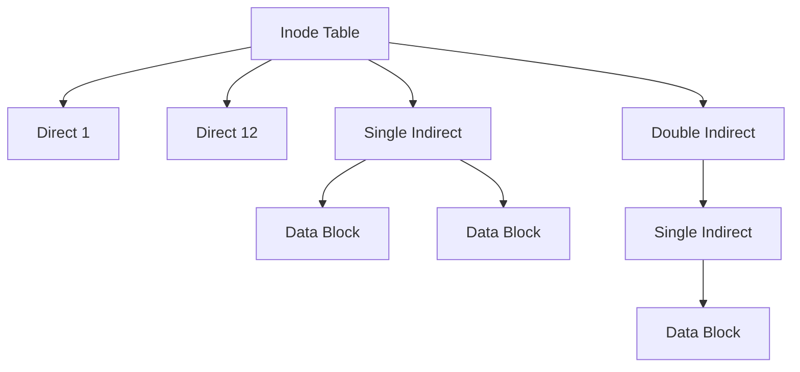

# 07 — File System & Disk Management: Inode & Storage

> File allocation methods, Inode structure, এবং Disk Scheduling algorithms.

---

## Core Mechanics: Inode Structure (Unix)

Unix সিস্টেমে প্রতিটি ফাইলের মেটাডেটা একটি **Inode**-এ থাকে। এটি সরাসরি মেমোরিতে ফাইলের অবস্থান বলে দেয় না, বরং কিছু **Direct** এবং **Indirect** পয়েন্টার ব্যবহার করে।

### Inode Breakdown:
- **Direct Pointers:** সাধারণত ১২টি পয়েন্টার সরাসরি ডাটা ব্লককে পয়েন্ট করে। (ছোট ফাইলের জন্য ফাস্ট)।
- **Single Indirect:** একটি ব্লক যা অন্য অনেক ডাটা ব্লকের অ্যাড্রেস রাখে।
- **Double Indirect:** পয়েন্টারের পয়েন্টার। খুব বড় ফাইলের জন্য ব্যবহৃত হয়।

---

## Numerical Walking: Disk Scheduling (SCAN)

**Problem:** 
Disk queue-তে রিকোয়েস্ট আছে: ৯৮, ১৮৩, ৩৭, ১২২, ১৪, ১২৪, ৬৫, ৬৭। হেড বর্তমানে ৫৩-তে আছে এবং ০-এর দিকে যাচ্ছে। SCAN অ্যালগরিদমে মোট হেড মুভমেন্ট কত? (ডিস্ক সাইজ ২০০ ব্লক, ০-১৯৯)।

### Logic:
1. ৫৩ থেকে ০-এর দিকে যাওয়ার পথে যা যা পড়বে সব কভার করবে: $53 \to 37 \to 14 \to 0$।
2. ০-তে পৌঁছানোর পর উল্টো দিকে ১৯৯-এর দিকে রওনা দিবে: $0 \to 65 \to 67 \to 98 \to 122 \to 124 \to 183$।

**Calculation:**
Total Distance $= (53-0) + (183-0) = 53 + 183 = 236 \text{ cylinders}$।

---

## MCQs (Practice Set)

1. **Inode-এ নিচের কোনটি থাকে না?**
   - (A) File Size
   - (B) Owner ID
   - (C) File Name
   - (D) Permissions
   - **Ans: C** (ফাইলের নাম ডিরেক্টরি এন্ট্রিতে থাকে)

2. **সবচেয়ে ফাস্ট ডিস্ক শিডিউলিং কোনটি?**
   - (A) FCFS
   - (B) SCAN
   - (C) SSTF
   - (D) LOOK
   - **Ans: C** (Shortest Seek Time First)

3. **C-SCAN-এর সুবিধা কী?**
   - (A) কম ডিস্টেন্স
   - (B) ইউনিফর্ম ওয়েটিং টাইম
   - (C) সহজ ইমপ্লিমেন্টেশন
   - (D) স্টারভেশন নেই
   - **Ans: B**

4. **Boot sector ডিস্কের কোথায় থাকে?**
   - (A) লাস্ট ব্লক
   - (B) ফার্স্ট ব্লক (Sector 0)
   - (C) মাঝখানে
   - (D) র‍্যামে
   - **Ans: B**

5. **নিচের কোনটি File Allocation Method নয়?**
   - (A) Contiguous
   - (B) Linked
   - (C) Indexed
   - (D) Paging
   - **Ans: D** (পেজিং মেমোরি ম্যানেজমেন্টের জন্য)

6. **Random Access-এর জন্য সেরা বরাদ্দ পদ্ধতি কোনটি?**
   - (A) Linked
   - (B) Contiguous
   - (C) Sequential
   - (D) Indexed
   - **Ans: B**

7. **Disk Formatting-কে কী বলা হয়?**
   - (A) Low-level formatting
   - (B) High-level formatting
   - (C) Logical formatting
   - (D) Partitioning
   - **Ans: A**

8. **RAID-0 এর মূল উদ্দেশ্য কী?**
   - (A) Redundancy
   - (B) Performance (Striping)
   - (C) Backup
   - (D) Security
   - **Ans: B**

9. **Mirroring কোন RAID লেভেলে থাকে?**
   - (A) RAID 1
   - (B) RAID 10
   - (C) RAID 5
   - (D) RAID 10
   - **Ans: B**

10. **SSTF-এর বড় সমস্যা কী?**
    - (A) লো স্পিড
    - (B) Starvation
    - (C) কনভয় ইফেক্ট
    - (D) মেমোরি লিক
    - **Ans: B**

---

## Written Problems

1. **Briefly explain Direct, Single Indirect, and Double Indirect pointers.**
   - **Solution:** Direct pointer সরাসরি ডাটা ব্লককে পয়েন্ট করে। Indirect পয়েন্টার একটি ব্লক ফাইলকে পয়েন্ট করে যাতে অন্য ডাটা ব্লকের অ্যাড্রেস থাকে। এটি ফাইলের সর্বোচ্চ সাইজ বাড়ায়।

2. **Disk Latency vs Seek Time?**
   - **Solution:** Seek time হলো হেডকে সঠিক ট্র্যাকে নেওয়ার সময়। Latency হলো কাঙ্ক্ষিত সেক্টরটি হেডের নিচে আসার সময় (রোটেশনাল ডিলে)।

3. **What is Contiguous Allocation and its drawback?**
   - **Solution:** ফাইলকে ডিস্কে পাশাপাশি ব্লকে রাখা। এটি ফাস্ট কিন্তু নতুন ডাটা অ্যাড করা কঠিন এবং এক্সটারনাল ফ্র্যাগমেন্টেশন তৈরি করে।

4. **RAID 5 কেন জনপ্রিয়?**
   - **Solution:** এটি ব্লক-লেভেল স্ট্রাইপিং এবং ডিস্ট্রিবিউটেড প্যারিটি ব্যবহার করে, যা পারফরম্যান্স এবং ডাটা প্রোটেকশন দুটোর ব্যালেন্স দেয়।

5. **Compare SCAN vs C-SCAN.**
   - **Solution:** SCAN দুই দিকেই সার্ভিস দেয়, কিন্তু C-SCAN শুধু একদিকে সার্ভিস দেয় এবং অন্য দিকে ফিরে আসার সময় কোনো রিকোয়েস্ট নেয় না, যা ওয়েটিং টাইমকে ইউনিফর্ম করে।

---

## Job Exam Special (BPSC/Bank)

- **Exam Tip:** "File Name কোথায় থাকে?"—inode-এ নয়, ডিরেক্টরি এন্ট্রিতে। এটি প্রায় প্রতিটি ভাইভা এবং রিটেন পরীক্ষায় আসে।
- **Logic:** RAID 1 এবং RAID 5 এর পার্থক্য মুখস্থ রাখা জরুরি।

---

## Interview Traps

- **Trap 1:** "ডিস্ক কি র‍্যামের মত ফাস্ট হতে পারে?" না, মেকানিক্যাল পার্টস থাকার কারণে ডিস্ক সবসময় কয়েক হাজার গুণ স্লো।
- **Trap 2:** "SSD-তে কি SCAN অ্যালগরিদম দরকার?" না, SSD-তে কোনো মুভিং হেড নেই, তাই এখানে শিডিউলিং লেটেন্সি খুব কম।
- **Trap 3:** "একটা ইনোড দিয়ে কি আনলিমিটেড সাইজের ফাইল স্টোর করা যায়?" না, ট্রিপল ইনডাইরেক্ট পয়েন্টারেরও একটি লিমিট আছে।

