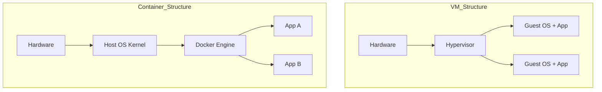

# 08 — Virtualization & Containers: Docker Deep Dive

> Hypervisors vs Containers, Docker internals, এবং Security concepts.

---

## Core Mechanics: Hypervisor vs Container

Virtualization প্রযুক্তি hardware resource-কে ভাগ করে একাধিক OS চালানোর সুযোগ দেয়।

### ১. Hypervisor (Type 1 & Type 2)
- **Type 1 (Bare Metal):** সরাসরি hardware-এর ওপর বসে। (e.g., VMware ESXi, Xen)।
- **Type 2 (Hosted):** হোস্ট OS-এর ওপর সফটওয়্যার হিসেবে চলে। (e.g., VirtualBox)।
- **Mechanics:** প্রতিটি VM-এর নিজস্ব **Guest OS** থাকে।

### ২. Containers (Docker)
- এটি Hardware ভার্চুয়ালাইজেশন নয়, বরং **OS-level ভার্চুয়ালাইজেশন**।
- **Internal Mechanics:** লিনাক্স কার্নেলের **Namespaces** (Isolation-এর জন্য) এবং **Cgroups** (Resource limit-এর জন্য) ব্যবহার করে।
- **Benefit:** হোস্ট OS কার্নেল শেয়ার করে, তাই VM-এর চেয়ে অনেক ফাস্ট।

---

## Technical Walkthrough: Protection Matrix

System security নিশ্চিত করতে **Access Control Matrix** ব্যবহৃত হয়। এতে Domain এবং Object-এর মধ্যে সম্পর্ক দেখানো হয়।

**Example Matrix:**
| Domain | File A | File B | Printer |
|---|---|---|---|
| Admin | Read/Write | Read/Write | Use |
| User | Read | None | Use |

---

## MCQs (Practice Set)

1. **Docker কোন লিনাক্স ফিচার ব্যবহার করে রিসোর্স লিমিট করে?**
   - (A) Namespaces
   - (B) Cgroups
   - (C) System Call
   - (D) Cron
   - **Ans: B**

2. **VMware Workstation কোন ধরণের হাইপারভাইজার?**
   - (A) Type 1
   - (B) Type 2
   - (C) Native
   - (D) Hardware
   - **Ans: B**

3. **কনটেইনার কেন হাইপারভাইজারের চেয়ে হালকা?**
   - (A) হার্ডওয়্যার লাগে না
   - (B) হোস্ট কার্নেল শেয়ার করে
   - (C) ইন্টারফেস ছোট
   - (D) সিকিউরিটি নেই
   - **Ans: B**

4. **Namespace-এর কাজ কী?**
   - (A) রিসোর্স কমানো
   - (B) প্রসেস আইসোলেশন
   - (C) স্পিড বাড়ানো
   - (D) মেমোরি ফিক্স করা
   - **Ans: B**

5. **Principle of Least Privilege মানে কী?**
   - (A) সবাইকে রুট এক্সেস দেওয়া
   - (B) যতটুক দরকার শুধু ততটুকুই পাওয়ার দেওয়া
   - (C) পাসওয়ার্ড না রাখা
   - (D) সব ফাইল রিড এক্সেস রাখা
   - **Ans: B**

6. **Bare Metal Hypervisor সরাসরি কোথায় রান করে?**
   - (A) Windows
   - (B) Linux
   - (C) Hardware
   - (D) BIOS
   - **Ans: C**

7. **Docker Image-এর একটি layer পরিবর্তন করলে কী হয়?**
   - (A) সব লেয়ার আবার ডাউনলোড হয়
   - (B) শুধু ওই লেয়ারটি চেইঞ্জ হয় (Copy-on-write)
   - (C) ইমেজ ডিলিট হয়ে যায়
   - (D) ওএস হ্যাং করে
   - **Ans: B**

8. **Trojan Horse কী?**
   - (A) উপকারী কোড
   - (B) দেখতে কাজের মনে হলেও ভেতরে ম্যালওয়্যার
   - (C) অ্যান্টিভাইরাস
   - (D) হার্ডওয়্যার ডিভাইস
   - **Ans: B**

9. **Encryption কেন ব্যবহৃত হয়?**
   - (A) স্পিড বাড়াতে
   - (B) ডেটা হাইড (Confidentiality) করতে
   - (C) মেমোরি বাঁচাতে
   - (D) ডিলিট রুখতে
   - **Ans: B**

10. **Amoeba OS কীসের উদাহরণ?**
    - (A) Real-time
    - (B) Distributed OS
    - (C) Batch
    - (D) Single user
    - **Ans: B**

---

## Written Problems

1. **VM vs Container: Structural difference.**
   - **Solution:** VM হার্ডওয়্যার লেভেলে আইসোলেশন দেয় (Guest OS সহ), আর কনটেইনার কার্নেল লেভেলে আইসোলেশন দেয় (Namespaces দিয়ে)।

2. **Namespaces vs Cgroups.**
   - **Solution:** Namespaces ঠিক করে একটি কনটেইনার কী কী দেখতে পাবে (File system, Network, PID)। Cgroups ঠিক করে সে কতটুকু রিসোর্স ব্যবহার করতে পারবে (CPU, RAM)।

3. **What is Type 1 Hypervisor?**
   - **Solution:** একে Bare-metal বলে। এটি সিস্টেম চালুর সাথে সাথেই লোড হয়। উদাহরণ: Xen, Microsoft Hyper-V।

4. **Security: Authentication vs Authorization.**
   - **Solution:** Authentication হলো আপনি কে সেটা প্রমাণ করা (Login)। Authorization হলো আপনি কি কি করার অনুমতি পাচ্ছেন (Permissions)।

5. **Docker layered architecture ব্যাখ্যা কর।**
   - **Solution:** ডকার ইমেজ অনেকগুলো read-only লেয়ার নিয়ে গঠিত। যখন কোনো অ্যাপ রান হয়, তার ওপর একটি writable container লেয়ার তৈরি হয়।

---

## Job Exam Special (BPSC/Bank)

- **Trending:** রিয়্যাল লাইফ ক্লাউড কম্পিউটিং এবং কনটেইনারাইজেশন থেকে প্রশ্ন আসছে। 
- **Focus:** Type 1 বনাম Type 2 হাইপারভাইজারের পার্থক্য ছক করে মনে রাখা জরুরি।

---

## Interview Traps

- **Trap 1:** "কনটেইনার কি VM-এর চেয়ে বেশি সিকিউর?" না, VM বেশি সিকিউর কারণ সেখানে হার্ডওয়্যার লেভেলে হার্ড বাউন্ডারি থাকে।
- **Trap 2:** "ডকার কি উইন্ডোজে চলে না?" চলে, কিন্তু উইন্ডোজের কার্নেলে লিনাক্স সাব-সিস্টেম (WSL) ব্যবহার করে।
- **Trap 3:** "Hyper-V কি Type 2?" না, এটি টাইপ ১ কারণ এটি হার্ডওয়্যার লেভেলের খুব কাছে কাজ করে। 

