# SSL/TLS — সম্পূর্ণ গাইড

## সূচিপত্র

- [SSL/TLS কী?](#ssltls-কী)
- [কোন সমস্যা সমাধান করে?](#কোন-সমস্যা-সমাধান-করে)
- [HTTP vs HTTPS](#http-vs-https)
- [Public Key এবং Private Key](#public-key-এবং-private-key)
- [SSL/TLS Handshake কিভাবে কাজ করে](#ssltls-handshake-কিভাবে-কাজ-করে)
- [Certificate Authority (CA) এবং Chain of Trust](#certificate-authority-ca-এবং-chain-of-trust)
- [SSL Certificate এর ভেতরে কী থাকে](#ssl-certificate-এর-ভেতরে-কী-থাকে)
- [SSL Certificate এর প্রকারভেদ](#ssl-certificate-এর-প্রকারভেদ)
- [SSL vs TLS — পার্থক্য](#ssl-vs-tls--পার্থক্য)
- [TLS 1.2 vs TLS 1.3](#tls-12-vs-tls-13)
- [Forward Secrecy](#forward-secrecy)
- [Certificate Revocation](#certificate-revocation)
- [সংক্ষেপে](#সংক্ষেপে)

---

## SSL/TLS কী?

**SSL (Secure Sockets Layer)** এবং **TLS (Transport Layer Security)** হলো **cryptographic protocol** যেটা internet এ দুইটা system এর মধ্যে **secure, encrypted communication** নিশ্চিত করে।

সহজ ভাষায় — যখন আপনি browser এ কোনো website visit করেন, আপনার browser আর ঐ website এর server এর মধ্যে যে data যায়-আসে সেটা যেন কেউ পড়তে বা পরিবর্তন করতে না পারে, সেই কাজটাই করে **SSL/TLS**।

> **গুরুত্বপূর্ণ:** SSL পুরনো এবং **deprecated**। আমরা এখন আসলে **TLS** ব্যবহার করি। কিন্তু অভ্যাসবশত মানুষ এখনো "SSL" বলে। তাই "SSL Certificate" আসলে **TLS Certificate**।

---

## কোন সমস্যা সমাধান করে?

SSL/TLS আসার আগে internet এ **তিনটি বড় সমস্যা** ছিল:

### 1. Eavesdropping (গোপনে তথ্য চুরি)

আগে **HTTP** তে সব data **plain text** এ যেত। যেকোনো **attacker** মাঝখানে বসে আপনার **password, credit card number** পড়ে ফেলতে পারত। এটাকে বলে **sniffing attack**।

**SSL/TLS এর সমাধান:** সব data **encrypt** করে পাঠায়। মাঝখানে কেউ ধরলেও শুধু অর্থহীন text দেখবে।

### 2. Man-in-the-Middle Attack (MITM)

আপনি ভাবছেন `bank.com` এ আছেন, কিন্তু আসলে একজন **attacker** মাঝখানে বসে আপনার সব **request** দেখছে এবং **modify** করছে।

**SSL/TLS এর সমাধান:** **Certificate** দিয়ে **server এর identity verify** করে। Browser চেক করে certificate টা trusted **Certificate Authority (CA)** থেকে issued কিনা।

### 3. Data Tampering (তথ্য পরিবর্তন)

Data যাওয়ার পথে কেউ **modify** করে দিতে পারত। যেমন: আপনি ১০০০ টাকা transfer করছেন, attacker সেটা ১০,০০০ বানিয়ে দিল।

**SSL/TLS এর সমাধান:** **Data integrity check** করে। কোনো data পথে modify হলে সাথে সাথে ধরা পড়ে।

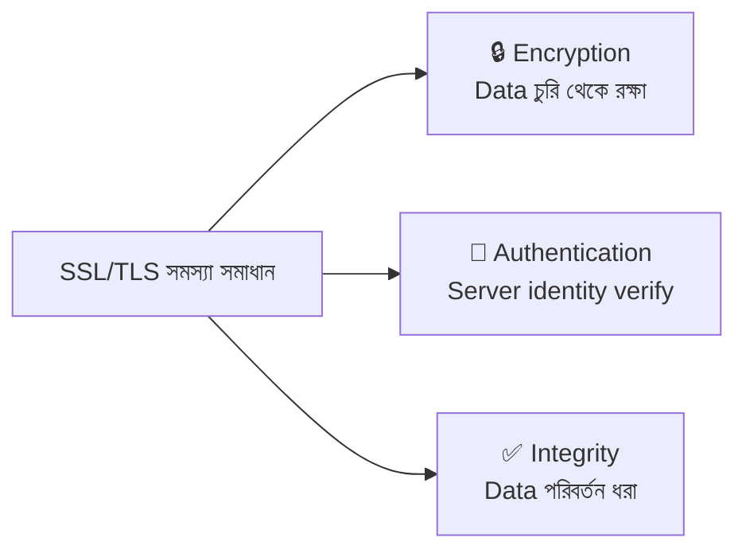

---

## HTTP vs HTTPS

**HTTPS = HTTP + SSL/TLS**

| বিষয় | HTTP | HTTPS |
|-------|------|-------|
| **URL** | `http://example.com` | `https://example.com` |
| **Port** | 80 | 443 |
| **Data** | Plain text | Encrypted |
| **Security** | কেউ পড়তে পারে | কেউ পড়তে পারে না |
| **Certificate** | লাগে না | SSL/TLS Certificate লাগে |

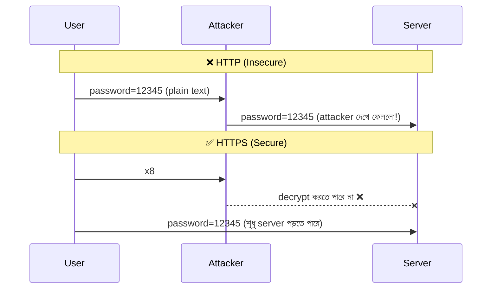

---

## Public Key এবং Private Key

SSL/TLS এর মূল ভিত্তি হলো **Asymmetric Encryption**। এখানে **দুইটা key** একসাথে কাজ করে:

| Key | কে রাখে | কাজ |
|-----|---------|-----|
| **Public Key** | সবাই পায় (certificate এর সাথে) | Data **encrypt** করতে এবং signature **verify** করতে |
| **Private Key** | শুধু server এর কাছে গোপনে থাকে | Data **decrypt** করতে এবং data **sign** করতে |

### মূল নিয়ম

- **Public Key** দিয়ে **encrypt** করলে → শুধুমাত্র **Private Key** দিয়েই **decrypt** করা যায়
- **Private Key** দিয়ে **sign** করলে → **Public Key** দিয়ে **verify** করা যায়

### বাস্তব উদাহরণ

ধরুন একটা **mailbox** এর কথা:

- **Public Key** = মেইলবক্সের ফাঁক (যেকেউ চিঠি ফেলতে পারে)
- **Private Key** = মেইলবক্সের চাবি (শুধু মালিক খুলতে পারে)

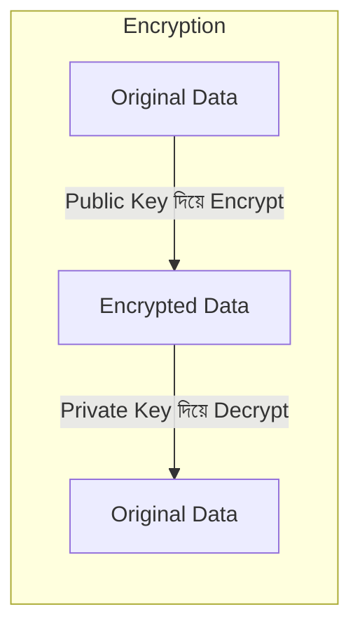

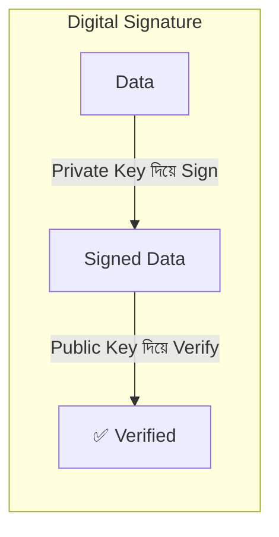

### Digital Signature কিভাবে কাজ করে?

**Digital Signature** দুইটা জিনিস prove করে:
1. **Authentication** — data সত্যিই ঐ server থেকে এসেছে
2. **Integrity** — data পথে কেউ change করেনি

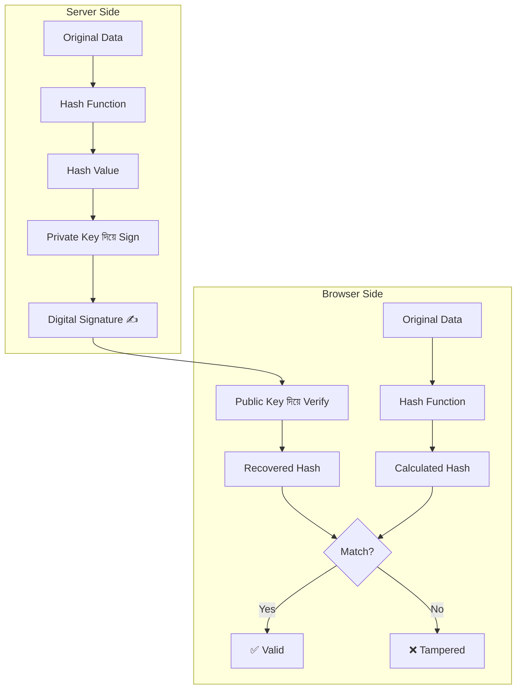

---

## SSL/TLS Handshake কিভাবে কাজ করে

Browser আর server এর মধ্যে **encrypted connection** তৈরি হওয়ার process কে বলে **TLS Handshake**। এটা **দুই phase** এ হয়:

### Phase 1: Asymmetric Encryption (শুধু শুরুতে)

এই phase এ নিরাপদে **key exchange** হয়।

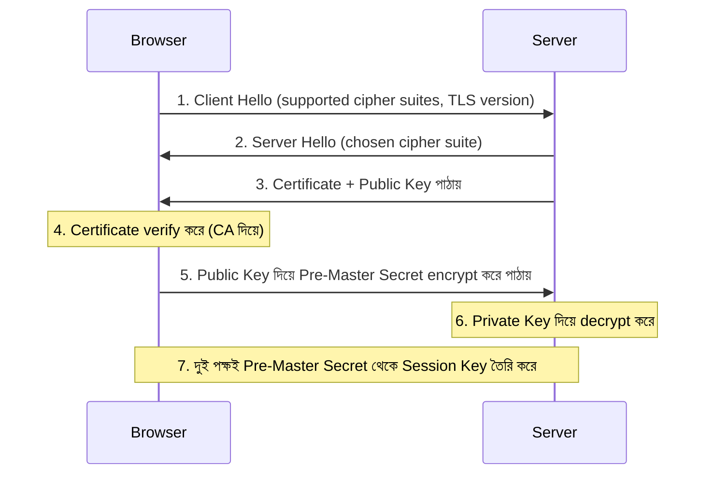

### Phase 2: Symmetric Encryption (বাকি পুরো session)

এখন থেকে সব data **Session Key** দিয়ে encrypt/decrypt হয়।

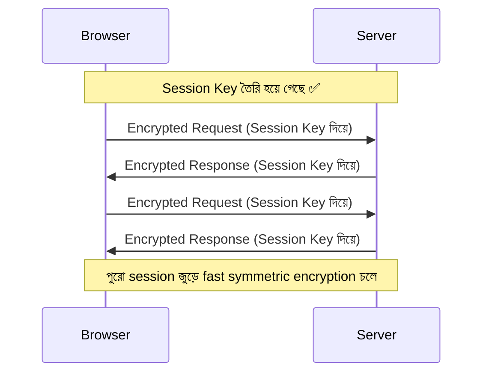

### কেন দুইটা phase?

| | Asymmetric Encryption | Symmetric Encryption |
|---|----------------------|---------------------|
| **Speed** | অনেক **slow** | অনেক **fast** |
| **ব্যবহার** | শুধু শুরুতে key exchange এ | পুরো communication এ |
| **কারণ** | নিরাপদে secret share করার জন্য perfect | Bulk data transfer এর জন্য perfect |

**Asymmetric** শুধু একবার ব্যবহার হয় নিরাপদে key exchange করতে, তারপর **Symmetric** দিয়ে fast communication চলে।

---

## Certificate Authority (CA) এবং Chain of Trust

### CA কী?

এখন সবচেয়ে গুরুত্বপূর্ণ প্রশ্ন — **browser কিভাবে বিশ্বাস করবে যে server এর Public Key আসল?**

এখানেই আসে **Certificate Authority (CA)**। CA হলো একটা **trusted third party** যে guarantee দেয় যে "হ্যাঁ, এই certificate আসল"। যেমন: **Let's Encrypt**, **DigiCert**, **GlobalSign**।

### CA কিভাবে কাজ করে?

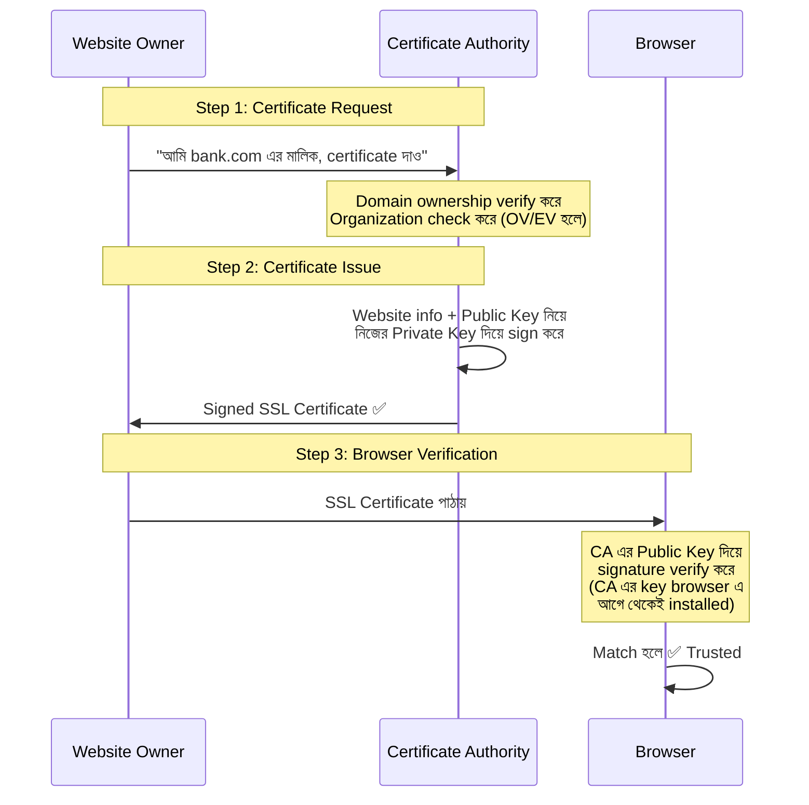

### Chain of Trust

**CA** একটা **chain** এর মাধ্যমে কাজ করে। এটা trust এর ভিত্তি:

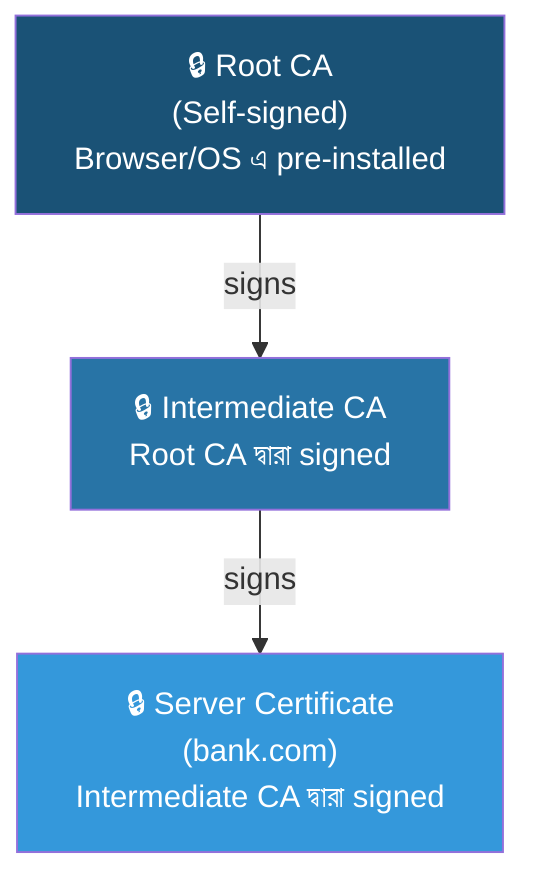

#### কেন Intermediate CA ব্যবহার হয়?

- **Root CA** এর **Private Key** অত্যন্ত মূল্যবান — এটা offline **vault** এ রাখা হয়
- **Intermediate CA** দিয়ে দৈনন্দিন certificate issue হয়
- Intermediate CA **compromise** হলে শুধু সেটা **revoke** করলেই হয়
- **Root CA** সবসময় নিরাপদ থাকে

#### Browser কিভাবে verify করে?

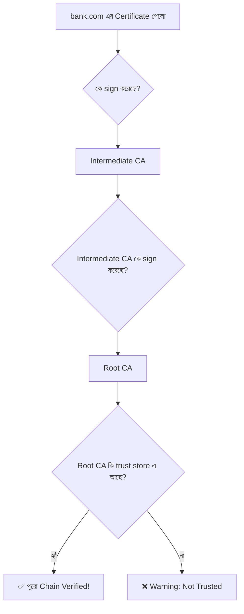

---

## SSL Certificate এর ভেতরে কী থাকে

| Field | বিবরণ |
|-------|--------|
| **Domain Name** | কোন website এর জন্য (যেমন `google.com`) |
| **Issuer (CA)** | কে issue করেছে (যেমন Let's Encrypt, DigiCert) |
| **Public Key** | Server এর public key |
| **Validity Period** | কবে থেকে কবে পর্যন্ত valid |
| **Digital Signature** | CA এর signature যেটা দিয়ে verify করা হয় |
| **Serial Number** | Unique identifier |
| **Subject** | Certificate holder এর তথ্য |

---

## SSL Certificate এর প্রকারভেদ

### Validation Level অনুযায়ী

| Type | Validation Level | ব্যবহার | সময় |
|------|-----------------|---------|------|
| **DV (Domain Validation)** | শুধু domain ownership check | Blog, ছোট website | মিনিটে হয়ে যায় |
| **OV (Organization Validation)** | Organization verify করে | Business website | কয়েক দিন |
| **EV (Extended Validation)** | পুরো company legally verify করে | Bank, E-commerce | কয়েক সপ্তাহ |

### Coverage অনুযায়ী

| Type | Coverage | উদাহরণ |
|------|----------|--------|
| **Single Domain** | একটা domain | `example.com` |
| **Wildcard** | সব subdomain | `*.example.com` |
| **SAN (Multi-Domain)** | একাধিক domain | `example.com`, `example.org` |

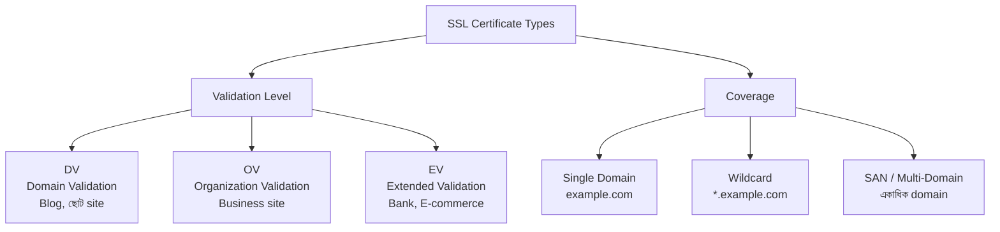

---

## SSL vs TLS — পার্থক্য

**TLS** হলো **SSL** এর **upgraded version**। SSL পুরনো এবং deprecated।

### ইতিহাস

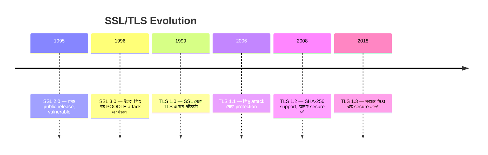

### মূল পার্থক্য

| বিষয় | SSL | TLS |
|-------|-----|-----|
| **Full Form** | Secure Sockets Layer | Transport Layer Security |
| **Developer** | Netscape | IETF |
| **Status** | ❌ Deprecated | ✅ Active |
| **Latest** | SSL 3.0 (1996) | TLS 1.3 (2018) |
| **Speed** | Slow handshake | Fast (especially 1.3) |
| **Security** | Multiple known attacks | TLS 1.3 — no known attack |

> আজকাল কেউ "SSL" বললে আসলে **TLS** ই বোঝায়। আসল SSL আর কেউ ব্যবহার করে না।

---

## TLS 1.2 vs TLS 1.3

### Handshake তুলনা

TLS 1.3 অনেক **দ্রুত** কারণ এটা মাত্র **১ round trip** এ handshake শেষ করে:

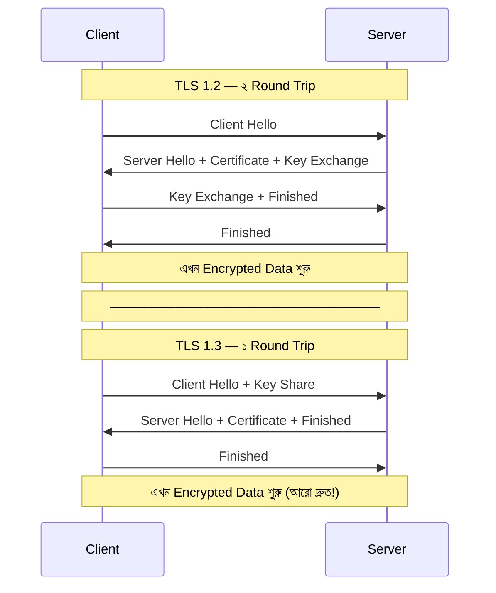

### TLS 1.3 তে কী বাদ দেওয়া হয়েছে?

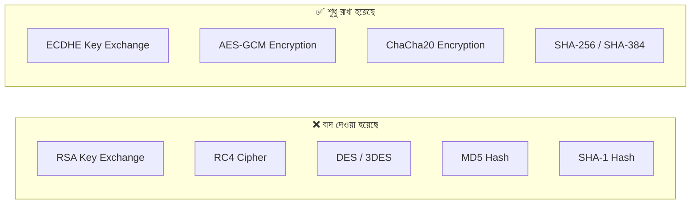

---

## Forward Secrecy

**Forward Secrecy** হলো **TLS 1.3** এর একটা **mandatory** feature। এটা নিশ্চিত করে যে server এর **Private Key** চুরি হলেও আগের কোনো session decrypt করা সম্ভব না।

### Forward Secrecy ছাড়া

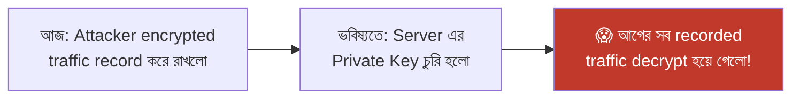

### Forward Secrecy সহ

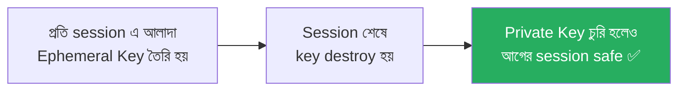

প্রতিটা session এ আলাদা **temporary key (Ephemeral Key)** তৈরি হয়। Session শেষ হলে key ধ্বংস হয়ে যায়। তাই আগের কোনো session এর data কখনো decrypt করা যায় না।

---

## Certificate Revocation

কোনো certificate **compromise** হলে বা ভুলভাবে issue হলে সেটা বাতিল করতে হয়। তিনটা mechanism আছে:

| Mechanism | কাজ |
|-----------|-----|
| **CRL (Certificate Revocation List)** | CA একটা list publish করে কোন কোন certificate বাতিল |
| **OCSP (Online Certificate Status Protocol)** | Browser real-time এ CA কে জিজ্ঞেস করে "এই certificate কি valid?" |
| **Certificate Transparency Log** | সব issued certificate public log এ রাখা হয়, ভুয়া certificate issue হলে ধরা পড়ে |

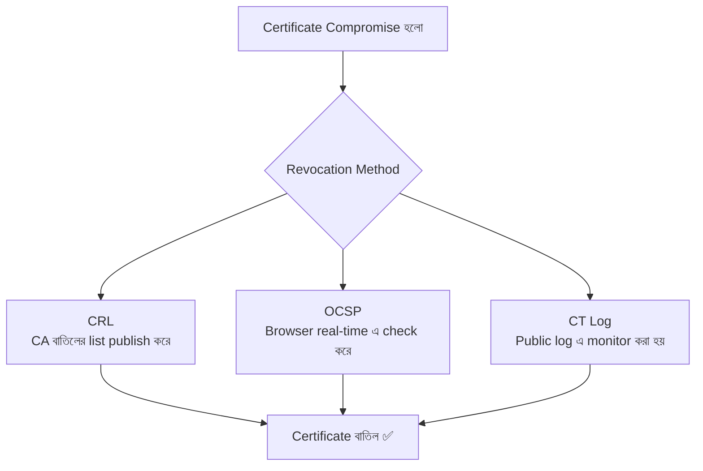

---

## সংক্ষেপে

| বিষয় | বিবরণ |
|-------|--------|
| **SSL/TLS কী** | Internet এ secure, encrypted communication এর protocol |
| **সমস্যা সমাধান** | Eavesdropping, MITM Attack, Data Tampering |
| **Public Key** | সবাই পায়, data encrypt ও signature verify করে |
| **Private Key** | শুধু server রাখে, data decrypt ও data sign করে |
| **CA (Issuer)** | Certificate এর authenticity guarantee দেয় |
| **Chain of Trust** | Root CA → Intermediate CA → Server Certificate |
| **SSL vs TLS** | SSL deprecated, TLS হলো current secure version |
| **TLS 1.3** | সবচেয়ে fast (1 round trip), mandatory Forward Secrecy |
| **Forward Secrecy** | Private Key চুরি হলেও আগের session safe |

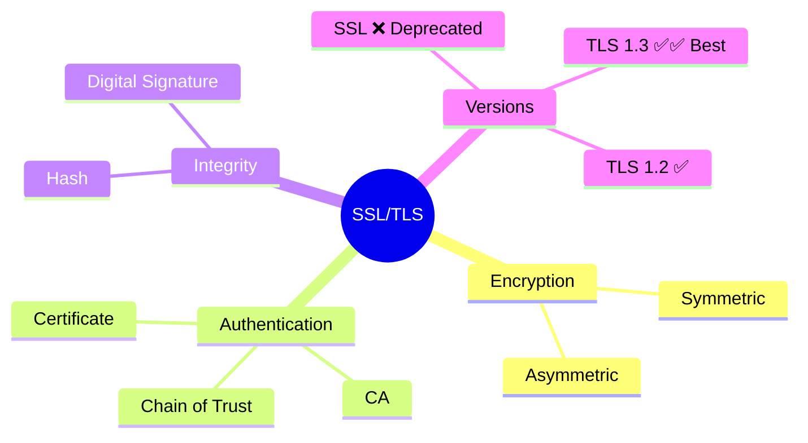

---

> **এই document টি শুধুমাত্র learning purpose এ তৈরি। practical implementation এর জন্য official documentation follow করুন।**
