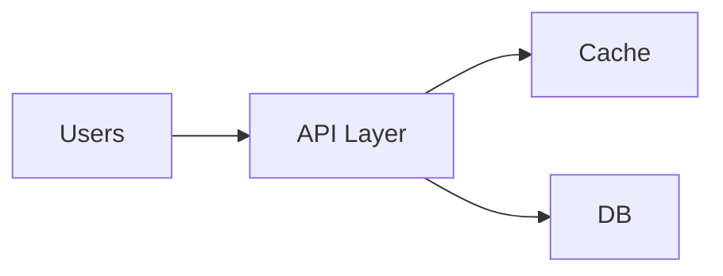

# Chapter 01 — Design Fundamentals (NFR, Capacity, Tradeoff)

## Core Ideas
- Functional requirements vs Non-functional requirements
- Availability, latency, throughput, durability
- Capacity estimation basics (RPS, storage, bandwidth)
- Bottleneck-first design thinking

## Quick Checklist
1. Traffic কত?
2. Read/write ratio কী?
3. SLO/SLA কী?
4. Failure হলে graceful fallback আছে?

## Capacity Estimation Mini Formula
- Daily requests = `RPS × 86400`
- Daily storage = `requests/day × avg payload`
- Bandwidth = `RPS × payload size`

## MCQ (15)
1. NFR example? → latency ✅
2. Throughput unit? → req/sec ✅
3. Availability 99.9% মানে? → downtime সীমিত ✅
4. Bottleneck analysis কোথায় শুরু? → hottest path ✅
5. Stateless service লাভ? → easy horizontal scale ✅
6. Over-design risk? → complexity বৃদ্ধি ✅
7. SLO কী? → target objective ✅
8. Capacity plan কেন? → future load handle ✅
9. p99 latency important কেন? → tail behavior ✅
10. Tradeoff unavoidable? → হ্যাঁ ✅
11. SLA breach impact? → reliability trust কমে ✅
12. High availability design-এ common tactic? → redundancy ✅
13. Read-heavy system first lever? → caching ✅
14. Write-heavy system first concern? → durable write path ✅
15. Single point of failure avoid? → multi-instance deploy ✅

## Written (5) with Solution

### Problem 1
Given 10k RPS, 2KB response. Outbound bandwidth estimate?
**Solution:** `10000 × 2KB = 20000 KB/s ≈ 20 MB/s` (~160 Mbps)।

### Problem 2
90% read workload-এ first optimization কী?
**Solution:** cache layer introduce + read replicas; primary DB load কমে।

### Problem 3
3-tier baseline architecture explain।
**Solution:** client → API/app layer → DB; optional cache between app & DB।

### Problem 4
99.95% availability monthly downtime কত?
**Solution:** month ~30 days => 43200 min. 0.05% downtime => ~21.6 min।

### Problem 5
Stateless service scaling কেন সহজ?
**Solution:** request-local state না থাকলে যেকোনো instance request serve করতে পারে; LB সহজ হয়।

## Navigation
- 🏠 [Master Index](00-master-index.md)
- ➡️ [Chapter 02](02-load-balancer-reverse-proxy-api-gateway.md)
