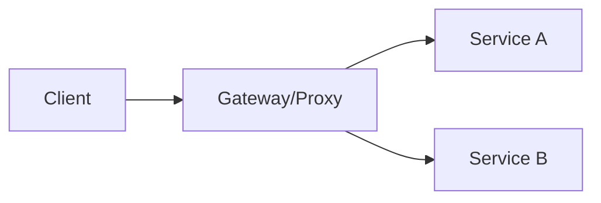

# Chapter 02 — Load Balancer, Reverse Proxy, API Gateway

## Concepts
- Load Balancer: traffic multiple servers এ distribute
- Reverse Proxy: client থেকে backend hide + central entry
- API Gateway: auth, routing, rate limit, aggregation

## LB Algorithms
- Round Robin
- Least Connections
- Weighted Round Robin
- Hash-based routing

## MCQ (15)
1. Reverse proxy sits? → server side ✅
2. API gateway কাজ? → cross-cutting policy ✅
3. Sticky session drawback? → uneven load ✅
4. Health check দরকার? → unhealthy node বাদ দিতে ✅
5. TLS termination কোথায় common? → LB/Proxy ✅
6. L4 vs L7 difference? → transport vs application awareness ✅
7. Weighted LB use-case? → heterogeneous servers ✅
8. Gateway SPOF avoid? → multiple instances ✅
9. Retry সব error-এ safe? → না ✅
10. Circuit breaker কোথায় useful? → downstream failure isolation ✅
11. Health check type? → active/passive ✅
12. Blue-green deploy-এ LB role? → traffic switch ✅
13. L7 routing supports? → path/header based routing ✅
14. Reverse proxy + cache possible? → হ্যাঁ ✅
15. API gateway auth centralization লাভ? → consistency ✅

## Written (5) with Solution
### Problem 1: L4 vs L7 compare
**Solution:** L4 fast/simple transport-level; L7 application-aware routing/policy rich।

### Problem 2: Gateway বনাম direct service call
**Solution:** gateway central policy দেয় but extra hop যোগ হয়।

### Problem 3: Zero downtime deployment
**Solution:** new pool warmup → health pass → gradual traffic shift → old pool drain।

### Problem 4: Sticky session কখন দরকার?
**Solution:** legacy session-in-memory app-এ; modern approach external session store better।

### Problem 5: Reverse proxy TLS termination benefit
**Solution:** cert management centralize, backend plain/internal TLS simplify, offload crypto।

## Navigation
- 🏠 [Master Index](00-master-index.md)
- ⬅️ [Chapter 01](01-design-fundamentals-nfr-capacity.md)
- ➡️ [Chapter 03](03-caching-patterns-distributed-cache.md)
