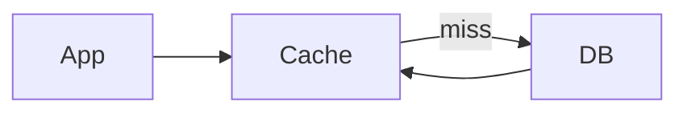

# Chapter 03 — Caching Patterns & Distributed Cache

## Why Cache
- latency reduce
- DB load কমানো
- burst traffic absorb

## Patterns
- Cache-aside (lazy)
- Write-through
- Write-back
- Refresh-ahead

## Eviction
- LRU
- LFU
- TTL-based expiry

## MCQ (15)
1. Cache-aside first read path? → cache then DB ✅
2. Write-through tradeoff? → write latency বেশি ✅
3. Stale cache issue? → consistency challenge ✅
4. TTL purpose? → automatic expiry ✅
5. Hot key সমস্যা? → skewed load ✅
6. Cache stampede কী? → concurrent miss flood ✅
7. Mitigation? → lock/jitter/prewarm ✅
8. Distributed cache example? → Redis ✅
9. Read-heavy workload benefit? → huge ✅
10. Cache always correct? → না, eventually stale হতে পারে ✅
11. Cache key design bad হলে? → collisions/poor hit ratio ✅
12. Eviction policy LRU মানে? → least recently used remove ✅
13. Write-back risk? → data loss on cache crash (if not flushed) ✅
14. Cache prewarming why? → cold start latency reduce ✅
15. Multi-layer cache example? → CDN + app cache + DB cache ✅

## Written (5) with Solution
### Problem 1: Cache stampede prevent
**Solution:** request coalescing lock, jittered TTL, background refresh।

### Problem 2: Product detail cache flow
**Solution:** read: cache hit হলে return; miss হলে DB fetch+cache set+return।

### Problem 3: Cache invalidation options
**Solution:** write-through, explicit delete on update, versioned key strategy।

### Problem 4: Hot key mitigation
**Solution:** local cache + request batching + key sharding + short TTL।

### Problem 5: CDN vs Redis role
**Solution:** CDN static/edge content, Redis dynamic application data cache।

## Navigation
- 🏠 [Master Index](00-master-index.md)
- ⬅️ [Chapter 02](02-load-balancer-reverse-proxy-api-gateway.md)
- ➡️ [Chapter 04](04-database-scaling-replication-sharding.md)
