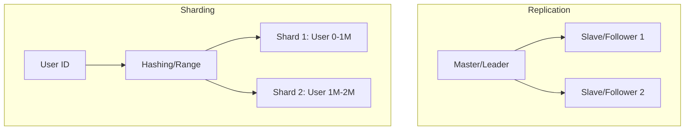

# Chapter 04 — Database Scaling: Replication, Sharding & Joins

সিস্টেম স্কেলিংয়ের সবচেয়ে বড় চ্যালেঞ্জ হলো ডেটাবেজ। ডেটাবেজকে কীভাবে স্কেল করতে হয় এবং লিডারলেস আর্কিটেকচার কেন জনপ্রিয়, তা আমরা এখানে জানব।

---

## 1. Architecture Walkthrough: Multi-Node DB

ডেটাবেজ স্কেলিং মূলত দুইভাবে হয়: replication এবং sharding।

- **Master-Slave (Leader-Based):** সব Write রিকোয়েস্ট মাস্টারে যায় এবং Read রিকোয়েস্ট স্লেভ বা ফলোয়ার থেকে রেন্ডার হয়।
- **Leaderless (Dynamo-style):** যেকোনো নোড ডেটা রাইট নিতে পারে (যেমন: Cassandra)। এখানে Quorum ($W+R > N$) ফর্মুলা গুরুত্বপূর্ণ।
- **Sharding:** বিশাল ডেটাবেজকে ছোট ছোট টুকরো (shards) করে আলাদা আলাদা হার্ডওয়্যারে রাখা।

---

## 2. Capacity Planning (Numerical Analysis)

### Scenario: 10M DAU for a Blogging Platform
ধরা যাক, প্রতিদিন ১০ মিলিয়ন ইউজার ব্লগ পড়ে এবং ১ লাখ ইউজার নতুন ব্লগ লেখে।

#### A. Read/Write Ratio
- **Read RPS:** $10M / 86400 \approx 115 \text{ QPS (Read)}$.
- **Write RPS:** $100K / 86400 \approx 1.2 \text{ QPS (Write)}$.
- **Ratio:** $100:1$ (Read heavy)। এই ধরনের সিস্টেমে Master-Slave আর্কিটেকচার আদর্শ।

#### B. Storage Calculation
- **Average Post Size:** $10 \text{ KB}$ (Text + Metadata).
- **Daily Storage:** $100K \times 10 \text{ KB} = 1 \text{ GB/day}$.
- **5-Year Storage:** $1 \text{ GB} \times 365 \times 5 \approx 1.8 \text{ TB}$.
- যদি ১টি নোড ২ টিবি নিতে পারে, তবে রিপ্লিকা বাড়িয়ে কাজ চালানো যাবে। কিন্তু যদি রাইট খুব বেশি হয়, তবে শার্ডিং লাগবে।

#### C. Sharding Calculation
যদি প্রতিটি সার্ভিস নোড ১০০০ রাইট কিউপিএস নিতে পারে এবং আমাদের সিস্টেম ২০০০ রাইট কিউপিএস চায়:
- **Min Shards:** $\lceil 2000 / 1000 \rceil = 2 \text{ shards}$. (প্র্যাকটিকালি ৩-৪টি রাখা হয়)।

---

## 3. High Level Design (HLD) vs Low Level Design (LLD)

### HLD
- **Partitioning Strategy:** Range based (Date) বনাম Hash based (UserID)।
- **Replication:** Synchronous (strong consistency) vs Asynchronous (eventual consistency)।
- **Consensus:** নির্বাচন মেকানিজম (যেমন: Raft/Paxos) ব্যবহার করে লিডার নির্বাচন করা।

### LLD (Sharding Key Design)
- **Problem:** শার্ডিং কী (Sharding Key) ভুল নির্বাচন করলে "Hotspot" তৈরি হয় (যেমন: সব সেলিব্রিটির ডেটা এক শার্ডে)।
- **Solution:** `hash(UserID) % NumberOfShards` অথবা কম্পোজিট কী ব্যবহার করা।

---

## 4. MCQs (10)

1. **Master-Slave আর্কিটেকচারে রাইট রিকোয়েস্ট কোথায় যায়?**
   - A) Slave-এ
   - B) Master-এ ✅
   - C) সবগুলোতে একসাথে
   - D) ইউজারের ব্রাউজারে

2. **Database Sharding বলতে কী বোঝায়?**
   - A) ডাটা ব্যাকআপ নেওয়া
   - B) এক সার্ভার থেকে অন্য সার্ভারে ডাটা কপি করা
   - C) ডালাকে ছোট ছোট ভাগে (Segments) ভাগ করে আলাদা সার্ভারে রাখা ✅
   - D) ডাটাবেজ ডিলিট করা

3. **Eventually Consistent সিস্টেমের মানে কী?**
   - A) ডাটা কখনও পাওয়া যাবে না
   - B) রাইট করার সাথে সাথে সব রিড আপ-টু-ডেট থাকবে
   - C) কিছু সময় পর সব নোড একই ডাটা পাবে ✅
   - D) ডাটাবেজ ক্রাশ করবে

4. **Leaderless Replication-এ 'Quorum' বলতে কী বোঝায়?**
   - A) সার্ভার সংখ্যা কমানো
   - B) রিড বা রাইট সফল হতে মেজরিটি নোডের একমত হওয়া ✅
   - C) ডাটা ডিলিট করা
   - D) সব ডাটা ইনডেক্স করা

5. **শার্ডিং কী (Sharding Key) নির্বাচনের প্রধান উদ্দেশ্য কী?**
   - A) ডাটা এনক্রিপ্ট করা
   - B) ডাটা সমানভাবে ডিস্ট্রিবিউট করা এবং হটস্পট কমানো ✅
   - C) ডাটাবেজ স্লো করা
   - D) সার্ভার নাম সেট করা

6. **মাস্টার-স্লেভ আর্কিটেকচারে মাস্টার ডাউন হলে কী হয়?**
   - A) রাইট অপারেশন বন্ধ হয়ে যায় যতক্ষণ নতুন লিডার না আসে ✅
   - B) সিস্টেম কাজ করে না
   - C) স্লেভ সব রাইট নেয় সাথে সাথে
   - D) ডাটা ডিলিট হয়

7. **Horizontal Scaling-এর ক্ষেত্রে ডাটাবেজের জন্য কোনটি বড় চ্যালেঞ্জ?**
   - A) ল্যাঙ্গুয়েজ চয়েস
   - B) জয়েন কুয়েরি (Cross-shard joins) ✅
   - C) স্টোরেজ কস্ট
   - D) ফ্রন্টএন্ড এরর

8. **Synchronous Replication-এর সুবিধা কোনটি?**
   - A) ডাটা লস হয় না (Strong Consistency) ✅
   - B) অনেক ফাস্ট
   - C) ল্যাটেন্সি খুব কম
   - D) সার্ভার লাগে না

9. **Cassandra ডাটাবেজ কোন আর্কিটেকচার ফলো করে?**
   - A) Master-Slave
   - B) Peer-to-Peer / Leaderless ✅
   - C) Single Node
   - D) Cloud only

10. **Relational Database শার্ডিং করা সচরাচর কঠিন কেন?**
    - A) টেবিল ছোট থাকে
    - B) জয়েন এবং ফরেন কী কন্ট্রেইন মেইনটেইন করা কঠিন ✅
    - C) র‍্যাম কম লাগে
    - D) পাসওয়ার্ড সাপোর্ট করে না

---

## 5. Case Study Interview Questions

1. **Q:** "You have a system where users follow each other (like Twitter). If you shard by UserID, how will you query 'Who follows User A'?"
   - **A:** এটি ডিফিকাল্ট কারণ ফলোয়াররা অন্যান্য শার্ডে থাকতে পারে। সমাধান হলো 'Follows' টেবিল আলাদা শার্ড করা বা গ্লোবাল ইনডেক্স রাখা।

2. **Q:** "Master-Slave lag কী এবং এটি কীভাবে হ্যান্ডেল করবেন?"
   - **A:** মাস্টার থেকে স্লেভে ডাটা যেতে সময় লাগলে রিড ডাটা পুরনো দেখায়। এর জন্য "Read-your-own-writes" কনসিস্টেন্সি ইমপ্লিমেন্ট করতে হয়।

3. **Q:** "Explain the CAP Theorem in the context of DB Scaling."
   - **A:** Partition tolerance থাকলে আপনাকে Consistency এবং Availability-এর মধ্যে একটি বেছে নিতে হবে।

4. **Q:** "What is a 'Hot Partition' and how do you fix it?"
   - **A:** একটি শার্ডে ট্রাফিক বেশি হলে হটস্পট হয়। সাল্টিং (Salting) বা রি-শার্ডিং করে এটি ঠিক করা যায়।

5. **Q:** "When would you prefer Cassandra over MySQL?"
   - **A:** যখন Write volume বিশাল এবং High availability (No SPOF) প্রয়োজন, তখন Cassandra ব্যবহার করা হয়।

---

## Navigation
- 🏠 [Master Index](00-master-index.md)
- ⬅️ [Chapter 03](03-caching-patterns-distributed-cache.md)
- ➡️ [Chapter 05](05-queue-stream-kafka-rabbitmq.md)
