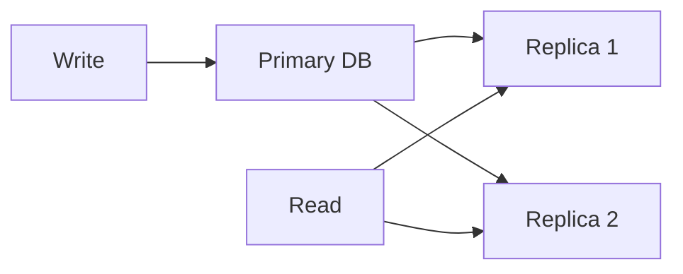

# Chapter 04 — Database Scaling (Replication, Partitioning, Sharding)

## Scaling Paths
- Vertical scaling
- Horizontal scaling

## Replication
- Primary-Replica
- Read scaling
- replication lag awareness

## Sharding
- key-based
- range-based
- directory-based

## Partitioning
- table partitioning for manageability/query performance

## MCQ (15)
1. Read scaling easiest with? → replicas ✅
2. Write scaling hard কেন? → coordination/consistency ✅
3. Shard key bad হলে? → hotspot ✅
4. Replica lag risk? → stale read ✅
5. Vertical scale limit? → hardware ceiling ✅
6. Cross-shard join complexity? → high ✅
7. Partition pruning লাভ? → less scan ✅
8. Global transaction in shards? → complex ✅
9. Failover purpose? → primary failure recovery ✅
10. Multi-tenant isolation via? → shard/partition strategies ✅
11. Async replication downside? → lag/stale reads ✅
12. Sync replication downside? → write latency বৃদ্ধি ✅
13. Shard rebalance challenge? → data migration cost ✅
14. Auto-increment shard across cluster issue? → global uniqueness handling দরকার ✅
15. Partition key poor হলে? → skew/hot partition ✅

## Written (5) with Solution
### Problem 1: Shard key নির্বাচন
**Solution:** high cardinality, even distribution, common query predicate aligned key বেছে নাও।

### Problem 2: Read-after-write consistency
**Solution:** write পরে primary read বা session stickiness বা lag-aware read policy।

### Problem 3: Replica failover
**Solution:** health detect → leader election/promote replica → routing update।

### Problem 4: Cross-shard query handling
**Solution:** scatter-gather + aggregation layer; minimize by good data modeling।

### Problem 5: Partitioning vs sharding
**Solution:** partition often single DB internal split; sharding multi-node distribution।

## Navigation
- 🏠 [Master Index](00-master-index.md)
- ⬅️ [Chapter 03](03-caching-patterns-distributed-cache.md)
- ➡️ [Chapter 05](05-queue-stream-kafka-rabbitmq.md)
