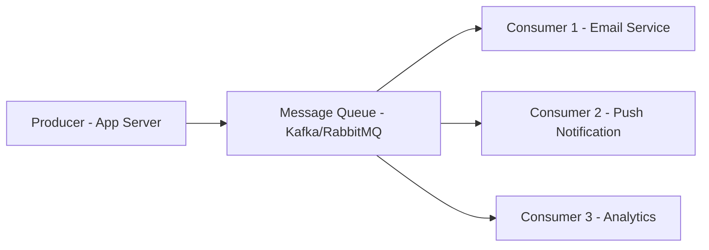

# Chapter 05 — Queue & Stream: Pub/Sub & Fan-out Patterns

সিস্টেমের বিভিন্ন কম্পোনেন্টের মধ্যে সরাসরি যোগাযোগ (Synchronous) করলে ল্যাটেন্সি বেড়ে যায়। এই সমস্যা সমাধানে আমরা Message Queue এবং এসিংক্রোনাস প্রসেসিং ব্যবহার করি।

---

## 1. Architecture Walkthrough: The Producer-Consumer Model

ম্যাসেজ কিউ একটি বাফারের মতো কাজ করে যা প্রডিউসার ও কনজ্যুমারের মধ্যে ডিপেন্ডেন্সি কমিয়ে দেয় (Decoupling)।

- **Fan-out Pattern:** যখন একটি নিউজলেটার বা পোস্ট পাবলিশ হয়, তখন সেটি ১ মিলিয়ন ফলোয়ারের কিউতে পাঠানোই হলো ফ্যান-আউট।
- **Pub/Sub (Publish-Subscribe):** প্রডিউসার ম্যাসেজ পাবলিশ করে একটি টপিকে, আর সব সাবস্ক্রাইবার সেই ম্যাসেজ পায়।
- **At-least-once vs Exactly-once:** Kafka-তে ম্যাসেজ ডেলিভারি গ্যারান্টি মেইনটেইন করা হয়।

---

## 2. Capacity Planning (Numerical Analysis)

### Scenario: Newsletter System with 1M Subscribers
প্রতিদিন ৫টি নিউজলেটার পাঠানো হয় এবং প্রতিটি নিউজলেটার ১ জন ইউজারের কাছে ফ্যান-আউট হয়।

#### A. Total Messages per Day
- **Messages:** $1M \text{ users} \times 5 \text{ newsletters} = 5M \text{ mail tasks/day}$.
- **Average Throughput:** $5M / 86400 \approx 58 \text{ tasks/sec}$.
- **Peak Throughput (Bulk send):** নিউজলেটার সাধারণত এক ঘণ্টার মধ্যে পাঠানো হয়। তবে ১ ঘণ্টায় $5M$ কাজ করতে হলে $5M / 3600 \approx 1400 \text{ tasks/sec}$.

#### B. Bandwidth Calculation
- **Task Payload:** $2 \text{ KB}$ (User data + Template ID).
- **Peak BW:** $1400 \text{ tasks/sec} \times 2 \text{ KB} = 2.8 \text{ MB/s}$.

#### C. Consumer Scaling
যদি ১টি মেইল সার্ভার প্রতি সেকেন্ডে ১০০টি মেইল পাঠাতে পারে:
- **Required Servers:** $1400 / 100 = 14 \text{ consumer instances}$.

---

## 3. High Level Design (HLD) vs Low Level Design (LLD)

### HLD
- **Storage Strategy:** Kafka-র মতো লগ-ভিত্তিক স্টোরেজ বনাম RabbitMQ-র মতো ইন-মেমোরি কিউ।
- **Retention Policy:** কতক্ষণ ম্যাসেজ কিউতে থাকবে (যেমন: ৭ দিন)।
- **Dead Letter Queue (DLQ):** যে ম্যাসেজগুলো প্রসেস করা যাচ্ছে না, সেগুলো আলাদা জায়গায় রাখা।

### LLD (Fan-out on Write vs Read)
- **Fan-out on Write:** ইউজার পোস্ট করার সাথে সাথে সব ফলোয়ারের কিউতে পোস্টটি পুশ করা হয়। (Fast Read)
- **Fan-out on Read:** যখন ফলোয়ার তার ফিড লোড করে, তখন সবার পোস্ট পুল (Pull) করে আনা হয়। (Fast Write)
- **Hybrid:** সেলিব্রিটিদের জন্য Pull এবং সাধারণ ইউজারদের জন্য Push।

---

## 4. MCQs (10)

1. **Message Queue ব্যবহারের প্রধান কারণ কী?**
   - A) ডাটাবেজ ব্যাকআপ
   - B) এসিংক্রোনাস প্রসেসিং এবং সার্ভিস ডিকাপলিং ✅
   - C) ফ্রন্টএন্ড ডিজাইন
   - D) পাসওয়ার্ড সেভ করা

2. **Pub/Sub মডেলে প্রডিউসার কোথায় মেসেজ পাঠায়?**
   - A) সরাসরি ইউজারের কাছে
   - B) একটি টপিক (Topic)-এ ✅
   - C) ডাটাবেজে
   - D) মোবাইলে

3. **Dead Letter Queue (DLQ) কেন ব্যবহার করা হয়?**
   - A) ডিলিট করা মেসেজ পুনরুদ্ধারে
   - B) বারবার ফেইল হওয়া মেসেজগুলো স্টোর করতে যাতে পরে ডিবাগ করা যায় ✅
   - C) মেইল পাঠাতে
   - D) স্টোরেজ কমাতে

4. **Kafka-তে 'Partition' ব্যবহারের সুবিধা কী?**
   - A) কালার চেঞ্জ করা
   - B) ডেটাকে প্যারালালি প্রসেস করা এবং স্কেলেবিলিটি বাড়ানো ✅
   - C) ডাটা এনক্রিপ্ট করা
   - D) মেমোরি কমানো

5. **Fan-out on Write-এর অসুবিধা কোনটি?**
   - A) রিড অনেক ফাস্ট
   - B) ১ মিলিয়ন ফলোয়ার থাকলে রাইট করার সময় বিশাল সময় লাগে ✅
   - C) কোড লেখা সহজ
   - D) মেমোরি লাগে না

6. **Exactly-once ডেলিভারি গ্যারান্তী বলতে কী বোঝায়?**
   - A) মেসেজ কখনও যাবে না
   - B) মেসেজ কয়েকবার যাবে
   - C) মেসেজ ঠিক একবারই ডেলিভার হবে ✅
   - D) মেসেজ রেন্ডমলি যাবে

7. **RabbitMQ সাধারণত কোন প্রোটোকল ব্যবহার করে?**
   - A) HTTP
   - B) AMQP ✅
   - C) FTP
   - D) SMTP

8. **ম্যাসেজ কিউতে 'Backlog' বাড়ার মানে কী?**
   - A) প্রডিউসার স্লো
   - B) কনজ্যুমার রিকোয়েস্ট হ্যান্ডেল করতে পারছে না ✅
   - C) ডাটাবেজ ডাউন
   - D) ইন্টারনেট নেই

9. **Backpressure বলতে কী বোঝায়?**
   - A) প্রডিউসারের ওপর চাপ কমানো যখন কনজ্যুমার ওভারলোডেড থাকে ✅
   - B) কনজ্যুমার সার্ভার বন্ধ করা
   - C) ডাটা ডিলিট করা
   - D) রিকোয়েস্ট রিজেক্ট করা

10. **Kafka কি ধরনের সিস্টেম?**
    - A) ইন-মেমোরি অনলি
    - B) ডিস্ট্রিবিউটেড ইভেন্ট স্ট্রিমিং প্লাটফর্ম ✅
    - C) রিলেশনাল ডাটাবেজ
   - D) ফ্রন্টএন্ড ফ্রেমওয়ার্ক

---

## 5. Case Study Interview Questions

1. **Q:** "Design a notification system that sends SMS, Email, and Push notifications. How do you ensure one failing doesn't stop others?"
   - **A:** ৩টি আলাদা কিউ এবং ৩টি আলাদা কনজ্যুমার গ্রুপ ব্যবহার করতে হবে।

2. **Q:** "Why would you choose Kafka over RabbitMQ for log analytics?"
   - **A:** Kafka ডাটা পারসিস্ট করে এবং হাই-থ্রুপুট স্ট্রিমিং ও ইভেন্ট রিপ্লে (Event Replay) সাপোর্ট করে।

3. **Q:** "How does the 'Fan-out' strategy change for a celebrity with 50M followers?"
   - **A:** সেক্ষেত্রে 'Fan-out on Read' বা হাইব্রিড অ্যাপ্রোচ নিতে হবে, কারণ ৫ কোটি ইউজারের কাছে রাইট করা ইমপসিবল।

4. **Q:** "What happens if a consumer crashes in the middle of processing a message?"
   - **A:** কনজ্যুমার ঠিকমতো Ack (Acknowledgment) না পাঠালে কিউ মেসেজটি রি-কিউ (Re-queue) করবে।

5. **Q:** "Explain the concept of 'Log Compaction' in Kafka."
   - **A:** এটি পুরনো মেসেজগুলো ডিলিট না করে শুধুমাত্র প্রতিটি কীয়ের লেটেস্ট ভ্যালু সেভ করে রাখে।

---

## Navigation
- 🏠 [Master Index](00-master-index.md)
- ⬅️ [Chapter 04](04-database-scaling-replication-sharding.md)
- ➡️ [Chapter 06](06-consistency-idempotency-retry-rate-limit.md)

