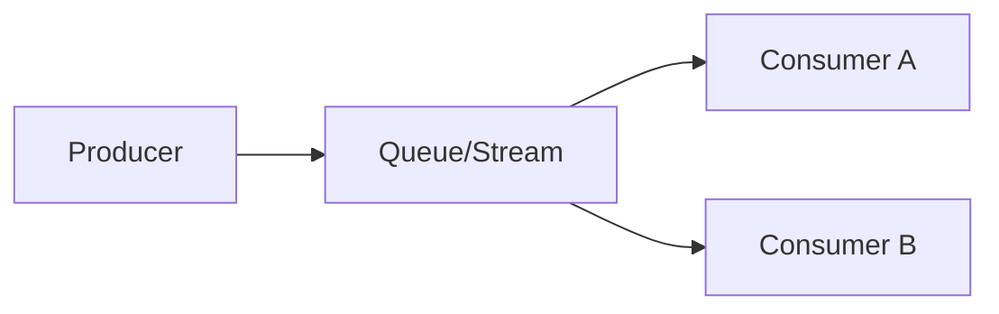

# Chapter 05 — Queue & Stream (Kafka, RabbitMQ Basics)

## Why Async
- decoupling
- smoothing burst load
- retry & resilience

## Queue Concepts
- producer
- consumer
- ack
- retry
- dead letter queue (DLQ)

## Stream Concepts
- partition
- offset
- consumer group

## MCQ (15)
1. Queue benefit? → decoupling ✅
2. At-least-once delivery effect? → duplicate possible ✅
3. Idempotent consumer কেন? → duplicate safe handle ✅
4. DLQ use? → poison messages isolate ✅
5. Kafka partition purpose? → parallelism + scale ✅
6. Offset meaning? → message position ✅
7. Consumer group behavior? → partition work split ✅
8. Sync vs async latency? → async user latency কমাতে পারে ✅
9. Ordering guarantee কোথায়? → per partition ✅
10. Retry সবসময় infinite? → না ✅
11. Consumer lag মানে? → unprocessed backlog ✅
12. DLQ message পরে কী? → inspect/fix/replay ✅
13. Exactly-once claim বাস্তবে? → hard, idempotent design দরকার ✅
14. Queue burst smoothing কীভাবে? → producer দ্রুত push, consumer async drain ✅
15. Backpressure না থাকলে? → downstream overload ✅

## Written (5) with Solution
### Problem 1: Notification async design
**Solution:** API enqueue → worker consume → send provider → ack/fail retry।

### Problem 2: Retry + DLQ policy
**Solution:** exponential backoff retry N times; এরপর DLQ-তে পাঠাও manual/auto replay জন্য।

### Problem 3: Kafka vs RabbitMQ
**Solution:** Kafka high-throughput log/stream; RabbitMQ flexible routing/queue semantics।

### Problem 4: Duplicate message safe handling
**Solution:** idempotency key + dedup store + consumer-side guard।

### Problem 5: Ordering guarantee দরকার হলে
**Solution:** related key same partition/queue route করো।

## Navigation
- 🏠 [Master Index](00-master-index.md)
- ⬅️ [Chapter 04](04-database-scaling-replication-sharding.md)
- ➡️ [Chapter 06](06-consistency-idempotency-retry-rate-limit.md)
